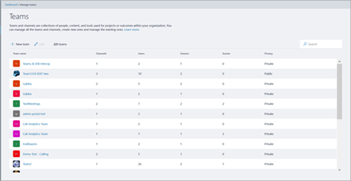
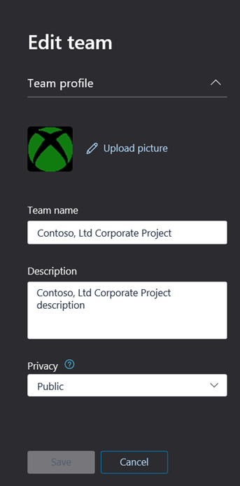
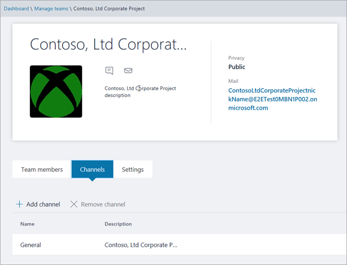

Manage teams in the Microsoft Teams admin center
==========================================

## Overview

As an IT admin, you may need to view or update the teams that your organization has set up for collaboration, or you might need to perform remediation actions such as assigning owners for ownerless teams. You can manage the teams used in your organization through both the Microsoft Teams PowerShell module and the Microsoft Teams admin center. For full administration capabilities using these two toolsets, you should make sure that you are assigned one of the following roles:

- Global Administrator
- Teams Service Administrator

You can learn more about admin roles in Teams in [Use Microsoft Teams admin roles to manage Teams](using-admin-roles.md), and you can read more about how to use the PowerShell cmdlets for managing teams in the [Microsoft Teams cmdlet reference](https://docs.microsoft.com/powershell/teams/?view=teams-ps).

This article provides an overview of the management tools for teams in the Microsoft Teams admin center.

## Teams overview grid

Management tools for teams are under the **Teams** node in the Microsoft Teams admin center. (In the admin center, select **Teams** > **Manage teams**.) Each team is backed by an Office 365 group, and this node provides a view of groups that have been Microsoft Teams-enabled in your organization.

  

The grid displays the following properties:

- **Team name**
- **Channels** - a count of all channels in the team, including the default General channel.
- **Team members** - a count of total users, including owners, guests, and members from your tenant.
- **Owners** - a count of owners for this team.
- **Guests** - a count of Azure Active Directory B2B guest users who are members of this team.
- **Privacy** - the Visibility/AccessType of the backing Office 365 group.
- **Status** - the Archived or Active status for this team. Learn more about archiving teams in the [Archive or restore a team](https://support.office.com/article/archive-or-restore-a-team-dc161cfd-b328-440f-974b-5da5bd98b5a7).
- **GroupID** - the unique GroupID of the backing Office 365 group
- **Classification** - the classification (if used in your organization) assigned to the backing Office 365 group. Learn more about classifications at [Create classifications for Office groups in your organization](https://docs.microsoft.com/office365/enterprise/powershell/manage-office-365-groups-with-powershell#create-classifications-for-office-groups-in-your-organization).
- **Description** - the description set for the backing Office 365 group

> [!NOTE]
> If you don't see all these properties in the grid, click the Settings icon. The **Edit columns** pane appears. You can use the toggles to turn on or turn off columns in the grid.

### Add

You can add a new team. Select the **Add** button, and then in the **Add a new team** pane, give the team a name and description.

### Edit

You can edit group and team-specific settings by selecting a team from the grid and then selecting the **Edit** button.

### Archive

You can archive a team. Archiving a team puts the team into read-only mode within Microsoft Teams. As an admin, you can archive and unarchive teams on behalf of your organization via the admin portal.

### Delete

Deleting a team is a soft-delete of the team and corresponding Office 365 group. To restore a mistakenly deleted team, follow the instructions in [Restore a deleted Office 365 Group](https://docs.microsoft.com/office365/admin/create-groups/restore-deleted-group?view=o365-worldwide).

### Search

Search currently supports the string "Begins with" and searches the **Team name** field.

## Team profile

You can navigate to the team profile page of any team from the main teams overview grid by clicking on the team name. The team profile page shows the members, owners, and guests that belong to the team (and its backing O365 Group), as well as the team’s channels and settings. From the team profile page, you can:

- Add or remove members and owners.
- Add or remove channels (note that you cannot remove the General channel).
- Update team and group settings.
 

## Making changes to teams

On the team's profile page, click **Edit** to change the following elements of a team:

- **Team members** - add or remove members and promote or demote owners.
- **Channels** - add new channels or remove existing channels. You cannot delete the default **General** channel. Once created, you can only edit the channel name, not the description.
- **Team name**
- **Description**
- **Privacy** - choose public or private.
- **Classification** - backed by your Office 365 group classifications. Choose **Confidential**, **Highly Confidential**, or **General**.
- **Conversations** - members can edit sent messages.
- **Channels** - members can create new channels and edit existing ones, and add, edit, and remove tabs, connectors, and apps.
- **Team member settings** - select team member settings.

You can also archive or delete a team by selecting the team name on the grid and clicking **Archive** or **Delete**.

The changes that you make to a team are logged. If you are modifying group settings (changing the name, description, photo, privacy, classification, or team members), the changes will be attributed to you through the audit pipeline. If you are performing actions against Teams-specific settings, your changes will be tracked and attributed to you in the general channel of the team.

## Troubleshooting

**Issue: Teams missing from the Team Overview Grid**

When you enter the Microsoft Teams admin center, under the **Teams** option some of your teams are missing from the listing in the Teams Overview Grid.

**Cause**: This issue occurs when the team was incorrectly (or not yet) profiled by the system which can lead to a missing property for it to be recognized.

**Resolution: Manually set the property to the correct value via MS Graph**

Replace **{groupid}** in the Query for the actual GroupId in question, which you can get via the Exchange Online powershell, with the **"[Get-UnifiedGroup](https://docs.microsoft.com/powershell/module/exchange/users-and-groups/get-unifiedgroup?view=exchange-ps)"** cmdlet, as the "**ExternalDirectoryObjectId**" attribute.

1. Access [Graph Explorer](https://developer.microsoft.com/en-us/graph/graph-explorer)

2. Sign in to Graph Explorer on the left menu

3. Change the query line to: PATCH > v1.0 > https://graph.microsoft.com/v1.0/groups/{groupid}

4. Add the following value on the request body: {"resourceProvisioningOptions": ["Team"]}

5. Run the query on the top-right.

6. Confirm the team appears correctly in the Microsoft Teams admin center - Team Overview

## Learn more

[Microsoft Teams cmdlet reference](https://docs.microsoft.com/powershell/teams/?view=teams-ps)  
[Admin roles in Microsoft Teams](using-admin-roles.md)
<!--
[Plan for Teams Lifecycle Management](plan-for-teams-lifecycle-management.md)
-->

