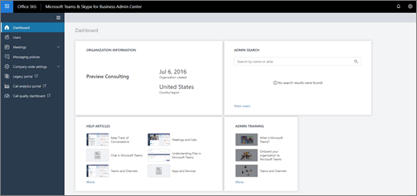

Manage Teams during the transition to the new Microsoft Teams admin center
======================================================

> [!IMPORTANT]
> [!INCLUDE [new-teams-sfb-admin-center-notice](includes/new-teams-sfb-admin-center-notice.md)]

## What is the new Microsoft Teams admin center?  

The new admin center experience will provide you with a unified experience to manage both Teams and Skype for Business. We’re delivering additional functionality, end-to-end insights, and the ability to manage Teams settings on a user level.

## Settings migrated to the new Microsoft Teams admin center

The following table identifies the sections of the Teams experience that have been migrated and shows the relationship between the current settings and the policies in the new admin portal.

|Section of Teams in Microsoft 365 admin center  |Setting name (Tenant level)  |Microsoft Teams admin center policy   |Level: Tenant or User   |
|---------|---------|---------|---------|
|General     |Show Organizational Chat in Personal Profile        |  [TeamsClientConfiguration](https://docs.microsoft.com/powershell/module/skype/set-csteamsclientconfiguration?view=skype-ps)       |  Tenant       |
|General     |Use Skype for Business for recipients who don’t have Teams         |[TeamsClientConfiguration](https://docs.microsoft.com/powershell/module/skype/set-csteamsclientconfiguration?view=skype-ps)         |Tenant         |
|Email integration     |Allow users to send emails to channels         |[TeamsClientConfiguration](https://docs.microsoft.com/powershell/module/skype/set-csteamsclientconfiguration?view=skype-ps)         |Tenant         |
|Email integration     |Allow senders list         |[TeamsClientConfiguration](https://docs.microsoft.com/powershell/module/skype/set-csteamsclientconfiguration?view=skype-ps)        |Tenant         |
|Custom cloud storage     |Box         |[TeamsClientConfiguration](https://docs.microsoft.com/powershell/module/skype/set-csteamsclientconfiguration?view=skype-ps)         |Tenant         |
|Custom cloud storage     |Dropbox        |[TeamsClientConfiguration](https://docs.microsoft.com/powershell/module/skype/set-csteamsclientconfiguration?view=skype-ps)         |Tenant         |
|Custom cloud storage     |Google Drive        |[TeamsClientConfiguration](https://docs.microsoft.com/powershell/module/skype/set-csteamsclientconfiguration?view=skype-ps)         |Tenant         |
|Custom cloud storage     |ShareFile        |[TeamsClientConfiguration](https://docs.microsoft.com/powershell/module/skype/set-csteamsclientconfiguration?view=skype-ps)         |Tenant         |
|Settings by user/license type     |Turn Microsoft Teams on or off for all users          |Deprecated1        |         |
|Teams and channels     |         |Redirects to Azure Active Directory Group Management (same as current experience).              |User         |
|Teams and channels     |         |Redirects to AAD Group Management (same as current experience).             |User          |
|Apps|Enable new external apps by default|Org-wide app settings|Tenant|
|Apps|Allow external apps|Org-wide app settings|Tenant|
|Apps|Allow sideloading of external apps2|[TeamsAppSetupPolicy](https://docs.microsoft.com/en-us/powershell/module/skype/set-csteamsappsetuppolicy?view=skype-ps)|User|
|Apps|Default apps3|TeamsAppPermissionPolicy|User|
|Apps|External apps3|TeamsAppPermissionPolicy|User|
|Calls and Meetings     |Allow scheduling for private meetings         |[TeamsMeetingPolicy](https://docs.microsoft.com/powershell/module/skype/set-csteamsmeetingpolicy?view=skype-ps)         |User          |
|Calls and Meetings     |Allow Ad-hoc channel meetup         |[TeamsMeetingPolicy](https://docs.microsoft.com/powershell/module/skype/set-csteamsmeetingpolicy?view=skype-ps)         |User          |
|Calls and Meetings     |Allow scheduling for channel meetings         |[TeamsMeetingPolicy](https://docs.microsoft.com/powershell/module/skype/set-csteamsmeetingpolicy?view=skype-ps)         |User          |
|Calls and Meetings     |Allow videos in meetings         |[TeamsMeetingPolicy](https://docs.microsoft.com/powershell/module/skype/set-csteamsmeetingpolicy?view=skype-ps)         |User          |
|Calls and Meetings     |Allow screen sharing in meetings         |[TeamsMeetingPolicy](https://docs.microsoft.com/powershell/module/skype/set-csteamsmeetingpolicy?view=skype-ps)         |User          |
|Calls and Meetings     |Allow private calling         |[TeamsCallingPolicy](https://docs.microsoft.com/powershell/module/skype/set-csteamscallingpolicy?view=skype-ps)        |User          |
|Messaging     |Enable Giphy so users can add gifs to conversations         |[TeamsMessagingPolicy](https://docs.microsoft.com/powershell/module/skype/set-csteamsmessagingpolicy?view=skype-ps)         |User         |
|Messaging     |Content rating         |[TeamsMessagingPolicy](https://docs.microsoft.com/powershell/module/skype/set-csteamsmessagingpolicy?view=skype-ps)         |User         |
|Messaging     |Enable memes that users can edit and add to conversations         |[TeamsMessagingPolicy](https://docs.microsoft.com/powershell/module/skype/set-csteamsmessagingpolicy?view=skype-ps)         |User         |
|Messaging     |Enable stickers that users can edit and add to conversations         |[TeamsMessagingPolicy](https://docs.microsoft.com/powershell/module/skype/set-csteamsmessagingpolicy?view=skype-ps)         |User         |
|Messaging     |Allow owners to delete all messages         |[TeamsMessagingPolicy](https://docs.microsoft.com/powershell/module/skype/set-csteamsmessagingpolicy?view=skype-ps)         |User         |
|Messaging     |Allow users to edit their own messages         |[TeamsMessagingPolicy](https://docs.microsoft.com/powershell/module/skype/set-csteamsmessagingpolicy?view=skype-ps)         |User         |
|Messaging     |Allow users to delete their own messages         |[TeamsMessagingPolicy](https://docs.microsoft.com/powershell/module/skype/set-csteamsmessagingpolicy?view=skype-ps)         |User         |
|Messaging     |Allows users to chat privately         |[TeamsMessagingPolicy](https://docs.microsoft.com/powershell/module/skype/set-csteamsmessagingpolicy?view=skype-ps)         |User         |

1 Deprecated for Guest. Enabling/disabling Guest can now be managed in the Microsoft Teams admin center. Enabling/disabling Teams for Business Enterprise, Edu Student, and Edu Faculty will be deprecated soon. This should be managed by assigning licenses in the Microsoft 365 admin center. See [Manage user access to Microsoft Teams](user-access.md).
  
2 Sideloading is split as follows:

- Allow a user to sideload apps which can be managed at a user level in [TeamsAppSetupPolicy](https://docs.microsoft.com/en-us/powershell/module/skype/set-csteamsappsetuppolicy?view=skype-ps).
- Allow users in a tenant to interact with custom apps which can be managed at a tenant level in org-wide app settings.
 
3 Default apps and external apps can be enabled and disabled at the user level in TeamsAppPermissionPolicy. Additionally, apps can be blocked at the tenant level in org-wide app settings which overrides any user and tenant-level settings. 

> [!NOTE]
> You’ll continue to use the Groups dashboard in the Microsoft 365 admin center for configuration related to Teams and channels. Settings for Apps will remain in the Teams area of the Microsoft 365 admin center and will be migrated later. 

## Manage settings during the migration

You can continue to modify settings in the Microsoft 365 admin center and the Skype for Business admin center until migration for a section is complete for your tenant. 

The following table shows where you can manage features during the migration.

|Feature  |Microsoft Teams admin center                      |Skype for Business admin center (legacy)  |Microsoft 365 admin center  |
|---------|:---------:|:---------:|:---------:|
|Teams Messaging, Meetings, and Live Events policies     |     X    |         |         |
|Teams Upgrade policy     |    X     |         |         |
|Guest settings for Messaging, Meetings, and Voice     |   X      |         |         |
|Teams Lifecycle Management   |    X    |      |       |
|Teams Settings   |    X    |      |       |
|External access settings     |    X    |      |       |
|User management    |         |         |    X     |    
|Audio conferencing     |    X     |    X     |         |
|Calling plans     |         |    X     |         |
|Phone System    |         |     X    |         |
|Phone number management     |         |   X      |         |
|Licensing for Cloud voice features     |         |         |    X     |
|Auto attendants     |         |    X     |         |
|Call queues     |         |    X     |         |

## Manage settings after the migration

When the migration of these settings is complete, we’ll disable them in the Office 365 admin center and the Skype for Business admin center, and they can then be managed in the new Microsoft Teams admin center.

## EDU migration June-July 2019

During June and July 2019, the remaining EDU tenants will be migrated from the old admin experience (in the Microsoft 365 admin center) to the Teams admin center. Check the Message Center (in the Microsoft 365 admin center) to learn when you'll be migrated. Here's what you'll see when you get migrated:

|Section/setting in Microsoft 365 admin center |Microsoft 365 admin center PowerShell cmdlet  |Setting name in Teams admin center  |Microsoft Teams admin center PowerShell cmdlet   |Level: Tenant or User   |
|---------|---------|---------|---------|
|General    | |Show Organizational Chat in Personal Profile        |  [TeamsClientConfiguration](https://docs.microsoft.com/powershell/module/skype/set-csteamsclientconfiguration?view=skype-ps)       |  Tenant       |
