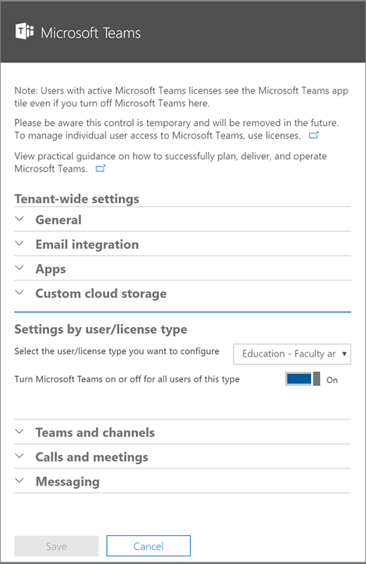

Manage Teams during the transition to the new Microsoft Teams and Skype for Business Admin Center
======================================================

The new Microsoft Teams & Skype for Business Admin Center is coming soon! 

Starting in March 2018, we're gradually migrating settings to the Microsoft Teams & Skype for Business Admin Center from both the current Skype for Business Admin center and the Microsoft Teams experience in the Office 365 Admin center. If a setting has been migrated, you'll see a notification and then be directed to the setting's location in the new Microsoft Teams & Skype for Business Admin Center.

We’ll continue to migrate other functionality from the Skype for Business Admin center in the coming months. You can stay up to date via our public [roadmap](https://aka.ms/Office365Roadmap).

> [!NOTE]
> We’re rolling out the new Microsoft Teams & Skype for Business Admin Center in stages. As a result, all customers will not see the new Admin Center at the same time. We’ll notify you when you can start using the new Admin Center.

## What is the new Microsoft Teams & Skype for Business Admin Center?  

The new Admin Center experience will provide you with a unified experience to manage both Teams and Skype for Business. We’re delivering additional functionality, end-to-end insights, and the ability to manage Teams settings on a user level.

Starting in mid-March 2018, the following capabilities will be available in the new Microsoft Teams & Skype for Business Admin Center: 

- **Microsoft Teams messaging policy**: Create policy for user-level management of the Microsoft Teams client experience for Messaging scenarios.
- **Microsoft Teams interop policy**: Configure the interoperability experience between Skype for Business and Microsoft Teams.
- **Microsoft Teams guest messaging settings**: Control the messaging capabilities for guest accounts in Microsoft Teams. 
- **Federation settings**: Manage the federation between tenants for Microsoft Teams and Skype for Business. 
- **User management**: Assign policies and configure user accounts. 
- **Audio conferencing**: Configure dial-in numbers and settings for Skype for Business and Microsoft Teams. 

 

## Settings migrated to the new Microsoft Teams & Skype for Business Admin Center

Your existing settings for General, Email integration, Custom cloud storage, Calls and Meetings, and Messaging in Microsoft Teams (see image below) will be migrated to the new Microsoft Teams & Skype for Business Admin Center (also known as the new Admin portal) over the next few months. 

> [!NOTE]
>You’ll continue to use the Groups dashboard in the Office 365 Admin center for configuration related to **Teams and channels**. Settings for **Apps** will remain in the Teams area of the Office 365 Admin center and will be migrated later. 

With respect to the settings available in **Settings by user/license type**, it essentially provided a way to configure groups of users differently. Now, with the new Admin portal, you can do that on a per-user basis. 

The license type setting will be migrated. If you’re currently using the **Turn Microsoft Teams on or off for all users of this type** setting to control access to Teams for users across SKUs, we will maintain your current configurations. However, you won’t be able to modify this setting in the new Admin portal. Instead, you’ll assign the appropriate licenses to users in your tenant via the Office 365 admin center. For more details, see [Manage user access to Microsoft Teams](user-access.md). 

The following table identifies the sections of the current Teams experience that will be migrated and shows the relationship between the current settings and the policies in the new Admin portal.

|Section of Teams in Office 365 Admin center  |Setting name (Tenant level)  |Microsoft Teams & Skype for Business Admin Center policy   |Level: Tenant or User   |
|---------|---------|---------|---------|
|General     |Show Organizational Chat in Personal Profile        |  TeamsClientConfiguration       |  Tenant       |
|General     |Use Skype for Business for recipients who don’t have Teams         |TeamsClientConfiguration         |Tenant         |
|General     |Allow T-Bot proactive help messages         |TeamsClientConfiguration         |Tenant         |
|Email integration     |Allow users to send emails to channels         |TeamsClientConfiguration         |Tenant         |
|Email integration     |Allow senders list         |TeamsClientConfiguration        |Tenant         |
|Custom cloud storage     |Box         |TeamsClientConfiguration         |Tenant         |
|Custom cloud storage     |Dropbox        |TeamsClientConfiguration         |Tenant         |
|Custom cloud storage     |Google Drive        |TeamsClientConfiguration         |Tenant         |
|Custom cloud storage     |ShareFile        |TeamsClientConfiguration         |Tenant         |
|Settings by user/license type     |Turn Microsoft Teams on or off for all users          |Deprecated. Use Office 365 admin center to assign licenses.        |         |
|Teams and channels     |         |Redirects to Azure Active Directory Group Management (Same as current experience).              |User         |
|Teams and channels     |         |Redirects to AAD Group Management (Same as current experience).             |User          |
|Calls and Meetings     |Allow scheduling for private meetings         |TeamsMeetingPolicy         |User          |
|Calls and Meetings     |Allow Ad-hoc channel meetup         |TeamsMeetingPolicy         |User          |
|Calls and Meetings     |Allow scheduling for channel meetings         |TeamsMeetingPolicy         |User          |
|Calls and Meetings     |Allow videos in meetings         |TeamsMeetingPolicy         |User          |
|Calls and Meetings     |Allow screen sharing in meetings         |TeamsMeetingPolicy         |User          |
|Calls and Meetings     |Allow private calling         |TeamsCallingPolicy         |User          |
|Messaging     |Enable Giphy so users can add gifs to conversations         |TeamsMessagingPolicy         |User         |
|Messaging     |Content rating         |TeamsMessagingPolicy         |User         |
|Messaging     |Enable memes that users can edit and add to conversations         |TeamsMessagingPolicy         |User         |
|Messaging     |Enable stickers that users can edit and add to conversations         |TeamsMessagingPolicy         |User         |
|Messaging     |Allow owners to delete all messages         |TeamsMessagingPolicy         |User         |
|Messaging     |Allow users to edit their own messages         |TeamsMessagingPolicy         |User         |
|Messaging     |Allow users to delete their own messages         |TeamsMessagingPolicy         |User         |
|Messaging     |Allows users to chat privately         |TeamsMessagingPolicy         |User         |

## Manage settings during the migration

We plan to migrate Teams settings in sections in the following sequence: Messaging, Meetings, Calls, and lastly, the sections within the TeamsClient Configuration policy (General, Email integration, and Custom cloud storage).   

You can continue to modify settings in the Office 365 Admin center and the Skype for Business Admin center until migration for a section is complete for your tenant. 

The following table shows where you can manage features during the migration.

|Feature  |Microsoft Teams and Skype for Business Admin Center                       |Skype for Business Admin Center (legacy)  |Office 365 Admin center  |
|---------|:---------:|:---------:|:---------:|
|Messaging policy     |     X    |         |         |
|Teams interop policy     |    X     |         |         |
|Guest messaging settings     |   X      |         |         |
|External access settings    |    X     |         |         |
|User management    |         |         |    X     |    
|Audio conferencing     |    X     |    X     |         |
|Calling plans     |         |    X     |         |
|Phone System    |         |     X    |         |
|Phone number management     |         |   X      |         |
|Licensing for Cloud voice features     |         |         |    X     |
|Auto attendants     |         |    X     |         |
|Call queues     |         |    X     |         |

## Manage settings after the migration

We’ll notify you after migration is complete for a specific section within Teams. At that time, you’ll be able to see your existing settings for that section in the Office 365 Admin center, but you won’t be able to make any modifications there. Instead, you’ll use the Microsoft Teams & Skype for Business Admin Center to manage the newly migrated settings.

When the migration of these settings is complete, we’ll disable them in the Office 365 Admin center and the Skype for Business Admin center.

