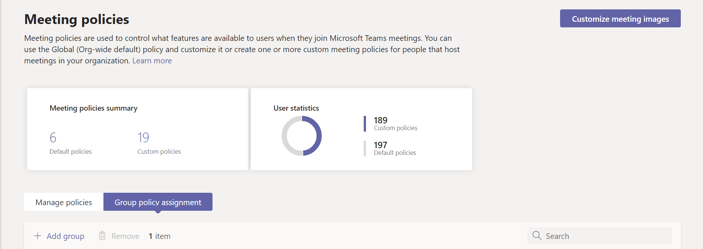
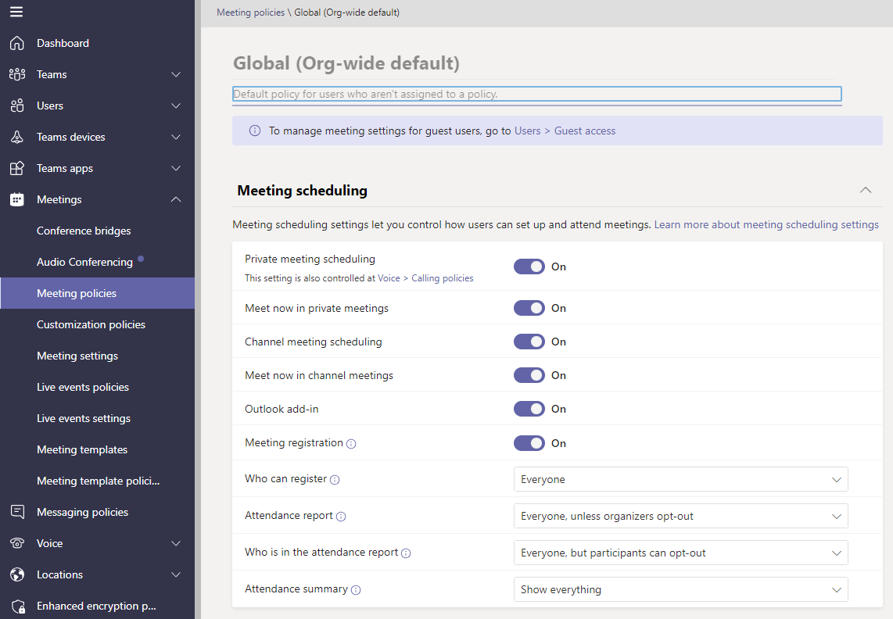
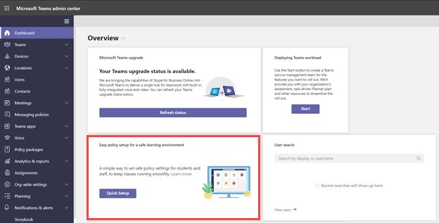

# Manage Teams with policies

Policies are an important part of managing Teams. Use this article to navigate how to use policies to benefit your organization.

## What you use policies for

Policies are used to accomplish many tasks in your organization across different areas such as messaging, meetings, and applications. Some of the things you can do include allowing users to schedule meetings in a teams channel, enabling users to edit sent messages, and controlling whether users can pin apps to the Teams app bar.

## How to assign policies

Policies can be assigned in several different ways depending on what your organization is trying to accomplish. You can make and view assignments in the Teams admin center.

Learn more about assigning policies [here](policy-assignment-overview.md).

> [!NOTE]
> To unassign policies, you can remove assignments in bulk for all users directly assigned to a policy. To learn more, read [Unassign policies in bulk](assign-policies-users-and-groups.md#unassign-policies-in-bulk).

## How to manage policies

Policies are managed with the Microsoft Teams admin center or [using PowerShell](./teams-powershell-managing-teams.md#manage-policies-via-powershell).

For example, an app setup policy can allow you to enable users to upload custom apps, install apps on behalf of your users, and pin apps to the Teams app bar. These policies are configured in the Teams admin center.

Additionally, a meeting policy can be used to control audio and video settings in Teams meetings such as transcriptions, cloud recordings, and IP audio/video.

### Teams for Education

You can also use the [Teams for Education policy wizard](easy-policy-setup-edu.md) to easily set up and manage policies for your learning environment.

## Types of policies

The following policies can be managed with Microsoft Teams.

Policy type | Description
------------|------------
[Policy packages](manage-policy-packages.md) | A policy package in Microsoft Teams is a collection of predefined policies and settings you can assign to users who have similar roles in your organization.
[Meeting policies](meeting-policies-overview.md) | A meeting policy is used to control the features that are available to meeting participants for meetings scheduled by users in your organization. Meeting policies include the following topics.  - Audio and video policies  - Content and screen sharing policies  - Participants, guests, and access policies  - General policies
[Voice and calling policies](voice-and-calling-policies.md)| Voice and calling policies manage these settings through teams such as emergency calling, call routing, and caller ID.
[App policies](app-policies.md)| App policies are used to control applications in Microsoft Teams. Admins can allow or block which apps users can install, pin applications to a user's Teams app bar, and install application on behalf of your users.
[Messaging policies](messaging-policies-in-teams.md)| Messaging policies control chat and channel feature availability.

## Related topics

* [Assign policies in Teams - getting started](policy-assignment-overview.md)
* [Manage feedback policies in Microsoft Teams](manage-feedback-policies-in-teams.md)
* [Manage teams policies in Microsoft Teams](teams-policies.md)
* [Set up for live events in Microsoft Teams](teams-live-events/set-up-for-teams-live-events.md)
* [Teams for Education policies and policy packages](policy-packages-edu.md)