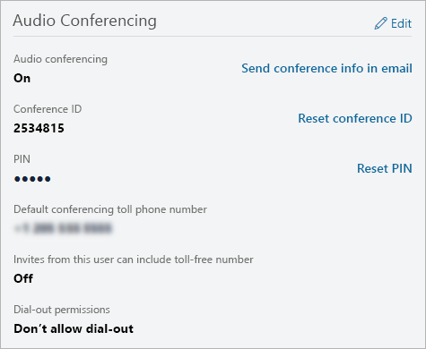

# Manage the Audio Conferencing settings for a user in Microsoft Teams

As an Office 365 admin, you can edit the Audio Conferencing settings—such as the provider, default toll or toll-free number, conference ID, or PIN—for an individual user in your organization. If you want to edit settings for your organization, see [Manage the Audio Conferencing settings for your organization](manage-the-audio-conferencing-settings-for-my-organization-in-teams.md).

##  Using the Microsoft Teams admin center

1. In the left navigation, click **Users**, and then select the user from the list of available users.

2. Click **Edit**.

3. Under **Audio Conferencing**, modify any of the following:

|**Setting**|**Description**|
|:-----|:-----|
|**Audio conferencing**|To turn audio conferencing on or off for the user, click **Edit** next to **Audio Conferencing**, and then in the **Audio Conferencing** pane, toggle **Audio conferencing** On or Off.|
|**Send conference info in email**  |Click this link only if you want to immediately send an email to the user with his or her conference ID and phone number. (This email does not include the PIN.) See [Send an email to a user with their Audio Conferencing information](send-an-email-to-a-user-with-their-dial-in-information-in-teams.md).  |
|**Conference ID**  |Click **Reset conference ID** if you need to reset the conference ID for the user. For more information, see [Reset a conference ID for a user](reset-a-conference-id-for-a-user-in-teams.md).  |
|**PIN** |Click **Reset PIN** if you need to reset the PIN for the user. For more information, see [Reset the Audio Conferencing PIN](reset-the-audio-conferencing-pin-in-teams.md). |
|**Default conferencing toll phone number** (required) |These will be numbers that are set on the audio conferencing bridge. Format the numbers as you want them to appear in Skype for Business and Microsoft Teams meeting requests. To change the default toll number, click **Edit** next to **Audio Conferencing** and in the **Audio Conferencing** pane, select a number under **Toll number**. |
|**Invites from this user can include toll-free number**|To change this setting, click **Edit** next to **Audio Conferencing** and in the **Audio Conferencing** pane, toggle **Include toll-free numbers in meeting requests from this user** On or Off. |
|**Unauthenticated users can be the first person in the meeting**|To change this setting, toggle **Unauthenticated users can be the first person in the meeting** On or Off.
|**Dial-out permissions**|To change this setting, click **Edit** next to **Audio Conferencing** and in the **Audio Conferencing** pane, choose an option under **Dial-out from meetings**.|

 

> [!Note]
> [!INCLUDE [updating-admin-interfaces](includes/updating-admin-interfaces.md)]

## Related topics

[Manage the Audio Conferencing settings for your organization](manage-the-audio-conferencing-settings-for-my-organization-in-teams.md)

[Audio Conferencing common questions](audio-conferencing-common-questions.md)
