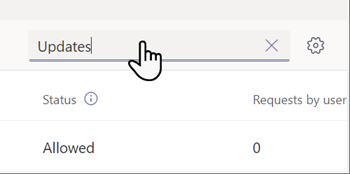

# Manage the Updates app for your organization in Microsoft Teams

## Overview of Updates

The Updates app in Microsoft Teams provides a centralized place for members of your organization to create, review, and submit updates. By creating update requests, you can use the Updates app to keep track of anything your organization needs. Updates is available for both desktop and mobile.

In Teams, users can get the Updates app from the Teams app store. You can share the [Get started in Updates article](https://support.microsoft.com/office/get-started-in-updates-c03a079e-e660-42dc-817b-ca4cfd602e5a) with your users to help them get comfortable using Updates.

:::image type="content" source="media/manage-updates-home.png" alt-text="Image of the Updates app on Teams desktop and mobile." lightbox="media/manage-updates-home.png":::

Updates comes with out-of-the-box templates for common business scenarios and the option to create your own requests.

:::image type="content" source="media/manage-updates-templates.png" alt-text="Screenshot of templates available in the Updates app." lightbox="media/manage-updates-templates.png":::

Anyone can create an update request and ask others to submit updates to sync their work status. They can also add people as Viewers to review the update submissions.

:::image type="content" source="media/manage-updates-request.png" alt-text="Screenshot of creating an update request." lightbox="media/manage-updates-request.png":::

When a user is assigned an update request, they get a notification in their Teams activity feed. They can see the requests assigned to them on the **Needing your updates** section of the homepage on desktop and on the **Submit** tab on mobile.

:::image type="content" source="media/manage-updates-submitters.png" alt-text="Screenshot of the Needing your updates section of the Updates app homepage on desktop." lightbox="media/manage-updates-submitters.png":::

Viewers can review update submissions on the **Review updates** section of the homepage on desktop and on the **Review** tab on mobile.

:::image type="content" source="media/manage-updates-viewers.png" alt-text="Screenshot of the Review updates section of the Updates app homepage on desktop." lightbox="media/manage-updates-viewers.png":::

## Example scenario

Employees at a clothing store are responsible for opening and closing the store every day. Every morning, the shift leader fills out the Store opening update. In this update, they describe any issues with the previous night's closing, answer questions about the cleanliness of the store, and report any supplies that need replenished. Submitting an update lets them communicate their needs for the store and any problems quickly and efficiently. Daily updates also give the store associates an opportunity to highlight what's going well.

At the store's manufacturing facilities, employees perform safety checks with Updates using mobile devices.

:::image type="content" source="media/updates-mobile.png" alt-text="Image of the Weekly safety walkthrough template on a mobile device.":::

Meanwhile, a team of remote workers is updating the store's website. They're spread across time zones, so daily stand-up meetings aren't convenient. Instead, each of the team members submits daily Updates reports on their progress to the team leader.

[Download the Updates lookbook](https://go.microsoft.com/fwlink/?linkid=2197649) to see more examples of what you can do with Updates.

## Prerequisites

Here are the prerequisites for deploying Updates:

- Permissions to create a Microsoft Dataverse database.

- An account on [powerautomate.microsoft.com](https://powerautomate.microsoft.com/).

- Administrator role in your target environment.

- License for Power Automate, Microsoft 365, or Dynamics 365.

## Storage with Microsoft Dataverse

The Common Data Model (CDM) is the shared data language used by business and analytical applications in the Microsoft Dataverse. It consists of a set of standardized, extensible data schemas published by Microsoft and our partners that enables consistency of data and its meaning across applications and business processes. Learn more about the [Common Data Model](/common-data-model/).

Updates that are created from a template still store data in Microsoft Dataverse, such as their title, details, template ID, and more.

## Updates Teams app permissions

The Updates Teams app lets you access the following features:

- Receive messages and data that you provide to it.

- Send you messages and notifications.

- Render personal apps and dialogs without a Teams-provided header.

- Access your profile information such as your name, email address, company name, and preferred language.

- Receive messages and data that team members provide to it in a channel.

- Send messages and notifications in a channel.

- Access your team's information:
  - Team name
  - Channel list
  - Roster (team members' names and email addresses)

- Use the team's information to contact them.

## Disable the Updates app

The Updates app is available by default. You can disable the app in the Teams admin center.

  1. In the left navigation of the Teams admin center, go to **Teams apps** > **Manage apps**.

  1. Search for, and then select the Updates app.

     

  1. Select the toggle to disable the app for your organization.

     

## Pin Updates to Teams

App setup policies let you customize Teams to pin apps that are most important for your users in your users. The apps are pinned to the app bar—the bar on the side of the Teams desktop client and at the bottom of the Teams mobile clients—where users can quickly and easily access them.

To pin the Updates app for your users, you can edit the global (Org-wide default) policy or create and assign a custom policy in app setup policy. Learn more about [Teams app setup policies](teams-app-setup-policies.md).

## Retention policy

Updates created from the Updates app are stored in the default Microsoft Dataverse environment, which doesn’t support backups at this time. Learn more about how to [back up and restore environments](/power-platform/admin/backup-restore-environments).

## Conditional access and permission policies

The Updates app in Teams doesn't currently support Conditional Access policies that are set for Microsoft Teams.

You can use [Teams app permission policies](teams-app-permission-policies.md) to manage Updates.

## Security

From the Teams Updates app, users can create new updates and view updates that they sent and received. Users can't view the updates submitted by others unless they're a viewer of the update or update request.

## Power Automate connector

Updates supports the Power Automate connector, **Updates App (Microsoft 365)**. Using this connector can help you automate your organization's workflows. [Learn more](https://powerautomate.microsoft.com/blog/automate-workflows-with-power-automate-connector-for-updates-in-microsoft-teams/).

## Give feedback or report an issue

To send feedback or report an issue, select **Settings and more** (**…**) in Teams, and then choose **Help** > **Give feedback**. Enter your feedback or details about the issue you're experiencing. Indicate at the beginning of your feedback report that you're sending feedback about Updates so we can easily identify Updates issues.
