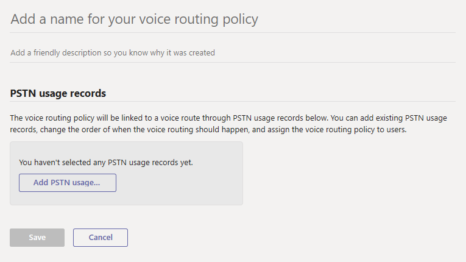

# Manage voice routing policies in Microsoft Teams

If you've deployed [Phone System Direct Routing](direct-routing-landing-page.md) in your organization, you use voice routing policies to allow Teams and Skype for Business Online users to receive and make phone calls to the Public Switched Telephone Network (PSTN) using your on-premises telephony infrastructure.

A voice routing policy is a container for PSTN usage records. You create and manage voice routing policies by going to **Voice** > **Voice routing policies** in the Microsoft Teams admin center or by using Windows PowerShell.

You can use the global (Org-wide default) policy or create and assign custom policies. Users will automatically get the global policy unless you create and assign a custom policy. Keep in mind that you can edit the settings in the global policy but you can't rename or delete it.

It's important to know that assigning a voice routing policy to a user doesn't enable them to make PSTN calls in Teams. You'll also need to enable the user for Phone System Direct Routing and complete other configuration steps. To learn more, see [Configure Direct Routing](direct-routing-configure.md).

## Create a custom voice routing policy

### Using the Microsoft Teams admin center

1. In the left navigation of the Microsoft Teams admin center, go to **Voice** > **Voice routing policies**, and then click **Add**. 
     
2. Enter a name and description for the policy.
3. Under **PSTN usage records**, click **Add PSTN usage**, and then select the records that you want to add. If you need to create a new PSTN usage record, click **Add**.
4. If you added multiple PSTN usage records, arrange them in the order that you want.
5. When you're done, click **Apply**.
6. Click **Save**.

### Using PowerShell

See [New-CsOnlineVoiceRoutingPolicy](https://docs.microsoft.com/powershell/module/skype/new-csonlinevoiceroutingpolicy).

## Edit a voice routing policy

### Using the Microsoft Teams admin center

You can edit the global policy or any custom policies that you create.

1. In the left navigation of the Microsoft Teams admin center, go to **Voice** > **Voice routing policies**.
2. Select the policy by clicking to the left of the policy name, and then click **Edit**.
3. Click **Add/remove PSTN usage records**, make the changes that you want, and then click **Save**.

### Using PowerShell

See [Set-CsOnlineVoiceRoutingPolicy](https://docs.microsoft.com/powershell/module/skype/set-csonlinevoiceroutingpolicy).

## Assign a custom voice routing policy to users

### Using the Microsoft Teams admin center

1. In the left navigation of the Microsoft Teams admin center, go to **Users**, and then click the user.
2. Click **Policies**, and then next to **Assigned policies**, click **Edit**.
3. Under **Voice routing policy**, select the policy you want to assign, and then click **Save**.

To assign a custom teams policy to multiple users at a time, see [Edit Teams user settings in bulk](edit-user-settings-in-bulk.md).

Or, you can also do the following:

1. In the left navigation of the Microsoft Teams admin center, go to **Voice** > **Voice routing policies**.
2. Select the policy by clicking to the left of the policy name.
3. Select **Manage users**.
4. In the **Manage users** pane, search for the user by display name or by user name, select the name, and then select **Add**. Repeat this step for each user that you want to add.
5. When you're finished adding users, click **Save**.

### Using PowerShell

See [Grant-CsOnlineVoiceRoutingPolicy](https://docs.microsoft.com/powershell/module/skype/grant-csonlinevoiceroutingpolicy).

## Related topics

- [Teams PowerShell overview](teams-powershell-overview.md)
- [Configure voice routing for Direct Routing](direct-routing-voice-routing.md)
- [Enable Location-Based Routing for Direct Routing](location-based-routing-enable.md)
