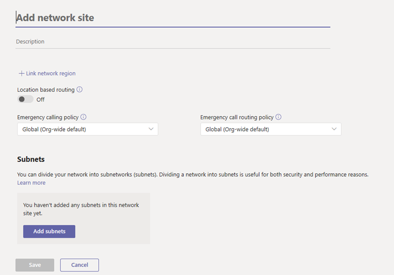
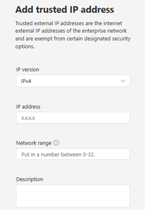

# Manage your network topology for cloud voice features in Microsoft Teams

If your organization is deploying [Location-Based Routing for Direct Routing](location-based-routing-plan.md) or [dynamic emergency calling](configure-dynamic-emergency-calling.md), you must configure network settings for use with these cloud voice features in Microsoft Teams. Network settings are used to determine the location of a Teams client and include network regions, network sites, subnets, and trusted IP addresses. Depending on the cloud voice feature and capability that you're deploying, you configure some or all these settings. To learn more about these terms, see [Network settings for cloud voice features](cloud-voice-network-settings.md).

You configure network settings on the **Network topology** page of the Microsoft Teams admin center or by using Windows PowerShell.

## Configure network settings in the Microsoft Teams admin center

[!INCLUDE [preview-feature](includes/preview-feature.md)]

You define network regions, network sites, and subnets on the **Network sites** tab of the **Network topology** page. Here, you can create or modify a network site, associate a site with a network region, associate a subnet to the site, turn on Location-based Routing, and assign emergency policies to the site. You can also add network regions that can be used globally for all sites.

#### Add and configure a network site

1. In the left navigation of the Microsoft Teams admin center, go to **Locations** > **Network topology**, and then click the **Network sites** tab.
2. Click **New**, and then enter a name and description for the site.

    

3. To associate the site with a network region, click **Link network region**, select an existing region or click **Add** to add a region, and then click **Link**.  
4. To enable Location-Based Routing for the site, turn on **Location based routing**.
5. To assign emergency services policies to the site, do one or both of the following:

    - If your organization uses Calling Plans or deployed Phone System Direct Routing, under **Emergency calling policy**, select the policy that you want.
    - If your organization deployed Phone System Direct Routing, under **Emergency call routing policy**, select the  policy that you want.

6. To associate a subnet to the site, under **Subnets**, click **Add subnets**. Specify the IP version, IP address, network range, add a description, and then click **Apply**. Each subnet must be associated with a specific site.
7. Click **Save**.

#### Modify a network site

1. In the left navigation of the Microsoft Teams admin center, go to **Locations** > **Network topology**, and then click the **Network sites** tab.
2. Select the site by clicking to the left of the site name, and then click **Edit**.
3. Make the changes that you want, and then click **Save.**

### Manage external trusted IP addresses

You manage external trusted IP addresses on the **Trusted IPs** tab on the **Network topology** page of the Microsoft Teams admin center. You can add an unlimited number of external trusted IP addresses.

#### Add a trusted IP address

1. In the left navigation of the Microsoft Teams admin center, go to **Locations** > **Network topology**, and then click the **Trusted IPs** tab.
2. Click **New**.
3. In the **Add trusted IP address** pane, specify the IP version, IP address, network range, add a description, and then click **Apply**.

    

#### Edit a trusted IP address

1. In the left navigation of the Microsoft Teams admin center, go to **Locations** > **Network topology**, and then click the **Trusted IPs** tab.
2. Select the IP address by clicking to the left of it, and then click **Edit**.
3. In the **Edit trusted IP address** pane, make the changes that you want, and then click **Apply**.

## Configure network settings using PowerShell

To complete the steps in this section, you'll need some familiarity with PowerShell cmdlets. To learn more, see [Teams PowerShell Overview](teams-powershell-overview.md).

### Define network regions

 Use the [New-CsTenantNetworkRegion](https://docs.microsoft.com/powershell/module/skype/New-CsTenantNetworkRegion) cmdlet to define network regions. Note that the RegionID parameter is a logical name that represents the geography of the region and has no dependencies or restrictions and the CentralSite &lt;site ID&gt; parameter is optional.

```
New-CsTenantNetworkRegion -NetworkRegionID <region ID>  
```

In this example, we create a network region named India.
```
New-CsTenantNetworkRegion -NetworkRegionID "India"  
```

See also [Set-CsTenantNetworkRegion](https://docs.microsoft.com/powershell/module/skype/set-cstenantnetworkregion).

### Define network sites

Use the [New-CsTenantNetworkSite](https://docs.microsoft.com/powershell/module/skype/new-cstenantnetworksite?view=skype-ps) cmdlet to define network sites. Each network site must be associated with a network region.

```
New-CsTenantNetworkSite -NetworkSiteID <site ID> -NetworkRegionID <region ID>
```
In this example, we create two new network sites, Delhi and Hyderabad, in the India region.
```
New-CsTenantNetworkSite -NetworkSiteID "Delhi" -NetworkRegionID "India"
New-CsTenantNetworkSite -NetworkSiteID "Hyderabad" -NetworkRegionID "India"
```
The following table shows the network sites defined in this example.

||Site 1 |Site 2 |
|---------|---------|---------|
|Site ID    |    Site 1 (Delhi)     |  Site 2 (Hyderabad)       |
|Region ID  |     Region 1 (India)    |   Region 1 (India)      |

See also [Set-CsTenantNetworkRegion](https://docs.microsoft.com/powershell/module/skype/set-cstenantnetworksite).

### Define network subnets

Use the [New-CsTenantNetworkSubnet](https://docs.microsoft.com/powershell/module/skype/new-cstenantnetworksubnet?view=skype-ps) cmdlet to define network subnets and associate them to network sites. Each network subnet can only be associated with one site.

```
New-CsTenantNetworkSubnet -SubnetID <Subnet IP address> -MaskBits <Subnet bitmask> -NetworkSiteID <site ID>
```

In this example, we create an association between subnet 192.168.0.0 and the Delhi network site and between subnet 2001:4898:e8:25:844e:926f:85ad:dd8e and the Hyderabad network site.
```

New-CsTenantNetworkSubnet -SubnetID "192.168.0.0" -MaskBits "24" -NetworkSiteID "Delhi"
New-CsTenantNetworkSubnet -SubnetID "2001:4898:e8:25:844e:926f:85ad:dd8e" -MaskBits "120" -NetworkSiteID "Hyderabad"

```
The following table shows the subnets defined in this example.

||Site 1 |Site 2 |
|---------|---------|---------|
|Subnet ID   |    192.168.0.0     |  2001:4898:e8:25:844e:926f:85ad:dd8e     |
|Mask  |     24    |   120      |
|Site ID  | Site (Delhi) | Site 2 (Hyderabad) |

For multiple subnets, you can import a CSV file by using a script such as the following.
```
Import-CSV C:\subnet.csv | foreach {New-CsTenantNetworkSubnet –SubnetID $_.SubnetID-MaskBits $_.Mask -NetworkSiteID $_.SiteID}  
```
In this example, the CSV file looks something like this:
```
Identity, Mask, SiteID
172.11.12.0, 24, Redmond
172.11.13.0, 24, Chicago
172.11.14.0, 25, Vancouver
172.11.15.0, 28, Paris
```

See also [Set-CsTenantNetworkSubnet](hhttps://docs.microsoft.com/powershell/module/skype/set-cstenantnetworksubnet).

### Define external subnets (external trusted IP addresses)

Use the [New-CsTenantTrustedIPAddress](https://docs.microsoft.com/powershell/module/skype/new-cstenanttrustedipaddress?view=skype-ps) cmdlet to define external subnets and assign them to the tenant. You can define an unlimited number of external subnets for a tenant.
```
New-CsTenantTrustedIPAddress -IPAddress <External IP address> -MaskBits <Subnet bitmask> -Description <description> 
```
For example:
```
New-CsTenantTrustedIPAddress -IPAddress 198.51.100.0 -MaskBits 30 -Description "Contoso address"  
```

See also [Set-CsTenantTrustedIPAddress](https://docs.microsoft.com/powershell/module/skype/set-cstenanttrustedipaddress).

## Related topics

- [Network settings for cloud voice features in Teams](cloud-voice-network-settings.md)
