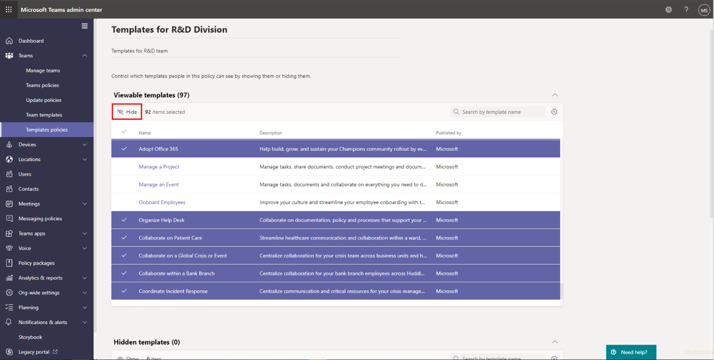
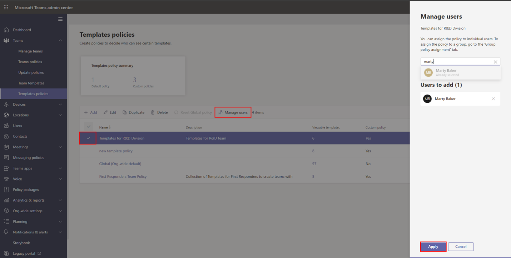
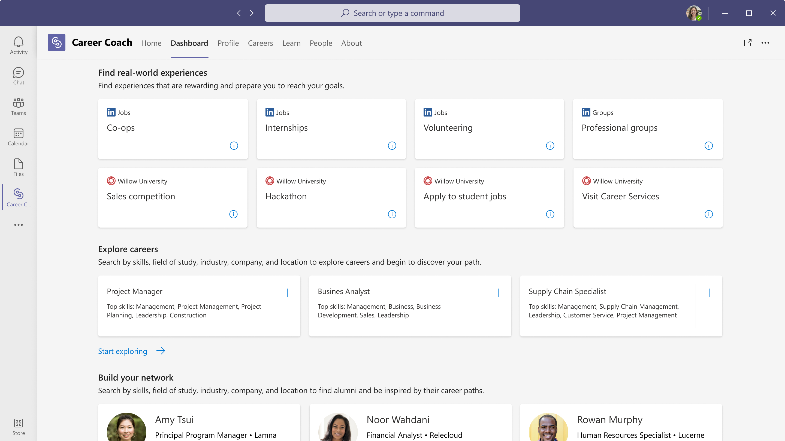
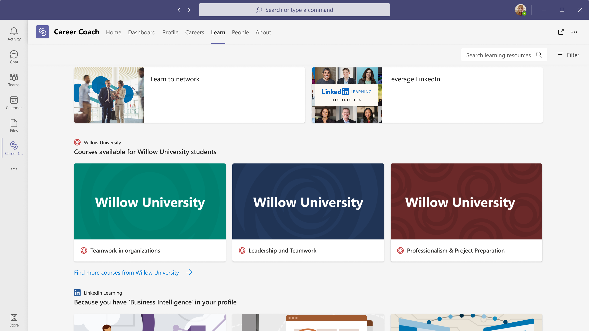
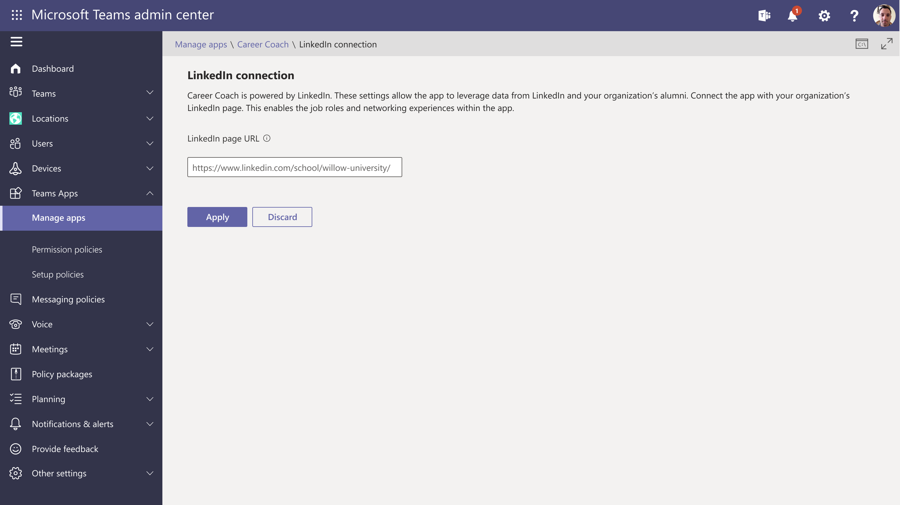
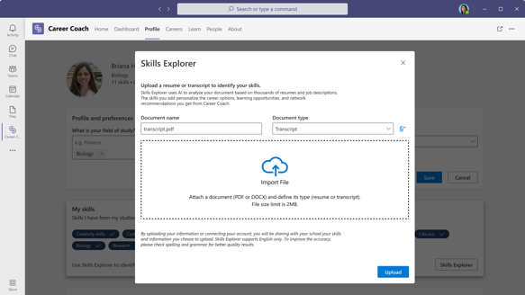
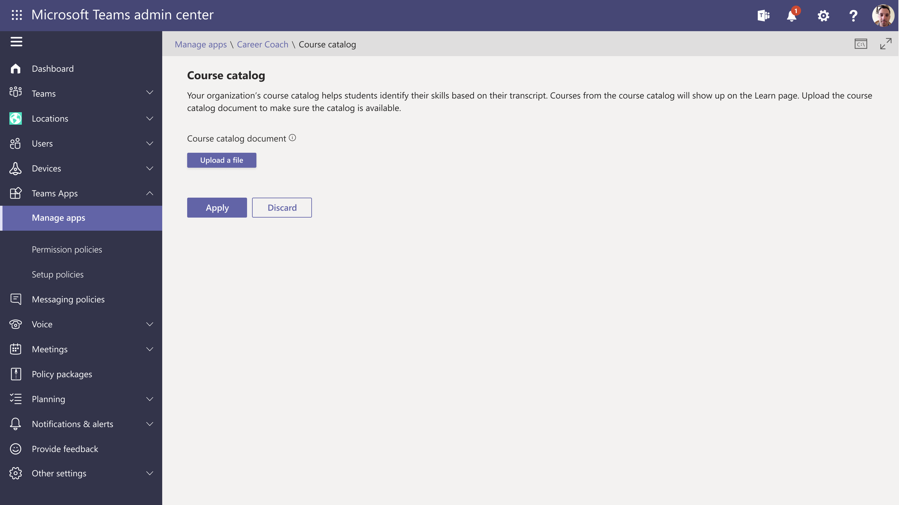
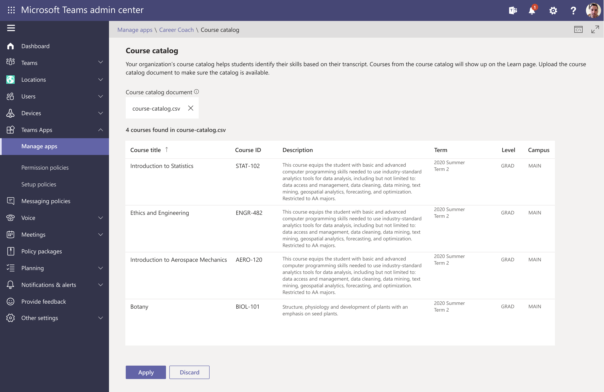
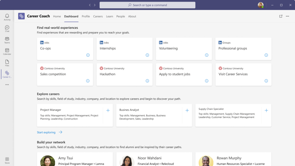

# Set up avatars for Microsoft Teams

Avatars for Microsoft Teams lets your users connect with presence in Teams without having to turn their cameras on. Your users can represent themselves the way they want to show by by choosing the avatar that fits their specific meeting. You can control whether avatars for Teams is available in your organization and who can use them.

Setting up the avatars for Teams app involves the following steps:

1. Allow the avatars for Teams app in you organization.
1. Ensure essential URLs are allowed.
1. (Optional) Block the avatars for Teams app for specific users or user groups.

After you complete these steps, the avatars for Teams app will be available to users in your organization.

## Allow the avatars for Teams app in you organization

> [!NOTE]
> The steps in this section apply when all users in your organization are assigned the same app permission policy, for example: **Global (Org-wide default)**. The steps you need to take might be different if you've already assigned different app permission policies to different users.

### Allow the avatars for Teams app

1. In the Teams admin center, in the left-navigation bar, go to **Teams apps** then select **Manage apps**.
1. Search for and select **Avatars** and then select **Allowed**.

   

### Create or edit a setup policy to pre-install the avatars for Teams app for users

1. In the Teams admin center, go to **Setup policies**.
1. Select the policy you want to edit or **Add** a policy.
1. Under **Installed apps**, select **Add apps**.

   

1. Adjust the scope of your search to be **Global**, then search for **Avatars**.

   

1. Confirm by selecting **Add** at the bottom.

   

### Enable user pinning or pin app for users

1. On the **Setup** policy page, set **User pinning** to **ON**.

   

1. **[Optional]** In the **Setup** policy page, go to **Pinned apps**, and **Add** the avatars for Teams app.

   

Now users will see the avatars for Teams app when they search through their apps, be able to pin it, and (optionally) have the app already pinned.

## Ensure essential URLs are allowed

To ensure the avatars for Teams app works properly, the following URLs need to be allowed through your firewall or proxy server.

*All URLs should be added to 443 TCP (and 80 for HTTPS redirect)*:

- `https://clients.config.office.net/user/v1.0/web/policies`
- `https://browser.events.data.microsoft.com/OneCollector/1.0/`
- `https://global.profile.prod.collab.mixedreality.microsoft.com/ms-graph-obo/accesstoken`
- `https://js.monitor.azure.com/scripts/c/ms.analytics-web-3.js`
- `global.profile.prod.collab.mixedreality.microsoft.com`
- `clients.config.office.net`
- `catalog.meshxp.net`
- `browser.events.data.microsoft.com`
- `avatars.meshxp.net`

If these URLs aren't properly allowed, you may run into issues when running the app and see the following error:

## Blocking Avatars app for specific users

Blocking users is important when you don't want certain users to access the Avatars for Teams app, or if there's a report of an inappropriate avatar that violates company policy and needs to be disabled.

> [!NOTE]
> This covers the case where all users in the tenant are assigned the same app permission policy, like **Global (Org-wide default)**. The steps you need to take might be different if you've already assigned different app permission policies to different users.

### Create a policy to block the avatars for Teams app for specific users

1. In the left panel, go to **Teams apps** > **Permission policies**.
1. Go to the app permission policies table, select **Add**.
1. Provide a name and description for the policy.
1. Under **Microsoft apps**, select **Block specific apps and allow all others**

### Add the Avatar app to the policy

1. Select Block apps.

1. Search for the Avatars app, then select **Add.**  

  

1. Be sure to enter a policy name and description, then select **Block** then **Save.**

  

### Add users to policy to block them from the Avatars app

In the left navigation of the Microsoft Teams admin center, go to the **Permission policy** page.

1. Select the new policy and click on” **Assign users**” to assign this policy to the users you want to block.

   

1. In the **Manage** **users** pane, search for the user by display name or by user name, select the name, and then select **Add**. Repeat this step for each user that you want to add.

1. When you're finished adding users, select **Apply**.  

Now users with the new app permission policy cannot see the Avatar app in the Teams app store.

> [!IMPORTANT]
> Users need to restart their Teams client for new policies or policy updates to take effect.
