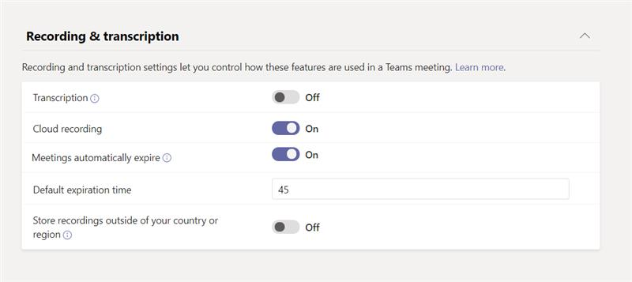

# Meeting policies and meeting expiration in Microsoft Teams

[Meeting policies](meeting-policies-overview.md) in Microsoft Teams are used to control whether users in your organization can start and schedule meetings and the features that are available to meeting participants for meetings that are scheduled by users. You can use the global (Org-wide default) policy or create and assign custom policies. You manage meeting policies in the Microsoft Teams admin center or by using [Get](/powershell/module/skype/get-csteamsmeetingpolicy), [New](/powershell/module/skype/new-csteamsmeetingpolicy), [Set](/powershell/module/skype/set-csteamsmeetingpolicy), [Remove](/powershell/module/skype/remove-csteamsmeetingpolicy), [Grant](/powershell/module/skype/grant-csteamsmeetingpolicy) -CsTeamsMeetingPolicy PowerShell cmdlets.

The meeting policy settings that control whether users can start and schedule meetings and also control expiration of meetings scheduled by users. When a meeting join link and conference ID for a meeting expires, no one can join the meeting. The following meeting policy settings determine whether users can start and schedule meetings in Teams. We discuss the meeting settings in this article.

- [Meet now in channels](meeting-policies-in-teams-general.md#meet-now-in-channels): Controls whether a user can start an impromptu meeting in a channel.
- [Channel meeting scheduling](meeting-policies-in-teams-general.md#channel-meeting-scheduling): Controls whether a user can schedule a meeting in a channel.
- [Private meeting scheduling](meeting-policies-in-teams-general.md#private-meeting-scheduling): Controls whether a user can schedule a private meeting in Teams. A meeting is private when it's not published to a channel in a team.
- [Outlook add in](meeting-policies-in-teams-general.md#outlook-add-in): Controls whether a user can schedule a private meeting from Outlook. A meeting is private when it's not published to a channel in a team.
- [Meet now in private meetings](meeting-policies-in-teams-general.md#meet-now-in-private-meetings): Controls whether a user can start an impromptu private meeting.

By default, these settings are on. When any of these settings are turned off, any user who is assigned the policy can't start or schedule new meetings of that type. At the same time, the meeting join links and conference IDs of all existing meetings of that type that the user previously started or scheduled expire.

For example, if a user is assigned a meeting policy in which these meeting policy settings are set to **On**, and then you turn off the **Allow Meet now in channels** setting, that user can no longer start impromptu meetings in channels, and the channel Meet now join links that the user previously created are expired. The user can still start and schedule other meeting types and join meetings organized by other people.

## What happens when the meeting join link and conference ID expire?

When the meeting join link and conference ID for a meeting expires, no one can join the meeting. When a user tries to join the meeting through the link or by phone, they'll get a message that says the meeting is no longer available. Conversations, files, whiteboards, recordings, transcripts, and other content related to the meeting are retained and users can still access them.

## What happens when you turn on and turn off a meeting policy setting?

### Switch a meeting policy setting from on to off

When a meeting policy setting is set to **On**, users who are assigned the policy can start or schedule meetings of that type and everyone can join. When you switch the meeting policy setting to **Off**, users who are assigned the policy can't start or schedule new meetings of that type, and the meeting join links and conference IDs of existing meetings that the user previously scheduled are expired.

Keep in mind that the user can still join meetings organized by other people.

### Switch a meeting policy setting from off to on

When you switch a meeting policy setting from **Off** to **On**, users who are assigned the policy can start or schedule meetings of that type. If a meeting policy setting is turned off and then turned on again for a user, all previously scheduled (and expired) meetings organized by the user become active and people can join them using the meeting join link or by phone.  

## Meeting expiration scenarios

Here's a summary of how meeting expiration works for each of the meeting policy settings discussed in this article.

|If you want to...&nbsp;&nbsp; |Do this&nbsp;&nbsp;&nbsp;&nbsp;  |Meeting join behavior&nbsp;&nbsp;&nbsp;&nbsp;  |
|---------------------------|---------------------|---------|
|Expire private Meet now meetings started by a user&nbsp;&nbsp;|Turn off **Meet now in private meetings**.&nbsp;&nbsp;|No one can join private **Meet now** meetings started by the user.|
|Expire private meetings scheduled by a user&nbsp;&nbsp;|Turn off **Private meeting scheduling** _and_ turn off **Outlook add-in**. &nbsp;&nbsp;|No one can join private meetings scheduled by the user. This prevents people from joining the following meetings:<ul><li>Private meetings that occurred in the past.</li><li>Private meetings that are scheduled for the future and have not yet occurred.</li><li>Future instances of recurring private meetings.</li></ul><br>Both **Private meeting scheduling** and **Outlook add-in** must be off to expire private meetings scheduled by a user. If one setting is off and the other is on, meeting join links and conference IDs of existing meetings remain active and won't be expired.|
|Expire channel **Meet now** meetings started by a user&nbsp;&nbsp;|Turn off **Meet now in channels** _and_ turn off **Channel meeting scheduling**.&nbsp;&nbsp;|No one can join channel **Meet now** meetings started by the user.|
|Expire channel meetings scheduled by a user&nbsp;&nbsp;|Turn off **Channel meeting scheduling**.&nbsp;&nbsp;|No one can join channel meetings scheduled by the user. This prevents people from joining the following meetings:<ul><li>Channel meetings that occurred in the past.</li><li>Channel meetings that are scheduled for the future and haven't yet occurred.</li><li>Future instances of recurring channel meetings.</li></ul>|

If you want people to access meetings that were previously scheduled or started by a particular user, you can:

- Turn on the meeting policy setting for that user.
- Turn off the meeting policy setting for that user and have another user who has the policy setting enabled create a new meeting to replace the expired meeting.

> [!NOTE]
> If the meeting was sent by a delegate, who was given permissions to send meeting invitations on behalf of another person, such as a manager, the meeting policy setting is applied to the person who granted permission (the manager).

## Changes to meeting expiration

All newly created Teams meeting recordings (TMRs) will have a default expiration of 120 days. This is on by default for all tenants. This means that by default, all TMRs created *after this feature was turned on* will be deleted 120 days after their creation date. Admins can also set meetings to **never auto-expire**. The OneDrive and SharePoint system will monitor the expiration date set on all TMRs and will automatically move TMRs to the recycle bin on their expiration date.

> [!NOTE]
> One copy of the meeting transcript is saved in OneDrive SharePoint and a second copy is saved in Exchange in temporary storage. The OSDP copy expires when the TMR auto-expires.

Automatic meeting expiration is a lightweight housekeeping mechanism to reduce storage clutter created by older TMRs. On average, across all customers, 96% of TMRs aren't watched after 60 days and 99% aren't watched after 110 days. We believe nearly all customers will benefit from the reduced storage load on their tenant by removing recordings that likely won't be watched again after 60 days. It's our goal to provide as clean an experience as possible for all customers by default.

Use meeting expiration to limit the OneDrive or SharePoint for cloud storage consumption driven by Teams meeting records. A typical meeting recording consumes around 400 MB per hour of recording.

> [!NOTE]
> The maximum default expiration date for A1 users is 30 days.

### Expiration date

- The expiration date is calculated as the **day it's created** plus the **default number of days set in the Teams policy by the admin**.
- Playback doesn't impact the expiration date.

### Change the default expiration date

Admins can edit the default expiration setting in PowerShell or the Teams admin center. Any changes will only effect *newly created* TMRs from that point forward. It won't impact any recordings created before that date. Admins can't change the expiration date on existing TMRs. This is done to protect the decision of the user that owns the TMR. Both meetings and calls can be controlled by this setting.

The expiration date value can be set as follows:

- Minimum value: **1 day**
- Maximum value: **99999 days**
- You can also set the expiration date to **-1** in PowerShell so the recordings never expire.

Example PowerShell command:

```powershell
Set-CsTeamsMeetingPolicy -Identity Global -NewMeetingRecordingExpirationDays 50
```

You can set the expiration date in the Teams admin center under **Meeting policies.** After you turn on **Meetings automatically expire,** you'll get the option to set a recording expiration.



### Compliance

You shouldn't rely on TMR expiration settings for legal protection since end users can modify the expiration date of any recordings they control.

#### Teams meeting recording expiration settings and Microsoft 365 retention policies in Microsoft Purview

File retention takes precedence over file deletion. A meeting recording with a Purview retention policy cannot be deleted by a TMR expiration policy until after the retention period is completed. For example, if you have a Purview rentention policy that says a file will be kept for five years and a TMR expiration policy set for 60 days, the TMR expiration policy will delete the recording after five years.  

If you have a TMR expiration policy and Purview deletion policy with different deletion dates, the file will be deleted at the earliest of the two dates. For example, if you have a Purview deletion policy that says a file will be deleted after one year and a TMR expiration set for 120 days, the TMR expiration setting will delete the file after 120 days.

### Enforcement of file retention with the Teams meeting recording expiration setting

Files won't be retained due to this feature or its settings. If a user with delete permissions attempts to delete a TMR that has an expiration setting, that user's delete action will be executed.

### What SKUs are required for this feature?

- All SKUs will have this feature by default.
- A1 users will be defaulted to a maximum 30-day expiration period, but they can change the expiration date as needed.

### What if I want the admin to have full control over the lifecycle of meeting recordings and don't want to give end users the ability to override the expiration date?

We recommend using the Security and Compliance retain and/or delete policies. That offering is targeted to solve complex policy and SLA-driven administrative legal concerns.

The auto-expiration feature is solely meant as a lightweight housekeeping mechanism to reduce storage clutter created from old Teams meeting recordings.

### Will future TMRs migrated from Classic Stream after this feature is released have auto-expiration applied to them too?

No, migrated TMRs will not come with an expiration set on them. Instead, we encourage admins to only migrate TMRs that they want to retain. More details will be provided in the migration documentation.

### How is this feature different from the expiration message I see when a TMR upload to OneDrive and SharePoint fails?

When a recording fails to upload to OneDrive or SharePoint, the Teams application displays a message in the chat that users have up to 21 days to download the TMR before it's permanently deleted from the Teams server. This existing expiration experience due to failed TMR uploads is not related to the OneDrive and SharePoint auto-expiration feature being discussed in the help document.

### How do I know the distribution of TMR playbacks so I know what the optimal auto-expiration default should be for my tenant?

1. Find the video in the library.
1. Select **...** > **Details**
1. Select the number of views at the top of the details pane.

You'll see file statistics that show:

- The number of unique viewers
- The number of total views
- The trend of viewers and views day-by-day for the last 90 days
- Viewership retention (which part of the video was viewed or not viewed)

### When will the file be deleted?

The recording is usually deleted within a day after the expiration date but in rare instances could take as long as five days. The file owner will receive an email notification when the recording expires and will be directed to the recycle bin to recover the recording.

> [!NOTE]
> On the expiration date, the recording is moved into the recycle bin and the expiration date field is cleared. If you recover the recording from the recycle bin, it won't be deleted by this feature again because the expiration date has been cleared.

## Related topics

[Change meeting expiration date - end-user controls](https://support.microsoft.com/office/record-a-meeting-in-teams-34dfbe7f-b07d-4a27-b4c6-de62f1348c24#bkmk_view_change_expiration_date)

[Manage meeting policies in Teams](meeting-policies-overview.md)

[Assign policies to your users in Teams](policy-assignment-overview.md)

[Teams PowerShell overview](teams-powershell-overview.md)

[Limits and specifications for Microsoft Teams](/microsoftteams/limits-specifications-teams)
