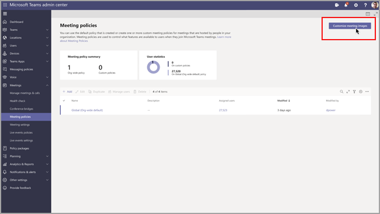

# Meeting policy settings for audio & video

This article describes the meeting policy settings specific to audio and video. These include the following:

- [Mode for IP audio](#mode-for-ip-audio)
- [Mode for IP video](#mode-for-ip-video)
- [IP video](#ip-video)
- [Media bit rate (Kbs)](#media-bit-rate-kbs)
- [Video filters mode](#video-filters-mode)
- [Allow custom background settings](#allow-custom-background-settings)
- [Far end camera control (FECC) for point tilt zoom (PTZ) cameras](#far-end-camera-control-fecc-for-point-tilt-zoom-ptz-cameras)

### Mode for IP audio

This is a per-user policy. This setting controls whether audio can be turned on in meetings and group calls. Here are the values for this setting.

|Setting value |Behavior  |
|---------|---------|
|**Outgoing and incoming audio enabled**    |Outgoing and incoming audio is allowed in the meeting. This is the default setting. |
|**Not enabled**     |Outgoing and incoming audio is turned off in the meeting.     |

If set to **Not enabled** for a user, that user can still schedule and organize meetings but they can't use audio. To join a meeting, they have to dial in through the Public Switched Telephone Network (PSTN) or have the meeting call and join them by phone. Meeting participants who don't have any policies assigned (for example, anonymous participants) have this set to **Outgoing and incoming audio enabled** by default. On Teams mobile clients, if this setting is not enabled, the user has to dial in to the meeting through the PSTN.

This setting doesn't apply to 1:1 calls. To restrict 1:1 calls, configure a Teams [calling policy](teams-calling-policy.md) and turn off the **Make private calls** setting. This setting also doesn't apply to conference room devices such as Surface Hub and Microsoft Teams Rooms devices.

This setting isn't yet available for Microsoft 365 Government Community Cloud (GCC), GCC High, or Department of Defense (DoD) environments.

To learn more, see [Manage audio/video for meeting participants](#manage-audiovideo-for-meeting-participants).

### Mode for IP video

This is a per-user policy. This setting controls whether video can be turned on in meetings and group calls. Here are the values for this setting.

|Setting value |Behavior  |
|---------|---------|
|**Outgoing and incoming video enabled**    | Outgoing and incoming video is allowed in the meeting. This is the default setting. |
|**Not enabled**     | Outgoing and incoming video is turned off in the meeting. On Teams mobile clients, users can't share videos or photos in the meeting.   Note that if **Mode for IP audio** is not enabled, then **Mode for IP video** will also remain not enabled.  |

If set to **Not enabled** for a  user, that user can't turn on video or view videos shared by other meeting participants. Meeting participants who don't have any policies assigned (for example, anonymous participants) have this set to **Outgoing and incoming video enabled** by default.

This setting doesn't apply to conference room devices such as Surface Hub and Microsoft Teams Rooms devices.

This setting isn't yet available for Microsoft 365 Government Community Cloud (GCC), GCC High, or Department of Defense (DoD) environments.

> [!NOTE]
> Keep in mind that this setting controls both outgoing and incoming video whereas the **IP video** setting controls outgoing video. To learn more, see [Which IP video policy setting takes precedence?](#which-ip-video-policy-setting-takes-precedence) and [Manage audio/video for meeting participants](#manage-audiovideo-for-meeting-participants).

To learn more, see [Manage audio/video for meeting participants](#manage-audiovideo-for-meeting-participants).

### IP video

This is a combination of a per-organizer and per-user policy. Video is a key component to meetings. In some organizations, admins might want more control over which users' meetings have video. This setting controls whether video can be turned on in meetings hosted by a user and in 1:1 and group calls started by a user. On Teams mobile clients, this setting controls whether users can share photos and videos in a meeting.

Meetings organized by a user who has this policy setting enabled, allow video sharing in the meeting by the meeting participants, if the participants also have the policy setting enabled. Meeting participants who don't have any policies assigned (for example, anonymous and federated participants) inherit the policy of the meeting organizer.

> [!NOTE]
> Keep in mind that this setting controls outgoing video whereas the **Mode for IP video** setting controls both outgoing and incoming video. To learn more, see [Which IP video policy setting takes precedence?](#which-ip-video-policy-setting-takes-precedence) and [Manage audio/video for meeting participants](#manage-audiovideo-for-meeting-participants).

| Teams desktop and web client |Teams mobile client  |
|:-------:|:-------:|
|    |          |

Let's look at the following example.

|User |Meeting policy  |IP video |
|---------|---------|---------|
|Daniela   | Global   | On       |
|Amanda    | Location1MeetingPolicy        | Off      |

Meetings hosted by Daniela allow video to be turned on. Daniela can join the meeting and turn on video. Amanda can't turn on video in Daniela's meeting because Amanda's policy is set to not allow video. Amanda can see videos shared by other participants in the meeting.

In meetings hosted by Amanda, no one can turn on video, regardless of the video policy assigned to them. This means Daniela can't turn on video in Amanda's meetings.  

If Daniela calls Amanda with video on, Amanda can answer the call with audio only.  When the call is connected, Amanda can see Daniela's video, but can't turn on video. If Amanda calls Daniela, Daniela can answer the call with video and audio. When the call is connected, Daniela can turn on or turn off her video, as needed.

To learn more, see [Manage audio/video for meeting participants](#manage-audiovideo-for-meeting-participants).

#### Which IP video policy setting takes precedence?

For a user, the most restrictive policy setting for video takes precedence. Here's some examples.

|IP video|Mode for IP video|Meeting experience|
|---------|---------|---------|
|Organizer: **On**  Participant: **On** |Participant: **Disabled**        |The **Mode for IP video** setting takes precedence. The participant who is assigned this policy can't turn on or view videos shared by others.|
|Organizer: **On**  Participant: **On** |Participant: **Outgoing and incoming video enabled**          |The participant who is assigned this policy can turn on or view videos shared by others.         |
|Organizer: **On**  Participant: **Off** |Participant: **Outgoing and incoming video enabled**         |The **IP video** setting takes precedence. Participants can only see incoming video and can't send outgoing video.         |
|Organizer: **On**  Participant: **Off** |Participant: **Disabled**         |The **Mode for IP video** setting takes precedence. The participant can't see incoming or outgoing video.|
|Organizer: **Off**    |       |The **IP video** setting takes precedence because it's turned off for the organizer. No one can turn on video in meetings organized by the user who is assigned this policy.         |

### Manage audio/video for meeting participants

|If you want to...  |Set the following policy settings  |
|---------|---------|
|Disable audio and video for participants in meetings  |Mode for IP audio: **Disabled**  Mode for IP video: **Disabled** IP video: N/A       |
|Enable only incoming video and audio for participants in meetings  |Mode for IP audio: **Outgoing and incoming audio enabled**  Mode for IP video: **Outgoing and incoming video enabled** IP video: **Off**       |
|Disable video for participants in meetings (participants have audio only)|  Mode for IP audio: **Enable outgoing and incoming audio**  Mode for IP video: **Disabled** IP video: N/A
|Enable audio and video for participants in meetings    |Mode for IP audio: **Outgoing and incoming audio enabled** (default)  Mode for IP video: **Outgoing and incoming video enabled** (default) IP video: **On** (default)    |

The most restrictive policy between the meeting organizer’s policy and the user’s policy applies. For example, if an organizer has a policy that restricts video and a user’s policy doesn't restrict video, meeting participants inherit the policy of the meeting organizer and don't have access to video in meetings. This means that they can join the meeting with audio only.

> [!NOTE]
> When a user starts a group call to join by phone, the **Use phone for audio** screen doesn't appear. This is a known issue that we're working to resolve. To work around this issue, select **Phone audio** under **Other join options**.

#### Teams mobile clients

For users on Teams mobile clients, the ability to share photos and videos during a meeting is also determined by the **IP video** or **IP video mode** setting. Depending on which policy setting takes precedence, the ability to share videos and photos won't be available. This doesn't affect screen sharing, which you configure using a separate [Screen sharing mode](meeting-policies-content-sharing.md#screen-sharing-mode) setting. Additionally, you can set a [Teams mobility policy](/powershell/module/skype/new-csteamsmobilitypolicy) to prevent mobile users from using IP video over a cellular connection, which means they must use a WiFi connection.

### Media bit rate (Kbs)

This is a per-user policy. This setting determines the media bit rate for audio, video, and video-based app sharing transmissions in calls and meetings for the user. It's applied to both the uplink and downlink media traversal for users in the call or meeting. This setting gives you granular control over managing bandwidth in your organization. Depending on the meetings scenarios required by users, we recommend having enough bandwidth in place for a good quality experience. The minimum value is 30 Kbps and the maximum value depends on the meeting scenario. To learn more about the minimum recommended bandwidth for good quality meetings, calls, and live events in Teams, see [Bandwidth requirements](prepare-network.md#bandwidth-requirements).

If there isn't enough bandwidth for a meeting, participants see a message that indicates poor network quality.

For meetings that need the highest-quality video experience, such as CEO board meetings and Teams live events, we recommend you set the bandwidth to 10 Mbps. Even when the maximum experience is set, the Teams media stack adapts to low-bandwidth conditions when certain network conditions are detected, depending on the scenario.

## Video filters mode

This is a per-user policy. This setting controls whether users can customize their video background in a meeting.

You can use both Teams admin center and PowerShell to set this policy. You can edit an existing Teams meeting policy by using the [Set-CsTeamsMeetingPolicy](/powershell/module/skype/set-csteamsmeetingpolicy) cmdlet. Or, create a new Teams meeting policy by using the [New-CsTeamsMeetingPolicy](/powershell/module/skype/new-csteamsmeetingpolicy) cmdlet, and then assign the policy to users.

To specify whether users can customize their video background in a meeting, set the **VideoFiltersMode** parameter (**Select video filters** setting in Teams admin center) as follows:

|Setting value in PowerShell|Setting value in Teams admin center |Behavior  |
|---------|---------|---------|
|**NoFilters** |**No filter**    |User can't customize their video background.|
|**BlurOnly**     |**Background blur only**|User has the option to blur their video background. |
|**BlurandDefaultBackgrounds**|**Background blur and default images**     |User has the option to blur their video background or choose from the default set of images to use as their background. |
|**AllFilters**|**All filters**     |User has the option to blur their video background, choose from the default set of images, or upload custom images to use as their background. |

> [!NOTE]
> Images uploaded by users aren't screened by Teams. When you use the **AllFilters** setting, you should have internal organization policies to prevent users from uploading offensive or inappropriate images, or images your organization don't have rights to use for Teams meeting backgrounds.

### Allow custom background settings

You can add custom background images to be used per tenant. This feature allows companies to apply corporate branding to Teams meetings.

1. Sign in to the Teams admin center.

2. Select **Meetings** > **Meeting Policies** > **Customize meeting images**.

   

3. Select **On** from **Org wide background images**.

4. Select **+ Add images**.

5. In the Managing backgrounds panel, select **Add image**.

6. Ensure that the images meet these requirements:
  
   - Minimum size 360 px
   - Maximum size 2048 px
   - File type of PNG, JPG, or BMP
   - Maximum 50 images can be uploaded

7. Preview the images that you've selected, and then select **Close**.

8. Review the images and add more as needed.

9. Select **Save**.

The meeting attendees will see a selection of background images that they can use when they attend a meeting.

> [!NOTE]
> It could take up to 24 hours for the changes to take effect.

> [!NOTE]
> This feature is temporarily available in public preview for all Microsoft Teams customers. To get this feature after the preview, each user will need the Advanced Communications add-on license. For more information, see [Advanced Communications add-on for Microsoft Teams](/microsoftteams/teams-add-on-licensing/advanced-communications).

### Far end camera control (FECC) for point tilt zoom (PTZ) cameras

Far end camera control is a policy that can be assigned to Teams Rooms on Windows resource accounts. It allows PTZ cameras that are connected to a Teams Room to be controlled by meeting participants in the Teams client app during meetings.

To use far end camera control, meeting participants will need to get the **PTZ Camera Controls** app.  See [Allow and block apps](manage-apps.md#allow-and-block-apps) to learn how to make the app available in your organization's app store.

To specify who can use far end camera control in a meeting, create and assign a new policy to a Teams Rooms resource account using the [New-CsTeamsMeetingPolicy](/powershell/module/skype/new-csteamsmeetingpolicy?view=skype-ps) cmdlet, or use [Set-CsTeamsMeetingPolicy](/powershell/module/skype/set-csteamsmeetingpolicy) to modify an existing one. Set the `TeamsCameraFarEndPTZMode` parameter to one of the following values:

| Setting value | Behavior |
|---------------|----------|
|Disabled | This is the default setting. When set to ‘disabled,’ no one can use PTZ camera controls. |
|AutoAcceptAll | PTZ camera controls are automatically available to any meeting participant. |
|AutoAcceptInTenant | PTZ camera controls are automatically available only to participants in the same organization as the Teams Room. |

When `TeamsCameraFarEndPTZMode` is set to `AutoAcceptAll` or `AutoAcceptInTenant`, camera control can still be manually turned off from the Teams Room at any point during a meeting. Camera control is also unavailable when the camera is turned off.

Any camera with mechanical PTZ and UVC controls is supported. For a list of cameras certified for Teams, including both PTZ and non-PTZ cameras, see [Certified firmware versions for USB audio and video peripherals](rooms/requirements.md#certified-firmware-versions-for-usb-audio-and-video-peripherals). This feature is not yet supported on cameras with digital PTZ controls or on Teams Rooms on Android.  

> [!NOTE]
> Update your camera firmware before testing PTZ controls. See the original equipment manufacturer (OEM) documentation to update firmware.

## Related topics

- [Teams PowerShell overview](teams-powershell-overview.md)
- [Assign policies to your users in Teams](policy-assignment-overview.md)
