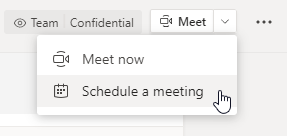
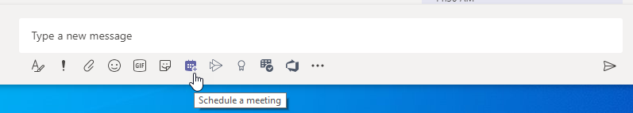
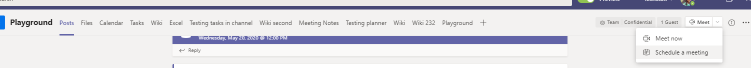
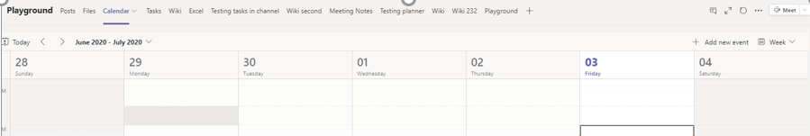
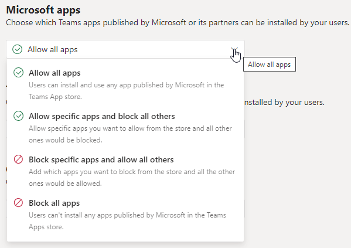

# Meeting policy settings - General

This article describes the following general policy settings for Teams meetings:

- [Meet now in channels](#meet-now-in-channels)
- [Outlook add-in](#outlook-add-in)
- [Channel meeting scheduling](#channel-meeting-scheduling)
- [Private meeting scheduling](#private-meeting-scheduling)
- [Meet now in private meetings](#meet-now-in-private-meetings)
- [Designated presenter role mode](#designated-presenter-role-mode)
- [Engagement report](#engagement-report)
- [Meeting registration](#meeting-registration)
- [Who can register](#who-can-register)
- [Meeting provider for Islands mode](#meeting-provider-for-islands-mode)
- [Speaker Coach](#speaker-coach)

## Meet now in channels

This is a per-user policy and applies before a meeting starts. This setting controls whether a user can start an ad hoc meeting in a Teams channel. If you turn this on, users can click the **Meet** button to start an ad hoc meeting or schedule a meeting in the channel. The default value is True.

## Outlook add-in

This is a per-user policy and applies before a meeting starts. This setting controls whether Teams meetings can be scheduled from within Outlook (Windows, Mac, web, and mobile).

If you turn this off, users are unable to schedule Teams meetings when they create a new meeting in Outlook. For example, in Outlook on Windows, the **New Teams Meeting** option won't show up in the ribbon.

## Channel meeting scheduling

Use the existing AllowChannelMeetingScheduling policy to control the types of events that can be created on the team channel calendars. This is a per-user policy and applies before a meeting starts. This setting controls whether users can schedule a meeting in a Teams channel. By default, this setting is turned on.

If this policy is turned off, users will not be able to create new channel meetings. However, existing channel meetings can be edited by the organizer of the event.

Schedule a meeting will be disabled.

Channel selection is disabled.

In the channel posts page, the following will be disabled:

- **Schedule a meeting** button on the channel reply compose box.
  
  
- **Schedule a meeting** button on the channel header.
  

In the channel calendar:

- **Add new event** button on channel calendar header will be disabled.
  

- Users will not be able to drag and select a time block on the channel calendar to create a channel meeting.

- Users cannot use Keyboard shortcuts to create a meeting on the channel calendar.

In the admin center:

The channel calendar app will show up in the **Microsoft apps** section on the app permission policies page.

## Private meeting scheduling

This is a per-user policy and applies before a meeting starts. This setting controls whether users can schedule private meetings in Teams. A meeting is private when it's not published to a channel in a team.

Note that if you turn off **Allow scheduling private meetings** and **Allow channel meeting scheduling**,  the **Add required attendees** and **Add channel** options are disabled for users in Teams. By default, this setting is turned on.

## Meet now in private meetings

This is a per-user policy and applies before a meeting starts. This setting controls whether a user can start an ad hoc private meeting.  By default, this setting is turned on.

## Designated presenter role mode

This is a per-user policy. This setting lets you change the default value of the **Who can present?** setting in **Meeting options** in the Teams client. This policy setting affects all meetings, including Meet Now meetings.

The **Who can present?** setting lets meeting organizers choose who can be presenters in a meeting. To learn more, see [Change participant settings for a Teams meeting](https://support.microsoft.com/article/change-participant-settings-for-a-teams-meeting-53261366-dbd5-45f9-aae9-a70e6354f88e) and [Roles in a Teams meeting](https://support.microsoft.com/article/roles-in-a-teams-meeting-c16fa7d0-1666-4dde-8686-0a0bfe16e019).

Currently, you can only use PowerShell to configure this policy setting. You can edit an existing Teams meeting policy by using the [Set-CsTeamsMeetingPolicy](/powershell/module/skype/set-csteamsmeetingpolicy) cmdlet. Or, create a new Teams meeting policy by using the [New-CsTeamsMeetingPolicy](/powershell/module/skype/new-csteamsmeetingpolicy) cmdlet and assign it to users.

To specify the default value of the **Who can present?** setting in Teams, set the **DesignatedPresenterRoleMode** parameter to one of the following:

- **EveryoneUserOverride**:  All meeting participants can be presenters. This is the default value. This parameter corresponds to the **Everyone** setting in Teams.
- **EveryoneInCompanyUserOverride**: Authenticated users in the organization, including guest users, can be presenters. This parameter corresponds to the **People in my organization** setting in Teams.
- **OrganizerOnlyUserOverride**: Only the meeting organizer can be a presenter and all meeting participants are designated as attendees. This parameter corresponds to the **Only me** setting in Teams.

Keep in mind that after you set the default value, meeting organizers can still change this setting in Teams and choose who can present in the meetings that they schedule.

## Engagement report

This is a per-user policy. This setting controls whether meeting organizers can download the [meeting attendance report](teams-analytics-and-reports/meeting-attendance-report.md).

This policy is on by default and allows your organizers to see who registered and attended the meetings and webinars they set up. To turn it off in the Teams admin center, go to **Meetings** > **Meeting policies**, and set the **Engagement report** setting to **Off**.

You can also edit an existing Teams meeting policy by using the [Set-CsTeamsMeetingPolicy](/powershell/module/skype/set-csteamsmeetingpolicy) cmdlet. Or, create a new Teams meeting policy by using the [New-CsTeamsMeetingPolicy](/powershell/module/skype/new-csteamsmeetingpolicy) cmdlet and assign it to users.

By default, the **AllowEngagementReport** parameter is set to **Enabled** in PowerShell. To prevent a meeting organizer from downloading the meeting attendance report, set the **AllowEngagementReport** parameter to **Disabled**.

When this policy is enabled, the option to download the meeting attendance report is displayed in the **Participants** pane.

> [!NOTE]
> As an administrator, you can’t view the attendance report for meetings that you don’t organize. However, you can view participant details for a given meeting within 24 hours of that meeting. In the Teams admin center, go to **Users** > **Manage users**. Choose the display name for the meeting organizer. Select the **Meetings & calls** tab, and then choose the appropriate meeting ID or call ID. Then, select **Participant details**.

For more information, including limits of the engagement report, see [viewing and downloading meeting attendance reports in Teams](https://support.microsoft.com/office/view-and-download-meeting-attendance-reports-in-teams-ae7cf170-530c-47d3-84c1-3aedac74d310).

## Meeting registration

This is a per-user policy. If you turn this on, users in your organization can set up webinars. This policy is enabled by default.

To edit this policy in the Teams admin center, go to **Meetings** > **Meeting policies**. To turn off meeting registration, set the policy to **Off**.

You can edit an existing Teams meeting policy by using the [Set-CsTeamsMeetingPolicy](/powershell/module/skype/set-csteamsmeetingpolicy) cmdlet. Or, create a new Teams meeting policy by using the [New-CsTeamsMeetingPolicy](/powershell/module/skype/new-csteamsmeetingpolicy) cmdlet and assign it to users.

To turn on meeting registration, set the  **MeetingRegistration** parameter to **True**. This is set to **True** by default.

To turn off meeting registration and prevent users from scheduling webinars, set the parameter to **False**.

## Who can register

This policy controls which users can register and attend webinars. This policy has two options, which are only available if **Meeting registration** is turned on.

- Set **Who can register** to **Everyone** if you want to allow everyone, including anonymous users, to register and attend webinars that users in your organization set up.
- Set **Who can register** to **Everyone in the organization** if you want to allow only the users in your organization to register and attend webinars.

By default, **Who can register** is set to **Everyone**. To edit this policy in the Teams admin center, go to **Meetings** > **Meeting policies**.

You can edit an existing Teams meeting policy by using the [Set-CsTeamsMeetingPolicy](/powershell/module/skype/set-csteamsmeetingpolicy) cmdlet. Or, create a new Teams meeting policy by using the [New-CsTeamsMeetingPolicy](/powershell/module/skype/new-csteamsmeetingpolicy) cmdlet and assign it to users.

To allow everyone, including anonymous users, to register and attend webinars, set the **WhoCanRegister** parameter to **Everyone**. This is set to **Everyone** by default.

To allow only users in your organization to register and attend webinars, set the parameter to **EveryoneInCompany**.

## Meeting provider for Islands mode

This is a per-user policy. This setting controls which Outlook meeting add-in is used for *users who are in Islands mode*. You can specify whether users can only use the Teams Meeting add-in or both the Teams Meeting and Skype for Business Meeting add-ins to schedule meetings in Outlook.

You can only apply this policy to users who are in Islands mode and have the **AllowOutlookAddIn** parameter set to **True** in their Teams meeting policy.

Currently, you can only use PowerShell to set this policy. You can edit an existing Teams meeting policy by using the [Set-CsTeamsMeetingPolicy](/powershell/module/skype/set-csteamsmeetingpolicy) cmdlet. Or, create a new Teams meeting policy by using the [New-CsTeamsMeetingPolicy](/powershell/module/skype/new-csteamsmeetingpolicy) cmdlet and assign it to users.

To specify which meeting add-in you want to be available to users, set the **PreferredMeetingProviderForIslandsMode** parameter as follows:

- Set the parameter to **TeamsAndSfB** to enable both the Teams Meeting add-in and Skype for Business add-in in Outlook. This is the default value.
- Set the parameter to **Teams** to enable only the Teams Meeting add-in in Outlook. This policy setting ensures that all future meetings have a Teams meeting join link. It doesn't migrate existing Skype for Business meeting join links to Teams. This policy setting doesn't affect presence, chat, PSTN calling, or any other capabilities in Skype for Business, which means that users will continue to use Skype for Business for these capabilities.

  If you set the parameter to **Teams**, and then switch back to **TeamsAndSfB**, both meeting add-ins are enabled. However, note that existing Teams meeting join links won't be migrated to Skype for Business. Only Skype for Business meetings scheduled after the change will have a Skype for Business meeting join link.

## Meeting reactions

The AllowMeetingReactions setting can be applied using PowerShell or under the Meeting policies in the Teams admin center.

Meeting reactions are On by default. Turning off reactions for a user doesn't mean that a user can't use reactions in meetings they schedule. The meeting organizer can still turn on reactions from the meeting option page, regardless of the default setting.

## Speaker Coach

This setting lets users turn on Speaker Coach during a Teams meeting. Speaker Coach listens to the audio of the user while they present and provides private real-time feedback and suggestions for improvement. The user also gets a summary report of their feedback after the meeting.

> [!NOTE]
> The user who turned on Speaker Coach during the meeting is the only one who can see the summary report of feedback. Admins won't have access to any of this data.

Currently, you can only set and edit this policy in PowerShell. by using the [Set-CsTeamsMeetingPolicy](/powershell/module/skype/set-csteamsmeetingpolicy) cmdlet. Or, create a new Teams meeting policy by using the [New-CsTeamsMeetingPolicy](/powershell/module/skype/new-csteamsmeetingpolicy) cmdlet and assign it to users.

This setting is enabled by default. To turn it off, set **AllowMeetingCoach** to **False**.

## Related topics

- [Teams PowerShell overview](teams-powershell-overview.md)
- [Assign policies in Teams](policy-assignment-overview.md)
- [Remove the RestrictedAnonymousAccess Teams meeting policy from users](meeting-policies-restricted-anonymous-access.md)
