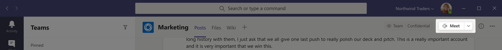
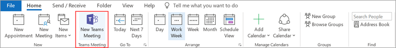
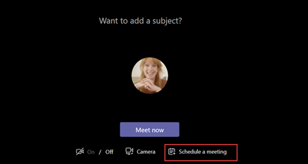
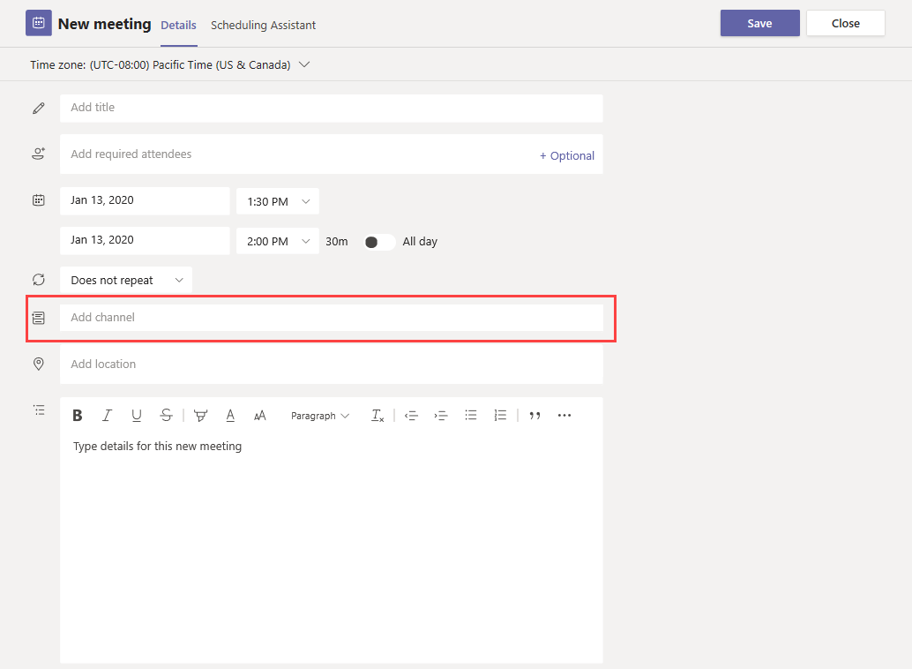
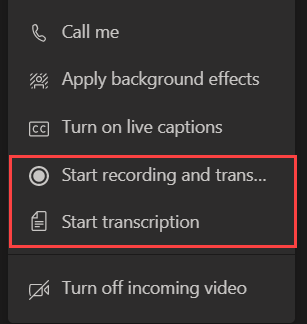
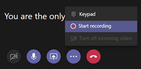
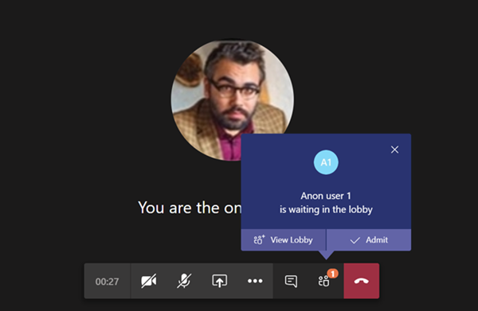
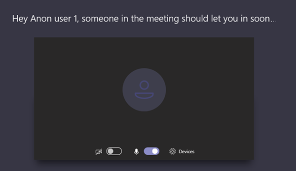

# Manage meeting policies in Teams

::: zone target="docs"
Meeting policies are used to control the features that are available to meeting participants for meetings that are scheduled by users in your organization. After you create a policy and make your changes, you can then assign users to the policy. You manage meeting policies in the Microsoft Teams admin center or by [using PowerShell](teams-powershell-overview.md).

You can implement policies in the following ways, which affect the meeting experience for users before a meeting starts, during a meeting, or after a meeting. 

|Implementation type  |Description  |
|---------|---------|
|Per-organizer    |When you implement a per-organizer policy, all meeting participants inherit the policy of the organizer. For example, **Automatically admit people** is a per-organizer policy and controls whether users join the meeting directly or wait in the lobby for meetings scheduled by the user who is assigned the policy.          |
|Per-user    |When you implement a per-user policy, only the per-user policy applies to restrict certain features for the organizer and/or meeting participants. For example, **Allow Meet now** is a per-user policy.     |
|Per-organizer and per-user     |When you implement a combination of a per-organizer and per-user policy, certain features are restricted for meeting participants based on their policy and the organizer's policy. For example, **Allow cloud recording** is a per-organizer and per-user policy. Turn on this setting to allow the meeting organizer and participants to start and stop a recording. 

By default, a policy named Global (org-wide default) is created. All users in your organization will be assigned this meeting policy by default. You can either make changes to this policy or create one or more custom policies and assign users to them. When you create a custom policy, you can allow or prevent certain features from being available to your users, and then assign it to one or more users who will have the settings applied to them. 

## Change or create a meeting policy

To change or create a meeting policy, go to the Microsoft Teams admin center > **Meetings** > **Meeting policies**. Select a policy from the list or select **New policy**. If you're creating a new policy, add a name and description. The name can't contain special characters or be longer than 64 characters. Choose your settings, and then select **Save**.

For example, say you have a bunch of users and you want to limit the amount of bandwidth that their meeting would require. You would create a new custom policy named "Limited bandwidth" and disable the following settings:

Under **Audio & video**:
- Turn off cloud recording
- Turn off Allow IP video

Under **Content sharing**:
- Disable screen sharing mode
- Turn off whiteboard
- Turn off shared notes

Then assign the policy to the users.

> [!NOTE] 
> A user can be assigned only one meeting policy at a time. 

## Assign a meeting policy to users

If you're applying the policy to one user, select **Users** on the left navigation pane, and then click the user's display name. On the user's page, next to **Assigned policies**, select **Edit**. Then, in the **Edit user policies** pane, under **Meeting policy**, select the meeting policy from the drop-down list, and then select **Save**. You can also assign policies from the list of users. To do this, select the user by clicking to the left of the user's display name. Select **Edit settings**. Then, on the **Edit settings** pane, under **Meeting policy**, select the policy from the drop-down list, and then select **Save**. 
 
If you're applying a policy to more than one user, select **Users** on the left navigation pane, and then select each user by clicking to the left of the user name, and then click **Edit settings**. On the **Edit Settings** pane, under **Meeting policy**, select the policy from the drop-down list, and then select **Save**.
 
You can also assign a meeting policy to one or more users as follows:

1. Go to **Microsoft Teams admin center** > **Meetings** > **Meeting policies**.
2. Select the policy by clicking to the left of the policy name.
3. Select **Manage users**.
4. In the **Manage users** pane, search for the user by display name or by user name, select the name, and then select **Add**. Repeat this step for each user that you want to add.
5. When you're finished adding users, select **Save**.
 
> [!NOTE] 
> You can't delete a policy if users are assigned to it. You must first assign a different policy to all affected users, and then you can delete the original policy.
 
## Meeting policy settings

When you select an existing policy on the **Meeting policies** page or select **New policy** to add a new policy, you can configure settings for the following.

- [General](#meeting-policy-settings---general)
- [Audio & video](#meeting-policy-settings---audio--video)
- [Content sharing](#meeting-policy-settings---content-sharing)
- [Participants & guests](#meeting-policy-settings---participants--guests)

::: zone-end 

## Meeting policy settings - General

- [Allow Meet now in channels](#allow-meet-now-in-channels)
- [Allow private Meet now (coming soon)](#allow-private-meet-now-coming-soon)
- [Allow the Outlook add-in](#allow-the-outlook-add-in)
- [Allow channel meeting scheduling](#allow-channel-meeting-scheduling)
- [Allow scheduling private meetings](#allow-scheduling-private-meetings)

### Allow Meet now in channels

This is a per-user policy and applies before a meeting starts. This setting controls whether a user can start an ad-hoc meeting in a Teams channel. If you turn this on, when a user posts a message in a Teams channel, the user can click **Meet now** beneath the compose box to start an ad-hoc meeting in the channel.

### Allow private Meet now (coming soon)

This is a per-user policy and applies before a meeting starts. This setting controls whether a user can start an ad hoc private meeting.  

### Allow the Outlook add-in

This is a per-user policy and applies before a meeting starts. This setting controls whether Teams meetings can be scheduled from within Outlook (Windows, Mac, web, and mobile).

If you turn this off, users are unable to schedule Teams meetings when they create a new meeting in Outlook. For example, in Outlook on Windows, the **New Teams Meeting** option won't show up in the ribbon.

### Allow channel meeting scheduling

This is a per-user policy and applies before a meeting starts. This setting controls whether users can schedule a meeting in a Teams channel.  If you turn this off, the **Schedule a meeting** option won't be available to the user when they start a meeting in a Teams channel and the **Select a channel to meet** option won't be available to the user when they schedule a meeting from Meetings in Teams.

### Allow scheduling private meetings

This is a per-user policy and applies before a meeting starts. This setting controls whether users can schedule private meetings in Teams. A meeting is private when it's not published to a channel in a team.

Note that if you turn off **Allow scheduling private meetings** and **Allow channel meeting scheduling**,  the **Schedule a meeting** option won't be available and users will be unable to schedule meetings in Teams.

## Meeting policy settings - Audio & video

- [Allow transcription](#allow-transcription)
- [Allow cloud recording](#allow-cloud-recording)
- [Allow IP video](#allow-ip-video)
- [Media bit rate (KBs)](#media-bit-rate-kbs)
- [Enable live captions (coming soon)](#enable-live-captions-coming-soon)

### Allow transcription

This is a combination of a per-organizer and per-user policy. This setting controls whether captions and transcription features are available during playback of meeting recordings. If you turn this off, the **Search** and **CC** options won't be available during playback of a meeting recording. The person who started the recording needs this setting turned on so that the recording also includes transcription. 

Note that transcription for recorded meetings is currently only supported for users who have the language in Teams set to English and when English is spoken in the meeting.

### Allow cloud recording

This is a combination of a per-organizer and per-user policy. This setting controls whether this user's meetings can be recorded. The recording can be started by the meeting organizer or by another meeting participant if the policy setting is turned on for the participant and if they're an authenticated user from the same organization.

People outside your organization, such as federated and anonymous users, can't start the recording. Guest users can't start or stop the recording. 

Let's look at the following example.

|User |Meeting policy  |Allow cloud recording |
|---------|---------|---------|
|Daniela | Global   | False |
|Amanda | Location1MeetingPolicy | True|
|John (external user) | Not applicable | Not applicable|

Meetings organized by Daniela can't be recorded and Amanda, who has the policy setting enabled, can't record meetings organized by Daniela. Meetings organized by Amanda can be recorded, however,  Daniela, who has the policy setting disabled and John who is an external user, can't record meetings organized by Amanda.

To learn more about cloud meeting recording, see [Teams cloud meeting recording](cloud-recording.md).

### Allow IP video

This is a combination of a per-organizer and per-user policy. Video is a key component to meetings. In some organizations, admins might want more control over which users’ meetings have video. This setting controls whether video can be turned on in meetings hosted by a user and in 1:1 calls and group calls started by a user. Meetings organized by a user who has this policy enabled, allow video sharing in the meeting by the meeting participants, if the meeting participants also have the policy enabled. Meeting participants who don't have any policies assigned (for example, anonymous and federated participants) inherit the policy of the meeting organizer.

Let's look at the following example.

|User |Meeting policy  |Allow IP Video |
|---------|---------|---------|
|Daniela   | Global   | True        |
|Amanda    | Location1MeetingPolicy        | False      |

Meetings hosted by Daniela allow video to be turned on. Daniela can join the meeting and turn on video. Amanda can't turn on video in Daniela's meeting because Amanda’s policy is set to not allow video. Amanda can see videos shared by other participants in the meeting.

In meetings hosted by Amanda, no one can turn on video, regardless of the video policy assigned to them. This means Daniela can't turn on video in Amanda’s meetings.  

If Daniela calls Amanda with video on, Amanda can answer the call with audio only.  When the call is connected, Amanda can see Daniela’s video, but can't turn on video. If Amanda calls Daniela, Daniela can answer the call with video and audio. When the call is connected, Daniela can turn on or turn off her video, as needed.

### Media bit rate (KBs)

This is a per-organizer policy. This setting determines the media bit rate for audio, video, and video-based app sharing transmissions in calls and meetings for the user. It's applied to both the uplink and downlink media traversal for users in the call or meeting. This setting gives you granular control over managing bandwidth in your organization. Depending on the meetings scenarios required by users, we recommend having enough bandwidth in place for a good quality experience. The minimum value is 30 Kbps and the maximum value depends on the meeting scenario. To learn more about the minimum recommended bandwidth for good quality meetings, calls, and live events in Teams, see [Bandwidth requirements](prepare-network.md#bandwidth-requirements).

If there isn’t enough bandwidth for a meeting, participants see a message that indicates poor network quality.

For meetings that need the highest quality video experience, such as CEO board meetings and Teams live events, we recommend you set the bandwidth to 10 Mbps. Even when the maximum experience is set, the Teams media stack adapts to low bandwidth conditions when certain network conditions are detected, depending on the scenario. 

### Enable live captions (coming soon)

This is a per-user policy and applies during a meeting. If this setting is on, the user sees an option to display captions during a meeting.

## Meeting policy settings - Content sharing

- [Screen sharing mode](#screen-sharing-mode)
- [Allow a participant to give or request control](#allow-a-participant-to-give-or-request-control)
- [Allow an external participant to give or request control](#allow-an-external-participant-to-give-or-request-control)
- [Allow PowerPoint sharing](#allow-powerpoint-sharing)
- [Allow whiteboard](#allow-whiteboard)
- [Allow shared notes](#allow-shared-notes)
- [Allow chat in meetings (coming soon)](#allow-chat-in-meetings-coming-soon)

### Screen sharing mode

This is a combination of a per-organizer and per-user policy. This setting controls whether desktop and/or window sharing is allowed in the user's meeting. Meeting participants who don't have any policies assigned (for example, anonymous, guest, B2B, and federated participants) inherit the policy of the meeting organizer.

|Setting value |Behavior  |
|---------|---------|
|**Entire screen**    | Full desktop sharing and application sharing is allowed in the meeting |
|**Single application**   | Application sharing is allowed in the meeting        |
|**Disabled**     |Screen sharing and application sharing turned off in the meeting.       |

Let's look at the following example.

|User |Meeting policy |Screen sharing mode |
|---------|---------|---------|
|Daniela  | Global   | Entire screen |
|Amanda   | Location1MeetingPolicy  | Disabled |

Meetings hosted by Daniela allow meeting participants to share their entire screen or a specific application. If Amanda joins Daniela’s meeting, Amanda can't share her screen or a specific application as her policy setting is disabled. In meetings hosted by Amanda, no one is allowed to share their screen or a single application, regardless of the screen sharing mode policy assigned to them. This means that Daniela can't share her screen or a single application in Amanda’s meetings.  

Currently, users can't play video or share their screen in a Teams meeting if they're using Google Chrome.

### Allow a participant to give or request control

This is a per-user policy. This setting controls whether the user can give control of the shared desktop or window to other meeting participants. To give control, hover over the top of the screen. 

If this setting is turned on for the user, the **Give Control** option is displayed in the top bar in a sharing session. 

If the settings is turned off for the user, the **Give Control** option isn't available.

Let's look at the following example.

|User |Meeting policy  |Allow participant to give or request control |
|---------|---------|---------|
|Daniela   | Global   | True       |
|Babek    | Location1MeetingPolicy        | False   |

Daniela can give control of the shared desktop or window to other participants in a meeting organized by Babek whereas Babek can't give control to other participants.

### Allow an external participant to give or request control

This is a per-user policy. This setting controls whether external participants in a meeting can give control of their shared desktop or window to other participants in the meeting. External participants in Teams meetings can be categorized as follows:  

   - Anonymous user
   - Guest users  
   - B2B user
   - Federated user  

Whether federated users can give control to external users while sharing is controlled by the **Allow an external participant to give or request control** setting in their organization.

### Allow PowerPoint sharing

This is a per-user policy. This setting controls whether the user can share PowerPoint slide decks in a meeting. External users, including anonymous, guest, and federated users, inherit the policy of the meeting organizer.

Let's look at the following example.

|User |Meeting policy  |Allow PowerPoint sharing |
|---------|---------|---------|
|Daniela   | Global   | True       |
|Amanda   | Location1MeetingPolicy        | False   |

Amanda can't share PowerPoint slide decks in meetings even if she's the meeting organizer. Daniela can share PowerPoint slide decks even if the meeting is organized by Amanda. Amanda can view the PowerPoint slide decks shared by others in the meeting, even though she can't share PowerPoint slide decks.

### Allow whiteboard

This is a per-user policy. This setting controls whether a user can share the whiteboard in a meeting. External users, including anonymous, B2B, and federated users, inherit the policy of the meeting organizer. 

Let's look at the following example.

|User |Meeting policy  |Allow whiteboard|
|---------|---------|---------|
|Daniela   | Global   | True       |
|Amanda   | Location1MeetingPolicy        | False   |

Amanda can't share the whiteboard in a meeting even if she's the meeting organizer. Daniela can share the whiteboard even if a meeting is organized by Amanda.  

### Allow shared notes

This is a per-user policy. This setting controls whether a user can create and share notes in a meeting. External users, including anonymous, B2B, and federated users, inherit the policy of the meeting organizer. The **Meeting Notes** tab is currently only supported in meetings that have less than 20 participants. 

Let's look at the following example.

|User |Meeting policy  |Allow shared notes |
|---------|---------|---------|
|Daniela   | Global   | True       |
|Amanda   | Location1MeetingPolicy | False |

Daniela can take notes in Amanda's meetings and Amanda can't take notes in any meetings.

### Allow chat in meetings (coming soon)

This is a per-organizer policy. This setting controls whether meeting chat is allowed in the user's meeting. 

## Meeting policy settings - Participants & guests

These settings control which meeting participants wait in the lobby before they are admitted to the meeting and the level of participation they are allowed in a meeting.

- [Automatically admit people](#automatically-admit-people)
- [Allow anonymous people to start a meeting](#allow-anonymous-people-to-start-a-meeting)
- [Allow dial-in users to bypass the lobby](#allow-dial-in-users-to-bypass-the-lobby-coming-soon)
- [Allow organizers to override lobby settings](#allow-organizers-to-override-lobby-settings-coming-soon)

> [!NOTE]
> Joining a meeting will vary depending on the settings for each Teams group and the method of connecting. If your group has audio conferencing and you are connecting through audio conferencing, then refer to [Audio Conferencing in Office 365](https://docs.microsoft.com/microsoftteams/audio-conferencing-in-office-365). If your Teams group does not have audio conferencing, then refer to [Join a meeting in Teams](https://support.office.com/article/join-a-meeting-in-teams-1613bb53-f3fa-431e-85a9-d6a91e3468c9).

This is a per-organizer policy. This setting controls whether people join a meeting directly or wait in the lobby until they are admitted by an authenticated user.

 Meeting organizers can click **Meeting Options** in the meeting invitation to change this setting for each meeting they schedule. **(coming soon)**
  
|Setting value  |Join behavior |
|---------|---------|
|**Everyone**   |All meeting participants join the meeting directly without waiting in the lobby. This includes authenticated users, federated users, guests, anonymous users, and people who dial in by phone.       |
|**Everyone in your organization and federated organizations**     |Authenticated users within the organization, including guest users and the users from federated organizations, join the meeting directly without waiting in the lobby.  Anonymous users and users who dial in by phone wait in the lobby.   |
|**Everyone in your organization**    |Authenticated users from within the organization, including guest users, join the meeting directly without waiting in the lobby.  Federated users, anonymous users, and users who dial in by phone wait in the lobby.           |

### Allow anonymous people to start a meeting

This is a per-organizer policy. This setting controls whether anonymous people, including B2B, and federated users, can join the user's meeting without an authenticated user from the organization in attendance. 

Here's the join behavior of anonymous people when authenticated users are present in the meeting.

|Allow anonymous people to start a meeting  |Automatically admit people |Join behavior of anonymous people |
|---------|---------|---------|
|True    | Everyone      | Join directly         |
|   | Everyone in your organization       | Wait in lobby        |
|   | Everyone in your organization and federated organizations       | Wait in lobby         |
|False    | Everyone        | Join directly        |
|   | Everyone in your organization     | Wait in lobby        |
|   | Everyone in your organization and federated organizations      | Wait in lobby         |

Here's the join behavior of anonymous people when no authenticated users are present in the meeting.

|Allow anonymous people to start a meeting |Automatically admit people  |Join behavior of anonymous people |
|---------|---------|---------|
|True    | Everyone      | Join directly         |
|   | Everyone in your organization       | Wait in lobby        |
|   | Everyone in your organization and federated organizations       | Wait in lobby         |
|False    | Everyone        | Wait in lobby. Users are automatically admitted when the first authenticated user joins the meeting.        |
|   | Everyone in your organization     |Wait in lobby         |
|   | Everyone in your organization and federated organizations      | Wait in lobby         |

### Allow dial-in users to bypass the lobby (coming soon)

This is a per-organizer policy. This setting controls whether people who dial in by phone join the meeting directly or wait in the lobby regardless of the **Automatically admit people** setting.

Here's the join behavior of people who dial in by phone.

|Allow dial-in users to bypass the lobby  |Automatically admit users  |Join behavior of people who dial in |
|---------|---------|---------|
|True    | Everyone      | Join directly         |
|   | Everyone in your organization       | Join directly        |
|   | Everyone in your organization and federated organizations       | Join directly         |
|False    | Everyone        | Join directly        |
|   | Everyone in your organization     |Wait in lobby         |
|   | Everyone in your organization and federated organizations      | Wait in lobby         |

### Allow organizers to override lobby settings (coming soon)

This is a per-organizer policy. This setting controls whether the meeting organizer can override the lobby settings that an admin set in **Automatically admit people** and **Allow dial-in users to bypass the lobby** when they schedule a new meeting. 

Meeting organizers can click **Meeting Options** in the meeting invitation to change lobby settings for each meeting they schedule. 

Here's how this setting affects whether the meeting organizer can change the **Automatically admit people** setting for each meeting the organizer schedules.

|Allow organizers to override lobby settings  |Automatically admit people  |Behavior |
|---------|---------|---------|
|True    | Everyone      | Organizer can change the setting to any other value. |
|   | Everyone in your organization       | Organizer can change the setting to any other value.|
|   | Everyone in your organization and federated organizations       | Organizer can change this to any other value.         |
|False    | Everyone        | Organizer can change the setting to any other value.|
|   | Everyone in your organization     |Organizer can change the setting to **Everyone in your organization**. |
|   | Everyone in your organization and federated organizations      | Organizer can't override the lobby setting. |

Here's how this setting affects whether the meeting organizer can change the **Allow dial-in users to bypass the lobby** setting for each meeting the organizer schedules.
    
|Allow organizers to override lobby settings  |Allow dial-in users to bypass the lobby  |Behavior |
|---------|---------|---------|
|True    |  True        | Organizer can change the setting to False.       |
|True      | False         | Organizer can change the setting to True.        |
|False     | True        |Organizer can change the setting to False.         |
|False      |False          |Organizer can't override the lobby setting and can't allow dial-in users to bypass the lobby in the meeting.        |

[Full article](meeting-policies-in-teams.md)

## Related topics
[Messaging policies in Teams](messaging-policies-in-teams.md)
