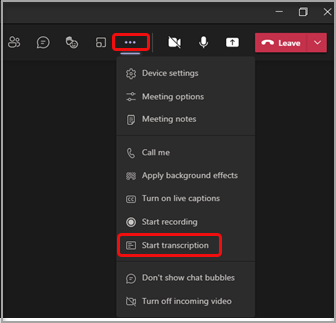
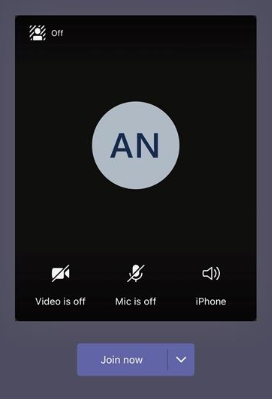

# Manage meeting policies in Teams

::: zone target="docs"
Use meeting policies to control the features that are available to meeting participants for meetings that are scheduled by users in your organization. You can use the global (Org-wide default) policy that's automatically created or create and assign custom policies. You manage meeting policies in the Microsoft Teams admin center or by using [PowerShell](teams-powershell-overview.md).

> [!NOTE]
> For information about using roles to manage the permissions of meeting presenters and attendees, see [Roles in a Teams meeting](https://support.microsoft.com/office/roles-in-a-teams-meeting-c16fa7d0-1666-4dde-8686-0a0bfe16e019?ui=en-us&rs=en-us&ad=us).

You can implement policies in the following ways, which affect the meeting experience for users before a meeting starts, during a meeting, or after a meeting.

|Implementation type  |Description  |
|---------|---------|
|Per-organizer    |When you implement a per-organizer policy, all meeting participants inherit the policy of the organizer. For example, **Automatically admit people** is a per-organizer policy. It controls whether users join the meeting directly or wait in the lobby for meetings scheduled by the user who is assigned the policy.          |
|Per-user    |When you implement a per-user policy, only the per-user policy applies to restrict certain features for the organizer and/or meeting participants. For example, **Allow Meet now in channels** is a per-user policy.     |
|Per-organizer and per-user     |When you implement a combination of a per-organizer and per-user policy, certain features are restricted for meeting participants based on their policy and the organizer's policy. For example, **Allow cloud recording** is a per-organizer and per-user policy. Turn on this setting to allow users to start and stop a recording.

You can edit the settings in the global policy or create and assign one or more custom policies. Users will get the global policy unless you create and assign a custom policy.

> [!NOTE]
> Meeting details button will be available if a user has the audio conference licenses enabled or the user is allow for audio conferencing, if not, the meeting details will not be available.

## Create a custom meeting policy

1. In the left navigation of the Microsoft Teams admin center, go to **Meetings** > **Meeting policies**.
2. Select **Add**.
3. Enter a name and description for the policy. The name can't contain special characters or be longer than 64 characters.
4. Choose the settings that you want.
5. Select **Save**.

For example, say you have a bunch of users and you want to limit the amount of bandwidth that their meeting would require. You would create a new custom policy named "Limited bandwidth" and disable the following settings:

Under **Audio & video**:

- Turn off Allow cloud recording.
- Turn off Allow IP video.

Under **Content sharing**:

- Disable screen sharing mode.
- Turn off Allow whiteboard.
- Turn off Allow shared notes.

Then assign the policy to the users.

## Edit a meeting policy

You can edit the global policy and any custom policies that you create.

1. In the left navigation of the Microsoft Teams admin center, go to **Meetings** > **Meeting policies**.
2. Select the policy by clicking to the left of the policy name, and then select **Edit**.
3. From here, make the changes that you want.
4. Select **Save**.

> [!NOTE]
> A user can be assigned only one meeting policy at a time.

## Assign a meeting policy to users

[!INCLUDE [assign-policy](includes/assign-policy.md)]

> [!NOTE]
> You can't delete a policy if users are assigned to it. You must first assign a different policy to all affected users, and then you can delete the original policy.

## Meeting policy settings

Select an existing policy on the **Meeting policies** page or select **Add** to add a new policy. Configure settings for the following.

- [General](#meeting-policy-settings---general)
- [Audio & video](#meeting-policy-settings---audio--video)
- [Content sharing](#meeting-policy-settings---content-sharing)
- [Participants & guests](#meeting-policy-settings---participants--guests)

::: zone-end

## Meeting policy settings - General

- [Allow Meet now in channels](#allow-meet-now-in-channels)
- [Allow the Outlook add-in](#allow-the-outlook-add-in)
- [Allow channel meeting scheduling](#allow-channel-meeting-scheduling)
- [Allow scheduling private meetings](#allow-scheduling-private-meetings)
- [Allow Meet now in private meetings](#allow-meet-now-in-private-meetings)

### Allow Meet now in channels

Allow **Meet now** is a per-user policy and applies before a meeting starts. This setting controls whether a user can start an unplanned meeting in a Teams channel. If you turn on this setting, users can select the **Meet** button to start an unplanned meeting or schedule a meeting in the channel. The default value is True.

### Allow the Outlook add-in

Allow the Outlook add-in is a per-user policy and applies before a meeting starts. This setting controls whether Teams meetings can be scheduled from within Outlook (Windows, Mac, web, and mobile).

If you turn off this feature, users are unable to schedule. Teams meetings when they create a new meeting in Outlook. For example, in Outlook on Windows, the **New Teams Meeting** option won't show up in the ribbon.

### Allow channel meeting scheduling

Use the existing AllowChannelMeetingScheduling policy to control the types of events that can be created on the team channel calendars. This is a per-user policy and applies before a meeting starts. This setting controls whether users can schedule a meeting in a Teams channel. By default, this setting is turned on.

If this policy is turned off, users can't create new channel meetings. However, existing channel meetings can be edited by the organizer of the event.

Schedule a meeting will be disabled.

 

Channel selection is disabled.

In the channel posts page, the following features will be disabled:

- **Schedule a meeting** button on the channel reply compose box.
  
  
- **Schedule a meeting** button on the channel header.
  

In the channel calendar:

- **Add new event** button on channel calendar header will be disabled.
  

- Users can't drag and select a time block on the channel calendar to create a channel meeting.

- Users can't use Keyboard shortcuts to create a meeting on the channel calendar.

In the admin center:

The channel calendar app will show up in the **Microsoft apps** section on the app permission policies page.

 

### Allow scheduling private meetings

Scheduling private meetings is a per-user policy and applies before a meeting starts. This setting controls whether users can schedule private meetings in Teams. A meeting is private when it's not published to a channel in a team.

If you turn off **Allow scheduling private meetings** and **Allow channel meeting scheduling**, the **Add required attendees** and **Add channel** options are disabled for users in Teams. By default, this setting is turned on.

### Allow Meet now in private meetings

This is a per-user policy and applies before a meeting starts. This setting controls whether a user can start an unplanned private meeting. By default, this setting is turned on.

## Meeting policy settings - Audio & video

- [Allow transcription](#allow-transcription)
- [Allow cloud recording](#allow-cloud-recording)
- [Mode for IP audio](#mode-for-ip-audio)
- [Mode for IP video](#mode-for-ip-video)
- [Allow IP video](#allow-ip-video)
- [Media bit rate (Kbs)](#media-bit-rate-kbs)

### Allow transcription

This policy turns on Live transcription. Allow transcription is a per-user policy. This setting controls whether this specific Team's meeting can be transcribed.

Live transcription shows speech-to-text of spoken content during a Teams meeting in near real time. The text appears alongside the meeting video, including the speaker's name and a time stamp. To learn more, see [View live transcription in a Teams meeting](https://support.microsoft.com/office/view-live-transcription-in-a-teams-meeting-dc1a8f23-2e20-4684-885e-2152e06a4a8b).

Currently, live transcription is supported on the Teams desktop client. Transcription is supported for spoken U.S. English. The transcript is available after the meeting on Teams desktop or web.

Here's how the **Allow transcription** and **Allow cloud recording** policy settings work together. The following table describes the values for these settings and the meeting behavior.

|Allow transcription|Allow cloud recording|Behavior|
|---------|---------|---------|
|**On**|**On**|The **Start transcription** option is available in Teams meetings. The meeting organizer or meeting participants can start and stop transcription. The **Start recording** option is available in Teams meetings. The meeting organizer or meeting participants can start and stop recording. |
|**On**|**Off**|The **Start transcription** option is available in Teams meetings. The **Start recording** option isn't available in Teams meetings. |
|**Off**|**On**|The **Start recording** option is available in Teams meetings. The **Start transcription** option isn't available in Teams meetings.|
|**Off**|**Off**|Recording and transcription aren't available in Teams meetings.  |

### Allow cloud recording

Allow cloud recording is controlled at a per-user policy. This setting controls whether a user can record. The recording can be started by the meeting organizer or by another meeting participant if their specific policy setting is turned on and if they're an authenticated user from the same organization as the organizer.

People outside your organization, such as federated and anonymous users, can't start the recording. Guest users can't start or stop the recording.

To learn more about cloud meeting recording, see [Teams cloud meeting recording](cloud-recording.md).

### Mode for IP audio

Mode for IP audio is a per-user policy. This setting controls whether audio can be turned on in meetings and group calls. Here are the values for this setting.

|Setting value |Behavior  |
|---------|---------|
|**Outgoing and incoming audio enabled**    |Outgoing and incoming audio is allowed in the meeting. This is the default setting. |
|**Disabled**     |Outgoing and incoming audio is turned off in the meeting.     |

If set to **Disabled** for a user, that user can still schedule and organize meetings but can't use audio. To join a meeting, the user has to dial in through the Public Switched Telephone Network (PSTN) or have the meeting call to join the user by phone. Meeting participants who don't have any policies assigned (for example, anonymous participants) have this set to **Outgoing and incoming audio enabled** by default. On Teams mobile clients, if this setting is disabled, the user has to dial in to the meeting through the PSTN.

This setting doesn't apply to 1:1 calls. To restrict 1:1 calls, configure a Teams [calling policy](teams-calling-policy.md) and turn off the **Make private calls** setting. This setting also doesn't apply to conference room devices such as Surface Hub and Microsoft Teams Rooms devices.

This setting isn't yet available for Microsoft 365 Government Community Cloud (GCC), GCC High, or Department of Defense (DoD) environments.

To learn more, see [Manage audio/video for meeting participants](#manage-audiovideo-for-meeting-participants).

### Mode for IP video

Mode for IP video is a per-user policy. This setting controls whether video can be turned on in meetings and group calls. Here are the values for this setting.

|Setting value |Behavior  |
|---------|---------|
|**Outgoing and incoming video enabled**    | Outgoing and incoming video is allowed in the meeting is the default setting. |
|**Disabled**     | Outgoing and incoming video is turned off in the meeting. On Teams mobile clients, users can't share videos or photos in the meeting.   If **Mode for IP audio** is disabled, then **Mode for IP video** will also remain disabled.  |

If set to **Disabled** for a  user, that user can't turn on video or view videos shared by other meeting participants. Meeting participants who don't have any policies assigned (for example, anonymous participants) have this set to **Outgoing and incoming video enabled** by default.

This setting doesn't apply to conference room devices such as Surface Hub and Microsoft Teams Rooms devices.

This setting isn't yet available for Microsoft 365 Government Community Cloud (GCC), GCC High, or Department of Defense (DoD) environments.

> [!NOTE]
> Keep in mind that this setting controls both outgoing and incoming video whereas the **Allow IP video** setting controls outgoing video. To learn more, see [Which IP video policy setting takes precedence?](#which-ip-video-policy-setting-takes-precedence) and [Manage audio/video for meeting participants](#manage-audiovideo-for-meeting-participants).

To learn more, see [Manage audio/video for meeting participants](#manage-audiovideo-for-meeting-participants).

### Allow IP video

Allow IP video is a combination of a per-organizer and per-user policy. Video is a key component to meetings. In some organizations, admins might want more control over which users' meetings have video. This setting controls whether video can be turned on in meetings hosted by a user and in 1:1 and group calls started by a user. On Teams mobile clients, this setting control whether users can share photos and videos in a meeting.

Meetings organized by a user who has this policy setting enabled, allow video sharing in the meeting by the meeting participants, if the participants also have the policy setting enabled. Meeting participants who don't have any policies assigned (for example, anonymous and federated participants) inherit the policy of the meeting organizer.

> [!NOTE]
> Keep in mind that this setting controls outgoing video whereas the **Mode for IP video** setting controls both outgoing and incoming video. To learn more, see [Which IP video policy setting takes precedence?](#which-ip-video-policy-setting-takes-precedence) and [Manage audio/video for meeting participants](#manage-audiovideo-for-meeting-participants).

| Teams desktop and web client |Teams mobile client  |
|:-------:|:-------:|
|    |          |

Let's look at the following example.

|User |Meeting policy  |Allow IP video |
|---------|---------|---------|
|Daniela   | Global   | On       |
|Amanda    | Location1MeetingPolicy        | Off      |

Meetings hosted by Daniela allow video to be turned on. Daniela can join the meeting and turn on video. Amanda can't turn on video in Daniela's meeting, because Amanda's policy is set to not allow video. Amanda can see videos shared by other participants in the meeting.

In meetings hosted by Amanda, no one can turn on video, regardless of the video policy assigned to them. This means Daniela can't turn on video in Amanda's meetings.  

If Daniela calls Amanda with video on, Amanda can answer the call with audio only. When the call is connected, Amanda can see Daniela's video, but can't turn on video. If Amanda calls Daniela, Daniela can answer the call with video and audio. When the call is connected, Daniela can turn on or turn off her video, as needed.

To learn more, see [Manage audio/video for meeting participants](#manage-audiovideo-for-meeting-participants).

#### Which IP video policy setting takes precedence

For a user, the most restrictive policy setting for video takes precedence. Here's some examples.

|Allow IP video|Mode for IP video|Meeting experience|
|---------|---------|---------|
|Organizer: **On**  Participant: **On** |Participant: **Disabled**        |The **Mode for IP video** setting takes precedence. The participant who is assigned this policy can't turn on or view videos shared by others.|
|Organizer: **On**  Participant: **On** |Participant: **Outgoing and incoming video enabled**          |The participant who is assigned this policy can turn on or view videos shared by others.         |
|Organizer: **On**  Participant: **Off** |Participant: **Outgoing and incoming video enabled**         |The **Allow IP video** setting takes precedence. Participants can only see incoming video and can't send outgoing video.         |
|Organizer: **On**  Participant: **Off** |Participant: **Disabled**         |The **Mode for IP video** setting takes precedence. The participant can't see incoming or outgoing video.|
|Organizer: **Off**    |       |The **Allow IP video** setting takes precedence because it's turned off for the organizer. No one can turn on video in meetings organized by the user who is assigned this policy.         |

### Manage audio/video for meeting participants

|If you want to...  |Set the following policy settings  |
|---------|---------|
|Disable audio and video for participants in meetings  |Mode for IP audio: **Disabled**  Mode for IP video: **Disabled** Allow IP video: N/A       |
|Enable only incoming video and audio for participants in meetings  |Mode for IP audio: **Outgoing and incoming audio enabled**  Mode for IP video: **Outgoing and incoming video enabled** Allow IP video: **Off**       |
|Disable video for participants in meetings (participants have audio only)|  Mode for IP audio: **Enable outgoing and incoming audio**  Mode for IP video: **Disabled** Allow IP video: N/A
|Enable audio and video for participants in meetings    |Mode for IP audio: **Outgoing and incoming audio enabled** (default)  Mode for IP video: **Outgoing and incoming video enabled** (default) Allow IP video: **On** (default)    |

The most restrictive policy between the meeting organizer’s policy and the user’s policy applies. For example, if an organizer has a policy that restricts video and a user’s policy doesn't restrict video, meeting participants inherit the policy of the meeting organizer and don't have access to video in meetings. This means that they can join the meeting with audio only.

> [!NOTE]
> When a user starts a group call to join by phone, the **Use phone for audio** screen doesn't appear. This is a known issue that we're working to resolve. To work around this issue, select **Phone audio** under **Other join options**.  

#### Teams mobile clients

For users on Teams mobile clients, the ability to share photos and videos during a meeting is determined by the **Allow IP video** or **IP video mode** setting. Depending on which policy setting takes precedence, the ability to share videos and photos won't be available. This doesn't affect screen sharing, which you configure using a separate [Screen sharing mode](#screen-sharing-mode) setting. Additionally, you can set a [Teams mobility policy](/powershell/module/skype/new-csteamsmobilitypolicy) to prevent mobile users from using IP video over a cellular connection, which means they must use a WiFi connection.

### Media bit rate (Kbs)

This is a per-user policy. This setting determines the total average media bit rate for audio, video, and video-based app sharing transmissions in calls and meetings for the user. It's applied to both the uplink and downlink media traversal for users in the call or meeting. This setting gives you granular control over managing bandwidth in your organization. Depending on the meetings scenarios required by users, we recommend having enough bandwidth in place for a good quality experience. The minimum value is 30 Kbps and the maximum value depends on the meeting scenario. To learn more about the minimum recommended bandwidth for good quality meetings, calls, and live events in Teams, see [Bandwidth requirements](prepare-network.md#bandwidth-requirements).

If there isn't enough bandwidth for a meeting, participants see a message that indicates poor network quality.

For meetings that need the highest-quality video experience, such as CEO board meetings and Teams live events, we recommend you set the bandwidth to 10 Mbps. Even when the maximum experience is set, the Teams media stack adapts to low-bandwidth conditions when certain network conditions are detected, depending on the scenario.

## Meeting policy settings - Content sharing

- [Screen sharing mode](#screen-sharing-mode)
- [Allow a participant to give or request control](#allow-a-participant-to-give-or-request-control)
- [Allow an external participant to give or request control](#allow-an-external-participant-to-give-or-request-control)
- [Allow PowerPoint sharing](#allow-powerpoint-sharing)
- [Allow whiteboard](#allow-whiteboard)
- [Allow shared notes](#allow-shared-notes)

### Screen sharing mode

> [!NOTE]
> This feature is still in development. Screen sharing is a per-participant policy, however, it can be affected by the organizer's screen sharing settings, as described in this section.

This setting controls whether desktop and/or window sharing is allowed in the user's meeting. Meeting participants who don't have any policies assigned (for example, external participants) inherit the policy of the meeting organizer.

|Setting value |Behavior  |
|---------|---------|
|**Entire screen**    | Full desktop sharing and application sharing are allowed in the meeting |
|**Single application**   | Application sharing is allowed in the meeting        |
|**Disabled**     |Screen sharing and application sharing turned off in the meeting.       |

Let's look at the following example.

|User |Meeting policy |Screen sharing mode |
|---------|---------|---------|
|Daniela  | Global   | Entire screen |
|Amanda   | Location1MeetingPolicy  | Disabled |

Meetings hosted by Daniela allow meeting participants to share their entire screen or a specific application. If Amanda joins Daniela's meeting, Amanda can't share her screen or a specific application as her policy setting is disabled. In meetings hosted by Amanda, no one is allowed to share their screen or a single application, regardless of the screen sharing mode policy assigned to them. This means that Daniela can't share her screen or a single application in Amanda's meetings.  

Currently, users can't play video or share their screen in a Teams meeting if they're using Google Chrome.

### Allow a participant to give or request control

This is a per-user policy. This setting controls whether the user can give control of the shared desktop or window to other meeting participants. To give control, hover over the top of the screen.

If this setting is turned on for the user, the **Give Control** option is displayed in the top bar in a sharing session.

If the setting is turned off for the user, the **Give Control** option isn't available.

Let's look at the following example.

|User |Meeting policy  |Allow participant to give or request control |
|---------|---------|---------|
|Daniela   | Global   | On       |
|Babek    | Location1MeetingPolicy        | Off   |

Daniela can give control of the shared desktop or window to other participants in a meeting organized by Babek whereas Babek can't give control to other participants.

To use PowerShell to control who can give control or accept requests for control, use the AllowParticipantGiveRequestControl cmdlet.

> [!NOTE]
> To give and take control of shared content during sharing, both parties must be using the Teams desktop client. Control isn't supported when either party is running Teams in a browser. This is due to a technical limitation that we're planning to fix.

### Allow an external participant to give or request control

This is a per-user policy. Whether an organization has this set for a user doesn't control what external participants can do, regardless of what the meeting organizer has set. This parameter controls whether external participants can be given control or request control of the sharer's screen, depending on what the sharer has set within their organization's meeting policies. External participants in Teams meetings can be categorized as follows:  

- Anonymous user
- Guest users  
- B2B user
- Federated user  

Whether federated users can give control to external users while sharing is controlled by the **Allow an external participant to give or request control** setting in their organization.

To use PowerShell to control whether external participants can give control or accept requests for control, use the AllowExternalParticipantGiveRequestControl cmdlet.

### Allow PowerPoint sharing

This is a per-user policy. This setting controls whether the user can share PowerPoint slide decks in a meeting. External users, including anonymous, guest, and federated users, inherit the policy of the meeting organizer.

Let's look at the following example.

|User |Meeting policy  |Allow PowerPoint sharing |
|---------|---------|---------|
|Daniela   | Global   | On       |
|Amanda   | Location1MeetingPolicy        | Off   |

Amanda can't share PowerPoint slide decks in meetings even if she's the meeting organizer. Daniela can share PowerPoint slide decks even if the meeting is organized by Amanda. Amanda can view the PowerPoint slide decks shared by others in the meeting, even though she can't share PowerPoint slide decks.

### Allow whiteboard

This is a per-user policy. This setting controls whether a user can share the whiteboard in a meeting. External users, including anonymous, guest, and external access users, inherit the policy of the meeting organizer.

Let's look at the following example.

|User |Meeting policy  |Allow whiteboard|
|---------|---------|---------|
|Daniela   | Global   | On       |
|Amanda   | Location1MeetingPolicy        | Off   |

Amanda can't share the whiteboard in a meeting even if she's the meeting organizer. Daniela can share the whiteboard even if a meeting is organized by Amanda.  

### Allow shared notes

This is a per-user policy. This setting controls whether a user can create and share notes in a meeting. External users, including anonymous, guest, and external access users, inherit the policy of the meeting organizer. The **Meeting Notes** tab is supported in meetings with up to 100 participants.

Let's look at the following example.

|User |Meeting policy  |Allow shared notes |
|---------|---------|---------|
|Daniela   | Global   | On       |
|Amanda   | Location1MeetingPolicy | Off |

Daniela can take notes in Amanda's meetings and Amanda can't take notes in any meetings.

<!-- Bookmark used by Context Sensitive Help (CSH). Do not delete. -->

<!-- Do not remove the bookmark link above. -->

## Meeting policy settings - Participants & guests

These settings control which meeting participants wait in the lobby before they are admitted to the meeting and the level of participation they are allowed in a meeting.

- [Let anonymous people start a meeting](#let-anonymous-people-start-a-meeting)
- [Automatically admit people](#automatically-admit-people)
- [Allow dial-in users to bypass the lobby](#allow-dial-in-users-to-bypass-the-lobby)
- [Allow team members to bypass the lobby](#allow-team-members-to-bypass-the-lobby)
- [Enable live captions](#enable-live-captions)
- [Allow chat in meetings](#allow-chat-in-meetings)

> [!NOTE]
>Options to join a meeting will vary, depending on the settings for each Teams group, and the connection method. If your group has audio conferencing, and uses it to connect, see [Audio Conferencing](./audio-conferencing-in-office-365.md). If your Teams group doesn't have audio conferencing, refer to [Join a meeting in Teams](https://support.office.com/article/join-a-meeting-in-teams-1613bb53-f3fa-431e-85a9-d6a91e3468c9).

### Let anonymous people start a meeting

This is a per-organizer policy that allows for leaderless conferencing meetings. This setting controls whether anonymous users can join the meeting without an authenticated user from the organization in attendance. By default, this setting is turned off which means anonymous users will wait in the lobby until an authenticated user from the organization joins the meeting.

> [!NOTE]
> If this setting is turned off and an anonymous user joins the meeting first and is placed in the lobby, an organization user must join the meeting with a Teams client to admit the user from the lobby. There are no lobby controls available for dialed in users.

### Automatically admit people

This is a per-organizer policy. This setting controls whether people join a meeting directly or wait in the lobby until they are admitted by an authenticated user. This setting does not apply to dial-in users.

 Meeting organizers can select **Meeting Options** in the meeting invitation to change this setting for each meeting they schedule.

> [!NOTE]
> In the meeting options the setting is labeled "Who can bypass the lobby". If you change the default setting for any user, it will apply to all new meetings organized by that user and any prior meetings where the user didn't modify Meeting options.
  
|Setting value  |Join behavior |
|---------|---------|
|**Everyone**   |All meeting participants join the meeting directly without waiting in the lobby. This includes authenticated users, external users from trusted organizations (federated), guests, and anonymous users.     |
|**People in my organization, trusted organizations, and guests**     |Authenticated users within the organization, including guest users and the users from trusted organizations, join the meeting directly without waiting in the lobby. Anonymous users wait in the lobby.   |
|**People in my organization and guests**    |Authenticated users from within the organization, including guest users, join the meeting directly without waiting in the lobby. Users from trusted organizations and anonymous users wait in the lobby. This is the default setting.           |
|**Organizer only**    |Only meeting organizers can join the meeting directly without waiting in the lobby. Everyone else, including authenticated users within the organization, guest users, users from trusted organizations and anonymous users must wait in the lobby.           |
|**People in my organization**  |Authenticated users from within the organization, excluding guest users, join the meeting directly without waiting in the lobby. Guests and users from trusted organizations and anonymous users wait in the lobby.|

### Allow dial-in users to bypass the lobby

This is a per-organizer policy. This setting controls whether people who dial in by phone join the meeting directly or wait in the lobby regardless of the **Automatically admit people** setting. By default, this setting is turned off. When this setting is turned off, dial-in users will wait in the lobby until an organization user joins the meeting with a Teams client and admits them. When this setting is turned on, dial-in users will automatically join the meeting.

> [!NOTE]
> If you change the default setting for any user, it will apply to all new meetings organized by that user and any prior meetings where the user didn't modify Meeting options.

### Allow team members to bypass the lobby

Meeting policies have a setting for letting team members bypass the meeting lobby. We've added the EveryoneInCompanyExcludingGuests option for people in the organization to bypass the lobby but exclude guest users from bypassing the lobby.

### Enable live captions

This is a per-user policy and applies during a meeting. This setting controls whether the **Turn on live captions** option is available for the user to turn on and turn off live captions in meetings that the user attends.  

|Setting value |Behavior  |
|---------|---------|
|**Disabled but the user can override**     | Live captions aren't automatically turned on for the user during a meeting. The user sees the **Turn on live captions** option in the overflow (**...**) menu to turn them on. This is the default setting. |
|**Disabled**     | Live captions are disabled for the user during a meeting. The user doesn't have the option to turn them on.          |

### Allow chat in meetings

This is a per-participant setting. This setting controls whether meeting chat is allowed in the user's meeting.

## Meeting policy settings - Designated presenter role mode

This is a per-user policy. This setting lets you change the default value of the **Who can present?** setting in **Meeting options** in the Teams client. This policy setting affects all meetings, including Meet Now meetings.

The **Who can present?** setting lets meeting organizers choose who can be presenters in a meeting. To learn more, see [Change participant settings for a Teams meeting](https://support.microsoft.com/article/change-participant-settings-for-a-teams-meeting-53261366-dbd5-45f9-aae9-a70e6354f88e) and [Roles in a Teams meeting](https://support.microsoft.com/article/roles-in-a-teams-meeting-c16fa7d0-1666-4dde-8686-0a0bfe16e019).

You can edit an existing Teams meeting policy by using the [Set-CsTeamsMeetingPolicy](/powershell/module/skype/set-csteamsmeetingpolicy) cmdlet. Or, create a new Teams meeting policy by using the [New-CsTeamsMeetingPolicy](/powershell/module/skype/new-csteamsmeetingpolicy) cmdlet and assign it to users.

To specify the default value of the **Who can present?** setting in Teams, set the **DesignatedPresenterRoleMode** parameter to one of the following settings:

- **EveryoneUserOverride**:  All meeting participants can be presenters. This is the default value. This parameter corresponds to the **Everyone** setting in Teams.
- **EveryoneInCompanyUserOverride**: Authenticated users in the organization, including guest users, can be presenters. This parameter corresponds to the **People in my organization** setting in Teams.
- **OrganizerOnlyUserOverride**: Only the meeting organizer can be a presenter and all meeting participants are designated as attendees. This parameter corresponds to the **Only me** setting in Teams.

Additionally, you can edit this policy in the Teams admin center.

Keep in mind that after you set the default value, meeting organizers can still change this setting in Teams and choose who can present in the meetings that they schedule.

## Meeting policy settings - Meeting attendance report

This is a per-user policy. This setting controls whether meeting organizers can download the [meeting attendance report](teams-analytics-and-reports/meeting-attendance-report.md).

Currently, you can only use PowerShell to configure this policy setting. You can edit an existing Teams meeting policy by using the [Set-CsTeamsMeetingPolicy](/powershell/module/skype/set-csteamsmeetingpolicy) cmdlet. Or, create a new Teams meeting policy by using the [New-CsTeamsMeetingPolicy](/powershell/module/skype/new-csteamsmeetingpolicy) cmdlet and assign it to users.

To enable a meeting organizer to download the meeting attendance report, set the **AllowEngagementReport** parameter  to **Enabled**. When enabled, the option to download the report is displayed in the **Participants** pane.

To prevent a meeting organizer from downloading the report, set the parameter to **Disabled**. By default, this setting is disabled and the option to download the report isn't available.

## Meeting policy settings - Meeting provider for Islands mode

This is a per-user policy. This setting controls which Outlook meeting add-in is used for *users who are in Islands mode*. You can specify whether users can only use the Teams Meeting add-in or both the Teams Meeting and Skype for Business Meeting add-ins to schedule meetings in Outlook.

You can only apply this policy to users who are in Islands mode and have the **AllowOutlookAddIn** parameter set to **True** in their Teams meeting policy.

Currently, you can only use PowerShell to set this policy. You can edit an existing Teams meeting policy by using the [Set-CsTeamsMeetingPolicy](/powershell/module/skype/set-csteamsmeetingpolicy) cmdlet. Or, create a new Teams meeting policy by using the [New-CsTeamsMeetingPolicy](/powershell/module/skype/new-csteamsmeetingpolicy) cmdlet and assign it to users.

To specify which meeting add-in you want to be available to users, set the **PreferredMeetingProviderForIslandsMode** parameter as follows:

- Set the parameter to **TeamsAndSfB** to enable both the Teams Meeting add-in and Skype for Business add-in in Outlook. This is the default value.
- Set the parameter to **Teams** to enable only the Teams Meeting add-in in Outlook. This policy setting ensures that all future meetings have a Teams meeting join link. It doesn't migrate existing Skype for Business meeting join links to Teams. This policy setting doesn't affect presence, chat, PSTN calling, or any other capabilities in Skype for Business, which means that users will continue to use Skype for Business for these capabilities.

If you set the parameter to **Teams**, and then switch back to **TeamsAndSfB**, both meeting add-ins are enabled. Existing Teams meeting join links **won't** be migrated to Skype for Business. Only Skype for Business meetings scheduled after the change will have a Skype for Business meeting join link.

## Meeting policy settings - Video filters mode

This is a per-user policy. This setting controls whether users can customize their video background in a meeting.

Currently, you can only use PowerShell to set this policy. You can edit an existing Teams meeting policy by using the [Set-CsTeamsMeetingPolicy](/powershell/module/skype/set-csteamsmeetingpolicy) cmdlet. Or, create a new Teams meeting policy by using the [New-CsTeamsMeetingPolicy](/powershell/module/skype/new-csteamsmeetingpolicy) cmdlet, and then assign the policy to users.

To specify whether users can customize their video background in a meeting, set the **VideoFiltersMode** parameter as follows:

|Setting value in PowerShell |Behavior  |
|---------|---------|
|**NoFilters**     |User can't customize their video background.|
|**BlurOnly**     |Users can blur their video background. |
|**BlurandDefaultBackgrounds**     |User has the option to blur their video background or choose from the default set of images to use as their background. |
|**AllFilters**     |User has the option to blur their video background, choose from the default set of images, or upload custom images to use as their background. |

> [!IMPORTANT]
> Images uploaded by users aren't screened by Teams. When you use the **AllFilters** setting, you should have internal organization policies to prevent users from uploading offensive or inappropriate images, or images your organization don't have rights to use for Teams meeting backgrounds.

> [!NOTE]
> These features are not available for all Teams clients. For more information, see the _Video and backgrounds_ title in [Meetings and live events](https://support.microsoft.com/office/meetings-and-live-events-5c3e0646-dc37-45ad-84a4-1666fac62d4e).

## Meeting policy settings - Meeting reactions

The AllowMeetingReactions setting can only be applied using PowerShell. There is no option to toggle AllowMeetingReactions on or off from the Teams admin center.

Meeting reactions are Off by default. Turning off reactions for a user doesn't mean that a user can't use reactions in meetings they schedule. The meeting organizer can still turn on reactions from the meeting option page, regardless of the default setting.

## Related topics

- [Teams PowerShell overview](teams-powershell-overview.md)
- [Assign policies to your users in Teams](policy-assignment-overview.md)
- [Remove the RestrictedAnonymousAccess Teams meeting policy from users](meeting-policies-restricted-anonymous-access.md)
- [Set up for webinars in Microsoft Teams](set-up-webinars.md)
