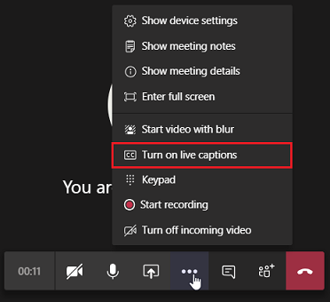

--- 
title: Manage meeting policies for participants and guests
author: CarolynRowe
ms.author: crowe
manager: serdars
ms.topic: article
ms.service: msteams
ms.reviewer: sonua, shalenc
audience: admin
ms.localizationpriority: medium
search.appverid: MET150
ms.collection: 
  - M365-collaboration
appliesto: 
  - Microsoft Teams
f1.keywords:
- CSH
ms.custom: 
  - ms.teamsadmincenter.meetingpolicies.participantandguests
  - seo-marvel-apr2020
description: Learn to manage meeting policy settings in Teams for participants and guests.
---


# Meeting policy settings - Participants & guests

<a name="bkmeetingparticipants"> </a>

These settings control which meeting participants wait in the lobby before they're admitted to the meeting and the level of participation they're allowed in a meeting.

- [Let anonymous people join a meeting](#let-anonymous-people-join-a-meeting)
- [Let anonymous people start a meeting](#let-anonymous-people-start-a-meeting)
- [Automatically admit people](#automatically-admit-people)
- [Allow dial-in users to bypass the lobby](#allow-dial-in-users-to-bypass-the-lobby)
- [Live captions](#live-captions)
- [Chat in meetings](#chat-in-meetings)

> [!NOTE]
> Options to join a meeting will vary, depending on the settings for each Teams group, and the connection method. If your group has audio conferencing, and uses it to connect, see [Audio Conferencing](/microsoftteams/audio-conferencing-in-office-365). If your Teams group doesn't have audio conferencing, refer to [Join a meeting in Teams](https://support.office.com/article/join-a-meeting-in-teams-1613bb53-f3fa-431e-85a9-d6a91e3468c9).

## Let anonymous people join a meeting

This per-organizer setting allows anyone to join meetings as an anonymous user by selecting the link in the meeting invitation. To learn more, see [Join a meeting without a Teams account](https://support.office.com/article/join-a-meeting-without-a-teams-account-c6efc38f-4e03-4e79-b28f-e65a4c039508). Anonymous users' ability to join meetings are also controlled at your organization level, the more restrictive setting will be effective. To learn more, see [Using the Microsoft Teams admin center to configure organization-wide policy](meeting-settings-in-teams.md#allow-anonymous-users-to-join-meetings).

## Let anonymous people start a meeting

This setting is a per-organizer policy that allows for leaderless dial-in conferencing meetings. This setting controls whether dial-in users can join the meeting without an authenticated user from the organization in attendance. By default, this setting is turned off, which means dial-in users will wait in the lobby until an authenticated user from the organization joins the meeting.

> [!NOTE]
> If this setting is turned off and a dial-in user joins the meeting first and is placed in the lobby, an organization user must join the meeting with a Teams client to admit the user from the lobby. There are no lobby controls available for dialed in users.

## Automatically admit people

This is a per-organizer policy. This setting controls whether people join a meeting directly or wait in the lobby until they're admitted by an authenticated user. This setting doesn't apply to dial-in users.


 Meeting organizers can click **Meeting Options** in the meeting invitation to change this setting for each meeting they schedule.

> [!NOTE]
> In the meeting options the setting is labeled "Who can bypass the lobby". If you change the default setting for any user, it will apply to all new meetings organized by that user and any prior meetings where the user didn't modify Meeting options.
  
|Setting value  |Join behavior |
|---------|---------|
|**Everyone**   |All meeting participants join the meeting directly without waiting in the lobby. This includes authenticated users, users from trusted organizations, guests, and anonymous users.     |
|**People in my organization and guests**     |Authenticated users within the organization, including guests, join the meeting directly without waiting in the lobby. Users from trusted organizations and anonymous users wait in the lobby. This is the default setting.    |
|**People in my organization, trusted organizations, and guests**     |Authenticated users within the organization, including guests and the users from trusted organizations, join the meeting directly without waiting in the lobby.  Anonymous users wait in the lobby.   |
|**People in my organization**    |Authenticated users from within the organization join the meeting directly without waiting in the lobby.  Users from trusted organizations, guests, and anonymous users wait in the lobby.          |
|**Organizer only**    |Only meeting organizers can join the meeting directly without waiting in the lobby. Everyone else, including authenticated users within the organization, guests, users from trusted organizations, and anonymous users must wait in the lobby. On the Teams client meeting options page, it appears as "Only me".          |
|**Invited users only**    |Only invited users and meeting organizers can join the meeting directly without waiting in the lobby. Everyone else, including authenticated users within the organization, guests, users from trusted organizations, and anonymous users must wait in the lobby. On the Teams client meeting options page, it appears as "People I invite". Users added as a part of a distribution group will have to go through the lobby.      |

 > [!NOTE]
> Trusted organizations are domains that you allow federated communications with in Teams. If you enable **Allow all external domains** for external access in the Teams admin center, any authenticated user within any Teams organization will be trusted. If you choose to specify external domains that are allowed and block all others, the allowed domains become trusted organizations. Any blocked domain is considered to not be a trusted organization.

## Allow dial-in users to bypass the lobby

This is a per-organizer policy. This setting controls whether people who dial in by phone join the meeting directly or wait in the lobby regardless of the **Automatically admit people** setting. By default, this setting is turned off. When this setting is turned off, dial-in users will wait in the lobby until an organization user joins the meeting with a Teams client and admits them. When this setting is turned on, dial-in users will automatically join the meeting when an organization user joins the meeting with a Teams client.

> [!NOTE]
> If a dial-in user joins a meeting before an organization user joins the meeting, they will be placed in the lobby until an organization user joins the meeting using a Teams client and admits them. If you change the default setting for any user, it will apply to all new meetings organized by that user and any prior meetings where the user didn't modify Meeting options.

## Live captions

This setting is a per-user policy and applies during a meeting. This setting controls whether the **Turn on live captions** option is available for the user to turn on and turn off live captions in meetings that the user attends.  



|Setting value |Behavior  |
|---------|---------|
|**Disabled but the user can override**     | Live captions aren't automatically turned on for the user during a meeting. The user sees the **Turn on live captions** option in the overflow (**...**) menu to turn them on. This is the default setting. |
|**Not enabled**     | Live captions are disabled for the user during a meeting. The user doesn't have the option to turn them on.          |

<a name="bkcontentsharing"> </a>

## Chat in meetings

This is a per-user and per-organizer policy. This setting controls whether meeting chat is allowed in the user's meeting. This setting doesn't apply to channel meetings.

|Setting value |Behavior  |
|---------|---------|
|**Turn it on for everyone**     | All participants can write and view chat messages. |
|**Turn it off for everyone**     | Meeting chat is turned off for all participants.  |
|**Turn it on for everyone but anonymous users**     | Meeting chat write access is turned off for anonymous participants only.  |

Once this **Chat in meetings** policy is applied to users, an organizer can't override this policy through **Meeting options**.

The policy applied to the meeting organizer can affect other users in the meeting. For example:

- If the organizer has **Chat in meetings** set to **Turn it on for everyone** or **Turn it on for everyone but anonymous users**, then a user's individual policy will apply and any users with **Turn it off for everyone** set will not be able to chat in the meeting.
- If the organizer has **Chat in meetings** set to **Turn it off for everyone**, the organizer's policy applies and no one will be able to chat in the meeting.

<a name="bkparticipantsandguests"> </a>

## Q&A in meetings

This is a per-organizer policy. This setting enables Microsoft 365 Tenant Admins to Enable or Disable the Questions & Answers experience (Q&A).

The setting is enforced when a meeting is created or is updated by Organizers. By default, this setting is turned off. Learn more about Q&A [here](/manage-qna-for-meetings).

The parameter QnAEngagementMode controls this policy in PowerShell. Q&A can also be adjusted within the admin portal.

|Setting value |Behavior  |
|---------|---------|
|**Enabled**     | Organizers can add Q&A when creating meetings. |
|**Disabled**     | Organizers won't have the option to add Q&A when creating meetings.  |

## Enable meeting policy settings

To enable meeting policy settings, you can use the [Teams admin center](https://admin.teams.microsoft.com/policies/meetings) (**Meeting Policies** > **Edit a policy** > **Participants & guests**) or the [Set-CsTeamsMeetingPolicy](/powershell/module/skype/set-csteamsmeetingpolicy) cmdlet in Teams PowerShell. 

In this example, we use PowerShell to modify the global meeting policy to allow anyone to start or join a meeting.

```powershell
Set-CsTeamsMeetingPolicy -Identity Global -AutoAdmittedUsers "Everyone" -AllowAnonymousUsersToStartMeeting $True -AllowPSTNUsersToBypassLobby $True
```

Once you’ve set up a policy, you need to apply it to users. If you modified the Global (Org-wide default) policy, it will automatically apply to users. You need to wait at least 4 hours for any policy changes to take effect, but it can take up to 24 hours.


## Related topics

- [Teams PowerShell overview](teams-powershell-overview.md)
- [Assign policies to your users in Teams](policy-assignment-overview.md)
- [Remove the RestrictedAnonymousAccess Teams meeting policy from users](meeting-policies-restricted-anonymous-access.md)
