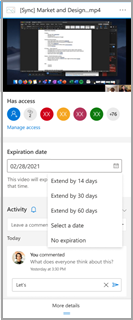

# Meeting recording expiration feature - Frequently asked questions

**What is the change?**

We are introducing a default 60-day expiration setting for *all* newly created Teams meeting recordings (TMRs). This is on by default for all tenants and you must turn it off if you do not want this feature. The OneDrive and SharePoint system will monitor the expiration date set on all TMRs and will automatically move TMRs to the recycle bin on their expiration date.

**Why are we introducing this change?**

We've answered your requests for the meeting recording expiration feature. This is a lightweight housekeeping mechanism to reduce storage clutter created from cold TMR. On average, 99% of TMRs are never rewatched after 60 days.

**Why is this being turned on by default?**

We believe nearly all customers will benefit from the reduced storage load on their tenant by removing recordings that will likely never be rewatched after 60 days. It's our goal to provide as clean an experience as possible for all customers by default.

**How is the expiration date calculated?**

The expiration date is calculated as the day it's created plus the default number of days set in the Teams policy by the admin.

**How can an Admin change the expiration date be changed?**

Admins can edit the default expiration setting in their Teams policy console. That change will affect only newly created TMRs from that point forward. It won't impact any recordings before that date.

Admins can't change the expiration date on existing TMRs. This is done to protect the decision of the user that owns the TMR.

**What is the scope of control for the admin policy?**
NOTE FROM AUTHOR: add information about the granularity of policy application

**How can end users modify the expiration date?**

 Anyone who has edit and delete permissions on a TMR can modify the expiration date in the file’s details pane in Microsoft OneDrive and SharePoint.

 Users can defer the expiration 14, 30, or 60 days, or they can choose a specific date in the future. Another option is that they can select that the file never expires.

**Whom does this impact?**

Anyone storing TMRs in OneDrive or SharePoint.

**Why should I use this feature?**

This feature is being turned on by default. To disable it, change the default expiration setting in the Teams policy console to **No expiration**.
You should use this to limit the OneDrive or Sharepoint for Cloud storage consumption driven by Teams meeting records. A typical meeting recording consumes around 400MB per hour of recording.

**Should I rely on this feature for strict security and compliance adherence?**

No, you shouldn't rely on this for legal protection since end users can modify the expiration date of any recordings they control.

**Will a retention and/or deletion policy I've set in the Security & Compliance center override the Teams meeting recording expiration setting?**

Yes, any policies you have set in the compliance center will take full precedence. 

For example:

- If you have a policy that says all files in a site must be retained for 100 days, and the expiration setting for a Teams meeting recording is 30 days, then the recording will be retained for the full 100 days.
- If you have a deletion policy that says all Teams meeting recordings will be deleted after five days and you have an expiration setting for a Teams meeting recording of 30 days, then the recording will be deleted after five days.

**What happens when a TMR expires?**

On the expiration date, the recording is moved into the recycle bin and the expiration date field is cleared. If you recover the recording from the recycle bin, it won't be deleted by this feature again because the expiration date has been cleared.

**How will I be notified about a file’s expiration?**

- Everyone will see a notification about the expiration date in the recording checklist in the Teams chat window.
- Everyone with view access will see a red icon next to the file in your OneDrive or SharePoint folder 14 days before the file expires.
- The file owner will receive an email notification when the recording expires and will be directed to the recycle bin to recover the recording.

**What SKUs are required for this feature?**

- All SKUs will have this feature by default.

- All users will be defaulted to a 30-day expiration period and won't be able to modify the expiration date.

**Is the file expiration an audited event and will I be able to see it in my audit logs?**

Yes, these will show up as system deletion events in the audit log.

**What if I want the admin to have full control over the lifecycle of meeting recordings and don't want to give end users the ability to override the expiration date?**

We recommend using the Security and Compliance retain and/or delete policies available as part of the E5 compliance SKU. That offering is targeted to solve complex policy and SLA-driven administrative legal concerns.

This feature is solely meant as a lightweight housekeeping mechanism to reduce storage clutter created from cold Teams meeting recordings.

**When will the file be deleted?**

The file will be deleted within five days of the expiration date, though this isn't a strict guarantee.
