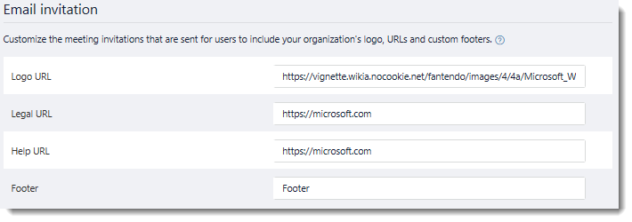
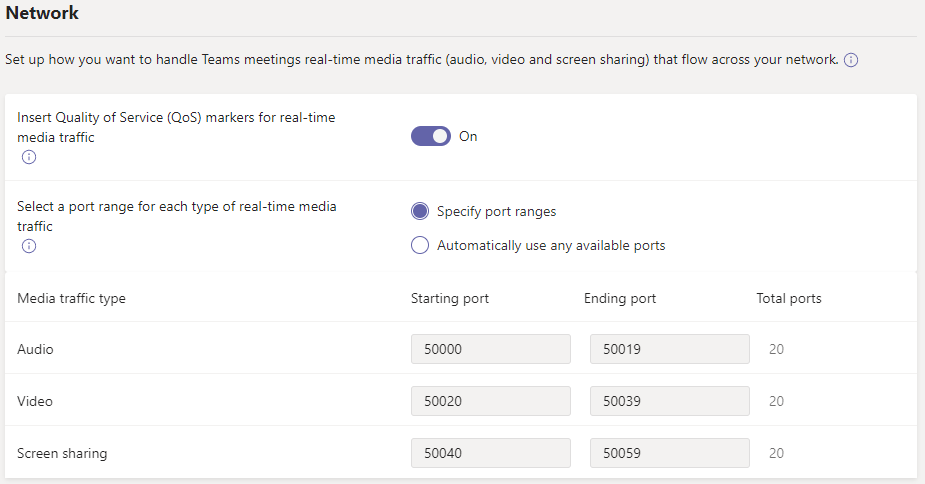

# Manage meeting settings in Microsoft Teams

As an admin, you use Teams meetings settings to control whether anonymous users can join Teams meetings, customize meeting invitations, and if you want to enable Quality of Service (QoS), set port ranges for real-time traffic. These settings apply to all Teams meetings that users schedule in your organization. You manage these settings from **Meetings** > **Meeting settings** in the Microsoft Teams admin center.

## Allow anonymous users to join meetings

With anonymous join, anyone can join the meeting as an anonymous user by clicking the link in the meeting invitation.

 **Using the Microsoft Teams admin center**

1. In the left navigation, go to **Meetings** > **Meeting settings**.
2. Under **Participants**, turn on **Anonymous users can join a meeting**.

    

If you don't want anonymous users to join meetings scheduled by users in your organization, turn off this setting.

## Customize meeting invitations

You can customize Teams meeting invitations to meet your organization's needs. You can add your organization's logo and include helpful information, such as links to your support website and legal disclaimer, and a text-only footer.

### Tips for creating a logo for meeting invitations  

1. Create an image that's no more than 188 pixels wide by 30 pixels tall (it's quite small).
2. Save the image in JPG or PNG format.
3. Store the image in a central location that everyone in your organization can access, such as a network share.

    Now you can add it to your meeting invitations. See the next steps.

### Customize your meeting invitations

 **Using the Microsoft Teams admin center**

1. In the left navigation, go to **Meetings** > **Meeting settings**.
2. Under **Email invitation**, do the following:

    

    - **Logo URL** Enter the URL where your logo is stored.
    - **Legal URL** If your organization has a legal website that you want people to go to for any legal concerns, enter the URL here.
    - **Help URL** If your organization has a support website that you want people to go to if they run into issues, enter the URL here.
    - **Footer** Enter text that you want to include as a footer.
3. Wait an hour or so for the changes to propagate. Then schedule a Teams meeting to see what the meeting invitation looks like.  

## Set how you want to handle real-time media traffic for Teams meetings

If you're using Quality of Service [(QoS)](qos-in-teams.md) to prioritize network traffic, you can enable QoS markers and you can set port ranges for each type of media traffic.

  **Using the Microsoft Teams admin center**

1. In the left navigation, go to **Meetings** > **Meeting settings**.
2. Under **Network**, do the following:

    

    - To allow DSCP markings to be used for QoS, turn on **Insert Quality of Service (QoS) markers for real-time media traffic**. You only have the option of using markers or not; you can't set custom markers for each traffic type. See [Select a QoS implementation method](QoS-in-Teams.md#select-a-qos-implementation-method) for more on DSCP markers.
    - To specify port ranges, next to **Select a port range for each type of real-time media traffic**, select  **Specify port ranges**, and then enter the starting and ending ports for audio, video, and screen sharing. Selecting this option is required to implement QoS.
    > [!IMPORTANT]
    > If you select **Automatically use any available ports**, available ports between 1024 and 65535 are used. Use this option only when not implementing QoS.
    >
    > Selecting a port range that is too narrow will lead to dropped calls and poor call quality. The recommendations below should be a bare minimum.

 If you are unsure what port ranges to use in your environment, the following settings are a good starting point. To learn more, read [Implement Quality of Service (QoS) in Microsoft Teams](QoS-in-Teams.md). These are the required DSCP markings and the suggested corresponding media port ranges used by both Teams and ExpressRoute.

_Port ranges and DSCP markings_

Media traffic type| Client source port range \* |Protocol|DSCP value|DSCP class|
|:---             |:---                         |:---    |:---      |:---      |
|Audio            | 50,000–50,019               |TCP/UDP |46        |Expedited Forwarding (EF)|
|Video            | 50,020–50,039               |TCP/UDP |34        |Assured Forwarding (AF41)|
|Application/Screen Sharing| 50,040–50,059      |TCP/UDP |18        |Assured Forwarding (AF21)|
| | | | |

\* The port ranges you assign cannot overlap and must be adjacent to each other.

Setting port ranges for different traffic types is only one step in handling real time media; see [Quality of Service (QoS) in Teams](qos-in-teams.md) for much more detail. If you enable or change settings in the Microsoft Teams admin center, you will need to [apply matching settings to all user devices](QoS-in-Teams-clients.md) and internal network devices to fully implement the changes to QoS in Teams.

After QoS has been in use for a while, you'll have usage information on the demand for each of these three workloads, and you can choose what changes to make based on your specific needs. [Call Quality Dashboard](turning-on-and-using-call-quality-dashboard.md) will be helpful with that.
