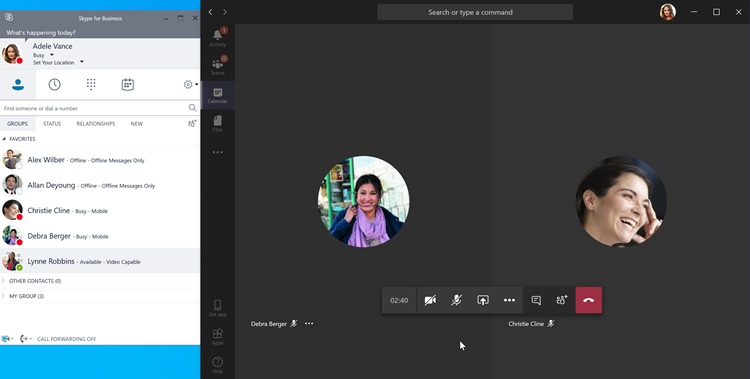
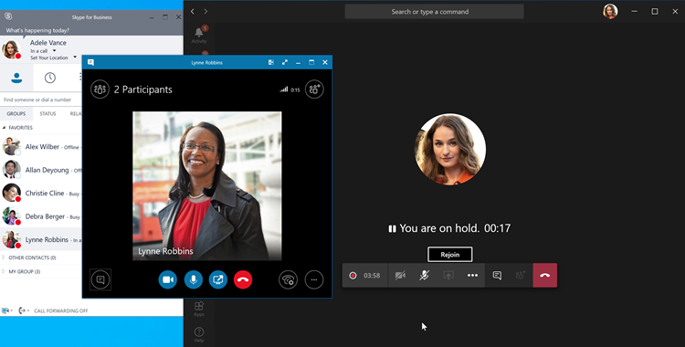
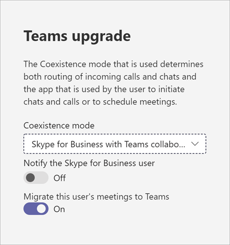

# Meetings First

"Meetings First" is targeted at and optimized for Skype for Business Server organizations with Enterprise Voice on premises who want to start using Teams meetings as rapidly as possible. For these organizations, Meetings First is an alternative to using **Islands** mode that prioritizes the Teams meetings experience.

## What is Meetings First?

Meetings First is based on the **SfBWithTeamsCollabAndMeetings** coexistence mode. Meetings First isn't a product or a feature—it's a configuration that uses capabilities and features of Teams and Skype for Business to provide a uniquely tailored coexistence experience.

In Meetings First, users create their meeting in Teams, while continuing to use Skype for Business for chat, calling, and presence. There is no overlap of modalities between Teams and Skype for Business. Chat, calling, and presence are on in Skype for Business and off in Teams. This configuration enables unique "better together" scenarios between Skype for Business and Teams that enhance the user's experience during coexistence, as well as interoperability scenarios with **Teams Only** users.

> [!Important]
> Meetings First is a better match for organizations who have no or few active Teams chat users. Active Teams chat users should not be switched to Meetings First mode, as they would lose the ability to chat in Teams and to access to their chat history. These users should be grandfathered in **Islands** mode instead, and Meetings First only granted to the users not yet active in chat in Teams.

## Who should consider Meetings First?

Meetings First is for organizations who use Skype for Business Server with Enterprise Voice who want to accelerate their move to Teams meetings. Meetings First is especially for organizations with a strong IT discipline who want a managed upgrade path to Teams.

For complex or large organizations, voice migrations are typically done on a site-by-site basis and might take a long time, potentially several years, resulting in extended coexistence scenarios. If that coexistence is in **Islands** mode, users will always have the choice of two meeting solutions (Skype for Business and Teams), which can result in confusing or suboptimal situations. Unlike voice migrations, meetings migrations can generally be completed across the entire company in a short amount of time. Organizations who want to completely switch to Teams meetings as quickly as possible (and without waiting for their voice migration to be complete) should consider Meetings First.

Meetings First might not be useful to organizations who have no Enterprise Voice users. These organizations should be able to upgrade to **Teams Only** as soon as they are able to adopt Teams meetings. They should consider skipping Meetings First.

In addition, Meetings First is useful to organizations whose scope is a pure-play meeting solution, for example when a "meetings-only" RFP is being issued.

## Capabilities in Meetings First

Meeting First brings the following capabilities together:

- [Provision a Skype for Business Server (on-premises) user](./tutorial-audio-conferencing.yml?tutorial-step=3) with [Teams Audio Conferencing](tutorial-audio-conferencing.yml).
- [Meetings Migration Service](/skypeforbusiness/audio-conferencing-in-office-365/setting-up-the-meeting-migration-service-mms): Meetings organized by the user will be migrated to the cloud and converted to Teams meetings as the user is promoted to Meetings First (requires Exchange Online).
- Streamlined user experience in Teams, centered on Teams meetings and teams and channels (which can be hidden using the [App Permissions policy](teams-app-permission-policies.md)). [Teams private chat, calling, and self-presence](teams-client-experience-and-conformance-to-coexistence-modes.md) aren't exposed in Meetings First, enabling the deployment and adoption effort to focus on meetings.
- Superior [Teams meeting experience](tutorial-meetings-in-teams.yml).
- "Better Together" between Teams and Skype for Business: 
  - Automatic hold: When in a meeting in Teams, getting in a call in Skype for Business will place the Teams meeting on hold, and vice-versa. This prevents users from having their private calls overheard by the meetings participants.
    
  - Presence reconciliation: Activity in Teams is reflected in the user's presence, which is the Skype for Business presence since chat and calling are in Skype for Business. Specifically, when Meetings First users are in a Teams meeting, their presence will be updated to reflect that. When they present their screen, their presence will be updated to show Do Not Disturb (based on their settings in Skype for Business).
  - USB device HID control reconciliation (also available on Mac): The HID controls are honored by Teams while in Teams meetings and by Skype for Business in all other circumstances.
  - Unless otherwise mentioned, Better Together capabilities require recent Windows desktop clients at this time.

## Prerequisites for Meetings First

The only hard requirements for Meetings First are the same as the requirements for Teams with on-premises Active Directory and a Skype for Business on-premises deployment:

- [General pre-requisites for Teams](upgrade-plan-journey-prerequisites.md), including
- [Identity and authentication in Teams](identify-models-authentication.md) and
- [Configure Azure Active Directory for Teams and Skype for Business](/skypeforbusiness/hybrid/configure-azure-ad-connect).

A [Skype for Business hybrid topology](/skypeforbusiness/hybrid/configure-federation-with-skype-for-business-online) isn't required, but it's recommended. Some capabilities such as Meetings Migration Service and interoperability rely on that topology.

Meetings First is supported with any version of the Skype for Business Server (and known to work with the no-longer-supported Lync Server). It's supported with any supported Skype for Business client, however Better Together capabilities require a recent client.

Once these requirements are met (and not prior), the users can be [licensed for Microsoft 365 or Office 365 and Teams](/office365/enterprise/assign-licenses-to-user-accounts).

For the best Meetings First experience, users should be enabled for [Exchange Online](exchange-teams-interact.md), [SharePoint Online, and OneDrive for Business](sharepoint-onedrive-interact.md), and Microsoft 365 group creation. Meetings First is supported for users whose mailbox is on Exchange on-premises, or who don't have SharePoint Online or OneDrive For Business, or Microsoft 365 group creation. However, their experience will be less complete. For organizations using Exchange Server on-premises, there might be (depending on the version of Exchange Server) some limitations to creating and viewing meetings from the Teams client, and some limitations with respect to compliance capabilities.

At minimum, users must be [licensed for Teams](/microsoft-365/admin/manage/assign-licenses-to-users). In addition, they can be licensed for [Audio Conferencing](set-up-audio-conferencing-in-teams.md), if needed.

We recommend you [grant **SfBOnly** or **SfBWithTeamsCollab**](/powershell/module/skype/grant-csteamsupgradepolicy?view=skype-ps) mode as tenant default at the time you license the users. This setting ensures that users wouldn't start using Teams on their own in the default **Islands** mode prior to launching Meetings First.

Meetings First is supported on full desktop clients (Windows and Mac), on browser clients, and on mobile clients. It's also compatible with [Microsoft Teams Rooms](/microsoftteams/room-systems/). Better Together requires the full desktop client.

## Prepare for Teams meetings in Meetings First

For your users to have the best possible experience in Teams meetings, you should:

- Follow the steps in [Meetings and conferencing for Microsoft Teams](deploy-meetings-microsoft-teams-landing-page.md), in particular.
- [Evaluate your environment](3-envision-evaluate-my-environment.md).
- [Prepare your organization's network for Microsoft Teams](prepare-network.md).
- Upgrade your meeting rooms with Teams capable [meeting room devices and solutions](/skypeforbusiness/certification/devices-meeting-rooms?bc=%2fmicrosoftteams%2fbreadcrumb%2ftoc.json&toc=%2fMicrosoftTeams%2ftoc.json), or use [Cloud Video Interop for Microsoft Teams](cloud-video-interop.md) to enable your existing third-party rooms and devices to join Teams meetings.
- Equip your users with [certified USB audio and video devices](/skypeforbusiness/certification/devices-usb-devices?bc=%2fmicrosoftteams%2fbreadcrumb%2ftoc.json&toc=%2fMicrosoftTeams%2ftoc.json).
- Prepare to [drive awareness and adoption for Teams meetings](adopt-microsoft-teams-landing-page.md).
- [Plan your service management](4-envision-plan-my-service-management.md).
- Familiarize yourself with the rich Call Analytics reports to [troubleshoot poor call quality](use-call-analytics-to-troubleshoot-poor-call-quality.md).

You might consider running a moderate scale production ready pilot at this stage.

## Configure users for Meetings First

Once you've licensed your users and prepared your organization for Teams meetings, it's time to enable your users for Meetings First. We've made it easy: one setting will do it all.

All capabilities and user experiences in Meetings First--including the Teams client configuration and [auto-conformance](teams-client-experience-and-conformance-to-coexistence-modes.md) of the user experience, Meetings Migration Service, and Better Together capabilities--are configured by granting the user (or group of users, or tenant default) the [SfBWithTeamsCollabAndMeetings coexistence mode](setting-your-coexistence-and-upgrade-settings.md) either in the [Microsoft Teams admin center](manage-teams-in-modern-portal.md) or by using [PowerShell](/powershell/module/skype/grant-csteamsupgradepolicy?view=skype-ps).

If you want to hide the Teams and Channels application from the left navigation of your users' Teams client to further focus their experience on meetings, you can use the [App Setup policy](teams-app-setup-policies.md).

## Reporting and Call Analytics

Reporting and Call Analytics for Teams meetings in Meetings First are unchanged from what they are in other modes.

## Related links

For more information, see [Choose your upgrade journey](upgrade-and-coexistence-of-skypeforbusiness-and-teams.md), [Migration and interoperability guidance](migration-interop-guidance-for-teams-with-skype.md), and [Coexistence with Skype for Business](coexistence-chat-calls-presence.md) for further details.
