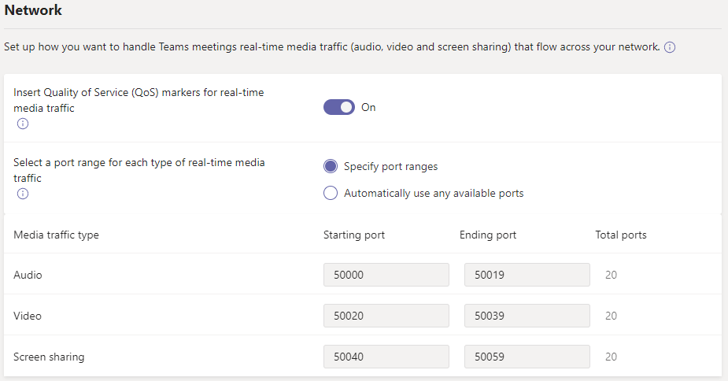

# Configure Quality of Service (QoS) settings in the Teams admin center

This article is for administrators and IT professionals who are configuring Quality of Service for Microsoft Teams. This article describes how to enable QoS in the Teams admin center.

**Before reading this article, be sure to read [Implement Quality of Service in Microsoft Teams](qos-in-teams.md)**, which describes everything you need to know to successfully use QoS with Microsoft Teams:

- QoS concepts, such as QoS queues, DSCP, DSCP markers and tagging, and so on
- Network readiness considerations
- Choosing a QoS implementation method
- Choosing port ranges
- Validating your implementation

Note: If you enable QoS or change settings in the Microsoft Teams admin center for the Teams service, you'll also need to [apply matching settings to all user devices](QoS-in-Teams-clients.md) and all internal network devices to fully implement the changes to QoS in Teams.

## Manage QoS markers in the Microsoft Teams admin center

1. Go to the [Teams admin center](https://admin.teams.microsoft.com).
2. In the left navigation, go to **Meetings** > **Meeting settings**.
3. Under **Network**, do the following:

    

    - To enable QoS, turn on **Quality of Service (QoS) markers for real-time media traffic**. You can specify whether or not to use markers, but you can't set custom markers for each traffic type. For more information about DSCP markers, see [Select a QoS implementation method](QoS-in-Teams.md#step-2-select-a-qos-implementation-method).

        > [!IMPORTANT]
        > Enabling QoS is performed only on the endpoints for tagging packets leaving the client. We recommend applying matching QoS rules on all internal network devices for incoming traffic.

    - If you've enabled Quality of Service, you must manage your port settings. 
    
      To specify port ranges, next to **Select a port range for each type of real-time media traffic**, select  **Specify port ranges**, and then enter the starting and ending ports for audio, video, and screen sharing. The port ranges for calling and meeting signaling are not customizable currently.
      
      Selecting a port range that is too narrow will lead to dropped calls and poor call quality. For more information about choosing port ranges, see [Choose initial port ranges](qos-in-teams.md#step-3-choose-initial-port-ranges-for-each-media-type).

      The port ranges you assign can't overlap and should be adjacent to each other.

      > [!IMPORTANT]
      > Do not select **Automatically use any available ports** unless you aren't implementing QoS. If you select this option, available ports between 1024 and 65535 are used. 

After using QoS for a while, you can use [Call Quality Dashboard](cqd-what-is-call-quality-dashboard.md) to determine if changes are required to your QoS configuration.  
