# Microsoft Teams call flows

> [!Tip]
> Watch the following session to learn how Teams leverages your network and how to plan for optimal network connectivity: [Teams Network Planning](https://aka.ms/teams-networking)

## Overview
This article describes how Teams uses Office 365 call flows in various topologies. In addition, it describes unique Teams flows that are used for peer-to-peer media communication. The document describes these flows, their purpose, and their origin and termination on the network. For purposes of this article, assume the following:

- Flow X is used by the on-premises Office 365 client to communicate with the Office 365 service in the cloud. It originates from the customer network, and it terminates as an endpoint in Office 365.

- Flow Y is used by the on-premises Office 365 client to communicate with a service on the Internet that Office 365 has a dependency on. It originates from the customer network, and it terminates as an endpoint on the Internet.

The article contains the following sections:

- **Background** - Provides background information, such as networks that Office 365 flows may traverse, type of traffic, connectivity guidance from the customer network to Office 365 service endpoints, interoperability with third-party components, and principles that are used by Teams to select media flows.

- **Call flows in various topologies** - Illustrates the use of call flows in various topologies. For each topology, the section enumerates all supported flows and illustrates how these flows are used via several use cases. For each use case, it describes the sequence and selection of flows via a flow diagram. 

- **Teams with Express Route optimization** - Describes how these flows are used when Express Route is deployed for optimization, illustrated via a simple topology.

## Background
### Network segments
**Customer network**: This is the network segment that you control and manage. This includes all customer connections within customer offices, whether wired or wireless, between office buildings, to on-premises datacenters, and your connections to Internet providers, Express Route, or any other private peering. 

Typically, a customer network has several network perimeters with firewalls and/or proxy servers, which enforce your organization's security policies, and that only allow certain network traffic that you have set up and configured. Because you manage this network, you have direct control over the performance of the network, and it is highly recommended that you complete network assessments to validate performance both within sites in your network and from your network to the Office 365 network. 

**Internet**: This is the network segment that is part of your overall network that will be used by users who are connecting to Office 365 from outside of the customer network. It is also used by some traffic from the customer network to Office 365. 

**Visited/Guest private network**: This is the network segment outside your customer network, but not in the public Internet, that your users and/or their guests may visit. For example, home private network or an Enterprise private network, that does not deploy Teams, where your users and/or their customers that interact with Teams services may reside.

>**Note**: Connectivity to Office 365 is also applicable to these networks.

**Office 365**: This is the network segment that supports Office 365 services. It is distributed worldwide with edges in proximity to the customer network in most locations. Functions mentioned in this document include Transport Relay, conferencing server, and Media Processor. 

**Express Route (optional)**: This is the network segment that is part of your overall network that will give you a dedicated, private connection to the Office 365 network.

### Types of traffic

**Real-time media**: Data encapsulated within RTP (Real-time Transport Protocol) that supports audio, video and screen sharing workloads. In general, media traffic is highly latency sensitive, so you would want this traffic to take the most direct path possible, and to use UDP versus TCP as the transport layer protocol, which is the best transport for interactive real time media from a quality perspective. (Note: As a last resort, media can use TCP/IP and also be tunneled within the HTTP protocol, but it is not recommended due to bad quality implications.) RTP flow is secured via SRTP, in which only the payload is encrypted.

**Signaling**: The communication link between the client and server, or other clients that are used to control activities (for example, when a call is initiated), and deliver instant messages. Most signaling traffic uses the HTTPS-based REST interfaces, though in some scenarios (for example, connection between Office 365 and a Session Border Controller) it uses SIP protocol. It's important to understand that this traffic is much less sensitive to latency but may cause service outages or call timeouts if latency between the endpoints exceeds several seconds. 

### Connectivity to Office 365

Teams requires [connectivity to the Internet](https://support.office.com/article/connectivity-to-the-internet-64b420ef-0218-48f6-8a34-74bb27633b10). Teams endpoint URLs and IP address ranges are listed in [Office 365 URLs and IP address ranges](https://docs.microsoft.com/office365/enterprise/urls-and-ip-address-ranges). (Note: Open connectivity to TCP ports 80 and 443, and to UDP ports 3478 through 3481 is required.) Furthermore, Teams has a dependency on Skype for Business Online, which must also be connected to the Internet.

Teams media flows connectivity is implemented via standard IETF ICE (Interactive Connectivity Establishment) procedures.

### Interoperability restrictions
**Third party media relays**: A Teams media flow (that is, one of the media endpoints is Teams) may traverse only Teams or Skype for Business native media relays. Interoperability with a third party media relay is not supported. (Note: A third party SBC on the boundary with PSTN must terminate RTP/RTCP stream, secured via SRTP, and not relay it to the next hop.)

**Third party SIP Proxy servers**: A Teams signaling SIP dialog with a third party SBC and/or gateway may traverse Teams or Skype for Business native SIP proxies. Interoperability with a third party SIP proxy is not supported.

**Third party B2BUA (that is, SBC)**: A Teams media flow from/to the PSTN is terminated by a third party SBC. However, interoperability with a third party SBC within the Teams network (that is, a third party SBC mediates two Teams/Skype for Business endpoints) is not supported.

### Technologies that are not recommended with Microsoft Teams

**VPN Network**: It is not recommended for media traffic (that is, flow 2'). The VPN client should use split VPN and route media traffic like any external non-VPN user, as specified in https://blogs.technet.microsoft.com/nexthop/2011/11/14/enabling-lync-media-to-bypass-a-vpn-tunnel/.

>**Note**: Although the title is Lync, it is applicable to Teams as well.

**Packet Shapers**: Any kind of packet snippers, packet inspection, or packet shaper devices are not recommended and may degrade quality significantly. 

### Principles
There are four general principles that help you understand call flows for Microsoft Teams:
 
1.	A Microsoft Teams conference is hosted by Office 365 in the same region where the first participant joined. (Note: If there will be exceptions to this rule in some topologies, then they will be described in this document, and illustrated by an appropriate call flow.)

2.	A Teams media endpoint in Office 365 is used based on media processing needs and not based on call type. (For example, a point-to-point call may use a media endpoint in the cloud to process media for transcription and/or recording, while a conference with two participants may not use any media endpoint in the cloud.) However, most conferences will use a media endpoint for mixing and routing purposes, allocated where the conference is hosted. The media traffic sent from a client to the media endpoint may be routed directly or use a Transport Relay in Office 365 if required due to customer network firewall restrictions. 

3.	Media traffic for peer-to-peer calls take the most direct route that is available, assuming that the call doesn't mandate a media endpoint in the cloud (see #2 above). The preferred route is direct to the remote peer (client), but if that route isn't available, then one or more Transport Relays will relay traffic. It is recommended that media traffic shall not transverse servers such as packet shapers, VPN servers, and so on, since this will impact the media quality.

4.	Signaling traffic always goes to the closest server to the user. 

To learn more about the details on the media path that is chosen, see https://www.youtube.com/watch?v=1tmHMIlAQdo.

## Call flows in various topologies
### Teams topology
This topology is used by customers that leverage Teams services from the cloud without any on-premises deployment, such as Skype for Business Server or Phone System Direct Routing. In addition, the interface to Office 365 is done via the Internet without Azure Express Route. 

[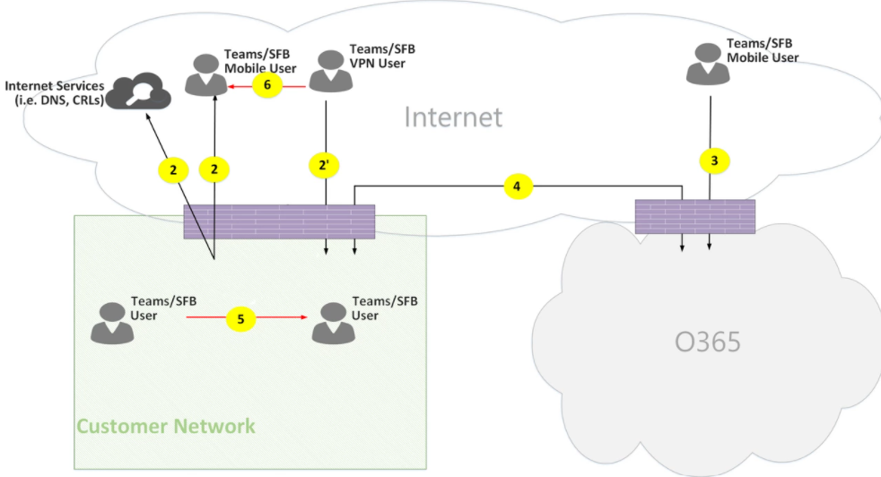](media/microsoft-teams-online-call-flows-figure01.png)

*Figure 1 - Teams topology*

Note that:

- The direction of the arrows on the diagram above reflect the initiation direction of the communication that affects connectivity at the enterprise perimeters. In the case of UDP for media, the first packet(s) may flow in the reverse direction, but these packets may be blocked until packets in the other direction will flow.
- Teams is deployed side by side with Skype for Business Online, hence clients are displayed as "Teams/SFB user".

You can find more information on the following optional topologies later in the article:

- Skype for Business on-premises deployment is described in this document in the section **Teams  hybrid topology**.
- Phone System Direct Routing (for PSTN connectivity) is described in this document in the section **Teams with Direct Routing topology**.
- Express Route is described in this document in the section **Teams with Express Route optimization**.

**Flow descriptions**:
- **Flow 2** – Represents a flow initiated by a user on the customer network to the Internet as a part of the user's Teams experience. Examples of these flows are DNS and peer-to-peer media.
- **Flow 2'** – Represents a flow initiated by a remote mobile Teams user, with VPN to the customer network. 
- **Flow 3** – Represents a flow initiated by a remote mobile Teams user to Office 365/Teams endpoints. 
- **Flow 4** – Represents a flow initiated by a user on the customer network to Office 365/Teams endpoints.
- **Flow 5** – Represents a peer-to-peer media flow between a Teams user and another Teams or Skype for Business user within the customer network.
- **Flow 6** – Represents a peer-to-peer media flow between a remote mobile Teams user and another remote mobile Teams or Skype for Business user over the Internet.

#### Use case: One-to-one
One-to-one calls use a common model in which the caller will obtain a set of candidates consisting of IP addresses/ports--including local, relay, and reflexive (public IP address of client as seen by the relay) candidates. The caller sends these candidates to the called party; the called party also obtains a similar set of candidates and sends them to the caller. STUN connectivity check messages are used to find which caller/called party media paths work, and the best working path is selected. Media (that is, RTP/RTCP packets secured via SRTP) are then sent using the selected candidate pair. The Transport relay is deployed as part of Office 365.

If the local IP address/port candidates or the reflexive candidates have connectivity, then the direct path between the clients (or via a NAT) will be selected for media. If the clients are both on the customer network, then the direct path should be selected. This requires direct UDP connectivity within the customer network. If the clients are both nomadic cloud users, then depending on the NAT/firewall, media may use direct connectivity.

If one client is internal on the customer network and one client is external (for example, a mobile cloud user), then it is unlikely that direct connectivity between the local or reflexive candidates is working. In this case, an option is to use one of the Transport Relay candidates from either client (for example, the internal client obtained a relay candidate from the Transport relay in Office 365; the external client needs to be able to send STUN/RTP/RTCP packets to the transport relay). Another option is the internal client sends to the relay candidate obtained by the mobile cloud client. Note that, although UDP connectivity for media is highly recommended, TCP is supported.

**High-level steps**:
1. Teams User A resolves URL domain name (DNS) via flow2
2. Teams User A allocates a media Relay port on Teams Transport Relay via flow 4
3. Teams User A sends "invite" with ICE candidates via flow 4 to Office 365
4. Office 365 sends notification to Teams User B via flow 4
5. Teams User B allocates a media Relay port on Teams Transport Relay via flow 4
6. Teams User B sends "answer" with ICE candidates via flow 4, which is forwarded back to Teams User A via Flow 4
7. Teams User A and Teams User B invoke ICE connectivity tests and the best available media path is selected (see diagrams below for various use cases)
8. Teams Users send telemetry to Office 365 via flow 4

**Within customer network:**

[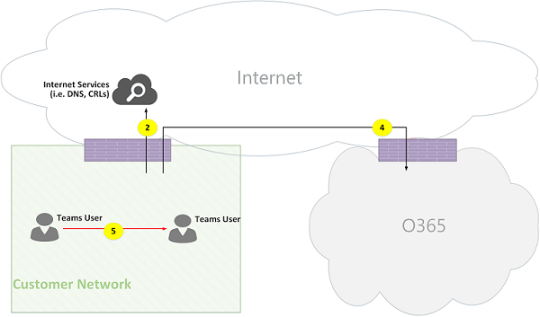](media/microsoft-teams-online-call-flows-figure02.png)

*Figure 2 - Within customer network*
 
In step 7, peer-to-peer media flow 5 is selected.
 
Media is bidirectional. The direction of flow 5 indicates that one side initiates the communication from a connectivity perspective, consistent with all the flows in this document. In this case, it doesn't matter which direction is used because both endpoints are within the customer network.

**Customer network to external user (media relayed by Teams Transport Relay):**

[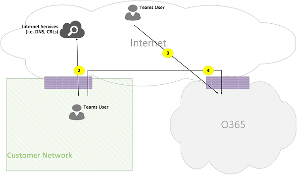](media/microsoft-teams-online-call-flows-figure03.png)

*Figure 3 - Customer network to external user (media relayed by Teams Transport Relay)*
 
In step 7, flow 4, from customer network to Office 365, and flow 3, from remote mobile Teams user to Office 365, are selected. These flows are relayed by Teams Transport Relay within Office 365.

Media is bidirectional, where direction indicates which side initiates the communication from a connectivity perspective. In this case, these flows are used for signaling and media, via different transport protocols and addresses.

**Customer network to external user (direct media):**

[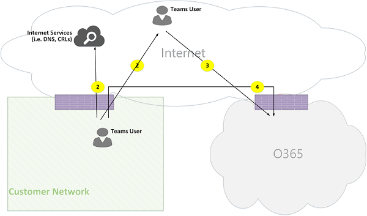](media/microsoft-teams-online-call-flows-figure04.png)

*Figure 4 - Customer network to external user (direct media)*
 
In step 7, flow 2, from customer network to Internet (client's peer), is selected.
- Direct media with remote mobile user (that is, not relayed through Office 365) is optional. In other words, customer may block this path to enforce a media path through Transport Relay in Office 365.

- Media is bidirectional. The direction of flow 2 to remote mobile user indicates that one side initiates the communication from a connectivity perspective. 

**VPN user to internal User (media relayed by Teams Transport Relay)**

[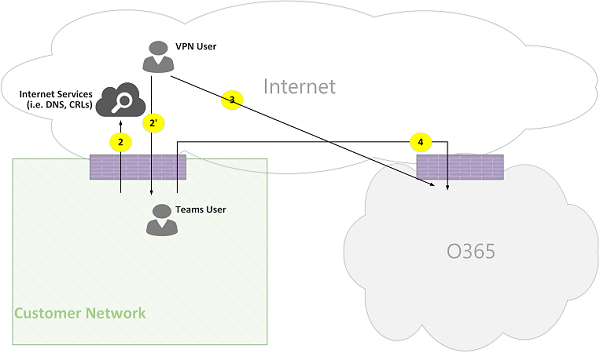](media/microsoft-teams-online-call-flows-figure05.png)

*Figure 5 - VPN user to internal user (media relayed by Teams Transport Relay)*
 
Signaling between the VPN to the customer network is via flow 2'. Signaling between the customer network and Office 365 is via flow 4. However, media bypasses the VPN and is routed via flows 3 and 4 through Teams media relay in Office 365.

**VPN user to internal user (direct media)**

[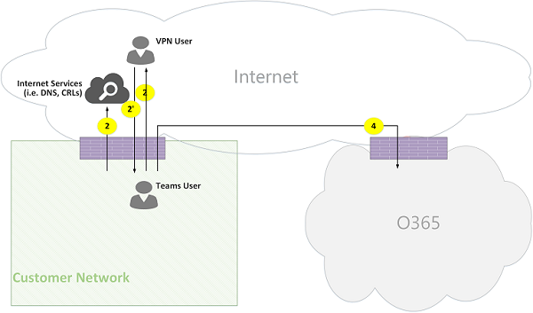](media/microsoft-teams-online-call-flows-figure06.png)

*Figure 6 - VPN user to internal user (direct media)*

Signaling between the VPN to the customer network is via flow 2'. Signaling between the customer network and Office 365 is via flow 4. However, media bypasses the VPN and is routed via flow 2 from the customer network to the Internet.

Media is bidirectional. The direction of flow 2 to the remote mobile user indicates that one side initiates the communication from a connectivity perspective.

**VPN user to external user (direct media)**

[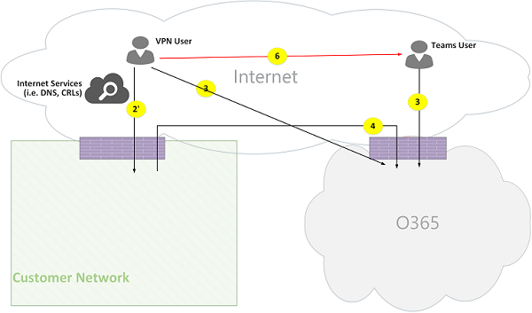](media/microsoft-teams-online-call-flows-figure07.png)

*Figure 7 - VPN user to external user (direct media)*

Signaling between the VPN user to the customer network is via flow 2' and via flow 4 to Office 365. However, media bypasses VPN and is routed via flow 6.

Media is bidirectional. The direction of flow 6 to the remote mobile user indicates that one side initiates the communication from a connectivity perspective.

#### Use Case: Teams to PSTN through Office 365 Trunk
Office 365 has a Phone System that allows placing and receiving calls from the Public Switched Telephone Network (PSTN). If the PSTN trunk is connected via the Phone System Calling Plan, then there are no special connectivity requirements for this use case. (If you want to connect your own on-premises PSTN trunk to Office 365, you can use Phone System Direct Routing.)

[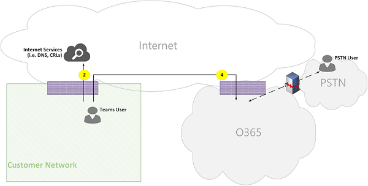](media/microsoft-teams-online-call-flows-figure08.png)

*Figure 8 - Teams to PSTN through Office 365 Trunk*

#### Use Case: Teams Meeting

The audio/video/screen sharing (VBSS) conferencing server is part of Office 365. It has a public IP address that must be reachable from the customer network and must be reachable from a Nomadic Cloud client. Each client/endpoint needs to be able to connect to the conferencing server.

Internal clients will obtain local, reflexive, and relay candidates in the same manner as described for one-to-one calls. The clients will send these candidates to the conferencing server in an invite. The conferencing server does not use a relay since it has a publicly reachable IP address, so it responds with its local IP address candidate. The client and conferencing server will check connectivity in the same manner described for one-to-one calls. 

Note that:

- Teams clients cannot join Skype for Business meetings, and Skype for Business clients cannot join Teams meetings.

- A PSTN user optionally "Dials IN" or "Dialed OUT", depending on the meeting's organizer PSTN Calling and/or conferencing provisioning. 

- A guest user or a customer user may join from a guest private network, which is protected via FW/NAT with strict rules.

[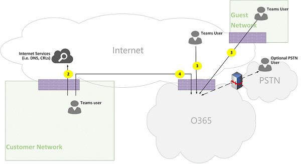](media/microsoft-teams-online-call-flows-figure09.png)

*Figure 9 - Teams Meeting*

#### Use Case: Federation with Skype for Business on premises

**Media relayed by Teams Transport Relay in Office 365**

[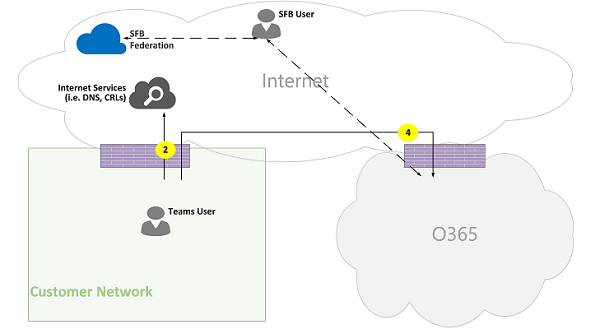](media/microsoft-teams-online-call-flows-figure10.png)

*Figure 10 - Media relayed by Teams Transport Relay in Office 365*

Note that:

- Federation is, by definition, a communication between two tenants. In this case, tenant A, which uses Teams, federates with tenant B, which uses Skype for Business on premises. If tenant B is also using Office 365, then the Skype for Business client would have used flow 3 to connect with Office 365.

- Signaling and media from the federated Skype for Business client to on-premises Skype for Business Server is out of scope of this document. However, it is illustrated here for clarity.

- Signaling between Teams and Skype for Business is bridged by a gateway in Office 365.

- Media in this case is relayed by Teams Transport Relay in Office 365 to the customer network and remote Skype for Business client via flow 4.

**Media relayed by Skype for Business Media Relay in federated tenant**

[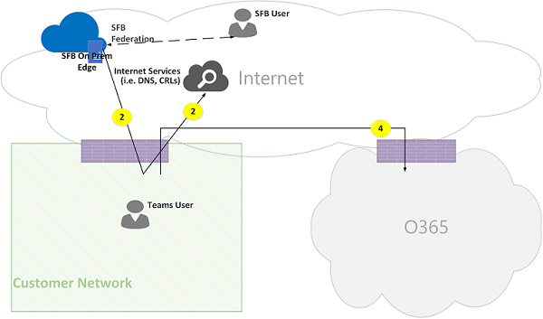](media/microsoft-teams-online-call-flows-figure11.png)

*Figure 11 - Media relayed by Skype for Business Media Relay in federated tenant*

Note that:

- Signaling and media from the federated Skype for Business client to an on-premises Skype for Business Server is out of scope of this document. However, it is illustrated here for clarity.

- Signaling between Teams and Skype for Business is bridged by a Gateway in Office 365.

- Media in this case is relayed by Skype for Business on-premises Media Relay to the customer network via flow 2. (Note that traffic from Teams user to the remote Media Relay in the federated customer network will be initially blocked by the Media Relay until traffic in the reverse direction starts to flow. However, the bidirectional flow will open connectivity in both directions.)

**Direct (peer-to-peer)**

[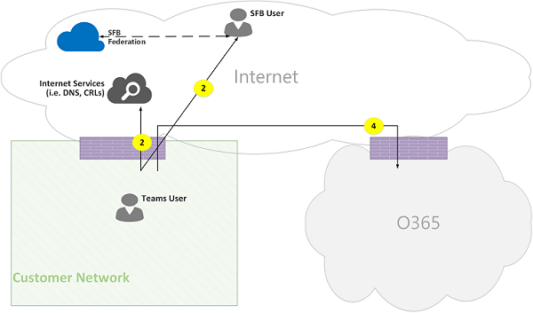](media/microsoft-teams-online-call-flows-figure12.png)

*Figure 12 - Direct (peer-to-peer)*

### Teams hybrid topology
This topology includes Teams with a Skype for Business on-premises deployment.

[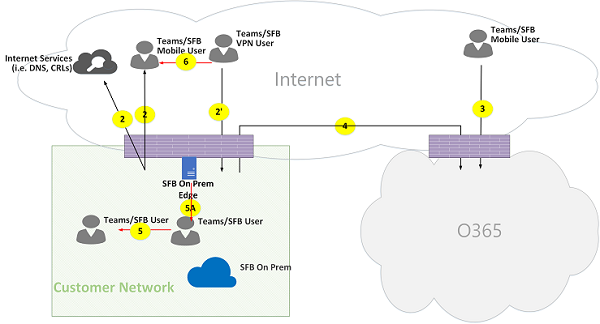](media/microsoft-teams-online-call-flows-figure13.png)

*Figure 13 - Teams hybrid topology*
 
- The direction of the arrows on the diagram above reflect the initiation direction of the communication that affects connectivity at the enterprise perimeters. In the case of UDP for media, the first packet(s) may flow in the reverse direction, but these packets may be blocked until packets in the other direction will flow.

- Teams is deployed side by side with Skype for Business Online, hence clients are displayed as "Teams/SFB user".

Additional flows (on top of Teams topology):
- **Flow 5A** – Represents a peer-to-peer media flow between a Teams user within the customer network and a Skype for Business on-premises media relay at the customer network edge.

#### Use Case: Teams to Skype for Business one-to-one
**Hybrid within the customer network**

[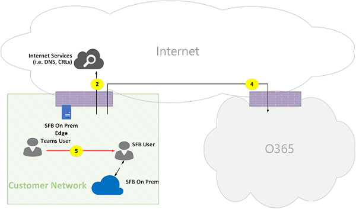](media/microsoft-teams-online-call-flows-figure14.png)

*Figure 14 - Hybrid within customer network*
 
Signaling between Teams and Skype for Business is bridged by a gateway in Office 365. However, media is routed directly peer-to-peer within the customer network via flow 5.

**Hybrid customer network with external Skype for Business user – relayed by Office 365**

[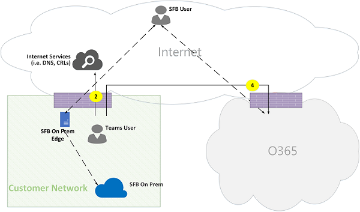](media/microsoft-teams-online-call-flows-figure15.png)

*Figure 15 - Hybrid customer network with external Skype for Business user - relayed by Office 365*

Note that:

- Signaling and media from the Skype for Business client to an on-premises Skype for Business Server is out of scope of this document. However, it is illustrated here for clarity.

- Signaling between Teams and Skype for Business is bridged by a gateway in Office 365.

- Media is relayed through Teams Transport Relay in Office 365 to the customer network through flow 4.

**Hybrid customer network with external Skype for Business user – relayed by on-premises Edge**

[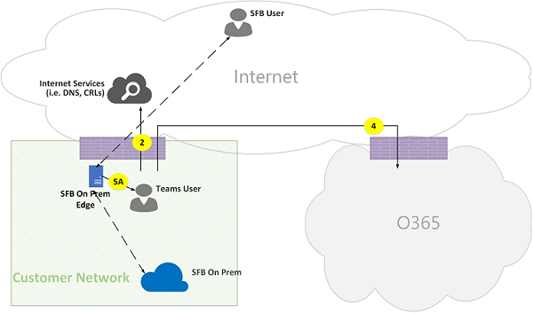](media/microsoft-teams-online-call-flows-figure16.png)

*Figure 16 - Hybrid customer network with external Skype for Business user - relayed by on-premises Edge*
 
Note that:

- Signaling and media from Skype for Business client to an on-premises Skype for Business Server is out of scope of this document. However, it is illustrated here for clarity.

- Signaling is bridged by a gateway in Office 365.

- Media is relayed by Skype for Business Media Relay within Skype for Business on-premises Edge to Teams user within the customer network via media flow 5A.

### Teams with Phone System Direct Routing topology
This topology includes Teams with Phone System Direct Routing. 

Direct Routing enables you to use a third-party Public Switched Telephone Network (PSTN) service provider by pairing a supported on-premises customer-owned Session Border Controller (SBC) hardware device to Office 365, and then connecting the telephony trunk to that device. 

To support this scenario, the customer must deploy a certified SBC for Direct Routing from one of Microsoft's certified partners. The SBC must be configured as recommended by the vendor, and be routable from Office 365 for direct UDP traffic. The media may flow directly from Teams and/or the Skype for Business client to the SBC (bypassing the Teams gateway) or traverse through the Teams gateway. The connectivity with the SBC, when the trunk is configured to bypass the Teams gateway, is based on ICE, where SBC supports ICE-Lite, while the Teams/Skype for Business media endpoint supports ICE Full. 

[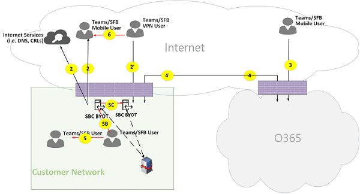](media/microsoft-teams-online-call-flows-figure17.png)

*Figure 17 - Teams with Phone System Direct Routing topology

Note that:

- The direction of the arrows on the diagram above reflect the initiation direction of the communication that affects connectivity at the enterprise perimeters. In the case of UDP for media, the first packet(s) may flow in the reverse direction, but these packets may be blocked until packets in the other direction will flow.

- Teams is deployed side by side with Skype for Business Online, hence clients are displayed as "Teams/SFB user".

Additional flows (on top of Teams online topology):
- **Flow 4'** - Represents a flow from Office 365 to the customer network, used to establish a connection between the Teams media server in the cloud with the SBC on premises.
- **Flow 5B** – Represents a media flow between the Teams user within the customer network with the Direct Routing SBC in bypass mode.
- **Flow 5C** – Represents a media flow between the Direct Routing SBC to another Direct Routing SBC in a PSTN hairpin call bypass mode.

**Internal user with Direct Routing (media relayed by Teams Transport Relay in Office 365)**

[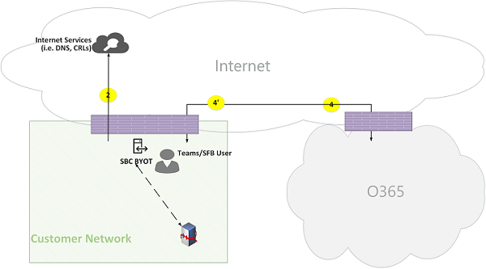](media/microsoft-teams-online-call-flows-figure18.png)

*Figure 18 - Internal user with Direct Routing (media relayed by Teams Transport Relay in Office 365)*

Note that:
 
- The SBC must have a public IP address that is routable from Office 365.

- Signaling and media from the SBC to Office 365 and vice versa use flow 4 and/or flow 4'.

- Signaling and media from the client within the customer network to Office 365 use flow 4.

**Remote user with Direct Routing (media is routed through a media server (MP) in Office 365)**

[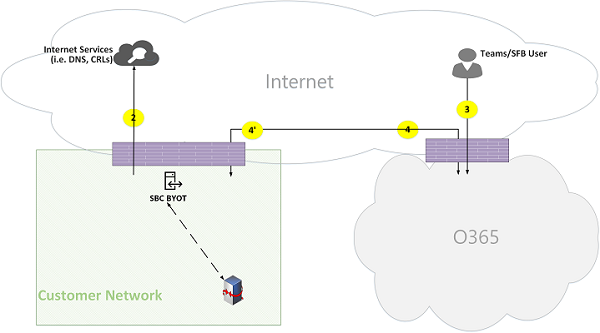](media/microsoft-teams-online-call-flows-figure19.png)

*Figure 19 - Remote user with Direct Routing (media is routed through a media server (MP) in Office 365)*
 
Note that:

- The SBC must have a public IP address that is routable from Office 365.

- Signaling and media from the SBC to Office 365 and vice versa use flow 4 and/or flow 4'.

- Signaling and media from the client on the Internet to Office 365 use flow 3.

**Internal user Direct Routing (media bypass)**

[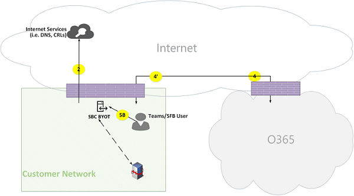](media/microsoft-teams-online-call-flows-figure20.png)

*Figure 20 - Internal user Direct Routing (media bypass)*
 
Note that:

- The SBC must have a public IP address that is routable from Office 365.

- Signaling from SBC to Office 365 and vice versa use flow 4 and/or flow 4'.

- Signaling from client within the customer network to Office 365 use flow 4.

- Media from client within the customer network to SBC within the customer network use flow 5B.

**Remote user with Direct Routing (media bypass relayed by Teams Transport Relay in Office 365)**

[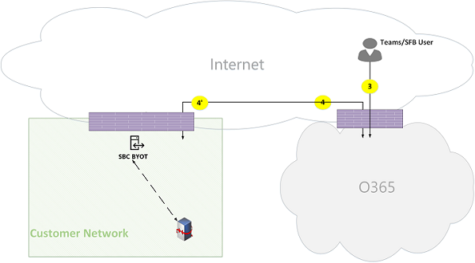](media/microsoft-teams-online-call-flows-figure21.png)

*Figure 21 - Remote user with Direct Routing (media bypass relayed by Teams Transport Relay in Office 365)*

Note that:

- The SBC must have a public IP address that is routable from Office 365 and Internet.

- Signaling from the SBC to Office 365 and vice versa uses flow 4 and/or flow 4'.

- Signaling from the client on the Internet to Office 365 uses flow 3.

- Media from the client on the Internet to the SBC within the customer network uses flows 3 and 4, relayed by Teams Transport Relay in Office 365. 

**Remote user Direct Routing (media bypass direct)**

[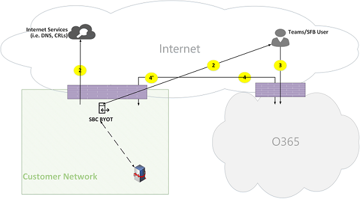](media/microsoft-teams-online-call-flows-figure22.png)

*Figure 22 - Remote user Direct Routing (media bypass direct)*
 
Note that:

- The SBC must have a public IP address that is routable from Office 365 and the Internet.

- Signaling from the SBC to Office 365 and vice versa uses flow 4 and/or flow 4'.

- Signaling from the client on the Internet to Office 365 uses flow 3.

- Media from the client on the Internet to the SBC within the customer network uses flow 2.

**Direct Routing (media bypass) – PSTN hairpin call (due to call forward/transfer)**

[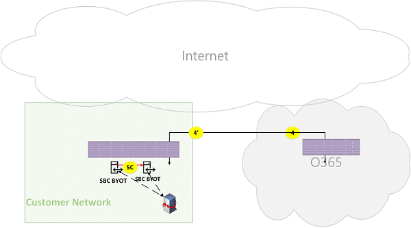](media/microsoft-teams-online-call-flows-figure23.png)

*Figure 23 - Direct Routing (media bypass) - PSTN hairpin call (due to call forward/transfer)*
 
Note that:

- THe SBC must have a public IP address that is routable from Office 365.

- Signaling from the SBC to Office 365 and vice versa uses flow 4 and/or flow 4'.

- The client is out of the signaling and media loop after the call is hairpinned from PSTN to PSTN.

- Media from SBC instance A within the customer network to SBC instance B within the customer network (where, A and B can be the same instance) uses flow 5C.

**Direct Routing (media through Office 365) – PSTN hairpin call across two tenants**

[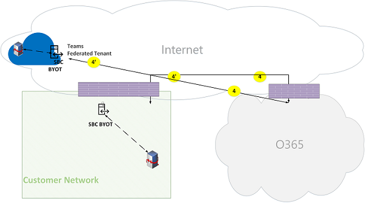](media/microsoft-teams-online-call-flows-figure24.png)

*Figure 24 - Direct Routing (media through Office 365) – PSTN hairpin call across two tenants*
 
Note that:

- The SBC must have a public IP address that is routable from Office 365.

- Signaling from the SBC to Office 365 and vice versa uses flow 4 and/or flow 4'.

- The client is out of the signaling and media loop after the call is hairpin from PSTN to PSTN.

- Media from SBC instance A within the customer network X to SBC instance B must be relayed through the Office 365 Media Server and can't use bypass mode.

## Teams with Express Route optimization

[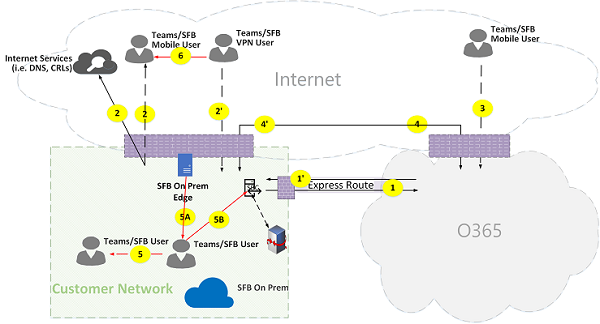](media/microsoft-teams-online-call-flows-figure25.png)

*Figure 25 - Teams with Express Route optimization*
 
In the case that Express Route is justified and deployed, then Teams flows could be re-routed from flow 4 to flow 1 and from flow 4' to flow 1'. However, Teams Application has a hard dependency on other Office 365 flows over the internet via flows 4 and 4'; hence these flows must not be blocked. 

Note that Skype for Business hybrid Edge traffic is routed to the Internet and not to Express Route to communicate with external users and federate with other tenants. 

To prevent asymmetrical flows, re-routing must be in both directions. In other words, an address within the customer network is routable either through Internet or Express Route, based on optimization, but not through both.

For example:

**Customer network to external user (media relayed by Teams Transport Relay):**

*Figure 26 - Customer network to external user (media relayed by Teams Transport Relay)*
 
**High Level Steps:**
1. Teams User within customer network resolves URL domain name (DNS) via flow2
2. Teams User within customer network allocates a media Relay port on Teams Transport Relay via flow 1
3. Teams User within customer network sends "invite" with ICE candidates via flow 1 to Office 365
4. OFFICE 365 sends notification to external Teams user via flow 3
5. Teams external user allocates a media Relay port on Teams Transport Relay via flow 3
6. Teams external user sends "answer" with ICE candidates via flow 3, which is forwarded back to Teams user A via Flow 1
7. Teams User A and Teams User B invoke ICE connectivity tests and selects flows 1 and 3, which are relayed by Teams Transport Relay in Office 365
8. Teams Users send telemetry to Office 365 via flows 1 and 3

>**Note**: Flow 4 must be enabled to support dependencies of Teams application on other micro-services that mandates flow 4.
