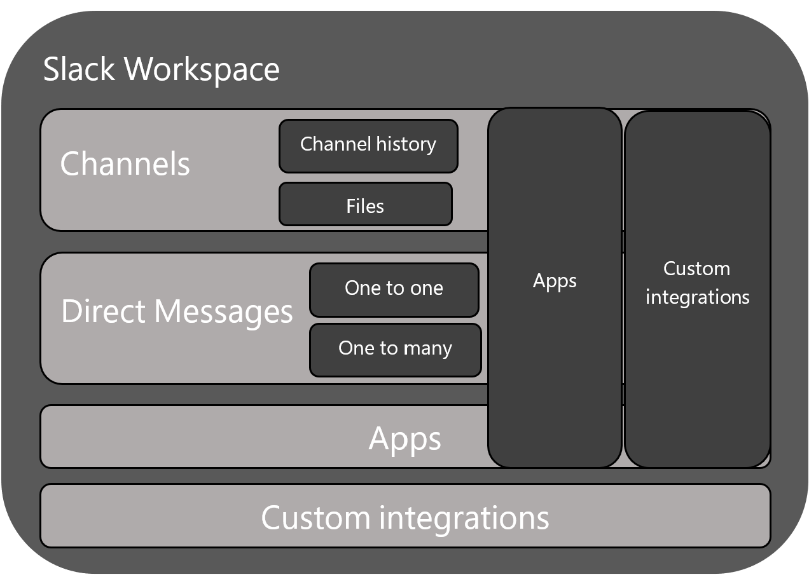
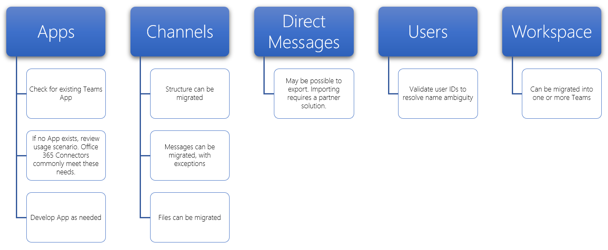

# Migrate from Slack to Microsoft Teams

This article walks you through the journey of moving to Microsoft Teams from Slack.

When planning your organization’s move to Teams from Slack, it's important to decide what you need to keep (if anything). We'll start off by describing what types of data can be migrated and then walk you through how to assess your needs, plan your move, and then make the move.

The diagram below shows the Slack architecture at a high level.



## Plan your migration from Slack
### What you can and can’t migrate
Your Slack service plan will determine what you can and can’t migrate. For example, some Slack service plans only let you export public channels history and files, other require a DocuSign request to include Private Channels and Direct Messages. 

To determine your Slack Workspace service level, log into Slack and note your plan type on the **About this Workspace** page.

To learn more about Slack export options, go to the Slack website: https://get.slack.help/hc/articles/204897248-Guide-to-Slack-import-and-export-tools 

The diagram below gives you a high-level look at the Slack migration landscape that we’ll cover in this article. 



When you're done with this section, you should understand:
- The service level of your Slack Workspaces
- What can and can't be exported
- Common approaches to exporting

### Assess your Slack workspaces
Before you can plan your organization’s migration plan, you need to pull together some information about your Slack workspaces. Understanding how your Slack workspaces are being used helps you determine the scope of your migration. For example, how many workspaces are being moved? Are they used by a specific department, many, or in use by an entire organization?

If you’re a member of the Slack Workspaces you want to migrate, you can analyze the usage yourself by going to *\<your Slack workspace\>.slack.com/stats*. Review the Channels and Members tabs to look for usage patterns. Decide which workspaces you want to migrate (and which ones you want to leave behind). 

> [!NOTE]
> If you don’t have access to the stats page, you’re not an admin or owner. 

### Export Channels

In Slack, users join a channel which is part of a Slack Workspace, whereas in Teams users join a team which is a collection of channels. We recommend that you use Slack analytics to see how much activity happens in each channel to help you decide which channels to move. You’ll use the resulting list to figure out how to group your Slack channels into teams in Teams as well as who should be members of each team.

If you have a paid Slack service plan (anything other than Free), you can use Slack’s analytics (\<your Slack workspace\>.slack.com/admin/stats#channels) to see how active a channel is, when it was last used, and how many people are members. This can help you decide whether to migrate the channel. 
By default, public channels content (messages and files) can be exported. Depending on your Slack service plan and whether you’ve requested Private Channels and Direct Messages from Slack, those can be exported.

To learn more about Slack export options, go to the Slack website: https://get.slack.help/hc/articles/204897248-Guide-to-Slack-import-and-export-tools 

> [!IMPORTANT]
> Check your organization’s privacy and compliance requirements around channel data. Your organization may have compliance requirements around the handling, storage, and processing of this data, in addition to complying with the lifecycle of end-user identifiable content (EUII).

### Export Direct Messages
Direct Messages are the same as chats in Teams, which are 1:1 or 1-to-many non-channel conversations. Export-ability depends on your Slack service plan and if you’ve requested Direct Messages to be included in your Slack Export. Teams doesn’t support importing Direct messages currently. Consult a Microsoft partner to learn about third-party solutions you can explore that bring Direct Messages content into Teams.

For exporting Direct Messages, check out tools, such as Export, in the Slack App Store.

### Apps and custom integrations

Apps in Slack are like apps in Teams. Once you have a list of apps and their configurations in the Workspace, you can search in the Teams App store to see if they’re available for Teams*. 

Go to \<your Slack workspace\>.slack.com/apps/manage to get a list of Apps and Custom Integrations. This page also shows you the number of configurations where each app is in use. 
Custom Integrations vary in their “migrate-ability.” If it’s a Web Hook, you can usually send it to a Microsoft 365 or Office 365 Connector to shift the workflow into Teams. Assess bots and other apps on a case-by-case basis to plan for moving them to Teams.

\* If your administrator has restricted apps usage, you may not be looking at the full list of available apps.

### Users
The identity schemes you used in Slack might not map directly to Microsoft 365 or Office 365. For example, the email addresses of your Slack users may not map to Microsoft 365 or Office 365 work or school accounts. You should create a user-ID map before you start planning your Teams rollout.

If you’re on a paid Slack service plan, you can go to *\<your Slack workspace\>.slack.com/admin/stats#members* to get member details such as email address and account type for each user (for example, single vs. multi-channel guest).

Here’s a script you can use to compare email addresses from a Slack export against Azure AD to help solve for name ambiguity. It’ll also report if the user is enabled for Teams. If you need help with PowerShell, read [Get started with Azure PowerShell](/powershell/azure/get-started-azureps).

```azurepowershell
Connect-AzureAD
Function Get-TimeStamp {
    return "[{0:MM/dd/yy} {0:HH:mm:ss}]" -f (Get-Date)
}

class User {
    [ValidateNotNullOrEmpty()] $ID
    [ValidateNotNullOrEmpty()] $FullName
    [string] $Email
    [string] $UPN
    [ValidateNotNullOrEmpty()][bool] $ExistsAzureAD
    [ValidateNotNullOrEmpty()][bool] $TeamsEnabled
}

$output = New-Object -type System.Collections.ObjectModel.Collection["User"]

$users = Get-Content -Raw -Path .\slackHistory\users.json | ConvertFrom-Json

Write-Host -ForegroundColor Green "$(Get-Timestamp) User Count: " $users.Count

$i=1
Write-Host "$(Get-Timestamp) Attempting direct email match.. `n"
foreach ($slackUser in $users) {
    $user = New-Object User
    $user.id = $slackUser.id
    $user.FullName = $slackUser.name
    try {
        if ($null -ne $slackUser.profile.email) {
            $user.email = $slackUser.profile.email
            $emailSplit = $slackUser.profile.email.Split('@')
            $mailNickName = $emailSplit[0]
            $result = Get-AzureADUser -Filter "MailNickName eq '$($mailNickName)' or UserPrincipalName eq '$($slackUser.profile.email)' or proxyAddresses/any(c:c eq 'smtp:$($slackUser.profile.email)')"
            if ($null -ne $result) {
                $user.ExistsAzureAD = $true
                $user.UPN = $result.UserPrincipalName
                $assignedPlans = $result.assignedPlans
                foreach ($plan in $assignedPlans) {
                    if ($plan.ServicePlanId -eq "57ff2da0-773e-42df-b2af-ffb7a2317929") {
                        if ($plan.CapabilityStatus -eq "Enabled") {
                            $user.TeamsEnabled = $true
                        }
                        else {
                            $user.TeamsEnabled = $false
                        }
                    }
                }
                Write-Host -ForegroundColor Green "$(Get-Timestamp) Current User $($i) - AzureAD object found:" $result.MailNickName
                Write-Host -ForegroundColor Green "$(Get-Timestamp) Current User $($i) - Teams Enabled:" $user.TeamsEnabled
            }
            else {
                $user.ExistsAzureAD = $false
                Write-Host -ForegroundColor Yellow "$(Get-Timestamp) Current User $($i) - AzureAD object not found: " $slackUser.profile.email
            }
        }
        $i++
    }   
    catch
    {
        $user.ExistsAzureAD = $false
        Write-Host -ForegroundColor Yellow "$(Get-Timestamp) Current User $($i) - AzureAD object not found: $($i)" $user.profile.email
        $i++
    }
    $output.Add($user)
}

$output | Export-Csv -Path .\SlackToAzureADIdentityMapping.csv -NoTypeInformation
Write-Host "`n $(Get-Timestamp) Generated SlackToAzureADIdentityMapping.csv. Exiting..."
```

When you’re done with this section, you should have:
- A list of Channels per Workspace with usage statistics.
- A list of Slack Apps with configurations per channel.
- Determined what type of Slack message history you want to export (if any).
- A list of users whose Slack accounts map to Microsoft work or school accounts and which Teams license they have.

## Plan your Teams deployment
You’ve exported what you need from Slack (and left behind anything you don’t need). Now it’s time to plan how you’ll roll out Teams and import your Slack data. This is a great opportunity to assess what's worked well for the team based on usage and include those elements in your Teams deployment plan. At the end of this section, you’ll have a blueprint for your Teams users, channels, and apps. 

The diagram below gives you a high-level outline of the things you’ll address in your Teams deployment.

:::image type="content" source="media/migrate-slack-to-teams-image3.png" alt-text="High-level outline of planning a Teams deployment from Slack.":::

### Team and channel structure

A Slack Workspace may represent a single team, multiple teams or an entire organization. It’s important to understand the scope of the Workspaces as you determine the structure. The closest relationship to a Teams team in Slack is the Workspace, which contains a collection of channels. The diagram below demonstrates 3 different Slack-to-Teams mappings, and guidance for picking the right one for each Workspace.


|Slack-to-Teams mapping | Description |
|---------|---------|
|1 Slack Workspace :arrow_right: 1 team   | For smaller Slack workspaces that need fewer than 200 channels<br>Include a buffer for growth and private channel planning  |
|1 Slack Workspace :arrow_right: multiple teams     | Use your Slack Workspace analytics data to create logical channel groupings, which become the basis of your teams        |
|2+ Slack Workspaces :arrow_right: multiple teams     | Use your Slack Workspace analytics data to create logical team and channel groupings, which become the basis of your teams        |

Third-party solutions have usage statistics to help you assess how active the channel is and how many posts there are. Typically, channels that are frequently used would be candidates to include in your team planning.

> [!TIP]
> Retain only what is required in your approach to determine which channels to recreate in Teams. To learn more, read [Overview of teams and channels](teams-channels-overview.md). 

#### Team Planning
Using the Channel inventory you compiled in the Planning section above, work with your Slack owners and admins to figure out which channels should become teams and which ones should become channels in a team. Use either Excel or Power BI to help with this analysis - both can provide additional insights to help drive these discussions on which channels to retain.

> [!TIP]
> Teams currently has a 200-channel limit per team. If your list of channels is getting close to that limit, you should figure out a way to split them into two separate teams.

### Channel History

There are both free solutions on GitHub and paid solutions you can use, depending on your organization’s requirements to retain Channel History of Public and Private channels. Additionally, this could be scripted into Teams.

Once you’ve set up your new team and channel structure in Teams, you can copy the exported files into the appropriate document libraries in your Teams channels.

To automate the importing of your content, there are several approaches you can consider. There are  free solutions on GitHub ([ChannelSurf](https://github.com/tamhinsf/ChannelSurf) or [Slack Export Viewer](https://github.com/hfaran/slack-export-viewer)) and partner solutions. Choose a solution based on your organization’s needs. 

### Channel Files

Most solutions will export files. However, they’re typically provided as links in the Channel History that require an API key to programmatically retrieve.

For files stored in Slack, once you’ve set up your teams and channels in Teams, you can programmatically copy them from Slack into the target Teams channel.

The following script retrieves files from Slack. It searches the specified Slack export on your computer, creates a folder in each target channel, and downloads all of the files to that location. Third-party solutions exist that can extract data. If you need help with PowerShell, read [Get started with Azure PowerShell](/powershell/azure/get-started-azureps).


```azurepowershell
$ExportPath = ".\slackHistory"
$ExportContents = Get-ChildItem -path $ExportPath -Recurse
Function Get-TimeStamp {
    return "[{0:MM/dd/yy} {0:HH:mm:ss}]" -f (Get-Date)
}

class File {
    [string] $Name
    [string] $Title
    [string] $Channel
    [string] $DownloadURL
    [string] $MimeType
    [double] $Size
    [string] $ParentPath
    [string] $Time
}

$channelList = Get-Content -Raw -Path .\slackHistory\channels.json | ConvertFrom-Json
$Files = New-Object -TypeName System.Collections.ObjectModel.Collection["File"]

Write-Host -ForegroundColor Green "$(Get-TimeStamp) Starting Step 1 (processing channel export for files) of 2. Total Channel Count: $($channelList.Count)"
#Iterate through each Channel listed in the Archive
foreach ($channel in $channelList) {
    #Iterate through Channel folders from the Export
    foreach ($folder in $ExportContents)
    {
        #If Channel Name matches..
        if ($channel.name -eq $folder){
            $channelJsons = Get-ChildItem -Path $folder.FullName -File
            Write-Host -ForegroundColor White "$(Get-TimeStamp) Info: Starting to process $($channelJsons.Count) days of content for #$($channel.name)."
            #Start processing the daily JSON for files
            foreach ($json in $channelJsons){
                $currentJson = Get-Content -Raw -Path $json.FullName | ConvertFrom-Json
                #Write-Host -ForegroundColor Yellow "$(Get-TimeStamp) Info: Processing $($json.Name) in #$($channel.name).."
                #Iterate through every action
                foreach ($entry in $currentJson){
                    #If the action contained file(s)..
                    if($null -ne $entry.files){
                        #Iterate through each file and add it to the List of Files to download
                        foreach ($item in $entry.Files) {
                        $file = New-Object -TypeName File
                            if ($null -ne $item.url_private_download){
                                $file.Name = $item.name
                                $file.Title = $item.Title
                                $file.Channel = $channel.name
                                $file.DownloadURL = $item.url_private_download
                                $file.MimeType = $item.mimetype
                                $file.Size = $item.size
                                $file.ParentPath = $folder.FullName
                                $file.Time = $item.created
                                $files.Add($file)
                            }
                        }
                    }
                }
            }
        }
    }
}
Write-Host -ForegroundColor Green "$(Get-TimeStamp) Step 1 of 2 complete. `n"

Write-Host -ForegroundColor Green "$(Get-TimeStamp) Starting step 2 (creating folders and downloading files) of 2."
#Determine which Files folders need to be created
$FoldersToMake = New-Object System.Collections.ObjectModel.Collection["string"]
foreach ($file in $files){
    if ($FoldersToMake -notcontains $file.Channel){
        $FoldersToMake.Add($file.Channel)
    }
}

#Create Folders
foreach ($folder in $FoldersToMake){
    #$fullFolderPath = $file.ParentPath + "\Files"
    $fullFolderPath = $ExportPath +"\$($folder)"
    $fullFilesPath = $ExportPath +"\$($folder)\Files"
    if (-not (Test-Path $fullFilesPath)){
        New-Item -Path $fullFolderPath  -Name "Files" -ItemType "directory"
    }
}

#Downloading Files
foreach ($file in $files)
{
    Write-Host -ForegroundColor Yellow "$(Get-TimeStamp) Downloading $($file.Name)."
    $fullFilePath = $file.ParentPath + "\Files\" + $file.Name
        if (-not (Test-Path $fullFilePath)){
            try{
                $request = (New-Object System.Net.WebClient).DownloadFile($file.DownloadURL, $fullFilePath)
            }
            catch [System.Net.WebException]{
                Write-Host -ForegroundColor Red "$(Get-TimeStamp) Error: Unable to download $($file.Name) to $($fullFilePath)"
            }   
        }
        else {
            try{
                $extensionPosition = $file.name.LastIndexOf('.')
                $splitFileName = $file.name.Substring(0,$extensionPosition)
                $splitFileExtention = $file.name.Substring($extensionPosition)
                $newFileName = $splitFileName + $file.Time + $splitFileExtention
                $fullFilePath = $file.ParentPath + "\Files\" + $newFileName
                $request = (New-Object System.Net.WebClient).DownloadFile($file.DownloadURL, $fullFilePath)
            }
            catch [System.Net.WebException]{
                Write-Host -ForegroundColor Red "$(Get-TimeStamp) Error: Unable to download $($file.Name) to $($fullFilePath)"
            }   
        }
}
Write-Host -ForegroundColor Green "$(Get-TimeStamp) Step 2 of 2 complete. `n"
Write-Host -ForegroundColor Green "$(Get-TimeStamp) Exiting.."
```


### Apps and Custom Integrations
Review your list of Slack apps and custom integrations (with configurations) and decide which ones you want to move to Teams. Check the Teams Marketplace to see if an app is available. If not, there are likely alternatives. 

To figure out which apps to add to Teams, it’s important to understand how the app is being used. By asking the question "what functionality is the app providing to this channel?", you'll learn about the outcome the app is delivering. 

In many cases, apps primarily receive event-driven data from an external service (for example, monitoring system) and push a message into Slack. You can achieve the same outcome by using a Microsoft 365 Connector that can push messages into Teams based on events.

Below are examples of Slack solutions where a Microsoft 365 Connector was used in Teams for integration.
- Ansible
  - Alerts can be sent to Teams via [Ansible webhook](https://docs.ansible.com/ansible-tower/latest/html/userguide/notifications.html#webhook)
- New Relic
  - Check out this user solution for [sending New Relic alerts to Teams](https://discuss.newrelic.com/t/new-relic-alerts-not-working-with-microsoft-teams/48609/3)
- Nagios
  - Alerts can be integrated today via Connectors. https://github.com/isaac-galvan/nagios-teams-notify
- ZenDesk
  - App exists in Teams Store
- Jenkins
  - Alerts can be sent to Teams using [Jenkins’s Office 365 Connector](https://plugins.jenkins.io/Office-365-Connector)


### User readiness and adoption plan
The cornerstone of any successful software deployment hinges on how prepared users are for the change. Users in your organization using Slack will easily understand Teams concepts, but training is still needed to help them make a smooth transition. For a comprehensive set of Teams adoption resources, go to the [Teams adoption hub](adopt-microsoft-teams-landing-page.md).

For example, both products feature channels, but they’re used differently in each product. For example, often a Channel in Slack is used like a chat in Teams for short-term, transactional conversations. Other notable differences are around threaded/non-threaded conversations and tuning notification settings.

Check out our rich library of [End-user Teams video training](https://support.office.com/article/microsoft-teams-video-training-4f108e54-240b-4351-8084-b1089f0d21d7). 

## Move to Teams 
Now that your transition plan is defined, you can begin creating your teams and channels in Teams. 

Once you’ve created your teams & channels, begin copying files from Slack channels into Teams and configuring your apps. If you’re using a solution to retain history, that can be configured now as well. Then you’re ready to start licensing users (if they aren’t licensed already) and adding them to the appropriate teams. To reduce the need for additional exports and file copies, consider removing Slack access at an agreed-upon date that coincides with each user’s addition to the team. This avoids needing to re-export and import delta changes on files and history.

Follow the steps in the diagram below to roll out Teams in your organization. For more information, check out [How to roll out Teams](./deploy-overview.md).


:::image type="content" source="media/migrate-slack-to-teams-image4.png" alt-text="Diagram listing the steps of moving to Teams from Slack.":::