# Navigate Microsoft Teams

Now that you have a clear understanding of your organization’s unique path and needs, it's time to get started on your journey to powerful collaboration with Microsoft Teams. Use the following section to learn how to navigate Kaizala’s capabilities complimented within Teams.

| From Kaizala | To Teams |
|---------|-----------------------|
| Getting started – sign in and profile setup| [Getting started with Teams](#getting-started) |
| Starting New chats, 1:1 Audio and video calls | [Chats in Teams, Audio, and video calls](#starting-new-chats-11-audio-and-video-calls) |
| Your Kaizala Groups| [Moving your Kaizala groups to Teams](#moving-your-kaizala-groups-to-microsoft-teams) |
| Mimic consumer app messaging experience| [Mimic consumer app messaging experience](#mimic-the-consumer-app-messaging-experience) |
| Out of Box Action cards |  [Getting work done in Teams](#getting-work-done-in-teams) |
| Polls, surveys, checklists| [Running polls, surveys, checklists in Teams](#polls-surveys-and-checklists-in-teams) |
| Meetings - Action Card| [Let’s Meet – Meetings in Teams](#getting-work-done-in-teams) |
| Announcements - Action Card| [Announcements in Teams](#announcements-in-teams) |
| Photo check-ins Action Card| [Photo check-ins in Teams](#photo-check-ins)
| Quiz - Action Card| [Quiz in Teams](#quiz-in-teams)
| Training - Action Card| [Training in Teams](#training-in-teams) |
| Your custom Actions cards | [Custom solutions in Teams](#moving-kaizala-custom-solutions-to-microsoft-teams) |
| Kaizala Management portal| [For IT pros](#it-professionals) |
| | [For end users](#end-user-guidance) |
| Kaizala Group Dissolution| [Kaizala Group Dissolution](#kaizala-group-dissolution) |
| Kaizala Tenant Data export| [Export Kaizala tenant data](#export-kaizala-tenant-data)  |
| Collaborating with External Users (vendors/suppliers/partners)| [Add or invite people outside your Teams org to a chat](#collaborating-with-external-usersvendorssupplierspartners) |

## Getting Started

Getting started on your move from Kaizala to Teams is easier than ever with our getting started guide. To learn more about starting your Microsoft Teams journey, see [Getting started with Teams](https://support.microsoft.com/office/start-and-pin-chats-a864b052-5e4b-4ccf-b046-2e26f40e21b5?wt.mc_id=otc_microsoft_teams&ui=en-us&rs=en-us&ad=us).

## Starting new chats, 1:1 audio and video calls

Create 1:1 or group chats to collaborate with a smaller group or to talk privately within Teams. You can pin chats and save messages for quick access. To begin chatting with our rich text formatting, emojis, and gifs, see [Chats in Teams](https://support.microsoft.com/office/start-and-pin-chats-a864b052-5e4b-4ccf-b046-2e26f40e21b5?wt.mc_id=otc_microsoft_teams&ui=en-us&rs=en-us&ad=us).

Communicate efficiently by starting 1:1 or group calls with anyone in your organization. With Teams,  you have the flexibility to make both audio and video calls.  To get started, see [Make calls](https://www.microsoft.com/videoplayer/embed/RE4rxv0?pid=ocpVideo0-innerdiv-oneplayer&postJsllMsg=true&maskLevel=20&market=en-us).

You can move from Kaizala groups to Microsoft Teams through the creation of Teams, channels, and group chats in Teams.

Teams is a collection of people, content, and tools surrounding different projects and outcomes within an organization.

Teams is made up of **channels**, which are the topic-specific conversations you have with your teammates. Each channel is dedicated to a specific topic, department, or project. Channels are most valuable when extended with applications. To learn more, see [work in channels](https://support.microsoft.com/office/teams-and-channels-df38ae23-8f85-46d3-b071-cb11b9de5499?ui=en-us&rs=en-us&ad=us#ID0EAABAAA=Work_in_channels).

**Group chats** allow you to gather your coworkers quick huddle over instant messaging.

### Conversations in Teams Chat vs Team Channel

|Conversations in Chat | Conversations in Team Channels |
|---------|---------|
|For lightweight conversations, where you’re directly messaging recipients.   | For interactions where multiple topics are discussed in an open space.  |
|Private chats are only visible to those in the chat     | Visible to everyone in the Team        |
|One continuous, unthreaded conversation     | Structured, multiple threaded conversations        |
|Up to 250 people     | Up to 25,000 people        |
|Choose if you want to share chat history with new chat participants     | History is shared with all new Team members        |
|New chat recipients must be added by those people already in chat     | Users can join a team by searching for it. In private Teams, Teams admin approves new members. Channel members can generate code to enable new members to join directly without admin approval.        |
|On the spot screen share, and audio and video calling. Easy scheduling of Teams meetings with all chat participants     | On the spot and scheduled audio and video calling        |
|Some extensibility with apps     | Full extensibility and customization with apps        |

For an overview on Teams, channels, and group chats, see [teams and channels in Microsoft Teams](teams-channels-overview.md).

## Moving your Kaizala groups to Microsoft Teams

In Kaizala, groups are a collection of people. There are three types of group structures within Kaizala - flat groups, hierarchy groups, and broadcast groups. As you transition to Microsoft Teams, you can use Teams, Channels, and group chats to create similar communication structures for your organization.

Use the guidance that follows for instructions on switching from Groups to Teams, Channels, and group chats.

There are two ways to move your Kaizala flat groups to Teams:

- Option 1: Switching from a Kaizala flat group to a group chat in Teams

- Option 2: Switch from a Kaizala flat group to a Teams team

**Option 1: Switch from a Kaizala flat group to a group chat in Teams**

You can create a Teams group chat to hold quick huddles and transient conversations with up to 250 participants. Group chats allow people in your organization to have a central place for open conversation where anyone can be added to chat.

1. Start and name a group chat.

    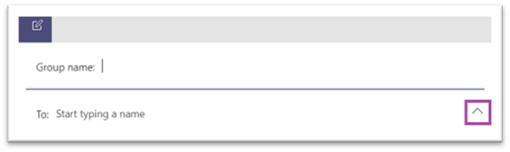

    Everyone who has access to the group chat can [send messages](https://support.microsoft.com/office/send-and-read-messages-in-teams-b29e60ec-76af-4d97-8c3c-a4e36f2b64aa?ui=en-us&rs=en-us&ad=us).

2. Add people to the conversation.

    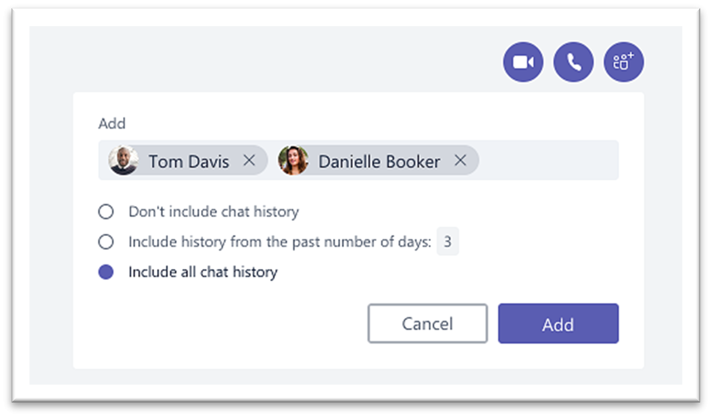
    
   When adding someone to a group chat (not a one-on-one), you can include the **chat history** and **duration of history** you want to share with them.

3. Manage group chat.
  
    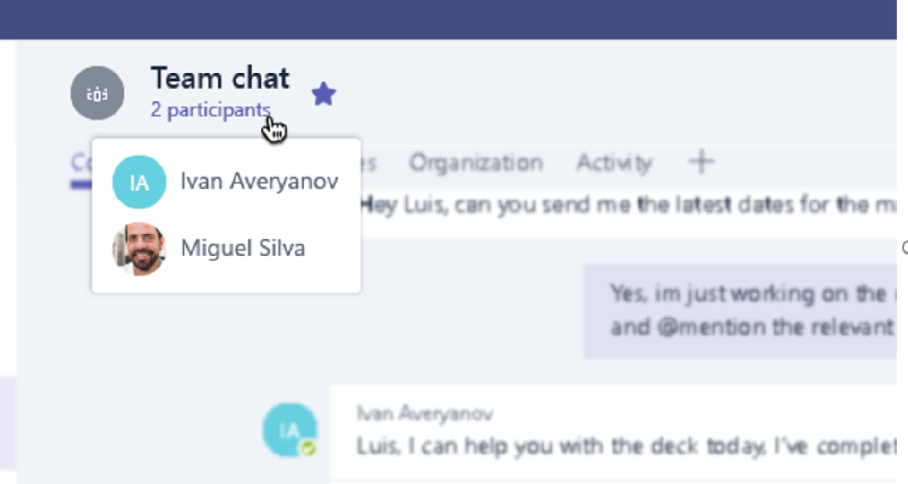
    
   To see who's in a group chat, hover over the number of participants in the chat header to show a list of everyone's names.

**Option 2: Switch from a Kaizala flat group to a Teams team**
   
For targeted large group communication, you can create a Team for a flat group. You can add up to 25,000 members to engage in structured communication with threaded conversations. This type of communication allows for moderation and administration roles to ensure that things are running smoothly.

1. Create a team:
   To get up and running in Teams, you should create a team, add people, and add channels. To learn more, see [your first teams](get-started-with-teams-create-your-first-teams-and-channels.md).
2. Review the guide for team owners:

As a [team owner](https://support.microsoft.com/office/go-to-guide-for-team-owners-92d238e6-0ae2-447e-af90-40b1052c4547?ui=en-us&rs=en-us&ad=us), you can add new members and guests, change members into owners, manage channels and settings, and archive a team that's no longer in use.

3. Add bulk members to a team:

    If you're a team owner, go to the team name in the teams list and select the **More options** button > then **Add member**.

    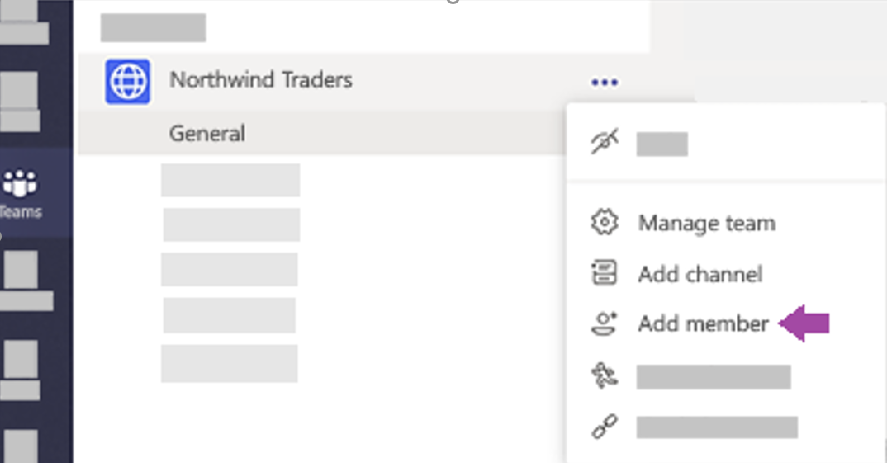

    You can start typing a distribution list, security group, or Microsoft 365 group to add to your team. To learn more, see [Add members to a team in Teams](https://support.microsoft.com/office/add-members-to-a-team-in-teams-aff2249d-b456-4bc3-81e7-52327b6b38e9?ui=en-us&rs=en-us&ad=us).

### Mimic the consumer app messaging experience

If you prefer a simplified experience for your users,  you can choose to configure your organization’s  Teams experience to mimic the consumer tools your users are already using.

We recommend starting the Teams journey for your Kaizala users with **Show favorite channels in Chat** enabled for simplified communications and Shifts (optional).

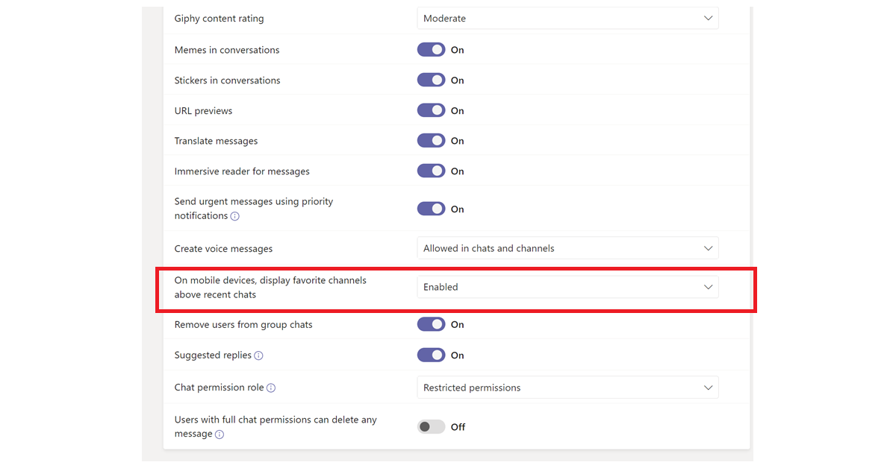

Here's an example of the Team's interface with **Shifts**:

Here's an example of Team's interface **without Shifts**:

 

> [!NOTE]
> You can remove access to the Teams button to create a simplified interface for Frontline workers with only highlighted channels showing up above chats. To learn more, see [Manage messaging policies in Teams](messaging-policies-in-teams.md).

### Use Teams and Channels to create a hierarchical group structure

In Kaizala, hierarchical groups allow your organization to interact in different group structures depending on the type of communication between members.  In Teams, you can create Teams and channels to match your org chart and set up hierarchy-based communication. You can use a hierarchical structure within Teams to alert members of needed actions, important news, and updates.

To learn more, see our [best practices for organizing teams in Microsoft Teams](best-practices-organizing.md).

### Use Teams and Channels to broadcast important news

In a Kaizala broadcast group, admins can send messages and actions to a targeted group. Similarly, you can post across multiple channels to broadcast a message in Teams. To direct attention to an important message, create Announcements posts.

Channel moderation allows you to control who can post and reply to messages. Channels can be chosen across the teams for the broadcaster to reach a larger audience. You can restrict interactions on announcements only permitting select admins and moderators with the ability to reply. Follow these steps to establish channel moderation within a Teams channel.

**Step 1**: Setup Channel Moderation.

- Select a channel for broadcasts

- Select **Channel settings** to set up moderation

- Navigate to "Who are the moderators?" to manually select moderators for your channel

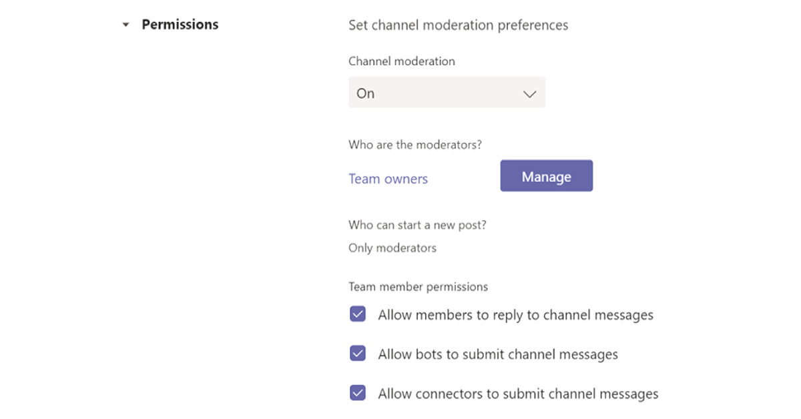

**Step 2**: Format your message.
  Create an announcement to notify team members of important news or actions.

   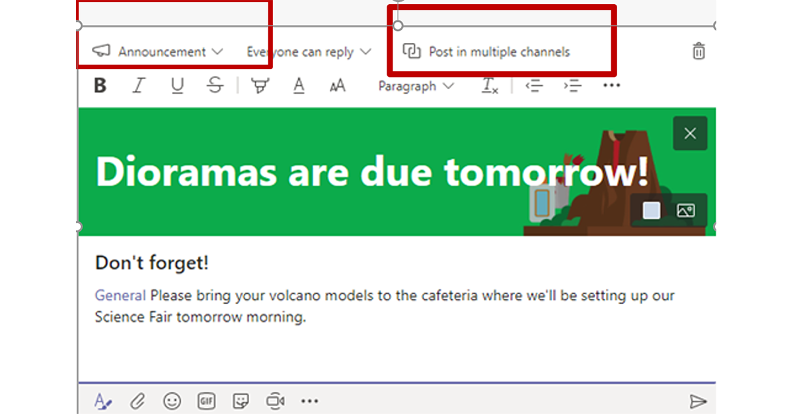

- In the channel, select Format  under the box where you type your message.

- At the top of box that appears, select the arrow next to New conversation > Announcement.

- Type a headline, change its background color, or add a background image for the headline area.

- Type the subject of your announcement in the Add a subhead area, then the body of your message, and select Send button.

    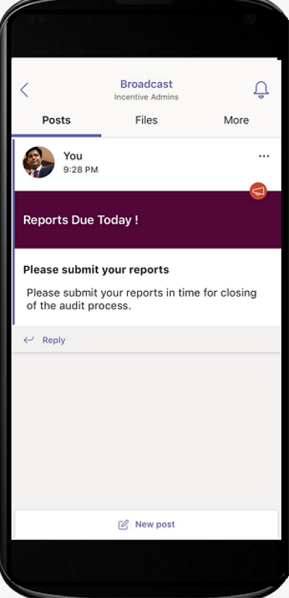

**Step 3**: Select channels for Message broadcast.

You can cross-post across multiple Teams and channels when you have important announcements and information that need to reach large groups of people.

  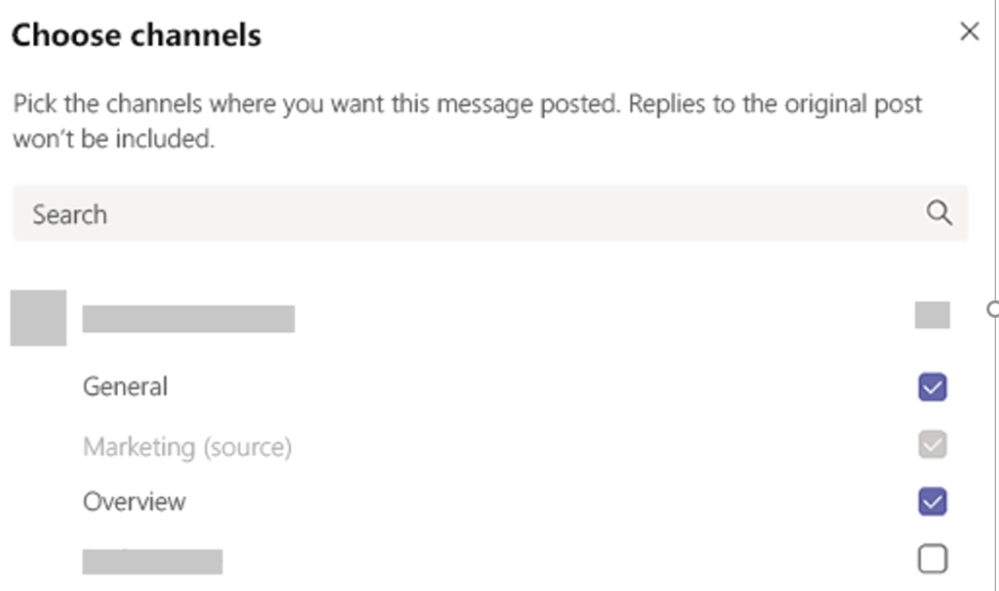

To learn more, see [Cross-post a channel conversation in Teams](https://support.microsoft.com/office/cross-post-a-channel-conversation-in-teams-9c1252a3-67ef-498e-a7c1-dd7147b3d295?ui=en-us&rs=en-us&ad=us).

## Getting work done in Teams

When it comes to getting work done, the right tools can enable efficiency. In Kaizala, you can use [Out-of-box (OOB) Action cards](/kaizala/partnerdocs/kaizalaactioncards) to make daily work management easier and efficient.
 Microsoft Teams provides several capabilities and solution for Out of Box Action cards in Kaizala.

The Teams platform allows you to use existing organization tools through integration into Microsoft Teams alongside ready-to-use Microsoft 365 applications and third-party apps. There are over 800 external applications available now in Microsoft Teams.

### Polls, surveys, and checklists in Teams

[Polls](https://github.com/OfficeDev/microsoft-teams-apps-poll/wiki), [surveys](https://github.com/OfficeDev/microsoft-teams-apps-survey), and [checklist](https://github.com/OfficeDev/microsoft-teams-app-checklist) action cards are now available as ready-to-install [Teams message extension](/microsoftteams/platform/messaging-extensions/what-are-messaging-extensions) app templates on GitHub​.

**Poll** enables users to quickly create and send polls in a chat or a channel to know their team’s opinion. Poll app is supported across all platforms – Teams desktop, browser, iOS, and Android clients. It’s ready for deployment as part of your existing Microsoft 365 subscription

**Survey** enables users to create a survey in a chat or a channel to ask a series of questions and get actionable insights. Use Survey for – Registrations, Enrollments, Feedback, Testimonials, Lead Capture, Reporting, Complaints, and Evaluations. Survey app is supported across all platforms – Teams desktop, browser, iOS, and Android clients. It’s ready for deployment as part of your existing Microsoft 365 subscription.

**Checklist** enables you to collaborate with your team by creating a shared checklist in a chat or channel. Checklist app is supported across all platforms – Teams desktop, browser, iOS, and Android clients. It’s ready for deployment as part of your existing Microsoft 365 subscription.

You can also send quick polls, surveys, and checklists to your team instantly with existing Microsoft 365 and third-party apps.

[Microsoft Forms](https://techcommunity.microsoft.com/t5/microsoft-forms-blog/microsoft-forms-works-great-with-microsoft-teams/ba-p/109915) allows you to collect information and get decisions fast. With Forms integrated into Teams, you can easily set up a Forms tab, create notifications for your form, and conduct a quick poll. To find out how, see [Create, edit, and review forms in Microsoft Teams](https://support.microsoft.com/office/work-with-colleagues-to-create-edit-and-review-forms-in-microsoft-teams-333b97a3-41d9-48bc-a1cb-84a96bd44e14#:~:text=1%20In%20Teams%2C%20go%20to%20the%20channel%20you,name%20for%20your%20new%20form.%20More%20items...%20).

Third-party apps like Polly and SurveyMonkey allow you to further conduct polls and surveys with your Teams.

- **Polly**  allows you to gain real-time poll insights to make better business decisions and measure team engagement across polls through comprehensive dashboard views.​

- **SurveyMonkey** brings surveys to where you’re already doing business in Microsoft Teams, making it easy to add surveys to your everyday workflow. Write and send a quick one-question poll from inside Microsoft Teams, then watch as results come in from your teammates.

### Jobs in Teams

Use **[Microsoft Planner](https://support.microsoft.com/office/organize-your-team-s-tasks-in-microsoft-planner-c931a8a8-0cbb-4410-b66e-ae13233135fb?ui=en-us&rs=en-us&ad=us)** to run jobs in Teams. You can collaborate on a project with a team, see progress reports, and track individual assignments.

While using Microsoft Teams, you can organize your tasks by adding one or more Planner tabs to a team channel. You can then work on your plan from within Teams or in Planner for web, remove or delete your plan, and get notified in Teams when a task is assigned to you in Planner.

### Announcements in Teams

Create and send messages intended for multiple teams or large number of employees over chat with the [company communicator](/microsoftteams/platform/samples/app-templates#company-communicator) app. Its easy interface allows designated users to create, preview, collaborate, and send messages in a targeted manner. Build custom targeted communication capabilities such as custom personal data on how many users acknowledged or interacted with a message with insights directly tied to management decisions.

### Photo Check-ins

Use the Teams Smart Camera to capture and share an annotated image with your Team. Easily share your location with precision to keep your team in the know. Need to have more info to communicate how the Kaizala features map to Teams. Definitely have as much info from the slide deck as we can into the doc.

[Use the Staff check-ins](/microsoftteams/platform/samples/app-templates#staff-check-ins) app template to enable front line Staff to easily provide time-critical information and status updates on either a scheduled or ad-hoc basis directly from Teams. The app supports real-time location, photos, notes, reminder notifications, and automated workflows.

### Quiz in Teams

Quiz is a custom [Teams messaging extension](/microsoftteams/platform/messaging-extensions/what-are-messaging-extensions)  that enables you to create a quiz within a chat or a channel for knowledge check and instantaneous results. You can use Quiz for, In-class and offline exams, Knowledge check within team, and for fun quizzes within a team. Quiz app is supported across multiple platforms, such as Teams desktop, browser, iOS, and Android clients. This app is ready for deployment as part of your existing Microsoft 365 subscription.

[Get it on GitHub](https://github.com/OfficeDev/microsoft-teams-apps-quiz)

  

### Training in Teams

[Use the Staff checkins](/microsoftteams/platform/samples/app-templates#staff-check-ins) app template to enable front line Staff to easily provide time-critical information and status updates on either a scheduled or ad-hoc basis directly from Teams. The app supports real-time location, photos, notes, reminder notifications, and automated workflows.

Use Teams to make training easy for your organization. Training is a custom [Teams messaging extension](/microsoftteams/platform/what-are-messaging-extensions) app that enables users to publish a training within a chat or a channel for offline knowledge sharing and upskilling. The app is supported across multiple Teams platform clients, such as desktop, browser, iOS, and Android. This app is ready for deployment as part of your Microsoft 365 subscription.

[Get it on GitHub](https://github.com/OfficeDev/microsoft-teams-apps-training)

You can simplify onboarding by offering access to contextual information.  Make employee guides, training, and more easily available and up to date to empower your organization through skilling. To learn more about training scenarios, see [Onboard new employees](https://support.microsoft.com/office/effectively-onboard-new-employees-691faccd-1d1a-4f47-99ac-b6c82973f5ee).

## Moving Kaizala Custom Solutions to Microsoft Teams

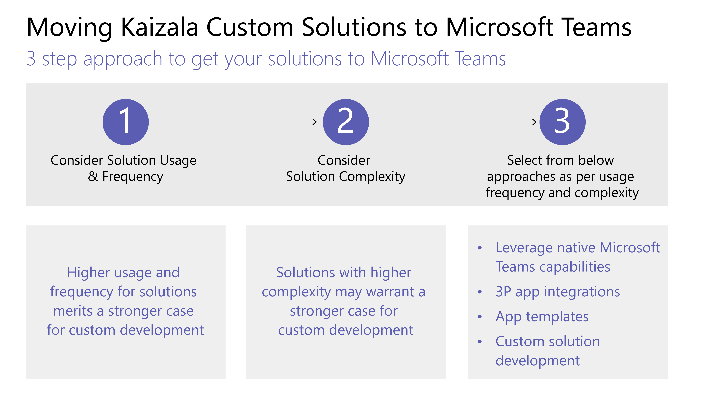

Follow this three-step approach to get your solutions to Microsoft Teams:

1. Consider solution usage and frequency.

    High usage and frequency for solutions merits a stronger case for custom development.

2. Consider solution complexity.

    Solutions with higher complexity may warrant a stronger case for custom development.

3. Explore the following approaches per usage frequency and complexity.

    - Leverage native Microsoft Teams capabilities

    - Use [third-party app integration and explore app store](deploy-apps-microsoft-teams-landing-page.md)

    - Discover [app templates](/microsoftteams/platform/samples/app-templates)

    - Build [custom apps using the Teams platform](/microsoftteams/platform/overview)

## Management in Microsoft Teams

### IT Professionals

Make the administrative transition from the Kaizala Management portal to the Microsoft Teams Admin Center. The Teams admin center is primarily for use of administrator roles only.

Administrators can manage the entire Teams workload, or they can have delegated permissions for troubleshooting call quality problems or managing your organization's telephony needs.

To navigate the admin center, visit [Microsoft Teams Admin Center](https://admin.teams.microsoft.com/).

You can monitor your organization’s security and compliance across Microsoft 365 with the [Microsoft Purview compliance portal](/microsoft-365/compliance/microsoft-365-compliance-center) and [Microsoft Security Center](/microsoft-365/security/defender/overview-security-center).

Protect your business and empower your users in the [Azure Active Directory admin center](https://aad.portal.azure.com/#@microsoft.onmicrosoft.com/dashboard/private/c7736064-7b28-4f3d-b366-2740a8d48020) where you can review groups, identity, licenses, and access across Microsoft 365.

## Kaizala Management Portal to Teams Admin Center

### End User Guidance

Use the following table to navigate the corresponding capabilities in Microsoft Teams from the Kaizala Management portal.

| Kaizala Management Portal | Microsoft Teams App|
|---------|-----------------------|
| Create Groups (Connected to Organization) | **Create teams** through the Desktop or mobile app |
| Adding Users in Bulk | For adding users in bulk to team – consider creating a team through O365 groups, O365 DLs, or Security group |
| Directory | Search for anyone in your organization through the **Search Bar** in teams. The Search results will also return files, messages, and posts |
| Analytics (Action Cards) | **Polls**, **Surveys**, and **Checklists** have built in reports with downloadable data. Jobs can also be assigned with the help of Tasks app in Teams, available for users. For more scenarios, third-party apps like **Trello**, **Asana** can also be explored to be used within Teams. |
| Extensions – Connectors | Use the **Connectors** option from the menu (…) for any channel for which the connector is required. |
| [Analytics (Usage) Adoption report](teams-analytics-and-reports/view-analytics.md), [Usage report](teams-analytics-and-reports/teams-usage-report.md), [Activity Report](teams-analytics-and-reports/user-activity-report.md) | Team owners can access reports for their teams by navigating from the menu (…) to **manage team** > **analytics**. |

> [!NOTE]
> Teams end Users can use Teams on desktop or mobile to manage their individual teams and channels and will not need to access the Teams Admin center.

## Kaizala Group Dissolution

As you transition to Teams channels and chats, you may consider Kaizala group dissolution to ensure your organization has one central place for communication. Deleting a Kaizala group removes the group from the Chats list. If you’re the only admin in the group, you’ll need to assign the admin role to at least one person in the group before deleting.

### To move a Kaizala group to Teams

 1. Share the Teams teaser with Kaizala group members

 2. Set up Teams sites

 3. Add users to Teams

 4. Announce the switchover to all the Kaizala group members

 5. In settings, [switch Kaizala group](#to-switch-to-kaizala-group-to-read-only) to **Read Only**

 6. Share the reasons as to why Teams is a better option with Kaizala group members

 7. Share the guidelines, for example, from when Teams will be available and how to use Teams

 8. Launch engagement contests

 9. Setup Leadership participation

 10. Seek feedback from the members

 11. Follow the content calendar

 12. [Delete Kaizala group](#to-delete-a-group)

### To switch to Kaizala group to **Read Only**

1. Sign in to Kaizala management portal.

2. Select **Groups** tab on the left navigation panel, select the group that you want to set as **Read Only**.

    

3. From the drop-down list, select **Edit Policies**.
  
    

4. In **Group Policy** window, uncheck the following options:

     - Allow new participants to see chat history. Messages sent from now on will be visible to them.

     - Allow members to send messages and attachments.

       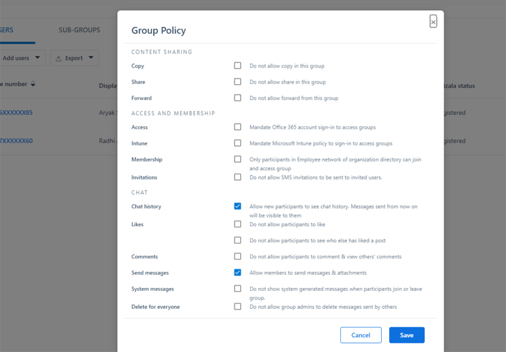

     > [!NOTE]
     > Admins can still post in the group.

### To delete a group

1. From the Chats list, press and hold the group conversation.

2. Tap Delete group.

## Export Kaizala tenant data

As a Kaizala tenant admin/global admin, you can export Kaizala tenant data from the Kaizala management portal. While using Teams, you can still maintain control of your corporate data in Kaizala. For more information, see [Export tenant data from the management portal](/office365/kaizala/export-or-delete-your-data).

### To export data

 1. Select **Analytics** tab on the left navigation panel, choose **Export Tenant Data**.
  
    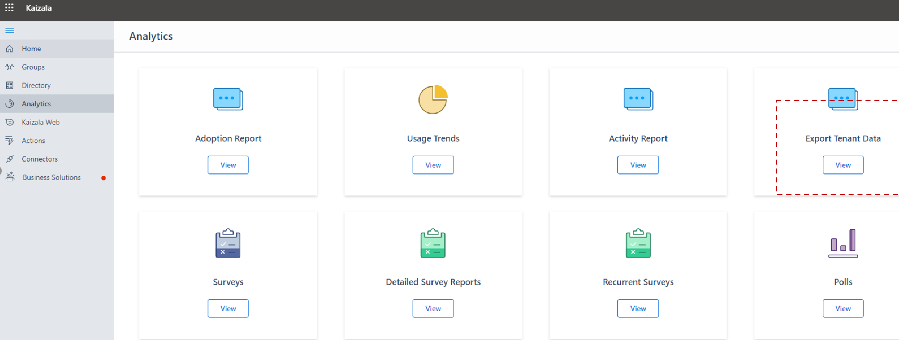

 2. Select **Export**.

    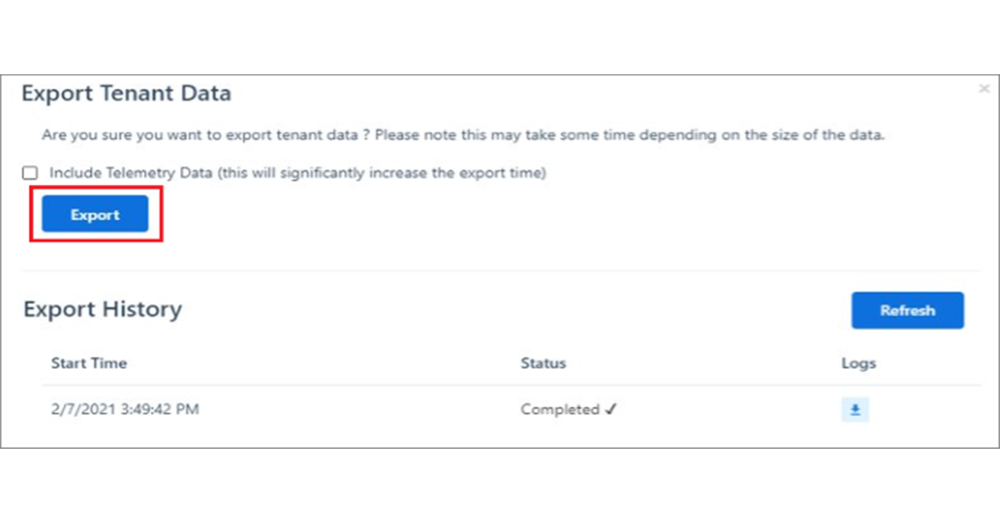

 3. Use Tenant Messages file – with filters on Group name/timestamp to access group level chat data.

    

## Deleting a Kaizala Group

Deleting a Kaizala group removes the group from the Chats list. If you’re the only admin in the group, you’ll need to assign the admin role to at least one person in the group before deleting.

To delete a group:

- From the Chats list, press and hold the group conversation.

- Tap Delete group.

## Kaizala Tenant Data export

While using Teams, you can still maintain control of your corporate data in Kaizala. For more information, see [Export tenant data from the management portal](/office365/kaizala/export-or-delete-your-data).

## Collaborating with External Users(Vendors/suppliers/Partners)

Microsoft Teams offers secure solutions to collaborate with external parties, and with Microsoft Teams Connect we are making it even easier to work with anyone outside your organization. Teams empowers commercial users to chat with external commercial users, that is, commercial users in other organizations. Building on this privilege, we are enabling you to chat with team members outside your organization, even if they are using a Teams personal account. These accounts are frequently used by SMB and therefore this new capability helps you strengthen the relationship with external partners.

As announced earlier at [Ignite](https://techcommunity.microsoft.com/t5/microsoft-teams-blog/microsoft-ignite-fall-2021-innovations-coming-to-microsoft-teams/ba-p/2824127), you can invite any Teams user to chat by entering the full email address or phone number you want to reach, and start a one-to-one or group chat with anyone with a Microsoft personal account, with no tenant switching required.

Chatting with external users without needing to switch tenants enables you to get the results that you need faster. Let’s take a closer look into how it works.

Depending on the administrative settings of your organization and of the Teams personal account user, you can start conversations with external Teams personal account users, and external Teams personal account users can start conversations with Teams at work users.

Teams users managed by an organization can invite Teams personal account users they want to chat with by entering their full email address or phone number. Teams personal users can enter the exact organizational email address of the user they want to reach and attempt to start a chat.

If the persons you want to chat with are not Teams users already, they will receive an email or a text message inviting them to join the conversation using a personal account. When they register and sign-in to their Teams personal account, they’ll be able to join the chat.

Once the persons you invited have accepted the invitation, you can start a new one-to-one or group chat or even add them to an existing external group chat. This chat thread will appear alongside your other chats, with no tenant switching required to view the chat.

As a part of your chat, you can express yourself by sending and receiving rich messages, GIFs, and media.

You can choose to remain only in the conversations you want to be in. You can block messages from external users or leave a group chat.

Teams users managed by an organization and Teams personal account users have the option to decline an external invitation. One can message an external user up to 10 times before they accept, but if there is no acceptance after 10 messages, you won’t be able to send additional messages to this user.

View the [support page](https://support.microsoft.com/en-us/office/add-or-invite-people-outside-your-teams-org-to-a-chat-6897ab47-9f60-4db6-8b95-18599714fe57) and read the [blog](https://techcommunity.microsoft.com/t5/microsoft-teams-blog/microsoft-teams-users-can-now-chat-with-any-teams-user-outside/ba-p/3070832) to learn more about how Teams enables you to seamlessly collaborate with external customers and partners within the safety and security of your trusted Teams workspace.

## Next Steps

[Microsoft Teams for Frontline workers](/MicrosoftTeams/drive-adoption-optimize-kaizala)
