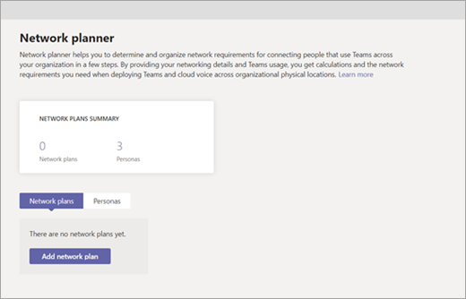

# Use the Network Planner for Microsoft Teams

Welcome to the Network Planner. In just a few steps, the Network Planner can help you determine and organize network requirements for connecting Microsoft Teams users across your organization. When you provide your network details and Teams usage, the Network Planner calculates your network requirements for deploying Teams and cloud voice across your organization’s physical locations.

Network Planner allows you to:

- Create representations of your organization using sites and Microsoft recommended personas (office workers, remote workers, and Teams room system).

    > [!NOTE]
    > The recommended personas were developed based on data from Teams best use scenarios and typical usage patterns. However, you can create up to three custom personas in addition to the three recommended personas.

- Generate reports and calculate bandwidth requirements for Teams usage.

## Create a custom persona

Follow these steps to create a custom persona:

1. Go to the Network Planner in the Microsoft Teams admin center.

2. On the **Personas** tab, click **+ Custom persona**. 

3. In the **New custom persona** pane, add a name and description for the new persona.

4. Select the permissions that this persona will use within the organization.

5. Click **Save**.

## Build your plan

Follow these steps to begin building your network plan:

1. Go to the Network Planner in the Microsoft Teams admin center.

2. On the **Network Plan** tab, click **Add a network plan**.

3. Enter a name and description for your network plan. The network plan will appear in the list of available plans.

4. Click the plan name to select the new plan.

5. Add sites to create a representation of your organization’s network setup.

    Depending on your organization’s network, you may want to use sites to represent a building, an office location, or something else. Sites might be connected by a WAN to allow sharing of internet and/or PSTN connections. For best results, create sites with local connections before you create sites that remotely connect to the internet or PSTN.

    To create a site:

    1. Add a name and description for your site.

    2. Under **Network settings**, add the number of network users at that site (required).

    3. Add network details: WAN-enabled, WAN capacity, internet egress (**Local** or **Remote**), and PSTN egress (none, local, or remote).

      > [!NOTE]
      > You must add WAN and internet capacity numbers to see specific bandwidth recommendations when you generate a report.

    4. Click **Save**.

## Create a report

After you add all sites, you can create a report, as follows.

1. On the **Reports** tab, click **Start a report**.

2. For each site you create, distribute the number of users across the available personas. If you use the Microsoft recommended personas, the number will be distributed automatically (80% office worker and 20% remote worker).

3. After you complete the distribution, click **Generate report**.

    The generated report will show the bandwidth requirements in several different views so that you can clearly understand the output:
    - A table with individual calculations will display bandwidth requirements for each permitted activity.
    - An additional view will show the overall bandwidth needs with recommendations.

4. Click **Save**. Your report will be available on the reports list for later viewing.
