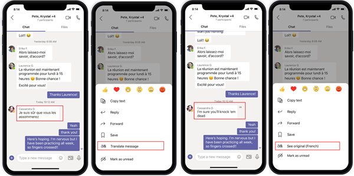

# Mobile on-demand translation for Android

Now users can read and send messages in their preferred languages from Android devices. The goal of the translation is to improve the users' Microsoft Teams experience and improve their communication efforts.

## How on-demand translation works

The user receives a message in the default language, English.
The user selects the message and opens the **Translate** menu.
The user selects the desired language.
The user then submits **Translate**.
The translated message appears below the original English message.

The following screenshot shows the sequencing of the translation.

## Set the on-demand translation option

The admin sets the on-demand translation option by setting a message policy. By default, the option is on.

## Current supported languages

Related resource
[Turn on inline message translation](inline-message-translation-teams.md)