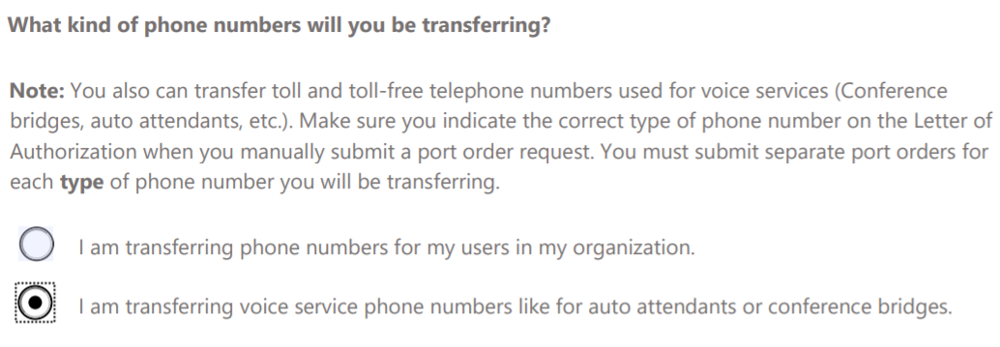

Define and document your Phone System with Calling Plans in Teams test plan for enterprises 
============================================================================================

After you’ve defined and documented your Phone System with Calling Plans in
Teams business success and technical implementation plans as part of the
Envision phase, the next step is validating that your organization’s
expectations and requirements are met through feature, functionality, and
usability. You should perform this validation step before you deploy a pilot or
final deployment in your production environment.

You can leverage the business success plan you defined during the Envision phase
to serve as the basis for determining the activities, expectations,
feature/functionality test cases, and overall scope to be evaluated during the
testing phase.

Identify testing support stakeholders
-------------------------------------

As you prepare to evaluate Phone System with Calling Plans features, create a
testing support stakeholder matrix to identify roles required to support the
testing phase.

> [!TIP]
> As you populate the Teams testing support stakeholder matrix, you might see
> that some roles are the same as those identified during the Envision phase,
> but with role descriptions slanted toward testing. You might need to
> identify additional roles, depending on the unique requirements of your
> testing scenarios.

#### Teams Testing Support Stakeholder Matrix

> [!TIP]
> 
> Below is an example of a testing support stakeholder template that you can
> use to document which stakeholders you require to support the testing phase.

| Role                          | Role description                                                                                                                                                                          | Assigned resource, contact information, and location |
|-------------------------------|-------------------------------------------------------------------------------------------------------------------------------------------------------------------------------------------|------------------------------------------------------|
| Testing Executive Sponsor(s)  | <ul><li>Ensure Teams features meet business needs; the executive sponsors are fluent in key business outcomes and prioritized use case scenarios.</li><li>Serve as ultimate authority, and assume accountability, for Teams feature testing objectives.</li><li>Help resolve issues escalated by the Testing Lead.</li><li>Sponsor communication within the company about testing goals.</li><li>Be responsible for making key strategic decisions.</li><li>Be responsible for ensuring the availability of required resources and budget for supporting testing efforts.</li><li>Drive awareness and buy-in for the testing campaign with other key stakeholders.</li><li>Serve as the testing sponsor during the test evaluation phase.</li></ul>                                                 | TBD                                                  |
| Steering Committee members    | <ul><li>Maintain interest in and provide guidance for the overall direction of the Phone System with Calling Plans service deployment.<li>Assist in evangelizing strategic insight through driving buy-in across the organization.</li></ul>                                                                        | TBD                                                  |
| Project Lead                  |<ul><li> Manage and lead the project team.</li><li>Coordinate partners and working teams engaged in the project.</li><li>Be accountable for creating and managing project plans to meet quarterly key results.</li><li>Resolve cross-functional issues.</li><li>Provide regular updates to project sponsors.</li><li>Incorporate key user experience learnings identified in test results into the overall user adoption plan.</li><li>Lead monthly business and operational reviews, contribute to quarterly business reviews.</li></ul>                                                                                                                                                         | TBD                                                  |
| Collaboration Lead/Architect  | <ul><li>Be responsible for executing on the collaboration strategy defined by company executives.</li><li>Analyze and choose collaboration products for the company that meet business goals.</li><li>Be responsible for the design of the operations for collaboration products.</li><li>Define the operation and support models.</li><li>Contribute to monthly and quarterly business reviews.</li></ul>                                                                                                 | TBD                                                  |
| Project Manager               | <ul><li>Develop and maintain the project plan.</li><li>Manage project deliverables in line with the project plan and budget.</li><li>Record and manage project issues, including escalations.</li><li>Conduct weekly standup calls.</li><li>Liaise with, and provide updates to, project executive sponsors.</li><li>Work with internal change management and communication teams to update the change management approach and communication plans as needed.</li></ul>                                                                                                                                                   | TBD                                                  |
| Network Lead                  | <ul><li>Provide input on network design during the Discovery phase.</li><li>Participate in planning during Envision phase workshops.</li><li>Coordinate the work of the networking team during project execution.</li></ul>                                                                                                                               | TBD                                                  |
| Security Lead                 | <ul><li>Provide input on security design and processes during the Discovery phase.</li><li>Participate in planning during Envision phase workshops.</li><li>Coordinate the work of the security team during project execution.</li></ul>                                                                                                                | TBD                                                  |
| Telephony Lead                | <ul><li>Provide input on telephony design during the Discovery phase.</li><li>Participate in planning during Envision phase workshops.</li><li>Coordinate the work of the telephony team during project execution.</li></ul>                                                                                                                           | TBD                                                  |
| Desktop Lead                  | <ul><li>Provide input on clients and the update process during the Discovery phase.</li><li>Participate in planning during Envision phase workshops.</li><li>Coordinate the work of the desktop team during project execution.</li></ul>                                                                                                              | TBD                                                  |
| Business Unit Representatives | <ul><li>Contribute to user-based adoption guides and materials.</li><li>Contribute to, and review, business use cases.</li></ul>                                                                                                                                   | TBD                                                  |
| IT Admins                     | <ul><li>Assist with test planning and execution (this role is for IT pros).                                                                                                                       | TBD                                                  |
| Service Owner                 | <ul><li>Be responsible for the operation of the Phone System with Calling Plans service, all up.</li><li>Serve as owner of the Phone System with Calling Plans service.</li></ul>                                                                                                               | TBD                                                  |
| Test Lead/Manager             | <ul><li>Define the test plan, including activities, dependencies, environment, goals, strategy, resourcing (environmental and human), and the timeline required for supporting the testing phase.</li><li>Coordinate delivery and readiness for test plan dependencies.</li><li>Align with the right priority for defect resolution.</li><li>Serve as the escalation path for any testing issues that arise.</li><li>Communicate and report test plan status with internal teams and designated stakeholders.</li><li>Document and present final test results.</li></ul> | TBD                                                  |
| Phone System with Calling Plans Tester     | <ul><li>Review the test plan to understand testing requirements, goals, timeline, issue resolution, and test cases to be executed.</li><li>Review and develop test cases supporting Phone System with Calling Plans acceptance and functionality requirements.</li><li>Execute test cases, and document test results.</li><li>Document defects as they arise and escalate them to the Test Lead for prioritization and resolution.</li><li>Test regressions to close out defects after defect resolution has been confirmed.</li></ul>                                                                | TBD                                                  |
| Network Tester                | <ul><li>Review the test plan to understand testing requirements, goals, timeline, issue resolution, and test cases to be executed.</li><li>Review test cases supporting network readiness acceptance and performance requirements.</li><li>Execute testing related to network readiness, including network connectivity and performance validation, QoS validation, and split-tunnel configuration validation.</li><li>Complete bandwidth validation for sites in scope by using Network Planner through MyAdvisor.</li><li>Document network readiness testing results.</li><li>Document defects as they arise and escalate them to the Test Lead for prioritization and resolution.</li><li>Test regressions to close out defects after defect resolution has been confirmed.</li></ul>                                                                | TBD                                                  |
| Security Tester               | <ul><li>Review the test plan to understand testing requirements, goals, timeline, issue resolution, and test cases to be executed.</li><li>Review and develop test cases supporting security acceptance requirements.</li><li>Execute testing related to security acceptance for test cases.</li><li>Document security acceptance testing results.</li><li>Document defects as they arise and escalate them to the Test Lead for prioritization and resolution.</li><li>Test regressions to close out defects after defect resolution has been confirmed.</li></ul>                                                                | TBD                                                  |
| Telephony Tester              | <ul><li>Review the test plan to understand testing requirements, goals, timeline, issue resolution, and test cases to be executed.</li><li>Review test cases supporting service number porting acceptance and functionality requirements.</li><li>Execute testing related to service number porting, including service number port to Office 365.</li><li>Execute test cases, and document test case results.</li><li>Document defects as they arise and escalate them to the Test Lead for prioritization and resolution.</li><li>Test regressions to close out defects after defect resolution has been confirmed.</li></ul>                                                                | TBD                                                  |
| Phone System with Calling Plans Admin Test | <ul><li>Review the test plan to understand testing requirements, goals, timeline, issue resolution, and test cases to be executed.</li><li>Review and develop test cases supporting Phone System with Calling Plans administration acceptance and functionality requirements.</li> <li>Execute test cases, and document test case results.</li><li>Document defects as they arise and escalate them to the Test Lead for prioritization and resolution.</li><li>Test regressions to close out defects after defect resolution has been confirmed.</li></ul>                                                                | TBD                                                  |

<table>
<tr><td>  Decision points</td><td><ul><li>Decide which testing support and stakeholder roles you require for testing Phone System with Calling Plans features in your environment.</li><li>Decide which resources you’ll assign for the testing support and stakeholder roles you’ve identified.</li></ul></td></tr>
<tr><td> Next steps</td><td><ul><li>Document the testing support and stakeholder roles required in your Testing Support Stakeholder Matrix.</li><li>Document contact information and location details for each resource you list in the Testing Support Stakeholder Matrix.
</table>

Define Phone System with Calling Plans feature requirements 
------------------------------------------------------------

As part of defining Phone System with Calling Plans feature requirements for
users in scope, see [Phone System with Calling Plans](calling-plan-landing-page.md).
Next, evaluate the latest Teams public roadmap to determine:

-   Which Phone System with Calling Plans features you’ll deploy for users in
    scope.

-   Expected user Phone System with Calling Plans functionality requirements,
    given your current Skype for Business, Exchange, and SharePoint deployment
    landscape.

-   Whether you can confirm that Phone System with Calling Plans features
    described in the latest public roadmap meet your user, functionality, and
    scope requirements in the timeline of your deployment

> [!TIP]
> The latest Teams roadmap for identifying Phone System with Calling Plans
> features in scope for your deployment can be found at
> <https://aka.ms/O365Roadmap>.

Now that the Phone System with Calling Plans persona and features have been
defined, the next criteria for evaluation will be the interoperability
experience with Teams. For additional information about the interoperability
experience along with configuration options available, see [Microsoft Teams and
Skype for Business
interoperability](https://docs.microsoft.com/microsoftteams/teams-and-skypeforbusiness-coexistence-and-interoperability).

#### Phone System with Calling Plans feature definition

> [!TIP]
> Below is an example of a Phone System with Calling Plans definition template
> that you can use to document the Phone System with Calling Plans
> administration and user group features to be evaluated.

| Enterprise-grade   | Collaborative meetings    | Platform and devices   | IT pro  | Additional business group, site-specific  | Requirements met by latest Teams roadmap |
|-------------------------------------------|----------------------------|------------------|------------------------|-------------------|-------------------|
| <ul><li>Phone System calling features:<ul><li>Blind transfer</li><li>Call Blocking</li><li>Call Forwarding</li><li>Caller ID Masking</li><li>E911 Support</li><li>Extension Dialing</li><li>Call Hold</li><li>Multi-Call Handling</li><li>Simultaneous Ring</li><li>Azure Voicemail</li></ul></li><li>Calling plan support</li></ul> |<ul><li>Skype for Business -to-Teams calling</li></ul> |<ul><li> Windows, Mac Teams client meetings feature support</li><li>Browser Teams client meetings feature support for:<ul><li>Chrome</li><li>Microsoft Edge</li></ul></li><li>iOS and Android Teams client meetings feature support</li><li>TTY support</li></ul> | <ul><li>Call quality diagnostic portal</li><li>Tenant Dial Plan</li><li>Tenant Caller ID policies</li><li>Enable call quality analytics (CQD)</li></ul> | <ul><li>Validate Teams meeting features based on corporate laptop image</li><li>Specific language support</li><li>GPO settings applied for a given user scenario or specific site</li></ul> | Yes  |

#### Phone System with Calling Plans user functionality definition

> [!TIP]
> Below is an example of a user functionality template that you can use to
> document the user experience required based on the Phone System with
> Calling Plans features to be evaluated.

| Exchange experience                          | SharePoint experience                            | Teams interoperability policy experience |
|----------------------------------------------|--------------------------------------------------|------------------------------------------|
| <ul><li>Create teams (Office Group creation enabled)</li><li>Join teams</li><li>Create channels</li><li>Create and view meetings</li><li>Modify user profile picture</li><li>Add and configure connectors</li><li>Add and configure tabs</li><li>Add and configure bots</li></ul> | <ul><li>Store and share files within Teams conversations</li><li>Store and share and files within private chats (based on OneDrive)</li></ul> | <ul><li>ChatDefaultClient: Default</li><li>CallingDefaultClient: Default</li></ul>      |

<table>
<tr><td>  Decision points</td><td><ul><li> Decide which Phone System with Calling Plans category features you’ll deploy in your environment.</li><li>Identify your user Phone System with Calling Plans functionality requirements given your current Skype for Business, Exchange, and SharePoint deployment landscape.</li><li>Decide which Teams interoperability experience you’ll deploy.</li><li>Review the latest Teams public roadmap and decide whether current workload capabilities meet your deployment timeline.</li></ul></td></tr>
<tr><td> Next steps</td><td><ul><li>Document the Phone System with Calling Plans category features required to support your Phone System with Calling Plans deployment.</li><li>Document user Phone System with Calling Plans functionality and interoperability requirements given your current Skype for Business, Exchange, and SharePoint deployment landscape.</li><li>Document whether the latest Teams public roadmap representing Phone System with Calling Plans capabilities meets the business needs and timing requirements of your deployment.</li></ul></td></tr>
</table>

Define and document your Phone System with Calling Plans test plan
------------------------------------------------------------------

After you’ve defined the Phone System with Calling Plans features in scope, the
next step is to create the test plan. At a high level, the test plan encompasses
the overall testing strategy and methodology you’ll use to support the feature
validation in the testing process.

At a high level, the test plan should include:

-   **Testing scope:** Summarizes the focus areas (goals, scenarios, and
    objectives) to be evaluated as part of the testing phase

-   **Test cases:** The set of test cases to be validated for Phone System with
    Calling Plans features in scope

-   **Testing resources:** A matrix of resources required to support the testing
    effort from an environmental, technical, and personnel point of view

-   **Testing schedule (timeline):** Represents when testing will begin, how
    long it’s likely to last, and when you expect the testing phase to end

-   **Defect reporting and remediation:** Guidelines for how issues with testing
    should be reported, tracked, and triaged

-   **Defect triage and escalation:** Outline for how and when a defect
    escalation should be initiated

-   **Testing exit and suspension criteria:** Guidance outlining criteria for
    either achieving sign-off to exit the testing phase or pausing testing until
    prioritized defects are resolved

-   **Test deliverables:** Summary of which outcomes will be developed and
    delivered to support sign-off acceptance and exit of the testing process

> [!TIP]
>   A testing methodology might already exist in your organization, but the
>   guidance below reflects best practices that can be included or leveraged
>   separately for testing Teams features in your environment.

In the sections that follow you’ll find additional prescribed guidance that will
assist in specific decisions, and templates and topics for you to consider as
you complete your testing plan.

### Define and document testing scope

As you work to develop your test plan, you must define the testing scope up
front, highlighting the workload and list of features that you’re evaluating.

The scope for properly evaluating Phone System with Calling Plans features
typically includes:

-   Phone System with Calling Plans site readiness

-   Phone System with Calling Plans user experience

-   Phone System with Calling Plans administration

#### Phone System with Calling Plans testing scope

> [!TIP]
>   Below is an example of test scope template that you can use to document the
>   Phone System with Calling Plans administration and user group features to be
>   evaluated.

| Phone System with Calling Plans site readiness                                                                                                                                                                                    | Phone System with Calling Plans user experience                                                                                                                                                                                         | Phone System with Calling Plans administration experience                                                                           |
|-----------------------------------------------------------------------------------------------------------------------------------------------------------------------------------------------------------------------------------|-----------------------------------------------------------------------------------------------------------------------------------------------------------------------------------------------------------------------------------------|-------------------------------------------------------------------------------------------------------------------------------------|
| <ul><li>Network Planner bandwidth planning (via MyAdvisor)<li></li>Network connectivity and performance validation (via the Skype for Business network assessment tool)<li></li>Quality of service (QoS) validation<li></li>Remote access split-tunnel validation</li></ul>|<ul><li>PBX features<li></li>PSTN calling (domestic and international)<li></li> Placing and receiving PSTN calls<li></li>Azure Voicemail<li></li>E911<li></li>Tenant Dial Plan<li></li>Tenant Caller ID masking <li></li>Advanced call control features (for example, call forwarding, simultaneous ring)</li></ul> |<ul><li>Licensing assignment</li><li>Subscriber number porting to Office 365</li><li>Phone System with Calling Plans reporting</li><li>Call quality reporting (CQD)</li></ul> |

<table>
<tr><td>  Decision points</td><td><ul><li>Decide the Phone System with Calling Plans testing scope by identifying features to be evaluated by focus area.</li><li>Decide additional goals and objectives for evaluation.</li></ul></td></tr>
<tr><td> Next steps</td><td><ul><li>Document the Phone System with Calling Plans features to be evaluated by focus area.</li><li>Document additional goals and objectives for evaluation.</li></ul></td></tr>
</table>

### Define and document Phone System with Calling Plans test cases

After you’ve defined the Phone System with Calling Plans features, client
deployment, and side-by-side scenarios with Skype for Business (if applicable),
the next step is to formulate the test cases required to evaluate Phone System
with Calling Plans features in scope. At a high level, test cases typically are
grouped by focus area and include:

-   **Test case title:** Focus area of the feature the test is evaluating (for
    example, Phone System with Calling Plans)

-   **Test case description:** Summary outlining the goals of the test features
    being evaluated

-   **Test case instructions:** Steps to follow to properly execute the test
    case being performed

-   **Environment required (prerequisites):** Setup instructions required to
    properly execute the test

-   **Resource required:** Personnel resources required for proper evaluation
    and execution of the test

-   **Expected results:** The outcome you expect after the test is successfully
    completed

> [!NOTE]
>   Because the approach and level of detail required for test case creation
>   might vary within your organization, it’s a good idea to follow an approach
>   that allows for an adequate level of detail yet balances thoroughness with
>   practicality, to support overall testing manageability.

> [!TIP]
>   To assist with test-case creation as a starting point, see the list of phone
>   system user guidance available at [Teams Meetings and
>   calls](https://support.office.com/article/Meetings-and-calls-d92432d5-dd0f-4d17-8f69-06096b6b48a8).

#### Phone System with Calling Plans test case

> [!TIP]
>   Below is an example of test case template that you can use to document the
>   Phone System with Calling Plans administration and user group features to be
>   evaluated.

Phone System with Calling Plans Validation

| Test case ID | Test case title               | Test case description                                                  | Environment required for test case execution                                               | Steps required for test case execution                                                                                                                                                          | Testing resource required              |
|--------------|-------------------------------|------------------------------------------------------------------------|--------------------------------------------------------------------------------------------|-------------------------------------------------------------------------------------------------------------------------------------------------------------------------------------------------|----------------------------------------|
| 1            | Placing an outbound PSTN call | Verify that you can place an external voice call to a 10-digit number. |<ul><li>Teams client installed.</li><li>User enabled with the following Office 365 licenses assigned:<ul><li>Office Enterprise E5 with Phone System, Microsoft Teams, and Domestic and International Calling Plans</li><li>Office Enterprise E3 with Phone System, Microsoft Teams, and Domestic and International Calling Plans</li></ul></li></ul> | <ol><li>Sign in to the Teams client.</li><li>Select the dial pad and enter a 10-digit number to be dialed.</li><li>Verify that the number dial is properly normalized and the external PSTN call is established.</li></ol>    | Phone System with Calling Plans Tester |

> [!TIP]
>   For additional guidance in facilitating individual test case and overall
>   plan creation for evaluating Phone System with Calling Plans features in
>   your organization, review the [Phone System Test
>   Plan](https://myadvisor.fasttrack.microsoft.com/CloudVoice/Downloads?SelectedIDs=5_1_0_21)
>   provided by [MyAdvisor](https://myadvisor.fasttrack.microsoft.com/).

<table>
<tr><td>  Decision points</td><td><ul><li>Decide which Phone System with Calling Plans administration and user features will be evaluated.</li><li>Decide what test environment is required to support test case execution.</li><li>Decide the steps required for test case evaluation.</li><li>Decide the resources required for proper execution of the test.</li></ul></td></tr>
<tr><td> Next steps</td><td><ul><li>Document the test cases to be evaluated, based on the test case template provided.</li><li>Include the completed template as part of your overall test plan.</li></ul></td></tr>
</table>

### Define and document testing resources

To support the testing phase, it’s important that you develop a resource plan
detailing the people, support, and technology resources that you’ll require. An
important component of the overall test plan, the resource plan helps you
determine any dependencies that might exist and gives you a high-level sense of
the resource support you might need.

At a high level, these resources typically consist of:

-   **People**: Stakeholders

-   **Technology**: Tenant, licensing, devices

-   **Support**: Training (cards, videos), administration support with defined
    escalation path

#### Testing resource requirements

> [!TIP]
>   Below is an example of testing resource requirement template that you can
>   use to document the different types of resources required to support your
>   testing phase.

| Resource type | Resources required                                           | Resource description |
|---------------|--------------------------------------------------------------|----------------------|
| People        | Stakeholders Test Lead Testers                               | TBD                  |
| Technology    | Access to Office 365 with the following services enabled:<ul><li>Office 365 E5 Licensing Assigned</li><li>Domestic and International Calling Plan Assigned</li></ul>    | TBD                  |
| Support       | Test administrator Test support lead Test support technician | TBD                  |

<table>
<tr><td>  Decision points</td><td><ul><li>Decide the resource types (people, technology, and support) that you’ll need to support the testing phase.</li><li>Decide the specific resources required for the resource types you identified.</li><li>Decide whether you should provide further detail to describe the types of resources that you need.</li></ul></td></tr>
<tr><td> Next steps</td><td><ul><li>Document the resource types (people, technology, and support) that you’ll need to support the testing phase.</li><li>Document the specific resources required for the resource types you identified.</li><li>If you decide it’s necessary, document any further detail about the types of resources you need to support the testing phase.</li></ul></td></tr>
</table>

### Define and document a testing timeline

As part of the test plan definition, create a timeline that outlines the
schedule for when you expect to complete testing activities and achieve
high-level milestones.

At a high level, this typically consists of:

-   **Task:** High-level activity to be completed

-   **Milestone:** High-level goal, or progress that was completed

-   **Resource required:** Testing resources required to support delivery of the
    milestone or task identified

-   **Start date:** The date the activity, milestone, or task was initiated on

-   **Completion date:** The date you expect the activity, milestone, or task to
    be completed by

-   **Owner:** Assigned resource who’s responsible for ensuring that the
    activity, milestone, or task is completed on time, in accordance with the
    completion date

-   **Estimation:** Number of hours that the assigned resources anticipate it
    will take to ensure that the activity, milestone, or task is completed on
    time

#### Testing scheduling and timeline requirements

> [!TIP]
>   Below is an example of a testing timeline requirement template that you can
>   use to document the anticipated dates for when specific testing activities
>   will be completed or milestones delivered by.

| Task                                                 | Milestone       | Start date                                                             | Completion date | Owner | Assigned resources | Estimation |
|------------------------------------------------------|-----------------|------------------------------------------------------------------------|-----------------|-------|--------------------|------------|
| Test Report                                          | TBD             | TBD                                                                    | TBD             | TBD   | TBD                | TBD hours  |
| Test Case Execution: Phone System with Calling Plans | TBD             | TBD                                                                    | TBD             | TBD   | TBD                | TBD hours  |
| Test Case Execution: Network Readiness               | TBD             | TBD                                                                    | TBD             | TBD   | TBD                | TBD hours  |

<table>
<tr><td>  Decision points</td><td><ul><li>Decide timeline activity, milestone, and tasks that you need to track.</li><li>Decide which resources you’ll need to assign.</li><li>Decide the date you expect to be done.</li><li>Identify the delivery owner.</li><li>Decide how much time it will take to complete the activity, milestone, or task.</li></ul></td></tr>
<tr><td> Next steps</td><td><ul><li>Document your testing timeline by using the template provided, and include:<ul><li>Timeline activity, milestone, and tasks that need to be tracked.</li><li>Resources that need to be assigned.</li><li>Anticipated completion date.</li><li>Delivery owner.</li><li>Time required to complete the activity, milestone, or task.</li></ul></li><li>Include the completed template as part of your overall test plan.</li></ul></td></tr>
</table>

### Define and document test defect report criteria

As test cases within a given phase or stream are executed, issues might arise
where the result from the test case being executed isn’t what you expected.

When these types of results occur, they should be captured in a defect report
and remediation plan that’s escalated to the designated test lead for review,
reporting, and defect resolution.

Typically, a defect report and remediation plan includes the following:

-   **Defect ID:** The number assigned to the issue

-   **Test case ID impacted**: The number assigned to the test case that was
    being evaluated at the time the defect was identified

-   **Defect description:** Summary of the issue

-   **Environment/steps to reproduce:** Summary of the testing environment
    setup, along with the exact steps required to reproduce the issue

-   **Defect severity**: The impact of the issue, ranging from preventing the
    test case from being approved to its being accepted with minimal risk. Some
    examples might include:

-   **Low:** The issue has little impact and won’t prevent the test case from
    achieving acceptance if the issue can be resolved later.

-   **Medium:** The issue has substantial impact, but won’t prevent the test
    case from achieving acceptance if the issue can be resolved before the
    testing phase is completed.

-   **High:** -The issue has critical impact on the test case. The issue must be
    resolved before the test case can be accepted.

-   **Status:** Has the issue been resolved, is it open, or still under
    investigation

-   **Submitted by:** The tester who reported the issue

-   **Assigned owner:** The resource assigned from the testing team who is
    responsible for resolving the issue

-   **Supporting details:** This can include—but isn’t limited to—client-side
    logs, screenshots, or video of the issue.

As testers execute the test cases outlined in your test plan, they should be
sure to complete a defect report and remediation plan for any issues that arise.
This will highlight potential impact that could impede or even halt the testing
evaluation process.

#### Testing defect report and remediation plan

> [!TIP]
>   Below is an example of Defect Report and Remediation Plan template that you
>   can use to document issues discovered during the testing phase.

| Defect ID                                | Test case ID impacted | Defect description                                                                                 | Environment /steps to reproduce                                                                                                | Severity | Status | Submitted by | Assigned owner | Supporting details (logs, screenshots, and so on) |
|------------------------------------------|-----------------------|----------------------------------------------------------------------------------------------------|--------------------------------------------------------------------------------------------------------------------------------|----------|--------|--------------|----------------|---------------------------------------------------|
| 1                                        | 1                     | When the user enters a four-digit extension, attempting to place an outbound call, the call fails. | In the Teams client, select the dial pad, enter a four-digit extension and select the phone icon to attempt to place the call. | Medium   | Closed | Louis Lahr   | Lisa Gray      | Teams client-side log  Teams client screenshot     |

<table>
<tr><td>  Decision points</td><td><ul><li>Decide which defect criteria severity levels you’ll assign to support the testing effort.</li><li>Decide what testing defect reporting criteria you’ll document if issues arise during testing.</li></ul></td></tr>
<tr><td> Next steps</td><td><ul><li>Document the testing defect reporting criteria required in the template provided.</li><li>Include the completed template as part of your overall test plan.</li></ul></td></tr>
</table>

### Define and document exit and suspension criteria

As part of the overall test plan execution process, you need to define criteria
to indicate the point at which you should suspend testing efforts versus
requirements that must be met for obtaining sign-off and exiting the testing
phase.

#### Test plan exit and suspension criteria

> [!TIP]
>   Below is an example of exit and suspension criteria template that you can
>   use in your test plan to document criteria required to achieve sign-off,
>   exit the testing phase, or suspend testing activities.

| Testing exit criteria                            | Testing suspension criteria                      |
|--------------------------------------------------|--------------------------------------------------|
|<ul><li>All test cases must achieve a pass rate of TBD %</li><li>All test cases must have been completely executed</li><li>From all test cases evaluated, all High severity defects must be closed</li></ul> | <ul><li>All test cases must achieve a TBD % failure rate</li><li>All defects identified as High severity must be resolved before testing can continue.</li></ul> |

<table>
<tr><td>  Decision points</td><td><ul><li>Decide on suspension criteria that must be met if issues with testing are identified.</li><li>Decide on exit criteria that must be met to obtain testing acceptance sign-off and support exiting the testing phase after all testing activities are complete.</li></ul></td></tr>
<tr><td> Next steps</td><td><ul><li>Document the testing exit and suspension criteria required in the test and exit templates provided.</li></ul></td></tr>
</table>

### Define and document the defect escalation process

Throughout the course of test plan execution, you might discover an issue or
identify a defect that requires escalation to the right resource for driving and
determining the required resolution to allow testing to proceed.

As defects are identified with the appropriate severity and priority assigned,
you create an escalation matrix and triage review process for mapping out when
an escalation is triggered and how, when, and who the defect will be assigned to
for further review and resolution.

Typically, a defect report and remediation plan includes the following:

-   **Defect ID:** The number you assigned to the issue

-   **Defect description:** Summary of the issue

-   **Defect priority assessment:** The level of priority assigned to a defect
    for resolution based on business impact and defect severity. Some examples
    could include:

-   **Low:** The issue has little impact on preventing the testing phase from
    achieving sign-off if the issue can be resolved later.

-   **Medium:** The issue has substantial impact on preventing the testing phase
    from achieving sign-off if the issue can’t be resolved.

-   **High:** The issue has critical impact on preventing the testing phase from
    achieving sign-off if the issue can’t be resolved.

-   **Assigned defect owner:** The resource assigned from the testing team who’s
    responsible for resolving the issue

-   **Assigned defect escalation point:** The resource assigned who is on point
    for escalating the issue in the organization (if required) for driving
    resolution; based on defect severity

-   **Defect status:** Has the issue been resolved, is it open, or still under
    investigation

-   **Required resolution by date:** The date which the issue must be resolved
    by

-   **Status date:** The date reflecting the last time status was updated as an
    outcome of a defect triage review

#### Test plan defect escalation

> [!TIP]
>   Below is an example of a defect escalation template that you can use in part
>   of your test plan to document the escalation process required for
>   prioritizing and resolving testing defects.

| Defect ID                                | Defect description                                                                                 | Defect priority assessment                                           | Assigned defect owner | Assigned defect escalation point | Defect escalation method                                          | Defect status | Required resolution by date | Status date |
|------------------------------------------|----------------------------------------------------------------------------------------------------|----------------------------------------------------------------------|-----------------------|----------------------------------|-------------------------------------------------------------------|---------------|-----------------------------|-------------|
| 1                                        | When the user enters a four-digit extension, attempting to place an outbound call, the call fails. | Medium                                                               | Lisa Gray             | Louis Lahr                       | Weekly Triage Review High-priority email to affected stakeholders | Open          | ASAP                        | 1/12/2018   |

<table>
<tr><td>  Decision points</td><td><ul><li>Decide and agree on the defect priorities to support your test plan.</li><li>Decide the escalation point for each defect area.</li><li>Decide the defect escalation and triage plan to follow, based on priority.</li><li>Decide the defect reporting and triage communication plan for escalation.</li><li>Decide the defect triage review meeting cadence.</li></ul></td></tr>
<tr><td> Next steps</td><td><ul><li>Document the agreed-on defect priorities.</li><li>Document the escalation point for each potential focus area.</li><li>Document the defect escalation and triage plan based on agreed-on criteria.</li><li>Document your defect reporting guidelines.</li><li>Schedule the series of defect triage meetings.</li></ul></td></tr>
</table>

### Define and document testing deliverables

The last and final component in creating a test plan is to identify the outcomes
in terms of specific deliverables that the overall test plan will deliver.

At a high level, these typically include, but aren’t limited to:

-   Test plan

-   Test cases

-   Defect reports

-   Test results summary

-   Test acceptance and sign-off

#### Test plan deliverables

> [!TIP]
>   Below is an example of a test plan deliverable matrix that you can use to
>   document the deliverables to be created, along with resources required for
>   review, approval, and sign-off.

| Test plan deliverable                    | Test plan deliverable format | Test plan deliverable owner                                                                                                      | Test plan deliverable reviewer | Test plan deliverable approver | Test plan deliverable sign-off date |
|------------------------------------------|------------------------------|----------------------------------------------------------------------------------------------------------------------------------|--------------------------------|--------------------------------|-------------------------------------|
| Test plan                                | Word                         | TBD                                                                                                                              | TBD                            | TBD                            | TBD                                 |
| Defect management reports                | Word                         | TBD                                                                                                                              | TBD                            | TBD                            | TBD                                 |
| Testing status reports                   | Word                         | TBD                                                                                                                              | TBD                            | TBD                            | TBD                                 |
| Test results summary                     | Word PPTX                    | TBD                                                                                                                              | TBD                            | TBD                            | TBD                                 |

<table>
<tr><td>  Decision points</td><td><ul><li>Decide which deliverables are to be created and captured as output from each testing phase. For each deliverable, decide on its:<ul><li>Format</li><li>Owner</li><li>Reviewer</li><li>Approver</li></ul></li></ul></td></tr>
<tr><td> Next steps</td><td><ul><li>Document a test plan deliverable creation and delivery matrix.</li></ul></td></tr>
</table>

Evaluate network readiness
----------------------------

As a critical element supporting your Teams deployment, network readiness is a
crucial part of testing to ensure that the network is properly optimized for
supporting Teams communications. To ensure that your network is ready for the
sites in scope, include the focus areas listed below in your overall testing
strategy:

-   Bandwidth estimation and planning with Network Planner (via MyAdvisor)

-   Quality of service (QoS) configuration validation

-   Network connectivity and performance check through traffic simulation

-   Split-tunneling validation

### Execute Network Planner (through MyAdvisor) for sites and personas in scope

Before introducing real-time communication services like Teams in your
environment, it’s important to ensure that the network has been properly
optimized and sized from an Azure ExpressRoute (if applicable), internet, and
WAN bandwidth perspective.

To assist in determining the amount of bandwidth and level of network
optimization required for sites in scope supporting your deployment, complete
the [Network
Planner](https://myadvisor.fasttrack.microsoft.com/CloudVoice/NetworkPlanner/Help?sectionName=DashboardHelp)
tool (through MyAdvisor) to validate your organization’s network readiness
needs. For additional guidance on how to determine network requirements for
Teams through the Network Planner, see MyAdvisor: Network Planner.

> [!TIP]
>   For additional information about the **Recommendations** tab, with examples
>   of how to configure and interpret the results, see the Network Planner
>   [Recommendations
>   Overview](https://myadvisor.fasttrack.microsoft.com/CloudVoice/NetworkPlanner/Help?sectionName=RecommendationHelp).

<table>
<tr><td> Decision points</td><td><ul><li>Decide which network sites are in scope for deployment of Teams services.</li><li>Decide the personas required for Teams modalities in scope.</li></ul></td></tr>
<tr><td> Next steps</td><td><ul><li>Complete the Network Planner (through MyAdvisor) for the list of sites that are in scope.</li><li>Document Network Planner validation results in the test plan results template provided.</li><li>Validate that the ExpressRoute (if applicable), internet, and WAN bandwidth that was calculated for sites in scope aligns to bandwidth values that are currently allocated.</li><li>For sites that don’t have adequate bandwidth, execute escalation and remediation plans to resolve bandwidth issues.</li><li>Establish a network monitoring solution for sites in scope to monitor bandwidth usage and QoS for ExpressRoute (if applicable), internet, and WAN segments.</li><li>Schedule a steering committee meeting to review Network Planner results.</li><li>Present bandwidth planning results to the steering committee to identify any areas that require remediation.</li></ul></td></tr>
</table>

Evaluate QoS configuration for sites in scope
---------------------------------------------

As part of validating network readiness for supporting Teams real-time
communications, it’s equally important to ensure that the network has been
properly configured and optimized from a QoS perspective.

For additional guidance on how to configure, deploy, and validate QoS network
readiness for Teams by using Group Policy, see [Enabling QoS for
Teams](https://docs.microsoft.com/MicrosoftTeams/qos-in-teams).

<table>
<tr><td> Decision points</td><td><ul><li>Decide on the QoS configuration to be implemented.</li></ul></td></tr>
<tr><td> Next steps</td><td><ul><li>Configure QoS.</li><li>Execute QoS validation as outlined from steps listed via the “validate via GPO” and “validate via Message Analyzer” sections above.</li></ul></td></tr>
</table>

### Document QoS configuration validation test results

After you’ve completed QoS validation testing by using Group Policy for sites in
scope, create a report that summarizes testing results to present during the
final steering committee review.

#### Site A: QoS configuration validation testing summary report

> [!TIP]
>   Below is an example testing summary report template that you can review
>   during the next steering committee meeting when you’re deciding when to
>   onboard Phone System with Calling Plans services in the Pilot phase.

**QoS configuration validation via GPO and Message Analyzer**

**Results Summary**:&nbsp;&nbsp;&nbsp;&#9744;Pass&nbsp;&nbsp;&nbsp; &#9744;Partial&nbsp;&nbsp;&nbsp; &#9744;Fail

<table>
<tr><th colspan="2">Testing highlights </th></tr>
<tr><td>TBD</td><td>TBD</td></tr>
<tr><th colspan="2">Testing lowlights  </th></tr> <tr><td><strong>Issue</strong>: TBD</td><td><strong>Remediation:</strong> TBD</td></tr>
<tr><th colspan="2">Blockers identified </td></tr>
<tr><td><strong>Blocker</strong>: TBD</td><td><strong>Remediation</strong>: TBD</td></tr>
</table>

> [!TIP]
> To facilitate further discussion during the final steering committee review, you can use the updated [Test Results matrix](https://myadvisor.fasttrack.microsoft.com/CloudVoice/Downloads?SelectedIDs=5_1_0_21) from [MyAdvisor](https://myadvisor.fasttrack.microsoft.com/) to document and highlight additional areas that require remediation.

<table>
<tr><td> Decision points</td><td><ul><li>Evaluate QoS test results to ensure that Teams real-time media traffic is being properly marked and prioritized.</li></ul></td></tr>
<tr><td> Next steps</td><td><ul><li>Document QoS test results in the test plan result template provided.</li><li>Execute escalation and remediation plans to resolve issues where QoS might not be properly configured or isn’t working as expected to support Teams media traffic.</li></ul></td></tr><li>Schedule a steering committee meeting to review test summary results.</li><li>Present test summary results to the steering committee to identify any areas that require remediation.</li>
</table>

Execute split-tunnel enablement validation
------------------------------------------

It’s common for businesses today to have one or more solutions for providing
remote access, such as a virtual private network, or VPN. These solutions enable
connectivity to internal line-of-business assets and applications securely and
reliably.

Though remote access solutions can work very well for giving access to some
applications, when it comes to tunneling Teams real-time media traffic, these
solutions frequently result in a less-than-optimal user experience for all
participants in a Teams audio conferencing or calling scenario.

To ensure that Teams media traffic does *not* traverse remote access solutions
in your environment, a split-tunnel configuration will be required.

For additional guidance on how to configure and validate split-tunnel
configuration network readiness for Teams, see
[Network](https://docs.microsoft.com/MicrosoftTeams/prepare-network)
Readiness.

> [!NOTE]
>   Due to the sheer volume of remote access solutions available in the
>   marketplace, this document can’t provide vendor-specific details, just
>   general guidelines for what should be configured on remote access solutions.

<table>
<tr><td> Decision points</td><td><ul><li>Decide the split-tunnel configuration to implement.</li></ul></td></tr>
<tr><td> Next steps</td><td><ul><li>Implement split-tunnel configuration.</li><li>Test and validate the split-tunnel configuration.</li></ul></td></tr>
</table>

### Document split-tunnel configuration validation test results

After you’ve completed testing split-tunnel configuration for sites in scope,
create a report that summarizes test results and present it during the next
steering committee review.

#### Site A: Split-tunnel configuration validation testing summary report

> [!TIP]
>   Below is an example testing summary report template that you can review
>   during the next steering committee meeting when you’re deciding when to
>   onboard Phone System with Calling Plans services in the Pilot phase.

**Split-tunnel configuration validation**

**Results Summary**:&nbsp;&nbsp;&nbsp;&#9744;Pass&nbsp;&nbsp;&nbsp; &#9744;Partial&nbsp;&nbsp;&nbsp; &#9744;Fail

<table>
<tr><th colspan="2">Testing highlights </th></tr>
<tr><td>TBD</td><td>TBD</td></tr>
<tr><th colspan="2">Testing lowlights  </th></tr> <tr><td><strong>Issue</strong>: TBD</td><td><strong>Remediation:</strong> TBD</td></tr>
<tr><th colspan="2">Blockers identified </td></tr>
<tr><td><strong>Blocker</strong>: TBD</td><td><strong>Remediation</strong>: TBD</td></tr>
</table>

> [!TIP]
> To facilitate further discussion during the final steering committee review, you can use the updated [Test Results matrix](https://myadvisor.fasttrack.microsoft.com/CloudVoice/Downloads?SelectedIDs=5_1_0_21) from [MyAdvisor](https://myadvisor.fasttrack.microsoft.com/) to document and highlight additional areas that require remediation.

<table>
<tr><td> Decision points</td><td><ul><li>Evaluate split-tunnel testing results to ensure that Teams real-time traffic is being excluded from the remote access solution.</li></ol></td></tr>
<tr><td> Next steps</td><td><ul><li>Document split-tunnel connectivity test results in the test plan result template provided.</li><li>Execute escalation and remediation plans to resolve issues where proper routing might not exist for supporting Teams media within a split-tunnel  configuration.</li><li>Schedule a steering committee meeting to review test summary results.</li><li>Present test summary results to the steering committee to identify any areas that require remediation.</li></ul></td></tr>
</table>

Execute network connectivity and performance validation by using the Network Assessment tool from Microsoft
-----------------------------------------------------------------------------------------------------------

The Network Assessment tool from Microsoft performs traffic simulation and
connectivity tests by streaming simulated audio packets, for a predefined period
and number of iterations, to the nearest edge site that provides connectivity to
the Teams service. One goal of this test is to evaluate network performance
metrics for packet loss, jitter, round-trip latency, and packet reorder
percentage from each simulated call. In addition, the test validates that proper
connectivity is allowed between internal and edge network elements to all edge
ingress points that support connectivity to Teams services.

For additional guidance on how to confirm and evaluate Teams network readiness
for designated sites in scope, see
[Network](https://docs.microsoft.com/MicrosoftTeams/prepare-network)
Readiness.

> [!TIP]
>   To complete network readiness analysis and readiness for sites in scope,
>   designate a lead for each site who can assist with your network readiness
>   evaluation efforts.

<table>
<tr><td> Decision points</td><td><ul><li>Decide the network assessment and connectivity testing profile for sites in scope.</li><li>Decide network assessment configuration file requirements for sites in scope.</li></ol></td></tr>
<tr><td> Next steps</td><td><ul><li>Configure network assessment configuration file requirements for sites in scope.</li><li>Execute network performance and connectivity validation for sites in scope.</li></ul></td></tr>
</table>

### Document network connectivity and performance validation test results

After you’ve completed all network connectivity and performance testing for the
sites in scope, create a report that summarizes test results and present it
during the next steering committee review.

#### Site A: Network connectivity and performance summary report

> [!TIP]
> Below is an example network connectivity and performance summary template
> that you can use during the next steering committee review when you’re
> determining overall network readiness for sites in scope.

**Location: Seattle [inside wired] client to Office 365 results**

**Results Summary**:&nbsp;&nbsp;&nbsp;&#9744;Pass&nbsp;&nbsp;&nbsp; &#9744;Partial&nbsp;&nbsp;&nbsp; &#9744;Fail 

| Metric                                                        | Target                                                                                                            | Weekday: office hours 9:30 AM to 11:00 AM                                                                                                                                                                                                                                                                                                 | Weekday: office hours 2:30 PM to 4:30 PM | Weekday: after hours 10:30 PM to 12:30 AM | Weekend: after hours 9:30 AM to 11:30 AM | Weekend: after hours 2:30 PM to 4:30 PM |
|---------------------------------------------------------------|-------------------------------------------------------------------------------------------------------------------|-------------------------------------------------------------------------------------------------------------------------------------------------------------------------------------------------------------------------------------------------------------------------------------------------------------------------------------------|------------------------------------------|-------------------------------------------|------------------------------------------|-----------------------------------------
| Latency (one way)                                             | \<50 ms                                                                                                           | 40 ms                                                                                                                                                                                                                                                                                                                                     | 38 ms                                    | 41 ms                                     | 35 ms                                    | 36 ms                                   |
| Latency (round-trip time, or RTT)                             | \<100 ms                                                                                                          | 81 ms                                                                                                                                                                                                                                                                                                                                     | 77 ms                                    | 80 ms                                     | 72 ms                                    | 70 ms                                   |
| Burst packet loss                                             | \<10% during any 200-ms interval                                                                                  | 3%                                                                                                                                                                                                                                                                                                                                        | 2%                                       | 2%                                        | 0.2%                                     | 0.1%                                    |
| Packet loss                                                   | \<1% during any 15-sec interval                                                                                   | 0.4%                                                                                                                                                                                                                                                                                                                                      | 0.3%                                     | 0.3%                                      | 0.1%                                     | 0%                                      |
| Packet inter-arrival jitter                                   | \<30 ms during any 15-sec interval                                                                                | 12 ms                                                                                                                                                                                                                                                                                                                                     | 11 ms                                    | 13 ms                                     | 5 ms                                     | 5 ms                                    |
| Packet reorder                                                | \<0.05% out-of-order packets                                                                                      | 0%                                                                                                                                                                                                                                                                                                                                        | 0%                                       | 0%                                        | 0%                                       | 0%                                      |

<table>
<tr><th colspan="2">Testing highlights </th></tr>
<tr><td>TBD</td><td>TBD</td></tr>
<tr><th colspan="2">Testing lowlights  </th></tr> 
<tr><td><strong>Issue</strong>: High latency</td><td><strong>Remediation:</strong> Investigate packet routing and implement the ideal route.</td></tr>
<tr><td><strong>Issue</strong>: Round-trip time isn&#39;t double the latency</td><td><strong>Remediation:</strong> Investigate a possible firewall or router configuration issue. Investigate traffic paths.</td></tr>
<tr><td><strong>Issue</strong>: High packet loss </td><td><strong>Remediation:</strong> Verify through the Network Planner that enough bandwidth has been allocated. </td></tr>
<tr><td><strong>Issue</strong>: High jitter </td><td> <strong>Remediation:</strong> Investigate whether the correct differentiated services code point (DSCP) values are being used. </td></tr>
<tr><td><strong>Issue</strong>: High packet loss </td><td><strong>Remediation:</strong> Investigate packet loss. </td></tr>
<tr><td><strong>Issue</strong>: High packet reorder </td><td><strong>Remediation:</strong> Investigate router queueing and bandwidth. </td></tr>
<tr><th colspan="2">Blockers identified </td></tr>
<tr><td><strong>Blocker</strong>: TBD</td><td><strong>Remediation</strong>:  TBD</td></tr>
</table>

<table>
<tr><td> Decision points</td><td><ul><li>Evaluate network assessment and connectivity testing results to ensure you meet the requirements described in <a href="https://docs.microsoft.com/SkypeForBusiness/optimizing-your-network/media-quality-and-network-connectivity-performance" data-raw-source="[Media quality and network connectivity performance](https://docs.microsoft.com/SkypeForBusiness/optimizing-your-network/media-quality-and-network-connectivity-performance)">Media quality and network connectivity performance</a> for both the edge segment and client segments.</li><li>Have you evaluated network capabilities for supporting real-time media for all sites in scope?</li><li> If your network hasn’t been properly assessed, or you know it won’t support real-time media, will you disable video and screen-sharing capabilities to reduce network impact and improve the Teams experience for users?</li></ul></td></tr>
<tr><td> Next steps</td><td><ul><li>Document network performance and connectivity test results.</li><li>Execute escalation and remediation plans to resolve issues with sites where there’s not enough bandwidth, or network performance and connectivity requirements aren’t being met.</li><li>Schedule a steering committee meeting to review test summary results.</li><li>Present test summary results to the steering committee to identify any areas that require remediation.</li></ul></td></tr>
</table>

Execute subscriber number port validation
-----------------------------------------

If you’ll need to transfer numbers as part of providing inbound/outbound calling
capabilities in Phone System with Calling Plans services supported by Teams, you
should perform a partial port for a service number. This will help you validate
the expectations, requirements, and reasonable timeline as you finish preparing
your deployment of Phone System with Calling Plans services in your production
environment.

To complete a partial port of a subscriber number from your current PSTN service
provider to Teams, walk through the steps described below.

#### Step 1

Identify the test number that you would like to port to Office 365 as an
assignable user number (subscriber number) to be serviced via the Phone System
with Calling Plans service in Teams.

> [!IMPORTANT]
>As you plan your number porting test, be sure to review the latest guidelines for number porting requests in [Number Port Common Questions](https://docs.microsoft.com/SkypeForBusiness/what-are-calling-plans-in-office-365/transferring-phone-numbers-common-questions).

#### Step 2

Identify and document all account information (including the name used for the
specific account) for the current carrier of the test number you’ll be porting.
Typically, you can find the information you’ll need in the most recent bill or
invoice from your current service provider.

> [!TIP]
>   You can port or transfer phone numbers within all currently supported
>   countries/regions; however, the way you submit a port order request might
>   differ depending on the country/region where the phone numbers are sourced
>   from. For the latest list of currently supported countries/regions, see
>   [Countries and region availability for Audio Conferencing and Calling
>   Plans](country-and-region-availability-for-audio-conferencing-and-calling-plans/country-and-region-availability-for-audio-conferencing-and-calling-plans.md).
> 
>   For additional information about transferring phone numbers to Phone System
>   with Calling Plans—along with potential restrictions—see [Transfer phone
>   numbers to Office
>   365](https://docs.microsoft.com/SkypeForBusiness/what-are-calling-plans-in-office-365/transfer-phone-numbers-to-office-365)
>   and [Toll Free dialing restrictions within Office
>   365](https://docs.microsoft.com/SkypeForBusiness/what-are-calling-plans-in-office-365/toll-free-dialing-limitations-and-restrictions.).

#### Step 3

Download and create a Letter of Authorization (LOA) for your country/region
that’s based on “service Number” as the number porting type.

>[!NOTE]
>   Because LOA formats can differ by country, region, or number type (that is
>   geographic versus non-geographic or user number versus service or toll-free
>   number), verify that you’re using the correct LOA template for your specific
>   scenario type. See [Download a Letter of Authorization
>   (LOA)](https://docs.microsoft.com/SkypeForBusiness/what-are-calling-plans-in-office-365/download-a-letter-of-authorization-loa)
>   for more information about choosing the LOA, or go directly to the [download
>   page](https://www.microsoft.com/download/details.aspx?id=49167).

>[!NOTE]
> **United States only** 
>   Because we’re only porting one service number for this test, be sure to
>   select the appropriate fields in the LOA as shown below:

>[!IMPORTANT]
>   When you manually port phone numbers by using an LOA, make sure you select
>   the correct type of phone number. You must submit separate port orders for
>   each type of phone number you want to transfer.  
>   Because we want to test the number porting process by using a phone number
>   associated with the same billing telephone number (BTN), you need to ensure
>   that the billing telephone number is *not* included with the specific phone
>   number being ported.

#### Step 4

In the tenant admin portal, go to the **Support** tab and create and submit a
service request. Attach the completed LOA file to schedule the phone number
associated with your current service provider for migration. To choose the
service request method most appropriate for your tenant size, see [Manually
submit a custom service
request](https://docs.microsoft.com/SkypeForBusiness/what-are-calling-plans-in-office-365/manually-submit-a-custom-service-request).

After the support request is received, Microsoft Support will follow up based on
the communication method you’ve chosen and advise you of status and next steps
for completing the number porting process.

#### Step 5

After the number is confirmed as having been ported over as a new subscriber
number in Office 365, assign the number to the Phone System with Calling Plans
service by going to the tenant admin portal \> **Skype for Business Admin
Center** \> **Voice**. On the **Phone Numbers** tab, assign the new service
number to the Phone System with Calling Plans service.

> [!TIP]
>   Though this task assigns a new service number to Phone System with Calling
>   Plans, at the time of this writing, the administration for this task is
>   completed by using the Skype for Business admin center.

#### Step 6

Now that you’ve assigned the ported subscriber number, sign in to a Teams client
as the user and dial an external 10-digit number via the PSTN. After you place
the call, confirm that the call has been connected and that the displayed caller
ID matches the subscriber number you ported.

#### Step 7

From an external PSTN number, place a call to the subscriber number you ported
to Office 365 and verify that the call is received inbound and connected via the
Teams client.

<table>
<tr><td> Decision points</td><td><ul><li>Decide which domestic subscriber numbers you’ll need to port, by country/region.</li><li>Decide which LOA template you’ll use.</li><li>Determine whether your current carrier (losing carrier) allows phone number fragmentation (that is, allows partial-port orders).</li></ul></td></tr>
<tr><td> Next steps</td><td><ul><li>Collect the required information and prepare the LOAs.</li><li>Download and complete the LOA templates you need.</li><li>Submit a subscriber number porting request.</li><li>Execute test validation for ported numbers by assigning them to the Phone System with Calling Plans service for dial-in access and confirm that they work, as outlined in steps 6 and 7 earlier in this section.</li></ul></td></tr>
</table>

### Document service number porting test results

After you’ve completed all subscriber number tests, create a report that
summarizes test results to present during the next steering committee review.

#### Site A: Number porting test summary report

> [!TIP]
>   Below is an example test summary report template that you can use for review
>   during the next steering committee meeting when you’re deciding when to
>   onboard Phone System with Calling Plans services in the Pilot phase.

**Service Number porting**

**Results Summary**:&nbsp;&nbsp;&nbsp;&#9744;Pass&nbsp;&nbsp;&nbsp; &#9744;Partial&nbsp;&nbsp;&nbsp; &#9744;Fail 

<table>
<tr><th colspan="2">Testing highlights </th></tr>
<tr><td>TBD</td><td>TBD</td></tr>
<tr><th colspan="2">Testing lowlights  </th></tr> <tr><td><strong>Issue</strong>: TBD</td><td><strong>Remediation:</strong> TBD</td></tr>
<tr><th colspan="2">Blockers identified </td></tr>
<tr><td><strong>Blocker</strong>: TBD</td><td><strong>Remediation</strong>: TBD</td></tr>
</table>

> [!TIP]
>   To facilitate further discussion during the final steering committee review,
>   you can use the updated [Test Results
>   matrix](https://myadvisor.fasttrack.microsoft.com/CloudVoice/Downloads?SelectedIDs=5_1_0_21)
>   provided by [MyAdvisor](https://myadvisor.fasttrack.microsoft.com/) to
>   document and highlight additional test areas that require remediation.

<table>
<tr><td> Decision points</td><td><ul><li>Evaluate whether subscriber numbers submitted for migration were successfully ported to the Phone System with Calling Plans service..</li><li>Evaluate whether you were able to assign the ported service number to the Phone System with Calling Plans service.</li></ul></td></tr>
<tr><td> Next steps</td><td><ul><li>Document your number porting test results.</li><li>Execute escalation and remediation plans to resolve issues you experienced with the number porting process, if any.</li><li>Schedule a steering committee meeting to review test summary results.</li><li>Present the test summary results to the steering committee to identify any areas that require remediation.</li></ul></td></tr>
</table>

Execute your test plan for Phone System with Calling Plans
----------------------------------------------------------

Now that you’ve defined your test plan, the next step is to walk through the
test cases, focusing on evaluating the Phone System with Calling Plans
administration and user experience features in scope. Before testing actually
begins, verify that the testing prerequisites listed below are in place.

### Phone System with Calling Plans testing prerequisites

-   Business use cases have been defined for the Phone System with Calling Plans
    service.

-   Key stakeholders have been identified.

-   The licensing required for Phone System with Calling Plans services is
    available and has been assigned to the group of users in scope.

-   The list of organizational sites and user groups in scope have been
    identified.

-   [Communications
    Credits](what-are-communications-credits.md)
    (if required) have been set up for your organization.

-   Phone System with Calling Plans settings have been identified and
    configured.

-   Tenant dial plan settings that support Phone System with Calling Plans have
    been identified, configured, and applied for the group of users in scope.

-   Phone System with Calling Plans policies have been identified and configured
    for the group of users in scope.

-   Phone System with Calling Plans compliance requirements have been identified
    and configured for the group of users in scope.

### Document Phone System with Calling Plans test case pass/fail status

As test cases are evaluated for the Teams administrative and user phone system
features in scope, track the results of each test case to reflect
pass/partial/fail status, along with the assigned ID of the defect in case
unforeseen issues arise.

#### Phone System with Calling Plans test case status

> [!TIP]
>   Below is an example test case status template that you can use to document
>   test results for review during the next steering committee meeting when
>   you’re deciding when to onboard Phone System with Calling Plans services in
>   the Pilot phase.

| Phone System with Calling Plans          |                              |                                                                                            |                           |                                                                            |
|------------------------------------------|------------------------------|--------------------------------------------------------------------------------------------|---------------------------|----------------------------------------------------------------------------|
| Test case ID                             | Test case title              | Test case description                                                                      | Test case results summary | Assigned defect ID (if applicable)                                         |
| 1                                        | Placing outbound PSTN calls. | Place an outbound call by dialing a domestic 10-digit number.                              |    &#9744;Pass &#9744;Partial  &#9744;Fail                   | When a user enters a four-digit number, the call placed to the PSTN fails. |

<table>
<tr><td> Decision points</td><td><ul><li>Evaluate high-level test case pass/fail status by site for Phone System with Calling Plans features in scope.</li></ul></td></tr>
<tr><td> Next steps</td><td><ul><li>Document the test case status results for all test cases completed in scope.</li><li>Schedule a steering committee meeting to review test summary results.</li><li>Present test case status results to the steering committee to identify any areas that require remediation.</li></ul></td></tr>
</table>

### Document Phone System with Calling Plans testing result summary

After all test cases supporting Phone System with Calling Plans features in
scope have been completed by site, document the results to review during a
steering committee meeting when you’re deciding when to enable Phone System with
Calling Plans services in the Pilot phase.

#### Site A: Phone System with Calling Plans test case summary report:

> [!TIP]
>   Below is an example test summary report template that you can review during
>   the next steering committee meeting when you’re deciding when to onboard
>   Phone System with Calling Plans services in the Pilot phase.

**Teams Phone System with Calling Plans**

**Results Summary**:&nbsp;&nbsp;&nbsp;&#9744;Pass&nbsp;&nbsp;&nbsp; &#9744;Partial&nbsp;&nbsp;&nbsp; &#9744;Fail 

<table>
<tr><th colspan="2">Testing highlights </th></tr>
<tr><td>TBD</td><td>TBD</td></tr>
<tr><th colspan="2">Testing lowlights  </th></tr> <tr><td><strong>Issue</strong>: TBD</td><td><strong>Remediation:</strong> TBD</td></tr>
<tr><th colspan="2">Blockers identified </td></tr>
<tr><td><strong>Blocker</strong>: TBD</td><td><strong>Remediation</strong>: TBD</td></tr>
</table>

> [!TIP]
>   To facilitate further discussion during the final steering committee review,
>   you can use the updated [Test Results
>   matrix](https://myadvisor.fasttrack.microsoft.com/CloudVoice/Downloads?SelectedIDs=5_1_0_21)
>   provided by [MyAdvisor](https://myadvisor.fasttrack.microsoft.com/) to
>   document and highlight additional areas that require remediation.

<table>
<tr><td> Decision points</td><td><ul><li>Evaluate high-level test summary results by site for Phone System with Calling Plans features in scope.</li></ul></td></tr>
<tr><td> Next steps</td><td><ul><li>Document the test case summary report after all test case results have been completed.</li><li>Schedule a steering committee meeting to review test summary results.</li><li>Present test summary results to the steering committee to identify any areas that require remediation.</li></ul></td></tr>
</table>

Present and report Phone System with Calling Plans test findings
----------------------------------------------------------------

After all testing activities have been completed and any defects with an impact
of Low have been resolved, schedule a final closeout meeting with designated
testing stakeholders. At the meeting, address:

-   Status summary

-   Highlight/lowlights

-   Lessons learned

-   Overall recommendation—proceed to the Pilot phase or reevaluate test
    results?

-   Test matrix results (these should be fully documented in an appendix)

#### Test plan deliverables:

> [!TIP]
>   Below is an example of a test plan deliverable template that you can use to
>   document the criteria required to achieve sign-off and exit the testing
>   phase, or suspend testing until all identified issues are fully resolved.

| Status summary               | Highlights/lowlights | Lessons learned | Closing Recommendation |
|------------------------------|----------------------|-----------------|------------------------|
| <ul><li>Test case pass rate of TBD %</li><li>All tests passed</li></ul> | TBD                  | TBD             | Proceed to Pilot       |

-   All tests passed

<table>
<tr><td> Decision points</td><td><ul><li>Decide the testing status summary.</li><li>Identify testing highlights and lowlights.</li><li>Identify lessons learned.</li><li>Decide which remediation actions remain, if any.</li></ul></td></tr>
<tr><td> Next steps</td><td><ul><li>Document test summary results to include:<ul><li>Status summary</li><li>Highlights/lowlights</li><li>Lessons learned</li></ul></li><li>Schedule a final steering committee meeting to review test results.</li><li>Present test summary results during a steering committee review to obtain final sign-off for exiting the testing phase.</li></ul></td></tr>
</table>
