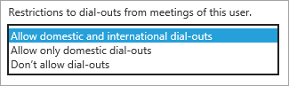

# Outbound calling restriction policies for Audio Conferencing and user PSTN calls

As an administrator, you can use outbound call controls to restrict the type of audio conferencing and end user PSTN calls that can be made by users in your organization. 

Outbound call controls can be applied on a per-user basis and provide the following two controls to independently restrict each type of outbound calls. By default, both controls are set to allow international and domestic outbound calls. 

|Control|Description|Control options|
|:-----|:-----|:-----|
|Audio Conferencing PSTN calls|Restricts the type of outbound  calls that are allowed from within  meetings organized by a user.|International and Domestic (default) Domestic None|
|End user PSTN calls|Restricts the type of calls  that can be made by a user.|International and Domestic (default) Domestic None|

   > [!NOTE]
   > A call is considered domestic if the number dialed is in the same country where Office 365 has been set up for the organizer of the meeting (in the case of audio conferencing), or the end user (in the case of end user PSTN calls). 

> [!NOTE]
> [!INCLUDE [updating-admin-interfaces](includes/updating-admin-interfaces.md)]

## Restrict audio conferencing outbound calls 

 **Using the Microsoft Teams admin center**

1. In the left navigation, click **Users**, and then select the user from the list of available users.

2. At the top of the page, click **Edit**.

3. Next to **Audio Conferencing**, click **Edit**.

4. Under **Dial-out permission from meetings**, select the dial-out restriction option you want.

5. Click **Save**. 

 **Using the Skype for Business admin center**

1.	In the **Skype for Business admin center**, in the left navigation, go to **Audio conferencing** > **Users**, and then select the user from the list of available users.

2.	In the Action pane, click **Edit**.

3.	Under **Restrictions to dial-outs from meetings of this user**, select the dial-out restriction option you want.

    

5. Click **Save**.

> [!Note]
> [!INCLUDE [updating-admin-interfaces](includes/updating-admin-interfaces.md)]

**Using PowerShell**

Outbound call restrictions are controlled by a single policy called OnlineDialOutPolicy which has a restriction attribute for each. The policy cannot be customized, rather there are pre-defined policy instances for each combination of the settings. 

You can use the Get-CSOnlineDialOutPolicy cmdlet to view the outbound calling policies and assign them to users by using the Grant-CSDialOutPolicy cmdlet. (Please note that the Grant cmdlet doesn’t contain the word “Online” as the Get cmdlet does.) 

The following table provides an overview of each policy.

|||
|:-----|:-----|
|Identity='tag:DialoutCPCandPSTNInternational'    |    User in the conference can dial out to   international and domestic numbers, and this user can also make outbound calls to international and domestic numbers.    |
|Identity='tag:DialoutCPCDomesticPSTNInternational'  |    User in the conference can only dial out to   domestic numbers, and this user can make outbound calls to international and domestic numbers.    |
|    Identity='tag:DialoutCPCDisabledPSTNInternational'    |    User in the conference cannot make any dial out. This user can make outbound calls to international and domestic numbers.    |
|    Identity='tag:DialoutCPCInternationalPSTNDomestic'    |    User in the conference can dial out to   international and domestic numbers, and this user can only make outbound calls to domestic PSTN number.    |
|    Identity='tag:DialoutCPCInternationalPSTNDisabled'    |    User in the conference can dial out to   international and domestic numbers, and this user cannot make any outbound calls to PSTN number besides emergency numbers.    |
|    Identity='tag:DialoutCPCandPSTNDomestic'    |    User in the conference can only dial out to   domestic numbers, and this user can only make outbound call to domestic PSTN numbers.    |
|    Identity='tag:DialoutCPCDomesticPSTNDisabled'    |    User in the conference can only dial out to   domestic numbers, and this user cannot make any outbound calls to PSTN number besides emergency numbers.    |
|    Identity='tag:DialoutCPCDisabledPSTNDomestic'    |    User in the conference cannot make any dial   out, and this user can only make outbound call to domestic PSTN numbers.    |
|    Identity='tag:DialoutCPCandPSTNDisabled'    |    User in the conference cannot make any dial   out, and this user cannot make any outbound calls to PSTN number besides emergency numbers.    |
