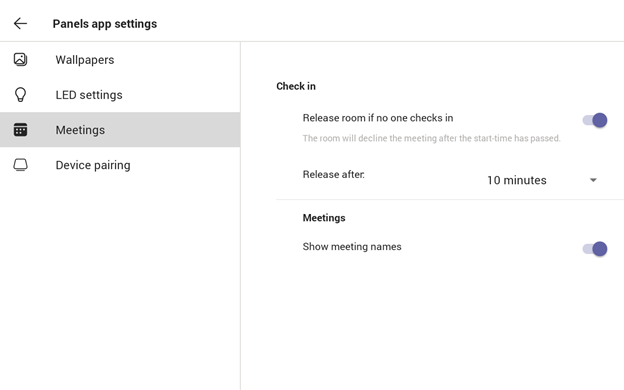
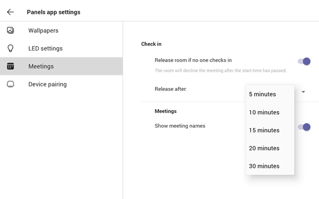

# Microsoft Teams Panels: Check-in and room release for active room management

This article covers the Microsoft Teams panels feature for room check-in and room release. To help ensure your meeting spaces are getting maximum use, we’re enabling a way to “check in” to claim a room from a Teams panel. Users can check into the room by tapping the button on the panel. If no one checks into the room, it will be released back to the room inventory for others to reserve and use. The default time to check in is 10 minutes before the room is released, but the unit of time configurable by the IT admin.

When the room is released, the room account declines the meeting invite, and a custom decline email message is sent back to the meeting organizer informing them the room was released due to no one checking in to claim it. The custom decline email will state: **Since no one checked in, the room has declined the meeting invitation and is no longer reserved.**

## Setting up check-in and room release on panels

By default, check-in and room release is turned off.

>[!NOTE]
>Device pairing is not applicable at this time.

1.  An IT admin can go into the Panels app settings (**Settings > Device Settings > Admin Settings > Panels App Settings > Meetings**) and turn on **Release room if no one checks in**.

2.  The IT admin can also configure from the drop-down menu how many minutes to wait before release if no one checks in.
