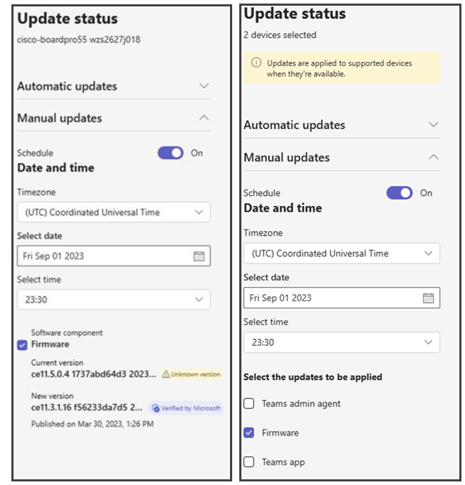

# Remotely update firmware and software on Teams phones

Using Teams admin center, you can update your Teams devices, including Teams phones, remotely. The following software components on your device can be updated from within Teams admin center:

- **Teams app** - available for Manual and Automatic updates

- **Device firmware** - available for Manual and Automatic updates

- **Company Portal app** - available for Manual updates only

- **Admin agent app** - available for Manual updates only 

Updates for Teams app and device firmware happen automatically by default. However, you can update them manually as well. When you're applying updates manually, they can be applied immediately or scheduled to be updated on a future date and time that you set.

> [!IMPORTANT]
> Microsoft strongly recommends using Teams Admin Center for managing and updating your Teams devices. Teams Admin Center ensures that all firmware and app updates installed on your Teams devices are validated and supported by Microsoft, which is essential for optimal performance and reliability of your Teams devices. By exclusively using firmware and app updates from the Teams Admin Center, you can avoid the risks and disruptions associated with alternative update methods. If customers use any other way to update, Microsoft can't guarantee to provide regular updates for those devices. 

## Software versions on Teams Admin Center

All new software versions for Teams devices are made available on Teams admin center once they're published by Microsoft. New releases might have minimum software version requirements. In such cases, the new version is only made available if the device meets the requirements. Verify that the device is meeting those requirements, but especially the firmware is current and updated.

Only software versions that have been tested by Microsoft are available for automatic or manual updates using Teams admin center. Software versions tested by Microsoft are labeled **Verified by Microsoft**.

Additionally, earlier versions of the software may also be made available and are labeled as **Microsoft Preview**. Devices can be manually updated to Microsoft Preview versions that are released, and those devices running on these versions are also eligible for receiving automatic updates in future.

Firmware versions that have not been tested by Microsoft are labeled **Unknown version**. Devices running an unknown firmware version can't be automatically updated. These devices can only be  updated manually.

Refer to this list for the details on new releases and the requirements that must be met: [Certified Teams phones - Firmware](../devices/teams-phones-certified-hardware.md&tabs=firmware)

## Automatic updates

### Assign phones to update phases

> [!NOTE]
> Devices within a phase will be updated gradually over a few weeks rather than all at once. Also, automatic updates of Teams devices using the Teams admin center isn't available in GCC High and DoD. Organizations in GCC High and DoD can, however, [manually update](#manually-update-remote-devices) using the Teams admin center.

To choose the automatic update phase for your phones, do the following steps:

1. Sign in to Microsoft Teams admin center by going to https://admin.teams.microsoft.com.
2. Navigate to **Teams devices** and then select **Phones**.  
3. Select one or more devices and then select **Update**.
4. Under **Automatic updates**, select one of the following phases:
   - **Validation** This option is best for lab or test devices on which you can carry out any validation you need to perform. Updates start deployment as soon as the latest software version is released. Previously called **As soon as possible**.
   - **General** This is the default option and is best for most of your general-purpose devices. Firmware updates start deployment only after **30 days** from the release of the new firmware version. Teams app updates start deployment only after **15 days** from the release of the new Teams app version. Previously called **Defer by 30 days** (applicable for firmware updates).
   - **Final** This option is best for devices used by VIPs and in large settings after large-scale validation is complete. Firmware updates start deployment only after **90 days** from the release of the new firmware version. Teams app updates start deployment only after **45 days** from the release of the new Teams app version. Previously called **Defer by 90 days** (applicable for firmware updates).     
5. Select **Update**.

To see which phase a device is in, see the **Automatic updates** column in the Teams admin center. To see which devices are part of a specific phase, use the **Filter** option then select **Auto-update phase**.

If you need to revert or remove firmware from a device that has been updated, you need to reset your device to its factory settings. Reset your device using the instructions from its manufacturer.

### Configure Maintenance window
If you want to configure the Maintenance window for a device, do the following steps:

1. Sign in to Microsoft Teams admin center by going to https://admin.teams.microsoft.com.
1. Navigate to **Teams devices** and then select **Phones**.
1. Follow the steps for [editing or creating a new configuration profile.](manage-teams-phones.md#use-configuration-profiles-in-teams)

1. Specify a suitable **Time window** by selecting a **Start time** and an **End time**. This time window follows the local timezone of the device.

   1. The default Time Window is from **01:00 Hrs** to **04:00 Hrs**.

   1. A minimum time window of 3 hours must be selected.

1. Specify the **Update frequency** by selecting the days of the week that are suitable for carrying out updates on the devices when available. 

1. Default selection is for **Sunday**.

1. Once the selection is done, **Save** the profile. If it's a new profile, you can **Assign** it to devices. If you're editing an existing profile, it automatically gets reapplied to the devices to which it's assigned.

1. You can check the selected Maintenance window settings under the **Details** tab on the device page. 

Automatic updates, when they happen, utilize the maintenance window configured for the device, that is, the **Time window** on the selected days for **Update frequency**. Maintenance window can also be utilized for scheduling manual updates. 

Option to configure maintenance window isn't available in GCC-High and DoD.

> [!NOTE]
> If an update operation is unable to start execution within the maintenance window it is scheduled for, it is cancelled and rescheduled for the next available maintenance window.

### Track automatic updates

If you want to check which software versions are currently rolling out for your devices, do the following steps:

1. Sign in to Microsoft Teams admin center by going to https://admin.teams.microsoft.com.
2. Navigate to **Teams devices** and then select **Phones**.
3. Refer to the widget titled **Software auto-updates** to determine the number of active update paths.
4. On this widget, select **View details**. A dialogue box opens showing the list of active update paths with the following details:

   - Device model and manufacturer
   - Current version and new version
   - Number of eligible devices
   - Active phase
   - Devices assigned to this update phase are being currently updated. Any device from a previous phase that isn't updated yet will also be included.
   - Software component name

> [!NOTE]
> The new version may not always be the latest available version. Devices running older versions may be updated in a step-wise approach, until they reach the latest version.

### Pause automatic updates

You can temporarily pause automatic updates for your tenant. When paused, Android based devices aren't automatically updated for the next 15 days. To pause the updates, do the following steps:

1. Sign in to Microsoft Teams admin center by visiting https://admin.teams.microsoft.com.
2. Navigate to **Teams devices** and then select **Phones**.
3. Under the **Actions** menu, select **Pause auto-updates**.
1. Updates automatically resume after 15 days. If you want to resume the updates before that, select **Resume auto-updates** from under the **Actions** menu.

## Manually update remote devices

If you want to manually update devices using the Teams admin center, you can decide whether to update the devices immediately or schedule an update for a future date and time.

To manually update remote devices, do the following steps:

1. Sign in to Microsoft Teams admin center by visiting https://admin.teams.microsoft.com.
1. Navigate to **Teams Devices** and then select **Phones**.
3. Select one or more devices and then select **Update**.
1. Under **Manual updates**, select **Schedule** if you want to schedule the update for the upcoming **Maintenance window** or a future date and time. The updates are applied at the date and time in the timezone selected in **Timezone**.

What you see depends on whether you have one, or multiple, devices selected. The left image below shows a single device selected while the image on the right shows multiple devices selected.

When you select multiple devices, you can choose which update types to apply to each selected device. Select the update types you want to apply and select **Update**.

When you select a single device, updates that are available for the device are shown. If multiple update types are available for the device, select each update type to apply. You can view the **Current version** applied on the device and the **New version** that will be applied. Select the update(s) you want to apply and select **Update**.

After you select **Update**, updates are applied to your devices at the date and time of the selected scheduling option. If you didn't select a future date and time, updates are applied to your devices within a few minutes.

To manage devices, you need to be a Global admin, Teams Service admin, or Teams Device admin. For more information about admin roles, see [Use Microsoft Teams administrator roles to manage Teams](../using-admin-roles.md).

> [!IMPORTANT]
> Microsoft recommends that you use roles with the fewest permissions. Using lower permissioned accounts helps improve security for your organization. Global Administrator is a highly privileged role that should be limited to emergency scenarios when you can't use an existing role.

This video shows how to update Teams devices.

> [!VIDEO https://www.microsoft.com/videoplayer/embed/RE5fxbK?autoplay=false]
    
#### Tracking update status

Administrators can track the status of these update operations from the 'History' section in the device page. Details for each operation are shown in the relevant row. More details are available on selecting the operation status.

## Frequently asked questions about automatic updates

1. **Which software components are automatically updated?** Both Firmware and Teams app are automatically updated for eligible devices. Automatic updates for Teams app is a feature still in early phase, therefore you might see some delays in device reaching the update phase. The gradual roll out of the feature is being done to ensure minimal impact on devices.
      
1. **How fast does the rollout happen?**  Eligible devices receive updates in weekly cycles based on the update phase they are in. For example, devices in General phase start receiving updates only after 15/30 days elapse since the new version was published. To ensure a stable rollout, the devices are updated gradually for a tenant and not all at once. Overall, the rollout of each new version takes a few weeks after the start of each update phase.

Also, if the device is on an older version, like N-3. It is updated step-wise to intermediate versions, like N-2 and N-1, before it is updated to the latest version (N). Therefore, this device may take longer to reach the latest version than usual, but no intervention is required.

1. **How do I check if a device has received an update?**  Whenever a device receives an update (or has one scheduled), the History tab on the device page shows corresponding details for a software update operation.

1. **I see that the updates are happening but they are failing. What do I do?**  Sometimes the updates can fail due to transient conditions. In such cases, no intervention is required. Updates are automatically retried on the devices. If updates are consistently failing across your inventory, you can check a few things:

   - Devices are online at the time when updates are scheduled.
   - Network configuration is done appropriately to allow download of updates. Refer to [URLs and IP address ranges for Microsoft Teams](/microsoft-365/enterprise/urls-and-ip-address-ranges#skype-for-business-online-and-microsoft-teams) for the URLs and IP address ranges that need to be allowed for Teams.
   - If this doesn't help, reach out to Microsoft support with the logs. Device logs can be found in the History tab of the device page. They are linked to the Device diagnostics operation that is run with the software update operation.
      
1. **The eligible count of devices does not seem to match the available devices.**  The device count in **Automatic software updates** section shows the number of eligible devices that are ready to be updated. The devices that are already updated to the **New version** are not counted. It can also include devices from the previous phase that are not updated.

1. **When do automatic updates happen?**  The updates are scheduled to happen during the Maintenance window to minimize impact. If the device is offline at that time, the updates get executed when the device comes back online the next time. If the Maintenance window is already over, the update is rescheduled for the next available window.

1. **Why do Teams app and Firmware follow a different cadence in update phases?**   Updates phases allow Firmware auto-updates to start immediately (Validation phase), only after 30 days (General phase), or only after 90 days (Final phase). Since Firmware changes include significant changes, their rollout through auto-update is done at a slow pace to ensure minimal impact. On the other hand, the update phases allow Teams app to start immediately (for Validation phase), only after 15 days (for General phase), or only after 45 days (for Final phase). Teams app versions include smaller scope of changes for the devices than the Firmware and hence their auto-update rollout is done at a faster pace to bring the devices to recent versions.

