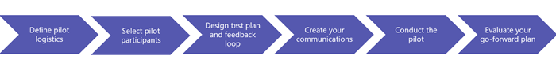

Pilot essentials: Start your journey to Microsoft Teams
=======================================================

Introduction
============

As an existing Skype for Business and Office 365 customer, your organization is already a part of the modern workplace movement, empowering your users to be more creative, innovative, and productive. Microsoft Teams further expands what’s possible, with added functionality, such as collaboration hubs for teamwork, app integration, and file storage. When you bring the current functionality of Skype for Business together with the value-add of Teams, you have a powerful communication and collaboration solution that can revolutionize how users work.

Your Teams journey, as well as go-forward recommendations, is based on the outcome of your pilot. While you continue to utilize Skype for Business, we encourage you explore all that Teams can offer to your organization. Since there is some overlapping functionality between Teams and Skype for Business, it is important to begin with a user pilot. The pilot, is a small-scale deployment that enables you to validate the interoperability with Skype for Business in your environment as well as understand how your endusers can maximize their productivity while minimizing confusion with both products running side-by-side.

Tailored for current Skype for Business customers, this resource provides guidance and best practices to start you on your journey to:

-   Personalize the action steps and recommendations to best meet your organizational profile.

-   Download and customize the communication and feedback templates found in the [Pilot Essentials Resources](https://go.microsoft.com/fwlink/?linkid=859067) to ensure your message resonates with your endusers.

Getting Started
=============================================================================================================

Designed to confirm organizational readiness, a pilot is a realistic validation of the resources and procedures needed on a larger scale prior to your organization-wide rollout.  To achieve the most realistic results, the pilot program should mimic how users communicate and collaborate today, verifying the ideal deployment scenario with Skype for Business and Microsoft Teams. Whether your organization is considering running Skype for Business and Teams side-by-side or transitioning to Teams at a future point in time, a pilot can help identify the right path forward for your organization. *Let’s get started!*

### Step One: Define your Pilot Program Logistics

A formal pilot should define your targeted path forward and include a project team, SMART goals, a set timeline, an articulated test plan, and feedback mechanisms. Take time to address these questions to help outline your pilot program logistics:

-   Who are the project stakeholders for your pilot?

    -   Stakeholders should include representatives with accountability for pilot success. Here are a few examples:

        -   **Executive Sponsor:** Overall accountability for collaboration and communications solutions’ success in your organization.

        -   **Project (Pilot) Lead:** Manages logistics for the pilot, coordinating stakeholders.

        -   **IT Pro:** Ensures network readiness for your Teams pilot.

        -   **Support Lead:** Accountable for readying the helpdesk for Teams.

        -   **MarCom Lead:** Responsible for all awareness and training communications.

<!-- -->

-   What are your business scenarios for Teams and Skype for Business?

    -   Usage and use cases will help inform your test plan. Review your current [usage reports](https://support.office.com/article/Active-user-in-Office-365-usage-reports-093A6D0D-890B-489E-9F46-B15687D3FE4F) for Skype for Business and/or conduct a focus group with your top Skype for Business users to better understand their current collaboration and communication scenarios.

-   Are you familiar with the Teams Roadmap?

    -   Take time to understand the Teams [roadmap](https://go.microsoft.com/fwlink/?linkid=859047), to help inform your scope and timing for your pilot. Time your pilot and feature/scenario testing accordingly to ensure realistic validation of applicability within your organization.

-   What are your goals and success criteria for your Teams pilot?

    -   Setting clear goals will provide a mechanism from which to measure success and define your best path forward. Sample goals and success criteria are provided in the [Pilot Essentials Resources](https://go.microsoft.com/fwlink/?linkid=859067).

-   What is your pilot timeline?

    -   Define a clear start and end-date for your pilot to maintain momentum and allow time to assess impact. A minimum 30-day pilot is recommended. Start small and add to your pilot as appropriate – whether additional workloads/features or additional users, making time to assess results and adjust your pilot as you iterate. You may even opt to run subsequent pilots as new Teams’ features are released per the roadmap.

<table>
<thead>
<tr class="header">
<td align="center">

</td>
<td align="left"><strong>TIP:</strong> Your pilot should be conducted in your production environment for optimal results. Confirm all technical prerequisites are completed prior to beginning your pilot such as ensuring your pilot users have the ability to create new teams and channels.</td>
</tr>
</thead>
<tbody>
</tbody>
</table>

<table>
<thead>
<tr class="header">
<td align="left">

</td>
<td align="left"><strong>Next Action:</strong><ul><li>Enlist your pilot program team</li><li>Articulate the business scenarios and features you will test as part of your pilot</li><li>Finalize your success criteria and goals</li><li>Establish your pilot timeline</li></ul></td>
</tr>
</thead>
<tbody>
</tbody>
</table>

### Step Two: Select your Pilot Participants

One of the most important tasks of pilot planning is thoughtful participant selection. An ideal pilot group includes representative users of all usage scenarios designed to validate the organization's requirements and intended use of feature sets.  This includes representatives from a variety of roles within your organization (exec admin, management, project manager, conferencing power users), different departments/business units, multiple regions (if applicable). The pilot should extend to key people in IT, training and helpdesk.  This allows a thorough validation while fully optimizing project management resources.

For optimal validation, look to include approximately 2-5% of your user base, or a minimum of 50 users, whichever is most representative of your organization. Depending on your pilot timeline, you may opt to start small and expand to additional pilot users over time.

<table>
<thead>
<tr class="header">
<td align="left">

</td>
<td align="left"><strong>TIP:</strong> When selecting your Teams pilot group participants, be sure to include both high-adopters of Skype for Business as well as users/groups who would benefit from the teamwork hub capabilities of Teams. Consider using a current cross-team project workstream for pilot user selection as well as a realistic use case for your test plan.</td>
</tr>
</thead>
<tbody>
</tbody>
</table>

<table>
<thead>
<tr class="header">
<td align="left">

</td>
<td align="left"><strong>Next Action:</strong> Identify your pilot test group(s).</td>
</tr>
</thead>
<tbody>
</tbody>
</table>

### Step Three: Design your Test Plan and Feedback Survey

A successful pilot experience provides your participants with clearly defined tasks to complete, along with a feedback loop. Your organization may opt to pilot all functionality at once, or leverage a gradual approach (e.g. collaboration, then meetings, then chat and calling.) A pre-defined survey is an easy way to capture and assess pilot results and should be designed based on the scenarios/features in the test plan.

<table>
<thead>
<tr class="header">
<td align="left">

</td>
<td align="left"><strong>Next Action:</strong> Tailor the sample test plan and feedback survey found in the <a href="https://go.microsoft.com/fwlink/?linkid=859067">Pilot Essentials Resources</a> based on the use cases and features you will be testing.</td>
</tr>
</thead>
<tbody>
</tbody>
</table>

### Step Four: Create your Communications

Educating your pilot participants on what is happening, when and why, as well as what is expected of them, is crucial to the success of your pilot. In addition, be sure your communications include links to training and support where users can get additional information as they progress through the pilot.

<table>
<thead>
<tr class="header">
<td align="left">

</td>
<td align="left"><strong>Next Action:</strong> Customize the sample email templates found in the <a href="https://go.microsoft.com/fwlink/?linkid=859067">Pilot Essentials Resources</a> based on the use cases and features you will be testing.</td>
</tr>
</thead>
<tbody>
</tbody>
</table>

### Step Five: Conduct your Pilot 

With all the logistics in place, you are now ready to begin your pilot. Conducting your pilot includes communicating to your pilot users, monitoring your network/usage to ensure your network and quality remains healthy, gathering feedback from participants, and reviewing help desk tickets for questions related to Teams.

A suggested timeline based on a 30-day pilot is provided below:

-   One week prior to Pilot kick off: Send initial communication to pilot users

-   Day 1: Send kick-off communication to pilot users

-   Day 7: Weekly project team check-point (Meet with your pilot project team and review user feedback, usage data, network data and help desk tickets to ensure your pilot is running smoothly. Make any adjustments as needed)

-   Day 14: Send mid-point communication to your pilot users

-   Day 14: Weekly project team check-point

-   Day 21: Weekly project team check-point

-   Day 30: Send final communication to your pilot users

<table>
<thead>
<tr class="header">
<td align="left">

</td>
<td>
<strong>Next Action:</strong> Tailor the timeline actions based on your pilot timeline.
</td>
</tr>
</thead>
<tbody>
</tbody>
</table>

### Step Six: Assess Learnings and Evaluate Go-Forward Plan

Once your pilot is complete, it’s time to gather all feedback surveys, final network stats and support tickets for analysis against your goals and determination of your go-forward plan.

Based on your outcomes, here are a few recommended paths your organization may take as you continue your journey from Skype for Business to Teams:

<table>
<thead>
<tr class="header">
<th align="left">Go Forward Recommendations</th>
<th align="left"></th>
</tr>
</thead>
<tbody>
<tr class="odd">
<td align="left"><strong>IF your pilot results indicate</strong></td>
<td align="left"><strong>THEN</strong> you might consider</td>
</tr>
<tr class="even">
<td align="left"><ul><strong><li>80% or higher agree that Teams can be easily utilized alongside Skype for Business</li></strong>
<strong><li>Less than 80% user agreement that Teams can replace Skype for Business based on current use cases and scenarios</li></strong>
<strong><li>Satisfactory network health</li></strong></ul></td>
<td align="left">
Deploying Teams and Skype for Business side-by-side for some/all available scenarios. To facilitate the learning curve, we strongly encourage rolling out features over time, in lieu of an all-at-once approach.

Learn more about running Skype for Business and Teams side-by-side.

Download <a href="https://go.microsoft.com/fwlink/?linkid=859044">user readiness templates</a> to facilitate communication with your end-users about their new side-by-side experience.
</td>
</tr>
<tr class="odd">
<td align="left"><ul><strong><li>80% or higher user agreement that Teams can replace Skype for Business based on current use cases and scenarios</li></strong>
<strong><li>Satisfactory network health</li></strong></ul></td>
<td align="left">
Deploying Teams and Skype for Business side-by-side for all scenarios, encouraging users to lead with Teams where feasible. In addition, reach out to your account team or Microsoft Support to let them know your organization may be ready to go to Microsoft Teams.

Learn more about running Skype for Business and Teams side-by-side.

Download <a href="https://go.microsoft.com/fwlink/?linkid=859044">user readiness templates</a> to facilitate communication with your end-users about their new side-by-side experience.
</td>
</tr>
<tr class="even">
<td align="left"><ul><strong><li>Less than 80% agree that Teams can be easily utilized alongside Skype for Business</li></strong>
<strong><li>Less than 80% user agreement that Teams can replace Skype for Business based on current use cases and scenarios</li></strong></ul></td>
<td align="left">Continuing with Skype for Business for communication (e.g. IM, Meetings, Calling) while utilizing the modern collaboration functionality (e.g. Teams/Channels) of Teams. Revisit a Teams pilot to verify communications functionality as new features are released per <a href="https://go.microsoft.com/fwlink/?linkid=859047">roadmap.</a></td>
</tr>
</tbody>
</table>

<table>
<thead>
<tr class="header">
<td align="left">

</td>
<td align="left"><strong>Note:</strong> Be sure to leverage your pilot participants as <a href="https://go.microsoft.com/fwlink/?linkid=859068">Champions</a> to help evangelize and onboard new users to Teams.</td>
</tr>
</thead>
<tbody>
</tbody>
</table>

<table>
<thead>
<tr class="header">
<td align="left">

</td>
<td align="left">

<strong>Next Action:</strong>
<ul><li>Analyze your pilot learnings and determine your path forward. If you opt to deploy Teams alongside Skype for Business, be sure to leverage the [user readiness templates](https://go.microsoft.com/fwlink/?linkid=859044) to help get your started.</li><li>View and bookmark the [Teams roadmap](https://go.microsoft.com/fwlink/?linkid=859047).</li></ul></td>
</tr>
</thead>
<tbody>
</tbody>
</table>

