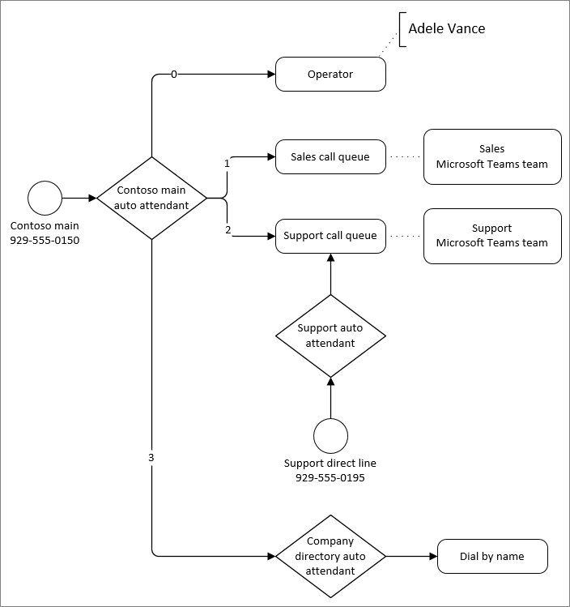

---
title: Plan your call routing flow for Microsoft Teams
author: CarolynRowe
ms.author: crowe
manager: serdars
ms.reviewer: colongma
ms.topic: article
ms.assetid: 6fc2687c-0abf-43b8-aa54-7c3b2a84b67c
ms.tgt.pltfrm: cloud
ms.service: msteams
search.appverid: MET150
ms.collection: 
  - M365-voice
  - m365initiative-voice
audience: Admin
appliesto: 
  - Skype for Business
  - Microsoft Teams
ms.localizationpriority: medium
ms.custom: 
  - Phone System
description: Learn how to plan your call routing flow for auto attendants and call queues in Microsoft Teams.
--- 

# Plan your call routing flow

As part of the planning process, we recommend that you work out the call routing for your organization in a diagram. The diagram helps determine the most efficient routing for people calling in to your organization. You can also use the diagram to determine the auto attendants and call queues that you need to create, along with related requirements such as service numbers, licenses, and resource accounts.

Let's look at how auto attendants and call queues route calls.

Auto attendants route all calls in one of the following ways:

- **Redirect immediately** - calls can be redirected to one of the call routing destinations (listed below) immediately upon answering or after an initial greeting.
- **Redirect based on dial options** - callers can be directed to choose between options that are assigned to the numbers on their telephone keypad, 0-9. Each dial key can be assigned a call routing destinations.
- **Dial people by name or extension** - callers can be directed to dial the extension number of the person they're trying to reach in your organization's directory, or by spelling the person's name.
- **Disconnect** - an auto attendant can hang up the call.

> [!NOTE]
> A single Auto attendant can only support a single "dial by" method.  To allow callers to dial by name and by number, you will need to create an auto attendant that has an option for dial by name and the another for dial by extension.  Each of these options will route to separate auto attendants configured for these "dial by" scenarios.

When calls are redirected by an auto attendant or call queue, you can choose from the following call routing destinations:

- **Person in the organization** - a person in your organization who is able to receive voice calls. This can be an online user or a user hosted on-premises using Skype for Business Server.
- **Voice app** - another auto attendant or a call queue. Choose the resource account associated with the destination.
- **External phone number** - any phone number. (See [external transfer technical details](create-a-phone-system-auto-attendant?tabs=additional-resources#external-phone-number-transfers---technical-details)).

- **Voicemail** - the voice mailbox associated with a Microsoft 365 group that you specify. You can choose if you want voicemail transcriptions and the "Please leave a message after the tone." system prompt.
- **Operator** (auto attendant only) - the operator defined for the auto attendant. Defining an operator is optional. An operator can be any of the other destinations in this list.

Auto attendants offer separate call routing options for calls received outside of business hours and on holidays.

Call queues place the caller on hold until an agent assigned to the queue is available to take their call. There are two situations where a caller might be directed out of the queue:

- **Call overflow** - if the number of calls in the queue exceeds the limit that you set, then new callers are redirected out of the queue.
- **Call timeout** - if a caller has been in the queue longer than the configured timeout setting, they're redirected out of the queue.

Calls redirected out of a queue can be sent to any of the call routing destinations listed above except for an operator. (Call queues don't have operators, but you can redirect callers to the same destination as an operator that you've configured for an auto attendant.)

The example below shows an example of call routing using auto attendants and call queues.

In the example above:

- The zero (0) key redirects callers to an operator. The operator for that auto attendant has been configured as a **Person in the organization**.
- The one (1) key redirects callers to the sales call queue. This call queue is connected to a team that contains the sales team assigned to the queue.
- The two (2) key redirects callers to the support call queue. This call queue is connected to a team that contains the support team assigned to the team.
- The support call queue has a direct phone number via an intervening auto attendant. Having an auto attendant answer the support line allows for separate off hours and holiday call routing.
- The three (3) key redirects users to another auto attendant for the company directory. The company directory auto attendant allows callers to call individuals in the organization by dialing their name or extension.

We recommend that you create one or more diagrams similar to the one above to map out your call routing. Be sure to include the following in your diagram or accompanying documentation:

- Which auto attendants will have direct access via phone numbers?
- What are the off-hours and holiday routing requirements for each auto attendant?
- The membership for each call queue. (You can add users individually or map the queue to different kinds of groups. Mapping a queue to a team provides the most versatile experience.)

Here are some call routing best practices:

- Look at your existing calling system and analyze the types and frequency of incoming calls. Use this information to help inform your auto attendant and call queue structure.
- Put the most common options earliest in the menu to route calls as quickly as possible.
- Avoid connecting service numbers directly to call queues unless the queues are available 24/7. Call queues don't allow for separate call handling for off hours or holidays. If you want to have a queue with a direct number, assign the number to an auto attendant that automatically redirects to the queue during business hours.
- If you receive numerous calls requesting basic information about your company, such as business hours, location, or web site address, consider creating an auto attendant to answer these questions with recorded messages.
- Keep the list of menu items to five or fewer. Callers can have trouble remembering more than five options. Use nested auto attendants if more options are needed to properly route a call.
- Describe the service first, followed by the option to press (eg: For Sales press 1) rather than the other way around (eg. Press 1 for Sales).
- User terminology your callers will understand rather than what you may use internally.
- Avoid frequent updates to call routing. If you change your menu options for an auto attendant in the future, call that out in the voice prompts for the first 30 days.
