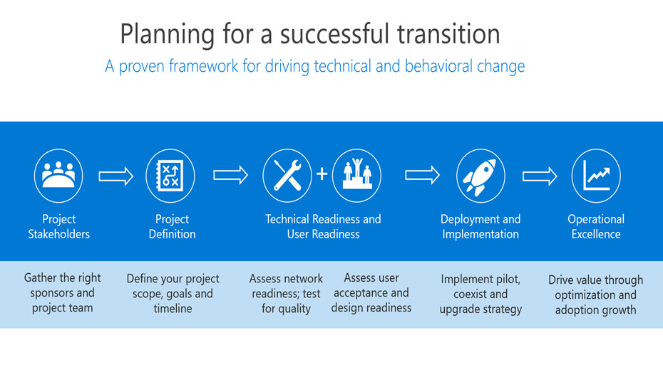
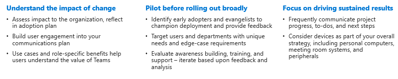

# Planning for a successful transition from Kaizala to Microsoft Teams

As you embark on your move from Kaizala to Microsoft Teams, it's important to take the time to [plan](/microsoftteams/deploy-enterprise-setup?tabs=ChatTeamsChannels#plan-your-deployment) for a successful transition. A solid transition plan gives you structure for your move and ensures that all stakeholders are working towards a common goal. Using a proven framework to implement the change can help you get started on your transition today.

## Transition framework

We’ve outlined our recommended approach to a successful transition below and encourage you to follow the phases in order, as each step in the framework builds upon the step prior.

- Envisioning teamwork for your organization

- Identifying champions and critical stakeholders

- Defining your project scope

- Piloting Microsoft Teams

Before getting started, make sure that:

- [Teams is installed](/microsoftteams/get-clients) and [licenses are assigned](/office365/servicedescriptions/teams-service-description) in your environment. At least minimum licenses should be assigned to your core team and to the early adopters who will participate in this initial project phase.

- You've downloaded the desktop and mobile applications.

### Envision teamwork for your organization

A healthy technical environment, sustained user adoption, and the realization of your business goals all begin with proper planning. A solid plan gives you a framework for your upgrade project and ensures that all stakeholders are working toward the same goals. Take time to list the current scenarios in which Kaizala is used. Next, envision usage scenarios above and beyond in modern workplace with Microsoft Teams. To get started with defining usage scenarios, see [Define usage scenarios for Microsoft Teams](/microsoftteams/teams-adoption-define-usage-scenarios).

### Identify champions and critical stakeholders

Begin by bringing together the right stakeholders and define your upgrade plan. A proper plan should include your scope, goals, and a clear timeline for transition. With an agreed plan in place, confirm that your technical environment and your end users are ready for Teams. Identify people who are interested in new technology and helping others. Create a [champion program](/microsoftteams/teams-adoption-create-champions-program) to drive excitement, awareness, and adoption across your transition. We’ve created a Champions Program Guide to kickstart this program in your organization, to learn more, see [Build a champion program](https://view.officeapps.live.com/op/view.aspx?src=https://fto365dev.blob.core.windows.net:443/media/Default/DocResources/Adoption/Build_Champions_Program_Guide.pptx).

### Define your project scope

As you plan for your move to Microsoft Teams, it's critical to define what success looks like for your business.  The project scope defines the focus of your project at this time and serves to keep your project team focused on their current tasks, enabling you to realize your long-term vision.

To learn more about our recommended strategy for defining outcomes and success, see [Define outcomes and success for adopting Microsoft Teams](/microsoftteams/teams-adoption-define-outcomes).

### Pilot Microsoft Teams

Once you’ve defined your project scope and vision, it’s time to pilot Microsoft Teams. Identify a user group of [early adopters](/microsoftteams/teams-adoption-onboard-early-adopters) to participate in an initial experiment with Teams. Conducting your pilot includes communicating with your users, monitoring your network and usage to ensure your network performance and call quality remain healthy, gathering feedback from participants, and reviewing help desk tickets for questions related to Teams.

## Prepare your organization

After following the recommended framework for planning a successful transition from Kaizala, prepare your organization for a successful transition of Microsoft Teams.

### Get ready

 1. Ensure that there are Teams licenses for everybody. Check out [Teams plans](https://www.microsoft.com/microsoft-teams/compare-microsoft-teams-options?activetab=pivot%3aprimaryr1) and [Microsoft Teams service description](/office365/servicedescriptions/teams-service-description).

 2. Use [Microsoft Teams Adoption](https://adoption.microsoft.com/microsoft-teams/#get-started) guidance to roll out Teams across your organization.

 3. Prepare administrators, champions, and your greater organization to embrace communication with Teams through skilling and adoption resources.  

 4. Use these training resources to help users in your organization learn and get the most out of Teams:

    - For IT Admin readiness, see [Admin training resources](/microsoftteams/itadmin-readiness).

    - For instructor led training, see [Instructor-led training for Microsoft Teams](/microsoftteams/instructor-led-training-teams-landing-page).
  
    - For training videos, see [Microsoft Teams video training](https://support.microsoft.com/office/microsoft-teams-video-training-4f108e54-240b-4351-8084-b1089f0d21d7?ui=en-us&rs=en-us&ad=us).

## Champion Microsoft Teams adoption

By [driving adoption](/microsoftteams/teams-adoption-get-started) of Microsoft Teams, you can deliver an excellent user experience and increased business value inside your company.

Throughout your Teams rollout, be sure to take advantage of [these](/microsoftteams/adopt-microsoft-teams-landing-page) resources with guidance on driving Teams adoption.

Strengthen your knowledge about Teams and drive usage in your organization through training for admins and users. For training resources, see [Microsoft Teams training](/microsoftteams/training-microsoft-teams-landing-page).

If your organization is interested in a customizable experience to align to your usage and adoption plans, see here to learn more about the [Microsoft 365 learning pathways](https://adoption.microsoft.com/microsoft-365-learning-pathways/) on-demand training solution.

To stay on top of what's coming for Teams and all other Microsoft 365 or Office 365 products and services in your organization, be sure to check [Message](https://admin.microsoft.com/AdminPortal/Home?ref=/MessageCenter) center and the [Teams roadmap](https://www.microsoft.com/microsoft-365/roadmap?rtc=2&filters=Microsoft%20Teams). You'll get announcements about new and updated features, planned changes, and issues to help keep you informed and prepared.

## Additional Resources

Bring everyone together, get conversations going effectively, connect with employees, and digitize everyday tasks with Microsoft Teams. Teams makes it easy to connect and coordinate with your frontline workers, members, customers, and distributors.

For additional resources, we’ve compiled a [library of documentation](/microsoftteams/) on Microsoft Teams for admins and IT professions. Use the documentation to ensure your organization is prepared along your journey from Kaizala to Microsoft Teams.

## Next Steps

[Navigating Microsoft Teams from Kaizala](/MicrosoftTeams/navigate-teams)
