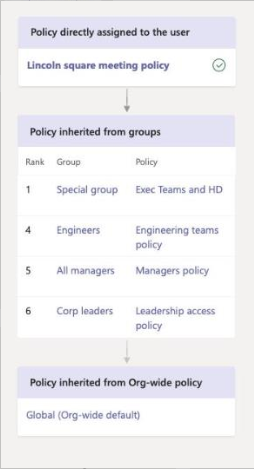
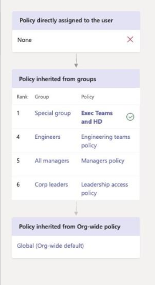
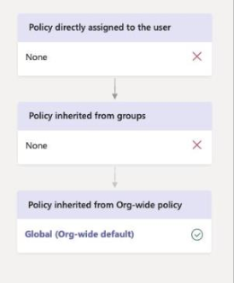
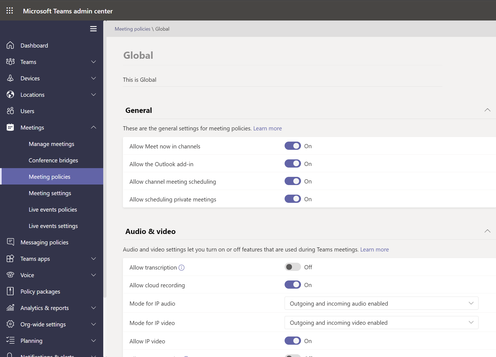
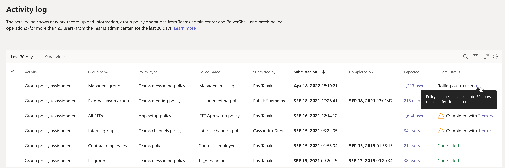

# Assign policies in Teams – getting started

As an admin, you use policies to control the Teams features that are available to users in your organization. For example, there are calling policies, meeting policies, and messaging policies, to name just a few.

Organizations have different types of users with unique needs. Custom policies that you create and assign let you tailor policy settings to different sets of users based on those needs.

To easily manage policies in your organization, Teams offers several ways to assign policies to users. Assign a policy directly to users, either individually or at scale through a batch assignment, or to a group that the users are members of. You can also use policy packages to assign a preset collection of policies to users in your organization who have similar roles. The option that you choose depends on the number of policies that you're managing and the number of users you're assigning policies to. Global (Org-wide default) policies apply to the largest number of users in your organization. You only have to assign policies to those users that require specialized policies.

This article describes the different ways that you can assign policies to users and the recommended scenarios for when to use what.

For details on how to **assign policies to users and groups**, see [assigning policies to users and groups](assign-policies-users-and-groups.md). For details on how to **assign policy packages**, see [assign policy packages](assign-policy-packages.md).

## Which policy takes precedence?

A user has one effective policy for each policy type. It's possible, or even likely, that a user is directly assigned a policy and is also a member of one or more groups that's assigned a policy of the same type. In these kinds of scenarios, which policy takes precedence? A user's effective policy is determined according to rules of precedence, as follows.

If a user is directly assigned a policy (either individually or through a batch assignment), that policy takes precedence. In the following visual example, the user's effective policy is the Lincoln Square meeting policy, which is directly assigned to the user.



If a user isn't directly assigned a policy of a given type, the policy assigned to a group that the user is a member of takes precedence. If a user is a member of multiple groups, the policy that has the highest ([group assignment ranking](assign-policies-users-and-groups.md#group-assignment-ranking)) for the given policy type takes precedence.

In this visual example, the user's effective policy is the Exec Teams and HD policy, which has the highest assignment ranking relative to other groups that the user is a member of and that are also assigned a policy of the same policy type.  



If a user isn't directly assigned a policy or isn't a member of any groups that are assigned a policy, the user gets the global (Org-wide default) policy for that policy type. Here's a visual example.



To learn more, see ([Precedence rules](assign-policies-users-and-groups.md#precedence-rules)).

## Ways to assign policies

Here's an overview of the ways that you can assign policies to users and the recommended scenarios for each. Select the links to learn more.

Before assigning policies to individual users or groups, start by [setting the global (Org-wide default) policies](#set-the-global-policies) so that they apply to the largest number of users in your organization.  Once the global policies are set, you'll only need to assign policies to those users that require specialized policies.

|Do this  |If...  | Using...
|---------|---------|----|
|[Assign a policy to individual users](assign-policies-users-and-groups.md#assign-a-policy-to-individual-users)   | You're new to Teams and just getting started or you only need to assign one or a couple of policies to a small number of users. |The Microsoft Teams admin center or PowerShell cmdlets in the Teams PowerShell module
|[Assign a policy to a group](assign-policies-users-and-groups.md#assign-a-policy-to-a-group) |Assign policies based on a user's group membership. For example, assign a policy to all users in a security group or distribution list.| The Microsoft Teams admin center or PowerShell cmdlets in the Teams PowerShell module|
|[Assign a policy to a batch of users](assign-policies-users-and-groups.md#assign-a-policy-to-a-batch-of-users)   | Assign policies to large sets of users. For example, assign a policy to hundreds or thousands of users in your organization at a time. |The Microsoft Teams admin center or PowerShell cmdlets in the Teams PowerShell module|
|[Assign a policy package to users](assign-policy-packages.md#assign-a-policy-package-to-users)  |Assign multiple policies to specific sets of users in your organization who have the same or similar roles. For example, assign the Education (Teacher) policy package to teachers in your school to give them full access to chats, calling, and meetings. Assign the Education (Secondary school student) policy package to secondary students to limit certain capabilities such as private calling.  |The Microsoft Teams admin center or PowerShell cmdlets in the Teams PowerShell module|
|[Assign a policy package to a group](assign-policy-packages.md#assign-a-policy-package-to-a-group)  |Assign multiple policies to a group of users in your organization who have the same or similar roles. For example, assign a policy package to all users in a security group or distribution list. |The Microsoft Teams admin center (coming soon) or PowerShell cmdlets in the Teams PowerShell module|
|[Assign a policy package to a batch of users](assign-policy-packages.md#assign-a-policy-package-to-a-batch-of-users)|Assign multiple policies to a batch of users in your organization who have the same or similar roles. For example, assign the Education (Teacher) policy package to all teachers in your school using batch assignment to give them full access to chats, calling, and meetings. Assign the Education (Secondary school student) policy package to a batch of secondary students to limit certain capabilities such as private calling.|PowerShell cmdlets in the Teams PowerShell module|

## Set the global policies

Follow these steps to set the global (Org-wide default) policies for each policy type.

### Using the Microsoft Teams admin center

1. In the left navigation of the Microsoft Teams admin center, go to the policy page for the policy type you want to update. For example, **Teams** > **Teams policies**, **Meetings** > **Meetings policies**, **Messaging policies**, or **Voice** > **Calling policies**.
2. Select the **Global (Org-wide default)** policy to view the current settings.
3. Update the policy as needed, and then select **Apply**.



### Using PowerShell

To set the global policies using PowerShell, use the Global identifier.  Start by reviewing the current Global policy to determine which setting you want to change.

```powershell
Get-CsTeamsMessagingPolicy -Identity Global
 
Identity                      : Global
Description                   :
AllowUrlPreviews              : True
AllowOwnerDeleteMessage       : False
AllowUserEditMessage          : True
AllowUserDeleteMessage        : True
AllowUserChat                 : True
AllowRemoveUser               : True
AllowGiphy                    : True
GiphyRatingType               : Moderate
AllowMemes                    : True
AllowImmersiveReader          : True
AllowStickers                 : True
AllowUserTranslation          : False
ReadReceiptsEnabledType       : UserPreference
AllowPriorityMessages         : True
ChannelsInChatListEnabledType : DisabledUserOverride
AudioMessageEnabledType       : ChatsAndChannels
Expand (20 lines) Collapse 
```

Next, update the Global policy as needed.  You only need to specify values for the settings that you want to change.

```powershell
Set-CsTeamsMessagingPolicy -Identity Global -AllowUserEditMessage $false
```

## View your policy assignments in the Activity log

When you assign policies to users in the Microsoft Teams admin center, you can view the status of those policy assignments in the [Activity log](https://admin.teams.microsoft.com/activitylog). The activity log shows network record upload information, group policy operations from Teams admin center and PowerShell, and batch policy operations (for more than 20 users) from the Teams admin center, for the last 30 days.



To view your policy operations in the Activity log:

1. In the left navigation of the Microsoft Teams admin center, go to **Dashboard**, and then under **Activity Log**, select **View details**.
2. You'll see the following information about each policy operation:
    - **Activity**: The name of the policy operation. For example: **Group policy assignment**
    - **Group name**: The name of the group the policy operation was completed on.
    - **Policy type**: The type of policy.
    - **Policy name**: The name of the policy operation. For batch policy assignments, you can select the link to view more details. This includes the number of users the policy was assigned to and the number of assignments completed, in progress, and not started. You'll also see the list of users in the batch, and the status and result for each user.
    - **Submitted by**: The name of the user who submitted the policy operation.
    - **Submitted on**: Date and time the policy operation was submitted.
    - **Completed on**: Date and time the policy operation was completed.
    - **Impacted**: Number of users in the batch or group.
    - **Overall status**: Status of the policy operation. A policy can have one of the following statuses:
        - **Not started**: The policy operation was submitted by the admin.
        - **In progress**: The policy operation has started processing.
        - **Rolling out to users**: The system has started applying the policy update to users.
        - **Completed**: The policy update has been applied all users.
        - **Completed with 'x' errors**: The policy operation is complete, but there are errors.

> [!NOTE]
> You can also get to the Activity log from the **Users** page. After you select **Apply** to submit a bulk policy assignment, you'll see a banner at the top of the page. Select the **Activity log** link in the banner.

## Related topics

- [Assign policies to users and groups](assign-policies-users-and-groups.md)
- [Assign policy packages to users and groups](assign-policy-packages.md)
- [Manage Teams with policies](manage-teams-with-policies.md)
- [Teams PowerShell Overview](teams-powershell-overview.md)
