# Teams Policies and Policy Packages for Education

> [!NOTE]
> For the larger story on policies in Microsoft Teams, please review [Assign policies to your users in Microsoft Teams](assign-policies.md).

It's important to note this article will cover multiple ways to assign policies to users in Teams.

- Manual assign to individual users.
- Bulk assigning via PowerShell to multiple users.
- Assigning policy packages to individual or multiple users.

The advantages and disadvantages of these approaches come down to the institution's individual needs.

## Admins: Getting started with Microsoft Teams policy management

Microsoft Teams, at its core, is about users being able to do things like go to meetings or live events, chat, make calls, and use apps. And setting the right Microsoft Teams admin policies is a critical step in creating a safe learning environment for students within Teams. As an admin, you can use policies to control the Teams features that are available to users in your educational institute.

Here's a list of the policy areas you will find in Microsoft Teams:

- Meetings
- Live events
- Calling
- Messaging
- Teams
- App permissions

:::image type="content" source="media/edu-admin-center-users.png" alt-text="Screenshot of user with policies applied.":::

You can easily manage all Teams policies in the [Microsoft Teams admin center](https://admin.teams.microsoft.com) by signing in with your admin credentials.

### Where to find Microsoft Teams policies

Once you've logged into the Teams admin center, you'll be able to go to the policy settings for any area of Teams you need to manage, by clicking on the policy option in the left hand navigation of the Teams admin center. We've included a screenshot of the location of the messaging policies.

:::image type="content" source="media/edu-messaging-policies.png" alt-text="Message policy location in the Teams admin center.":::

### How to create and update a policy definition

Before you assign policies to your users, you need to first add and create your policy definitions for each capability area with Teams.

> [!NOTE]
> We recommend that you set different policy definitions for your students and educators.

By default, every new user (student or educator) will be assigned the Global (Org-wide default) policy definition for each capability area. We recommend you follow these steps:

1. Create a custom policy definition for each Teams capability area that can then be assigned to your educators (without this, any changes you make to the Global policy will restrict educators until they have their own policy).
1. Assign your educators to this new policy definition.
1. Update the Global (Org-wide default) policy definition, then assign it to your students.

To create or edit policy definitions, go to the policy capability area you want to work in (for example, Messaging policies). Select **Add** if you want to create a new custom policy definition (which you'll do for the custom policy definition you create for educators). Otherwise, to change an existing policy definition, then select **Edit** (which will be what you do if you choose to update the Global policy for students).

:::image type="content" source="media/edu-messaging-policies-add-closeup.png" alt-text="Close up of the messaging policies section with a view of the Add button.":::

Whether you choose to add or edit a policy definition, you're brought to a view that lists all the policy options related to this policy area. Use this list to select what values you want set in your policy definition.

> [!IMPORTANT]
> Don’t forget to select **Save** before you leave the page.

### How to assign a policy definition to a user

> [!NOTE]
> Assigning a policy definition may take a while to propagate out to all the users and clients. You might want to do this when the user accounts are first created in Azure/M365, and whenever a new student joins the educational institute.

Once your policy definition is created or updated, you can assign it to a user by selecting **Manage users** in policy page, searching for the desired user then applying the policy.

You can also assign a policy to a user by navigating to Users, selecting the user you wish to update policies for, selecting Policies, then Edit. From there, you can select the policy definition you’d like to use assign to the user for each capability area.

> [!IMPORTANT]
> If you're part of a large educational institute, using the Microsoft Teams admin portal experience to set policies for each user may be difficult. It'll be better for you to assign policies in batches via PowerShell. We have some EDU-specific information on how to [Assign policies to large sets of users in your educational institute](batch-policy-assignment-edu.md) if you need it, and you can also check out the section below on policy packages, which are another great way to manage policies and settings for large groups of users.

### Policy packages in Microsoft Teams

A policy package in Teams collects predefined policies and policy settings that you learned about outlined above, and assigns them to users with similar roles in your institution. Policy packages simplify, streamline, and help provide consistency when managing policies. In normal practice, you assign each of your users a policy package, and  redefine the policies in each package as needed to suit the needs of that user group. When you update settings in a package, all users assigned to that package are changed as a bulk update.

Educational institutions in general have many users with unique needs, depending partly on the age and maturity of the students. For example, you may want to grant educators and staff full access to Microsoft Teams, but want to limit Microsoft Teams capabilities for students to encourage a safe and focused learning environment. You can use policy packages to tailor settings based on the needs of different cohorts in your educational institute community.

> [!NOTE]
> For more reading, you can check out [Manage policy packages in Microsoft Teams](manage-policy-packages.md) for step by step guidance on assigning single users a package, assigning packages in bulk to up to 5000 users, and managing and updating the policies linked to each package.

Just like the policy list earlier in this article, policy packages predefine policies for:

- Meetings
- Live events
- Calling
- Messaging
- Teams
- App permissions

Microsoft Teams currently includes the following policy packages:

|Package name listed in Microsoft Teams Admin center |Best used for  |Description |
|:--- |:--- |:--- |
|**Education_Teacher**| Educators and staff| Use this set of policies and policy settings to grant educators and staff within your organization full access to chat, calling and meetings through Microsoft Teams. |
|**Education_PrimaryStudent**| Primary school aged students  | Younger, primary school aged students within your institution may need more limits within Microsoft Teams. Use this set of policies and policy settings to limit capabilities like meetings creation and management,  chat management, and private calling. |
|**Education_SecondaryStudent**| Secondary school aged students | Secondary school aged students within your institution may need more limits within Microsoft Teams. Use this set of policies and policy settings to limit capabilities like meetings creation and management,  chat management, and private calling. |
|**Education_HigherEducationStudent**| Higher education students | Higher education students within your intuition may need fewer limits than younger students, but some limitations may be recommended. You can use this set of policies and policy settings to give access to chat, calling, and meetings within your  organization, but limit how your students use Microsoft Teams with external participants. |
|||

:::image type="content" source="media/edu-policy-packages-list.png" alt-text="Policy packages page with list of policy packages to choose from.":::

Each individual policy is given the name of the policy package so you can easily identify policies linked to a policy package. For example, when you assign the Education_Teacher policy package to educators in your educational institution, a policy named Education_Teacher is created for each policy in the package.

> [!NOTE]
> If you decide that educators and administrative support staff need different policies, you can repurpose an existing package: identify a package you aren't currently using and change the settings to be appropriate for that group. You might have to make a note to yourself which group has which package, but that's the only impediment to repurposing a package.

## Policies that should be assigned for student safety

### Meeting policies

#### Turn off the ability to create and start meetings

To ensure that students can’t schedule a meeting to communicate unattended, in meeting policies set to **Off** meeting creation capabilities through these General settings:

- **Allow Meet now in channels**: Off
- **Allow the Outlook add-in**: Off
- **Allow channel meeting scheduling**: Off
- **Allow scheduling private meetings**: Off

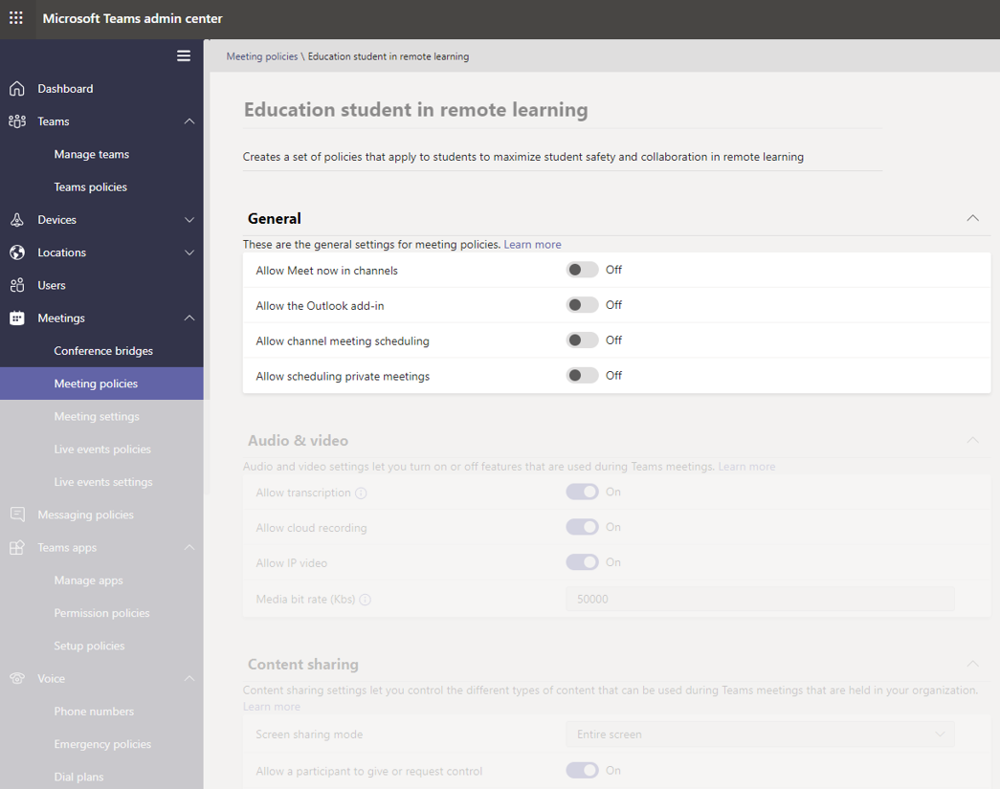

- And on the same page, in the Participants and Guests in meeting section: **Allow Meet now in private meetings**: Off

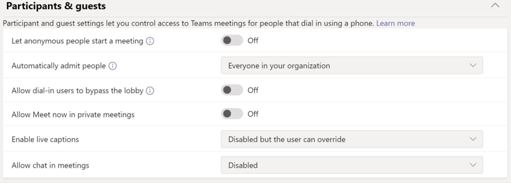

#### Control whether or not students can share their videos during calls and meetings

In the meeting policies section, ensure that the Audio and visual values you set for your students aligns to your educational institution’s guidelines, as well as the desires of students, educators, and parents and guardians (With the exception of **Allow cloud recording**, which we recommend be set to **Off**).

The options here:

- **Allow transcription**: Off/On
- **Allow cloud recording**: **Off**
- **Allow IP Video**: Off/On

:::image type="content" source="media/edu-policy-list-b.png" alt-text="Education student in remote learning page with the video options showing.":::

### Live events policies

#### Turn off the ability to create and start live events

To ensure that students can’t schedule a live events to communicate unattended, disable the **Allow scheduling** policy for students by setting it to **Off**.

:::image type="content" source="media/edu-allow-scheduling-off.png" alt-text="Education student in remote learning page with the allow scheduling option turned Off.":::

### Calling policies

#### Turn off the ability to make private calls

To ensure that students can’t make private calls with other students or educators, disable the **Make private calls** policy for students by setting it to **Off**.

:::image type="content" source="media/edu-private-calls-off.png" alt-text="Education student in remote learning page with Make private calls set to Off.":::

### Messaging policies

#### Turn off the ability to delete or edit sent messages

- For students: To make sure the messages that students send aren’t deleted or altered, students should have these settings turned **Off**:
  - **Delete sent messages**
  - **Edit sent messages**
- For educators: To make sure that educators can moderate or delete inappropriate messages students sent, educators should have these settings turned **On**:
  - **Owners can delete sent messages** (This setting allows educators to delete inappropriate student messages)
  - **Delete sent messages**
  - **Edit sent messages**

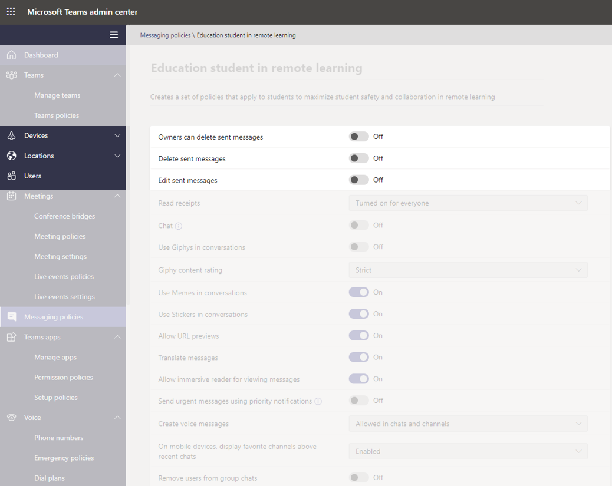

> [!NOTE]
> For more information on this topic, check out [Mute student comments in a class team.](https://support.office.com/article/Mute-student-comments-in-a-class-team-a378de16-ffc0-420c-b08d-e17ec08e7c17).

#### Control whether students can chat privately

Ensure that the **Chat On/Off** value you set for students aligns to your educational institution’s guidelines as well as the desires of students and educators. This control turns on or off the ability for a user to communicate privately in 1:1 chat or group chat in Teams.

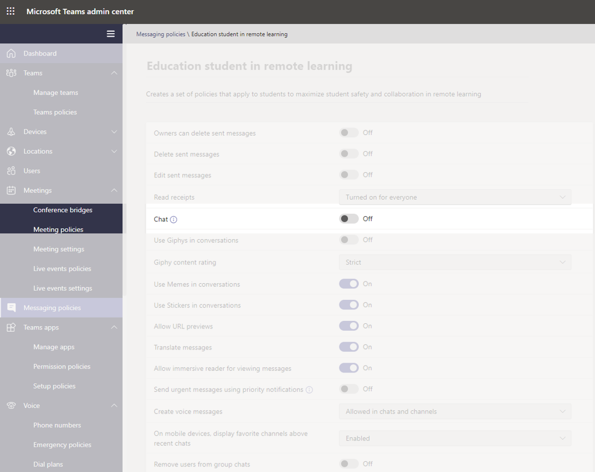

#### Control whether students can personalize their messages

Ensure that the value you set for students aligns to your educational institution’s guidelines as well as the desires of students, educators, parents, and guardians. Our recommendation is to set **Giphy for students** to **Off**, and keep **Memes and Stickers** turned **On**.

#### Control whether students can send voice messages

Ensure that the value you set for **Create voice messages** for students aligns to your educational institution’s guidelines as well as the desires of students and educators.

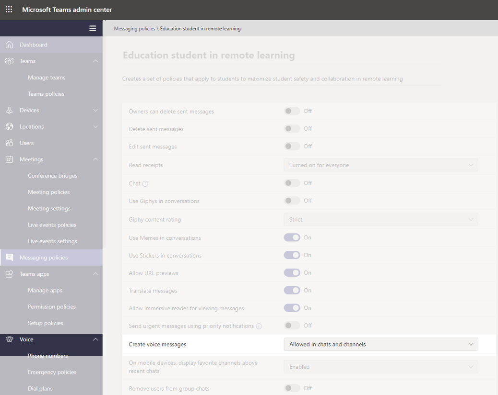

#### Turn off the ability to remove users from chat for students

Students should not have the ability to remove other users from any chats they're included in. The setting for **Remove users from group chats** should be set to **Off**.

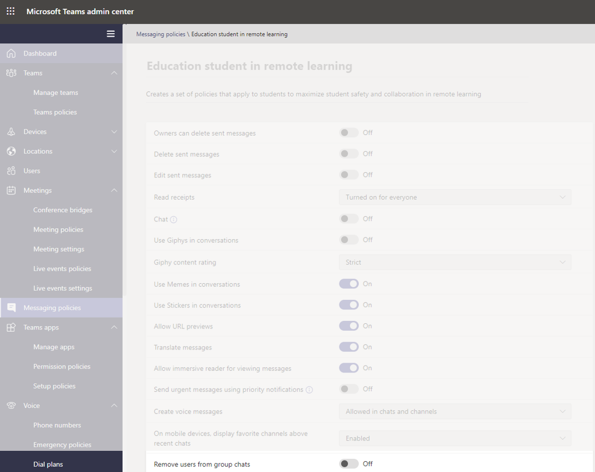

### Teams policies

#### Turn off the ability to discover and create private channels

To ensure that students can’t create a private channel as personal space to communicate without supervision, set the **Create private channels** policy for students to **Off**.

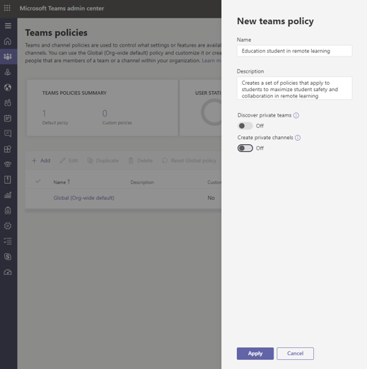

> [!IMPORTANT]
> Likely you will also want to ensure students don't have the ability to create new teams in Microsoft Teams. This is actually an M365 groups setting, and you can read more about it [here](https://docs.microsoft.com/microsoft-365/admin/create-groups/manage-creation-of-groups).

### App permission policies

#### Control whether students can add apps within Teams

Ensure the values you set for students align to your educational institution’s guidelines. For example, if you’d like the students to be exposed to the apps you approve, you can select:

- **Microsoft apps**: **Allow all apps**
- **For Third-party apps**: **Allow specific apps and block all others**
- **For Tenant apps**: **Allow specific apps and block all others**

:::image type="content" source="media/edu-policies-apps.png" alt-text="Education student in remote learning page with the app policies options set.":::

> [!NOTE]
> This is an example, and as stated above, you should set these policies in accordance to your educational institution's guidelines.

## Policies that should be assigned for educators

These are recommended policy settings for admins to apply for educators, so they can have a safe class experience for their students.

> [!NOTE]
> The policy recommendations for students contains more information than the educators' sections you'll see below. While you may set policy settings in-line with your educational institute's own policies and procedures, the recommendations provided here are strictly relevant when it comes to the safety and security of students.

### Meeting policies

These settings will allow educators to control access to their meetings.

- **Let anonymous people start a meeting**: **Off**
- **Automatically admit people**: **Everyone in your organization**
- **Allow dial-in users to bypass the lobby**: **Off**
- 1**DesignatedPresenterRoleMode**: **OrganizerOnlyUserOverride**

1 This setting isn't in the Microsoft Teams admin center, so you'll need to use PowerShell to set the **DesignatedPresenterRoleMode** parameter using the [Set-CsTeamsMeetingPolicy](https://docs.microsoft.com/powershell/module/skype/set-csteamsmeetingpolicy) or [New-CsTeamsMeetingPolicy](https://docs.microsoft.com/powershell/module/skype/new-csteamsmeetingpolicy) cmdlet. This sets the default value of the **Who can present?** setting in **Meeting options** in Teams to **Only me**. With this setting, only the meeting organizer can be a presenter and all other meeting participants are designated as attendees. To learn more, see [Meeting policy settings - Designated presenter role mode](meeting-policies-in-teams.md#meeting-policy-settings---designated-presenter-role-mode).

> [!NOTE]
> For staff who aren't educators, you may want to set the parameter to **EveryoneUserOverride** (which corresponds to the **Everyone** setting in Teams) or **EveryoneInCompanyUserOverride** (which corresponds to the **People in my organization** setting in Teams.)

### Messaging policies

Setting **Owners can delete sent messages** to **On** will allow educators to monitor chat sessions and remove inappropriate messages in channel meetings.

> [!NOTE]
> This allows educators to remove inappropriate messages in class chats when the meeting is created within the channel, or to remove messages within the channel itself.

## What educators can do to protect students

Of course, while setting policies is a great way for Admins to proactively protect students in a Teams setting, educators are the people who are interacting with the students on a regular basis, and they also have a vital role to play to keep students safe. Admins may want to discuss the following information with the educators they work with.

### Set meeting roles through your Meeting options

Meeting options allow you to control if meeting participants join your meetings as attendees or presenters. Your options are:

- Go to your **Calendar**  and navigate to the meeting you'd like to update. Click or tap **Meeting options** near the meeting join link to open your **Meeting options**.

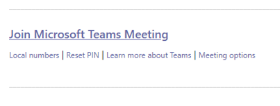

- Control who can enter the meeting directly with the **Who can bypass the lobby** selection. Set it to **People in my organization** to keep external users from having the option to enter, and turn **Always let callers bypass the lobby** to **Off** to have participants wait to be admitted to the meeting instead of joining immediately. You also have the option to **Announce when callers join or leave**, and this should be set to **On** so you're always aware of who's in the meeting.
- Control who joins the meeting as a presenter or attendee.​ You can select **Only Me** to designate all other participants as attendees. This is the safest set-up for meetings held in a classroom setting.
  - If you expect to have more than one presenter in your meeting, select **Specific people** and pick the other participants who should join as presenters. Select **Everyone** if you want all participants to join the meeting as a presenter.

:::image type="content" source="media/edu-meeting-options.png" alt-text="Who can bypass the lobby dropdown with People in my organization selected and Who can present dropdown with Only me selected.":::

### Roles in an online meeting

Every participant in a meeting is assigned a role as a presenter or attendee. A participant's role controls what they can do in a meeting. Please see the table below.

|Capabilities  |Organizer/Presenter  |Attendee  |
|---------|---------|---------|
|Speak and share video     |     Y     |     Y     |
|Participate in meeting chat     |     Y     |     Y     |
|Privately view a PowerPoint file shared by someone else     |     Y     |     Y     |
|Share content     |     Y     |     N     |
|Mute other participants|     Y     |     N     |
|Remove participants      |     Y     |     N     |
|Admit participants from the lobby|     Y     |     N     |
|Change the roles of other participants     |     Y     |     N     |
|Start or stop recording     |     Y     |     N     |

### Change roles during a meeting

Every participant in a meeting is assigned a role as presenter or attendee. A participant's role controls what they can do while in a meeting.

- To change a participant's role, click or tap to **Show participants** in your call controls. Right-click on the participant whose role needs to be changed, and then select **Make an attendee** or **Make a presenter**.

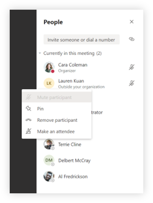

- To quickly access your Meeting options and change the meeting role settings for both current participants and anyone joining your meeting in the future, click or tap **More actions** in your call controls, and then **Show meeting details**. You can find the link to your **Meeting options** near the join link for the meeting.

:::image type="content" source="media/edu-meeting-details.png" alt-text="Meeting window with Meeting details pane on the right hand side.":::

### Mute student comments

After the meeting, you can block students from commenting further if you scheduled a channel meeting.

#### For a specific meeting

When you schedule a meeting in a channel, the meeting itself is a channel post, and the meeting chats are replicas of the post. As the team owner, you can click or tap **More actions** for that post, click **Edit**.

:::image type="content" source="media/edu-meeting-edit.png" alt-text="Choosing More options on a channel post and seeing the Edit menu option as the second option on the pop-up menu.":::

On the edit pane, you have a dropdown option, where you can set that option to be **You and moderators can reply**.

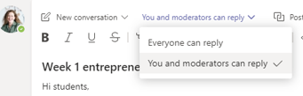

### For all meetings and posts of a team

You can control when students can post and reply in the class team and meeting chats. Click or tap **More actions** of the team, click **Manage Team**, go to **Members**, and either select individuals to mute or **Mute all students**.

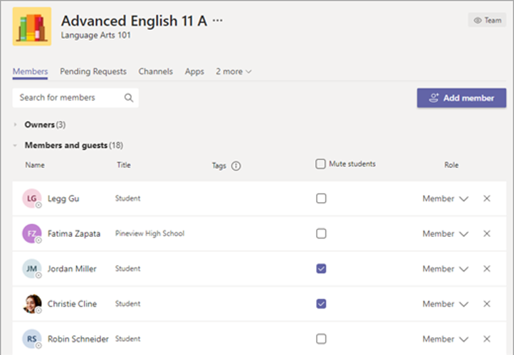

## Further reading

Please review the [Keeping students safe while using meetings in Teams for distance learning](https://support.office.com/article/keeping-students-safe-while-using-meetings-in-teams-for-distance-learning-f00fa399-0473-4d31-ab72-644c137e11c8) for more information on protecting students.
