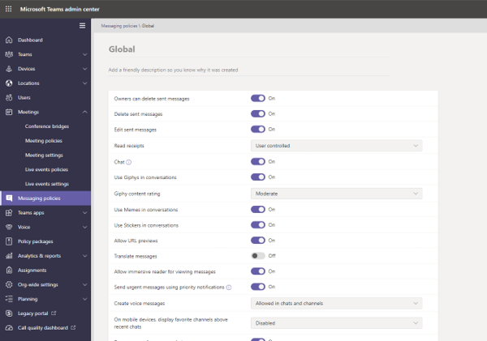
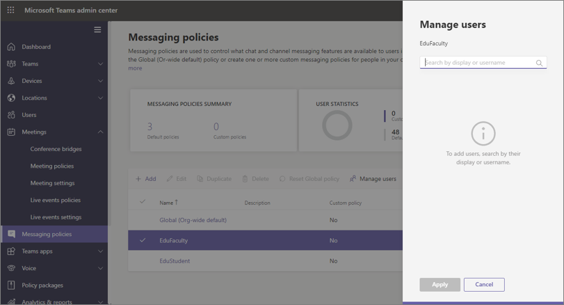
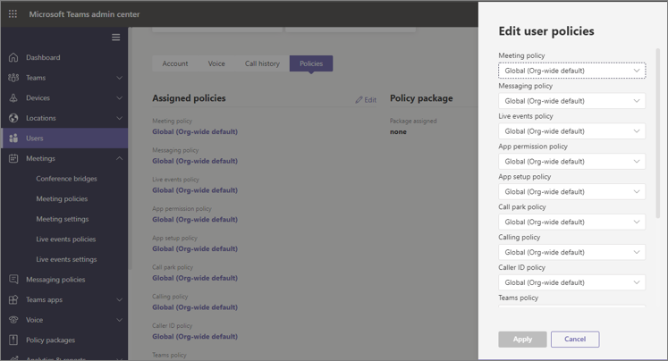

# Teams policies and policy packages for Education

[!INCLUDE [policy-wizard-edu](includes/policy-wizard-edu.md)]

> [!NOTE]
> For the larger story on policies in Microsoft Teams, please review [Assign policies to your users in Microsoft Teams](policy-assignment-overview.md).

## Admins: Getting started with Microsoft Teams policy management

Microsoft Teams allows users to do things like attend online meetings or live events, chat, make calls, and use apps. Setting the right Microsoft Teams admin policies is a critical step in ensuring that Teams is a safe learning environment for students. As an admin, you can use policies to control the Teams features that are available to users in your educational institute. In most cases, policies must be adjusted for both students and educators to keep the environment safe.  

Here's a list of the main policy areas you will find in Microsoft Teams. To learn more about the policies in each area and the capabilities they control, use the links below:

- [Meetings](meeting-policies-overview.md)
- [Live events](teams-live-events/configure-teams-live-events.md)
- [Calling](teams-calling-policy.md) 
- [Messaging](messaging-policies-in-teams.md)
- [Teams](teams-policies.md)
- [App permissions](teams-app-permission-policies.md)

:::image type="content" source="media/edu-admin-center-users.png" alt-text="Screenshot of user with policies applied.":::

You can manage all Teams policies in the [Microsoft Teams admin center](https://admin.teams.microsoft.com) by signing in with your admin credentials.

### Where to find Microsoft Teams policies

Once you've logged into the Teams admin center, you'll be able to go to the policy settings for any area of Teams you need to manage, by clicking on the policy option in the left hand navigation of the Teams admin center. We've included a screenshot of the location of the messaging policies.

:::image type="content" source="media/edu-messaging-policies.png" alt-text="Message policy location in the Teams admin center.":::

### How to create and update a policy definition

Before you assign policies to your users, you need to first add and create your policy definitions for each capability area with Teams.

> [!NOTE]
> We recommend that you set different policy definitions for your students and educators.

By default, every new user (student or educator) will be assigned the Global (Org-wide default) policy definition for each capability area. We recommend that you use the Global (Org-wide default) for your strictest set of policy definitions. In most cases, this stricter policy set will be more appropriate for students. Using your Global (Org-wide default) policy definition in this way will ensure that new users will have the tightest restrictions when they are added to your tenant. To adhere to this guidance, we recommend you follow these steps:

1. Create a custom policy definition for each Teams capability area with policy values that are fitting for your educators' needs (without this, educators will have the same restricted access as your students as defined within the Global (Org-wide default) policy definition).

1. Assign these new custom policy definitions to your educators.

1. Edit the Global (Org-wide default) policy definitions for each capability area with values that are appropriate for your students.

1. The Global (Org-wide default) policy definitions will be applied to your students as long as they have no other policy definitions assigned.

To create or edit policy definitions, go to the policy capability area you want to work in (for example, Messaging policies). Select **Add** to create a new custom policy definition. To change an existing policy definition, select **Edit**.

:::image type="content" source="media/edu-messaging-policies-add-closeup.png" alt-text="Close up of the messaging policies section with a view of the Add button.":::

Whether you choose to add or edit a policy definition, you're brought to a view that lists all the policy options related to this policy area. Use this list to select what values you want set in your policy definition.

> [!IMPORTANT]
> Don’t forget to select **Save** before you leave the page.

### Assigning policy definitions 
There are multiple methods you can use to assign policy definitions to your users. Each method has its own advantages and disadvantages, which will differ depending on your institution's unique needs.  

In most cases, we recommend that you use group policy assignment to assign policies to your users. This method allows for faster and more seamless policy application.  When a user is added to a group that has a policy definition assigned to it, the new user automatically inherits the policies of the group.  This allows for easier policy management when large numbers of users are added and removed to the environment, for example at the beginning and ending of a school term.  

For large organizations, we also recommend batch policy assignment, which is tailored for cases where you need to assign policies to large sets of users. To learn more about these application methods, refer to [Assign policies to large sets of users in your school](batch-group-policy-assignment-edu.md).

If you have a smaller institution or have a need to update an individual student or educator's policy settings, follow the instructions below.  

> [!IMPORTANT]
> Policy assignments given at the individual user level override any group policies assigned to the user. Ensure that you are only using individual policy assignments when you desire to override group policy settings. 

#### How to assign a policy definition to a user

> [!NOTE]
> Assigning a policy definition may take a while to propagate out to all the users and clients. You might want to do this when the user accounts are first created in Azure/M365, and whenever a new student joins the educational institute.

Once your policy definition is created or updated, you can assign it to a user by selecting **Manage users** on the policy page, searching for the desired user, then applying the policy.

You can also assign a policy to a user by navigating to **Users**, selecting the user you wish to update policies for, selecting **Policies**, then **Edit**. From there, you can select the policy definition you’d like to assign to the user for each capability area.

### Policy packages in Microsoft Teams
> [!NOTE]
> For more reading, you can check out [Manage policy packages in Microsoft Teams](manage-policy-packages.md) for step by step guidance on assigning single users a package, assigning packages in bulk to up to 5000 users, and managing and updating the policies linked to each package.

A policy package in Teams collects predefined policies and policy settings that you learned about outlined above, and assigns them to users with similar roles in your institution. Policy packages simplify, streamline, and help provide consistency when managing policies. In normal practice, you assign each of your users a policy package, and  redefine the policies in each package as needed to suit the needs of that user group. When you update settings in a package, all users assigned to that package are changed as a bulk update.

Educational institutions in general have many users with unique needs, depending partly on the age and maturity of the students. For example, you may want to grant educators and staff full access to Microsoft Teams, but want to limit Microsoft Teams capabilities for students to encourage a safe and focused learning environment. You can use policy packages to tailor settings based on the needs of different cohorts in your educational institute community.

> [!IMPORTANT]
> Our primary recommendation is that you use the Global (Org-wide default) policy definition for students instead of a policy package. This ensures that new users in your organizations always have the strictest set of policies appropriate for students. If this recommendation does not meet the needs of your institution, one of the student policy packages below may be a good alternative. 

Just like the policy list earlier in this article, policy packages predefine policies for:

- Meetings
- Live events
- Calling
- Messaging
- App permissions

Microsoft Teams currently includes the following policy packages:

|Package name listed in Microsoft Teams Admin center |Best used for  |Description |
|:--- |:--- |:--- |
|**Education_Teacher**| Educators and staff| Use this set of policies and policy settings to grant educators and staff within your organization full access to chat, calling and meetings through Microsoft Teams. |
|**Education_PrimaryStudent**| Primary school aged students  | Younger, primary school aged students within your institution may need more limits within Microsoft Teams. Use this set of policies and policy settings to limit capabilities like meetings creation and management,  chat management, and private calling. |
|**Education_SecondaryStudent**| Secondary school aged students | Secondary school aged students within your institution may need more limits within Microsoft Teams. Use this set of policies and policy settings to limit capabilities like meetings creation and management,  chat management, and private calling. |
|**Education_HigherEducationStudent**| Higher education students | Higher education students within your intuition may need fewer limits than younger students, but some limitations may be recommended. You can use this set of policies and policy settings to give access to chat, calling, and meetings within your  organization, but limit how your students use Microsoft Teams with external participants. |
|**Education_PrimaryTeacher_RemoteLearning**| Educators and staff | Creates a set of policies that apply to primary teachers to maximize student safety and collaboration when using remote learning. |
|**Education_PrimaryStudent_RemoteLearning**| Primary school aged students| Creates a set of policies that apply to primary students to maximize student safety and collaboration when using remote learning.
|||

:::image type="content" source="media/edu-policy-packages-list.png" alt-text="Policy packages page with list of policy packages to choose from.":::

Each individual policy is given the name of the policy package so you can identify policies linked to a policy package. For example, when you assign the Education_Teacher policy package to educators in your educational institution, a policy named Education_Teacher is created for each policy in the package.

> [!NOTE]
> If you decide that educators and administrative support staff need different policies, you can repurpose an existing package: identify a package you aren't currently using and change the settings to be appropriate for that group. You might have to make a note to yourself which group has which package, but that's the only impediment to repurposing a package.

## Manage policy packages

### View

View the settings of each policy in a policy package before you assign a package. In the left navigation of the Microsoft Teams admin center, select **Policy packages**, select the package name, and then select the policy name.

Decide whether the predefined values are appropriate for your organization or whether you need to customize them to be more restrictive or lenient based on your organization's needs.

### Customize

Customize the settings of policies in the policy package, as needed, to fit the needs of your organization. Any changes you make to policy settings are automatically applied to users who are assigned the package. To edit the settings of a policy in a policy package, in the Microsoft Teams admin center, select the policy package, select the name of the policy you want to edit, and then select **Edit**.

Keep in mind that you can also change the settings of policies in a package after you assign the policy package. To learn more, see [Customize policies in a policy package](manage-policy-packages.md#customize-policies-in-a-policy-package). 

### Assign

Assign the policy package to users. If a user has a policy assigned, and then later you assign a different policy, the most recent assignment will take priority.

> [!NOTE]
> Each user will require the Advanced Communications add-on in order to receive a custom policy package assignment. For more information, see [Advanced Communications add-on for Microsoft Teams](/microsoftteams/teams-add-on-licensing/advanced-communications).

#### Assign a policy package to one or several users

To assign a policy package to one or multiple users, in the left navigation of the Microsoft Teams admin center, go to **Policy packages**, and then select **Manage users**.  

To learn more, see [Assign a policy package](assign-policy-packages.md).

If a user has a policy assigned, and then later you assign a different policy, the most recent assignment will take priority.

#### Assign a policy package to a group

**This feature is in private preview**

Policy package assignment to groups let you assign multiple policies to a group of users, such as a security group or distribution list. The policy assignment is propagated to members of the group according to precedence rules. As members are added to or removed from a group, their inherited policy assignments are updated accordingly. This method is recommended for groups of up to 50,000 users but will also work with larger groups.

To learn more, see [Assign a policy package to a group](assign-policy-packages.md#assign-a-policy-package-to-a-group).

#### Assign a policy package to a large set (batch) of users

Use batch policy package assignment to assign a policy package to large sets of users at a time. You use the [New-CsBatchPolicyPackageAssignmentOperation](/powershell/module/teams/new-csbatchpolicypackageassignmentoperation) cmdlet to submit a batch of users and the policy package that you want to assign. The assignments are processed as a background operation and an operation ID is generated for each batch.

A batch can contain up to 5,000 users. You can specify users by their object Id, UPN, SIP address, or email address. To learn more, see [Assign a policy package to a batch of users](assign-policy-packages.md#assign-a-policy-package-to-a-batch-of-users).

## Policies that should be assigned for student safety

For more information on the steps you need to take to protect students in your environment, carefully review [Keeping students safe while using Teams for distance learning](https://support.office.com/article/keeping-students-safe-while-using-meetings-in-teams-for-distance-learning-f00fa399-0473-4d31-ab72-644c137e11c8).
