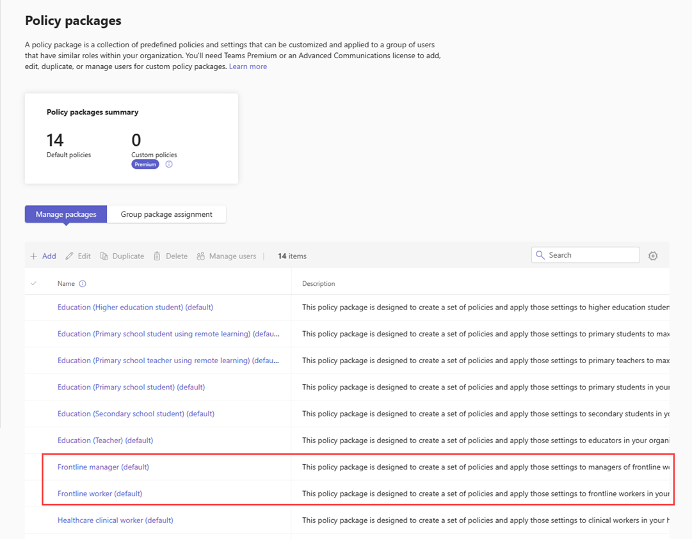
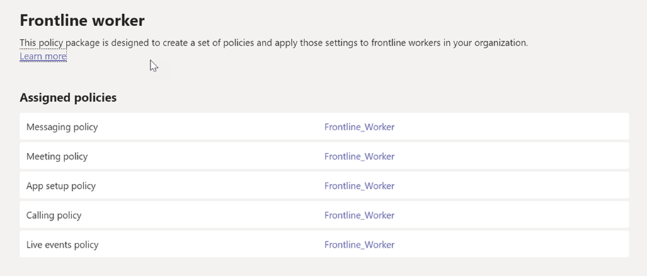
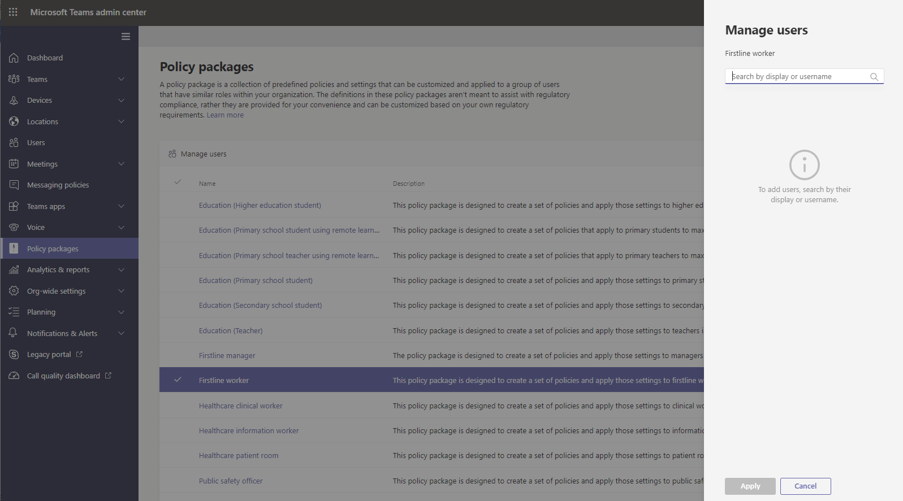

# Teams policy packages for Firstline Workers and Firstline Managers

## Overview

A [policy package](manage-policy-packages.md) in Microsoft Teams is a collection of predefined policies and policy settings that you can assign to users who have similar roles in your organization. Policy packages simplify, streamline, and help provide consistency when managing policies.

When you assign a policy package to a set of users, the policies in the package are created, and you can then customize the settings of the policies in the package to suite of the needs of that set of users. When you update settings in a policy package, all users who are assigned to that package get the updated settings. You can manage policy packages by using the Microsoft Teams admin center or PowerShell.

Policy packages predefine policies for the following:

- Meetings
- Live events
- Calling
- Messaging
- Teams
- App permissions

Teams currently includes the following policy packages for the Firstline Workforce.

|Package name in the Microsoft Teams admin center  |Best used for|Description |
|---------|---------|---------|
|Firstline manager |Firstline Managers in your organization|Creates a set of policies and applies those settings to Firstline Managers in your organization. |
|Firstline worker |Firstline Workers in your organization|Creates a set of policies and applies those settings to Firstline Workers in your organization. |

Each individual policy is given the name of the policy package so you can easily identify the policies that are linked to a policy package. For example, when you assign the Firstline worker policy package to Firstline Workers in your organization, a policy named Firstline_Worker is created for each policy in the package.

## Manage policy packages

### View

View the settings of each policy in a policy package before you assign a package. In the left navigation of the Microsoft Teams admin center, click **Policy packages**, and then click to the left of the package name.

Decide whether the predefined values are appropriate for your organization or whether you need to customize them to be more restrictive or lenient based on your organization's needs.

### Assign

Assign the policy package to users. Remember that policies in a policy package aren't created until you assign the package, after which you can change the settings of individual policies in the package. 

To assign a policy package to one or multiple users, click **Manage users**. You can also use PowerShell to assign a policy package to large batches of users. For steps on how to assign a policy package, see [Assign a policy package](manage-policy-packages.md#assign-a-policy-package).

If a user has a policy assigned, and then later you assign a different policy, the most recent assignment will take priority.

### Customize

Customize the settings of policies in the policy package to fit the needs of your organization. Any changes you make to policy settings are automatically applied to users who are assigned the package. You can edit the settings of a policy through the **Policy packages** page or by going directly to the policy page in the Microsoft Teams admin center. To learn more, see [Customize policies in a policy package](manage-policy-packages.md#customize-policies-in-a-policy-package).

## Related topics

[Manage policy packages in Teams](manage-policy-packages.md)

[Assign policies to your users in Teams](assign-policies.md)
