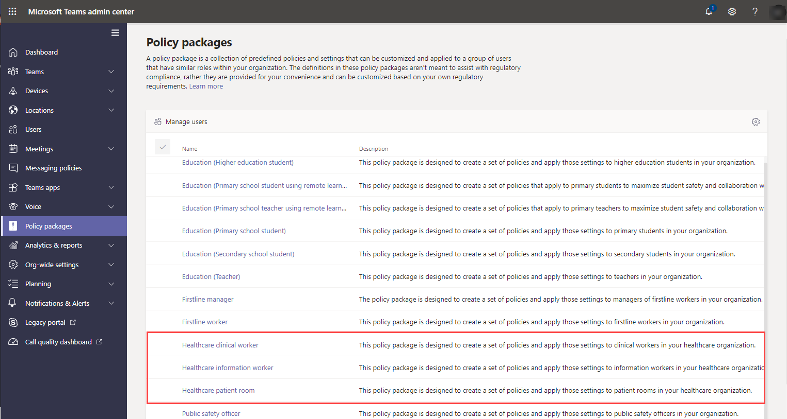

# Teams policy packages for healthcare

## Overview

A [policy package](manage-policy-packages.md) in Microsoft Teams is a collection of predefined policies and policy settings that you can assign to users who have similar roles in your organization. Policy packages simplify, streamline, and help provide consistency when managing policies. You can customize the settings of the policies in the package to suit the needs of your users. When you change the settings of policies in a policy package, all users who are assigned to that package get the updated settings. You can manage policy packages by using the Microsoft Teams admin center or PowerShell.

Policy packages pre-define policies for the following, depending on the package:

- Messaging
- Meetings
- Calling
- App setup
- Live events

Teams currently includes the following healthcare policy packages.

|Package name in the Microsoft Teams admin center|Best used for|Description |
|---------|---------|---------|
|Healthcare clinical worker  |Clinical workers in your healthcare organization  |Creates a set of policies and policy settings that give clinical workers such as registered nurses, charge nurses, physicians, and social workers full access to chat, calling, shift management, and meetings. |
|Healthcare information worker  |Information workers in your healthcare organization |Creates a set of policies and policy settings that give information workers such as IT personnel, informatics staff, finance personnel, and compliance officers, full access to chat, calling, and meetings.|
|Healthcare patient room  |Patient room devices|Creates a set of policies and policy settings that apply to patient rooms in your healthcare organization.|

Each individual policy is given the name of the policy package so you can easily identify the policies that are linked to a policy package. For example, when you assign the Healthcare clinical worker policy package to clinicians in your organization, a policy named Healthcare_ClinicalWorker is created for each policy in the package.

## Manage policy packages

### View

View the settings of each policy in a policy package before you assign a package. In the left navigation of the Microsoft Teams admin center, select **Policy packages**, select the package name, and then select the policy name.

Decide whether the predefined values are appropriate for your organization or whether you need to customize them to be more restrictive or lenient based on your organization's needs.

### Customize

Customize the settings of policies in the policy package, as needed, to fit the needs of your organization. Any changes you make to policy settings are automatically applied to users who are assigned the package. To edit the settings of a policy in a policy package, in the Microsoft Teams admin center, select the policy package, select the name of the policy you want to edit, and then select **Edit**.

Keep in mind that you can also change the settings of policies in a package after you assign the policy package. To learn more, see [Customize policies in a policy package](manage-policy-packages.md#customize-policies-in-a-policy-package). 

### Assign

Assign the policy package to users. To assign a policy package to one or multiple users, click **Manage users**. You can also [use PowerShell](https://docs.microsoft.com/powershell/module/teams/new-csbatchpolicypackageassignmentoperation) to assign a policy package to large batches of users. 

For steps on how to assign a policy package using the Microsoft Teams admin center or PowerShell, see [Assign a policy package](manage-policy-packages.md#assign-a-policy-package).

If a user has a policy assigned, and then later you assign a different policy, the most recent assignment will take priority.

## Related topics

[Manage policy packages in Teams](manage-policy-packages.md)

[Assign policies to your users in Teams](assign-policies.md)
