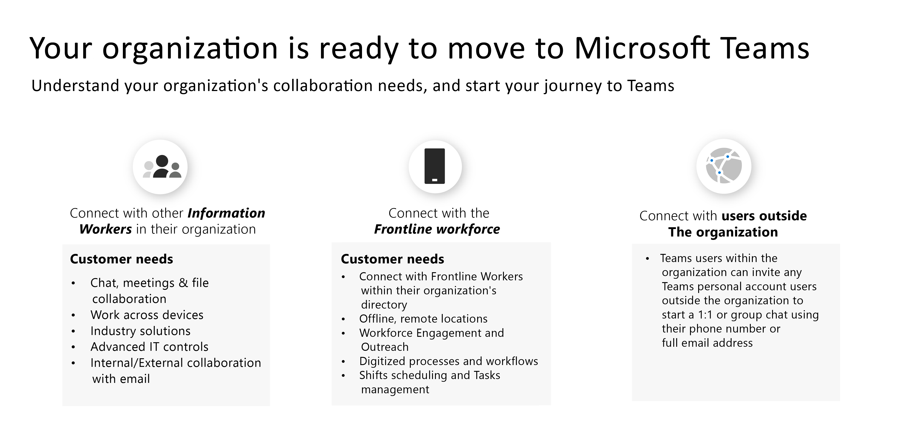

# Charting your Kaizala to Teams journey

You’ve decided to move from Kaizala to Microsoft Teams.

Before getting started, it is important to answer these two questions:

- What user groups will be moving to Teams?  

- What is your path to Teams?

## Identify User Groups

*What groups exist in your organization? Who will be using Teams and how? What needs will these groups require for effective teamwork?* To begin your journey to Teams, first **identify users groups for your transition.**  User groups are a set of employees within your workforce that conduct work in similar areas of the business. 

We’ve identified three common user groups to support you in identifying collaboration needs. Every user group has its own unique needs in terms of communication. 

 1. **Information workers** are employees who create, use, transform, consume, or manage information in the course of their work.

 2. **Frontline workers** are mostly desk-less workers whose primary function is to work directly with customers or the general public providing services, support, and selling products, or are directly involved in the manufacturing of products/services.

 3. **External users** are people outside your organization such as your suppliers, vendors, business partners, clients, or customers.

Users connecting with other information workers in their workforce need:

- Chat, meeting, file collaboration

- Work across devices

- Industry solutions

- Advanced IT controls
  
- Internal and external collaboration with email

Users connecting with the Frontline workforce need:

- Connection with Frontline Workers within their organization’s directory

- Offline, remote locations

- Workforce engagement and outreach

- Digitized processes and workflows

- Shifts scheduling and tasks management

Users connecting with external users (suppliers/vendors) could use:

- [Microsoft Teams users can chat with any Teams users who are outside their organization](https://techcommunity.microsoft.com/t5/microsoft-teams-blog/microsoft-teams-users-can-now-chat-with-any-teams-user-outside/ba-p/3070832)

- [Add or invite people outside your Teams org to a chat](https://support.microsoft.com/en-us/office/add-or-invite-people-outside-your-teams-org-to-a-chat-6897ab47-9f60-4db6-8b95-18599714fe57)

## Determine your path

After verifying the collaboration needs of your user groups, you'll be able to determine what your path from Kaizala to Teams will look like. Every organization is unique, and no workforce’s journey will be the exact same. Organizations not currently using Teams will need to make additional strategic decisions to ensure a successful transition journey. Determining your path will help you identify any important actions that should be completed for a successful transition.

We’ve outlined what the path may consist of depending on your organization’s usage today:  

For organizations **not using Teams**:

 1. Envision teamwork for your organization

 2. Pilot Teams
  
 3. Deploy Teams
  
 4. Use Kaizala and Teams
  
 5. Manage change

 6. Plan for your adoption of Teams

 7. Move your organization to Teams

For organizations **already using Teams**:

 1. Plan for your transition

 2. Manage change

## Next Steps

[Plan for a successful transition to Microsoft Teams](/MicrosoftTeams/plan-your-move-kaizala)
