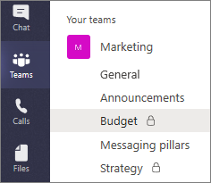
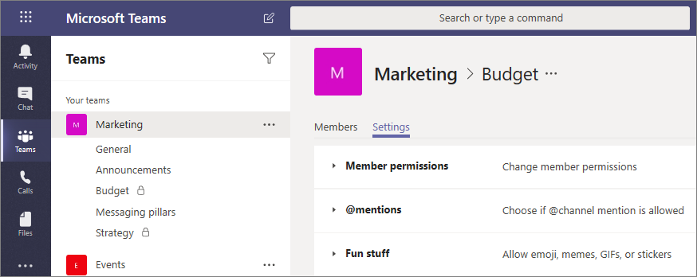

# Private channels in Microsoft Teams

Private channels in Microsoft Teams create focused spaces for collaboration within your teams. Only the users on the team who are owners or members of the private channel can access the channel. You might want to use a private channel if you want to limit communication to those who have a need to know or if you want to facilitate communication between a group of people assigned to a specific project, without having to create an additional team to manage.

For example, a private channel is useful in the following scenarios:

- A group of people in a team want a focused space to collaborate without having to create a separate team.
- A subset of people in a team want a private channel to discuss sensitive information, such as budgets, resourcing, strategic positioning, and so on.

A lock icon indicates a private channel. Team owners can see all private channels in a team. Team members can only see those private channels that they are added to.



The architecture for private channels is different from standard channels. Each private channel has it's own SharePoint site collection where files shared in the channel are stored. The site collection is created in the same geographic region as the parent team site where standard channel files are stored but is separate from it.

A private channel site collection inherits data classification and guest access permissions from the parent team site. The parent team site and the private channel site settings are synced when a private channel is created and can be changed independently afterwards.

## Private channel limitations

Private channels currently don't support the following:

- Wikis
- Messaging extensions
- Bots
- Scheduled channel meetings
- Creation on Teams mobile clients

> [!NOTE]
> We'll be adding more support for apps and other capabilities in private channels so check back here for the most up-to-date information.

Each team can have a maximum of 30 private channels and a each private channel can have a maximum of 250 members.

## When to create a private channel

To determine whether a private channel is appropriate, consider the following questions about who needs to work together and what the collaboration is about.

|Is there already a team that has these people as team members?  |Does this work need to be kept private from others?  |Are there multiple distinct topics to discuss?  |Recommendation  |
|---------|---------|---------|---------|
|Yes      |Yes         |Yes         |Create a private channel in the existing team or consider creating dedicated private channels for each topic.         |
|Yes     |Yes         |No         |Create a private channel in the existing team.         |
|Yes     |No         |No         |Create a channel in the existing team.         |
|No     |No         |No         |Consider creating a new team.         |
|No     |No         |Yes         |Consider creating a new team and then, depending on the confidentiality of each topic, consider creating separate standard or private channels for each topic.         |
|No     |Yes         |No         |Create a new team or create a new private channel in an existing team.         |

When a private channel is created, it is linked to the parent team and can't be moved to a different team. Additionally, private channels can't be converted to standard channels or vice versa.

## Private channel creation and membership

### Who can create private channels?

By default, any team owner or team member can create a private channel. Guests can't create them. The ability to create private channels can be managed at the team level and at the organization level:

- On the **Settings** tab for a team, team owners can turn off or turn on the ability for members to create private channels.
- As an admin, you can use [policies](teams-policies.md) to control which users in your organization are allowed to create private channels.

The person who creates a private channel is the private channel owner and only the private channel owner can directly add or remove people from it. A private channel owner can add any team member to a private channel they created, including guests. Members of a private channel have a secure conversation space, and when new members are added, they can see all conversations (even old conversations) in that private channel.

For steps on how to create a private channel, see ADD LINK TO END USER CONTENT.

### What happens when a team member leaves or is removed from a team?

If a team member leaves or is removed from a team, that user will also leave or be removed from all private channels in the team. If the user is added back to the team, they must be added back to the private channels in the team.

## What happens when a private channel owner is removed from a private channel?

A private channel owner can't be removed through the Teams client if they are the last owner of one or more private channels.

If a private channel owner leaves your organization or if they are removed from the Office 365 group associated with the team, a member of the private channel is automatically promoted to be the private channel owner.

### What can team owners and team members see in a private channel?

Team owners can see the names of all private channels in their team. They can also delete any private channel in the team. (Careful – this can’t be undone!) Team owners can't see the files in a private channel or the conversations and member list of a private channel unless they are members of that private channel.

The following table shows who can see what in a private channel.

|Item  |Team owner can see |Team members can see |
|---------|---------|---------|
|Name and description    |All private channels in the team         |Only the private channels that they are added to         |
|Conversations and tabs     |Only when added to the private channel         |Only when added to the private channel         |
|Files and content    |Only when added to the private channel        |Only when added to the private channel         |

## Manage private channels

The following table outlines what actions owners, members, and guests can do in private channels.

|Action  |Team owner|Team member|Team guest|Private channel owner|Private channel member|Private channel guest|
|---------|---------|---------|---------|---------|---------|---------|
|Create private channel|Yes<sup>1</sup>|Yes<sup>1,2</sup>|No|N/A|N/A|N/A|
|Delete private channel|Yes|No|No|Yes|No|No|
|Leave private channel|N/A|N/A|N/A|Yes<sup>3</sup>|Yes|Yes|
|Edit private channel|No|N/A|N/A|Yes|No|No|
|Restore deleted private channel|Yes|No|No|Yes|No|No|
|Add members|No|N/A|N/A|Yes|No|No|
|Edit settings|No|N/A|N/A|Yes|No|No|
|Manage tabs, apps, and connectors|No|N/A|N/A|Yes<sup>4</sup>|Yes<sup>5</sup>|No|

<sup>1</sup>Assuming the policy that you set allows the user to create private channels.<br>
<sup>2</sup>Each team has a setting that team owners can turn on or off to allow team members to create private channels. Team owners can always create private channels.<br>
<sup>3</sup>Assuming the private channel owner isn't the last owner of the channel. <br>
<sup>4</sup>Requires the team to have an app installed for a private channel to use it.<br>
<sup>5</sup>Private channel owners can configure this.

### Manage private channel membership and settings

Each private channel has its own independent settings, including the ability to add and remove members, add tabs and connectors, and @mentioning for the entire channel. These settings are also independent of the parent team settings.

The private channel owner can click **Manage channel**, and then use the **Members** and **Settings** tabs to add or remove members and edit settings.  



### Set whether team members can create private channels

Team owners can turn off or turn on the ability for members to create private channels. To do this, on the **Settings** tab for the team, turn off or turn on **Allow members to create private channels**.

### Set whether users in your organization can create private channels

As an admin, you can set policies by using the Microsoft Teams admin center or PowerShell to control which users in your organization are allowed to create private channels.

#### Using the Microsoft Teams admin center

Use teams policies to set which users in your organization are allowed to create private channels. For more information, see [Manage teams policies in Teams](teams-policies.md).

#### Using PowerShell

Create a custom policy by using the **New-CSTeamsChannelPolicy** cmdlet, and then assign the policy to users.

Set the **AllowPrivateChannelCreation** parameter to **true** to allow users who are assigned the policy to create private channels.  Setting the parameter to **false** turns off the ability to create private channels for users who are assigned the policy.

By default, **AllowPrivateChannelCreation** is set to **true** in the global policy, and all users in your organization can create private channels.

For example, you might want to allow only certain users the ability to create private channels and turn off the ability for all other users in your organization. The following steps show you how to do this.

1. Run the following to edit the global policy and turn off the ability to create private channels for all users in your organization.

    ```
    Set-CsTeamsChannelsPolicy -Identity Global -AllowPrivateChannelCreation $false
    ```
2. Run the following to create a custom policy to turn on the ability to create private channels.

    ```
    New-CsTeamsChannelsPolicy -Identity CreatePrivateChannels -AllowPrivateChannelCreation $true
    ```
3. Assign the custom policy to users. These users can be team owners or team members.

    ```
    Grant-CsTeamsChannelsPolicy -Identity user1@contoso.com -PolicyName CreatePrivateChannels
    ```

## Compliance

### Classification

Private channels are subject to the same group classification as the parent team. To learn more, see [Plan for governance in Teams](plan-teams-governance.md).

### eDiscovery and General Data Protection Regulation (GDPR)

eDiscovery and GDPR work differently in private channels than in standard channels. Records for messages sent in a private channel are delivered to the mailbox of all private channel members, rather than to a group mailbox. The titles of the records are formatted to indicate which private channel they were sent from.

To perform an eDiscovery search or legal hold on a team that has a private channel, perform a search across the following:

- Team
- Site collections associated with private channels in the team
- Mailboxes of private channel members

### Retention policies

Retention policies in Teams don't apply to private channel messages. To delete private channel messages from a user's mailbox after a specific period of time, run the following script:

[placeholder for script]

### Data loss prevention (DLP)

DLP policies that are applied to users' mailboxes also apply to private channel messages.

## Related topics

- [Overview of teams and channels in Teams](teams-channels-overview.md)
- [Assign team owners and members in Teams](assign-roles-permissions.md)