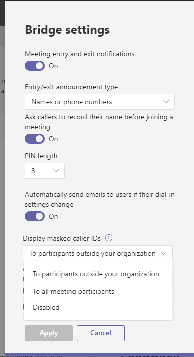
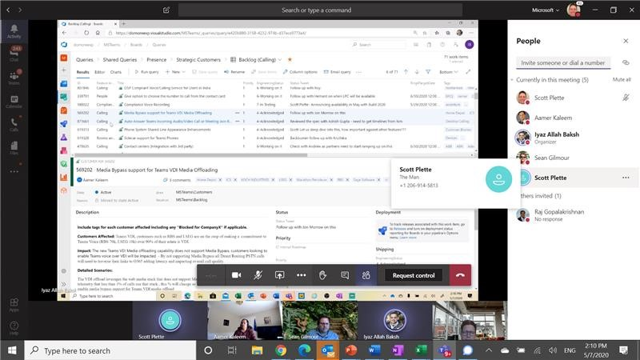

# Mask phone numbers in Microsoft Teams meetings and calls

During a Microsoft Teams meeting or phone call, a participants’ phone number can be visible to all meeting attendees. This is helpful so you can gather someone’s contact information, but it poses security and privacy risk. To remediate this issue, Teams provides a feature that masks the attendee’s phone numbers. Teams lets you implement the solution properly on service side and has a tenant setting which allows admins to toggle masking on/off. The admin can choose whether it is enabled for all meeting participants or only for external participants. The solution can work for healthcare, justice, government, enterprise, and EDU.

## Enable masking for specific participants

A tenant meeting setting allows the admins to choose whether masking is enabled and whether it is for all meeting participants or only for external participants.

**In PowerShell**:

*Name:* MaskPSTNNumbersType

\*\*look up the existing policies; don’t deviate

*DataType:* Enum

*Values:* MaskedForExternalUsers (default), MaskedForAllUsers, NoMasking

P0 – Add to PowerShell / ACMS

P1 – Add to Modern Portal UI

**In the Admin console**:

Location: Teams Admin Portal --&gt; Meetings --&gt; Conference bridges --&gt; Bridge settings

Also see [Meeting policies in Teams](meeting-policies-in-teams.md) to learn how to set the number masking policies.

**MaskPSTNNumbersType = MaskedforExternalUsers (default)**

-   Internal participants (part of the meeting organizer’s tenant) should still see the full phone number.

-   External participants (federated, B2B non-federated and anonymous) should see masked phone numbers.

**MaskPSTNNumbersType = MaskedforAll**

-   All participants in the meeting see masked phone numbers.

**MaskPSTNNumbersType = NoMasking**

-   All participants in the meeting see the full phone number.

**Masking rule**

*What is the determination on this?*

**Multiple dialed-in participants in a meeting with the same number**

The service solution will implement a design which will differentiate between 2 people calling in with the same number.

**Where is the masking applied**

Anywhere in UI where we display phone numbers:

1.  The meeting stage

    1.  phone number should be masked on the **lobby admit notification**

    2.  phone number should be masked on the **participant grid** when the PSTN participant speaks/makes some noise

    3.  **contact card** of dialed in participant should have masked phone number

2.  The Participants panel / meeting roster

    1.  phone numbers should be masked in any of the roster sections (lobby, presenters, attendees) - both display name & tooltip

    2.  **contact card** of dialed in participant should have masked phone number

3.  The external call monitor

4.  The meeting chat header

    1.  **contact card** of dialed in participant should have masked phone number

Meeting types

Phone numbers should be masked in

-   all meeting types

    -   scheduled (private, channel, reply chain)

    -   adhoc (private, channel, reply chain)

    -   structured and unstructured.

<!-- -->

-   group calls

**Note:** This feature shouldn’t affect 1:1 VoIP calls, 1:1 PSTN calls or call queues (which has meeting infrastructure).

Nuances and related features

**Reverse Number Lookup**

If the number of the dialed-in participant is in the AAD, Reverse Number Lookup should continue working instead of displaying the full number or a masked phone number.

When a user hovers on the item with RNL, the phone number should be masked on the contact card.

**Recording**

User attribution in recording should respect the masking setting.

**Transcript**

User attribution in transcript should respect the masking setting.

**Captions**

User attribution in captions should respect the masking setting.

**Attendance report**

The attendance report is available with the following criteria:

if masking is enabled <u>only for external participants</u> – attendance report should have full phone numbers  
if masking is enabled <u>for all participants</u> – attendance report should have masked phone numbers

**PSTN entry/exit chimes**

On the system level, disable the “digit-by-digit" announcement of the phone number if

-   MaskedPSTNNumbersType = MaskedForExternalUsers

-   MaskedPSTNNumbersType = MaskedForAll.

**Dial out**

When a user dials out a phone number from the Invite box and then that number shows up in roster, it will be masked.

**Meeting chat**

PSTN numbers can't appear in the meeting chat as they are not able to send messages in the meeting chat, they are dial-in/phone only participants. Also PSTN numbers don't appear in the meeting chat roster (the list of people in the meeting chat).

**Compliance recording call is escalated to a meeting**

TBD, need to sync with calling PM. Probably the phone number should not be masked.

**Call Analytics**

Some roles in the Modern Portal see the caller and recipient phone numbers masked - last three digits are obfuscated with asterisk symbols. For example, 15552823\*\*\*. [source](https://docs.microsoft.com/en-us/microsoftteams/set-up-call-analytics)

**Meeting and Teams analytics**

In the future…
