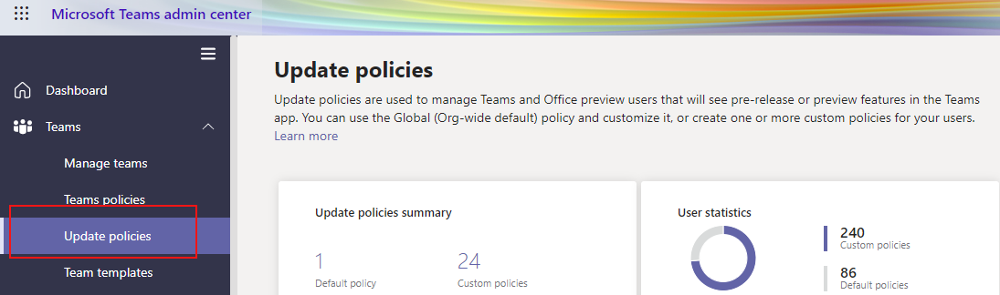

# Microsoft Teams Public Preview

> [!NOTE]
> Features included in preview might not be complete, and might undergo changes before becoming available in the public release. They're provided for evaluation and exploration purposes only. Not supported in Office 365 Government Community Cloud (GCC).

Public Preview for Microsoft Teams provides early access to unreleased features in Teams. Previews allow you to explore and test upcoming features. We also welcome feedback on any feature in public previews. Public preview is enabled per Team user, so you don't need to worry about affecting your entire organization.

For a list of what's available in the Teams public preview, visit [Release Notes for Office Current Channel (Preview)](https://docs.microsoft.com/officeupdates/current-channel-preview).

## Set the Update policy

Public preview is enabled on a per-user basis, and the option to turn on public preview is controlled in an admin policy. Update policies are used to manage Teams and Office preview users who will see pre-release or preview features in the Teams app. You can use the Global (Org-wide default) policy and customize it, or create one or more custom policies for your users. The policy needs to be assigned to specific users because it doesn't over-write the global policy.

1. Sign in to the admin center.
2. Select **Teams**>**Update policies**.

   

3. Select **Add**.
4. Name the update policy, add a description, and turn on **Show preview features**.

You can also set the policy using PowerShell using the `CsTeamsUpdateManagementPolicy` cmdlet.

## Enable public preview

To enable the public preview on a desktop or web client, you need to do the following tasks:

1. Select your profile to display the Teams menu.
2. Select **About** → **Public preview**.
3. Select **Switch to Public preview**.

## Related topics

[Public developer preview](https://docs.microsoft.com/microsoftteams/platform/resources/dev-preview/developer-preview-intro)

