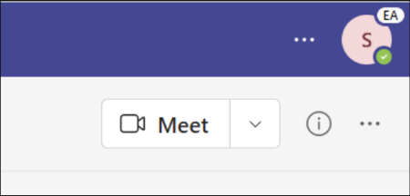

# Microsoft Teams Public Preview

> [!NOTE] 
> Features included in preview might not be complete and could undergo changes before becoming available in the public release. They're provided for evaluation and exploration purposes only. The preview features aren't supported in Office 365 Government Community Cloud (GCC).

Public Preview for Microsoft Teams provides early access to unreleased features in Teams. Previews allow you to explore and test upcoming features. We also welcome feedback on any feature in Public Preview. The Public Preview feature is enabled per Team user, so you don't need to worry about this feature affecting your entire organization.

For a list of what's available in the Teams Public Preview, visit [Microsoft Teams Public Preview tech notes](https://techcommunity.microsoft.com/t5/microsoft-teams-public-preview/bd-p/MicrosoftTeamsPublicPreview).

> [!IMPORTANT] 
> This policy has no effect on users who are part of [Microsoft 365 targeted release](/microsoft-365/admin/manage/release-options-in-office-365). For more information, see [Teams support for Targeted Release](https://techcommunity.microsoft.com/t5/microsoft-teams-blog/introducing-microsoft-teams-support-for-microsoft-365-targeted/ba-p/3804259).

## Set the Update policy

Public Preview is enabled on a per-user basis, and the option to turn on Public Preview is controlled in an admin policy. Update policies are used to manage Teams and Office Preview users who will see pre-release or preview features in the Teams app. You can use the Global (Org-wide default) policy and customize it, or create one or more custom policies for your users. The policy needs to be assigned to specific users because it doesn't overwrite the global policy.

1. Sign in to the [Microsoft Teams admin center](https://admin.teams.microsoft.com/).

2. Select **Teams** > **Teams Update policies**.

1. Select **Add** to create a new policy or select an existing policy and then select **Update policy**.

2. Name the update policy, add a description, and select the setting for **Show Teams preview features**.

   :::image type="content" source="media/new-update-policy-screen.png" alt-text="The New update policy screen." lightbox="media/new-update-policy-screen.png":::

   -   **On for users in Current Channel (Preview)** (default)
       - This default option turns on Teams Public Preview features for any user enrolled in Office Current Channel (Preview).
       - Users enrolled in Office Current Channel (Preview) can't turn Teams Public Preview off.

   -   **Users can opt in**
       - This option enables Teams Public Preview regardless of whether a user is enrolled in Office Current Channel (Preview).
       - The users must turn on the Teams Public Preview in their Teams app because it isn't enabled by default for them.

   - **Off**
     - Teams Public Preview features aren't available to users.

   -  **On for everyone**
       - This option turns on Teams Public Preview regardless of whether a user is enrolled in Office Current Channel (Preview).
       - Users can't turn Teams Public Preview off.

5. Select **Apply**.
1. Ensure that **Microsoft controlled** (default value) is the value selected from the **Use new Teams client** dropdown list.

   :::image type="content" source="media/use-new-teams-client-dropdown-list.png" alt-text="The Use new Teams client dropdown list." lightbox="media/use-new-teams-client-dropdown-list.png":::

You can also set the policy using the PowerShell `Set-CsTeamsUpdateManagementPolicy` cmdlet with the `-AllowPublicPreview` parameter.

## Enable Public Preview

To enable Public Preview on a desktop or web client, perform the following tasks:

1. Select the three dots to the left of your profile to display the Teams menu.
2. Select **About** > **Public preview**.
3. Select **Switch to Public preview**.

> [!NOTE]  
> This option is only available when **Allow public preview** is set to **Enabled**.

### Public Preview for Microsoft Teams Rooms on Windows

Public Preview is turned off by default. When Public Preview is turned on, users have access to features that are in Public Preview on enabled Teams Rooms. To turn on Public Preview, add ```<EnablePublicPreview>True</EnablePublicPreview>``` to your XML configuration file. For more information about the XML file, see [Manage a Microsoft Teams Rooms console settings remotely with an XML configuration file](/microsoftteams/rooms/xml-config-file).

We recommend enrolling 5-10 devices to Public Preview.

All Public Preview features are announced at [Microsoft Teams Public Preview - Microsoft Tech Community](https://techcommunity.microsoft.com/t5/microsoft-teams-public-preview/bd-p/MicrosoftTeamsPublicPreview).

### Public Preview Indicator

Users who are in the Public Preview will see **EA** next to their profile picture, indicating that they have **E**arly **A**ccess to Teams features (as shown in the below image). 



## Related topics

[Public developer preview](/microsoftteams/platform/resources/dev-preview/developer-preview-intro)

