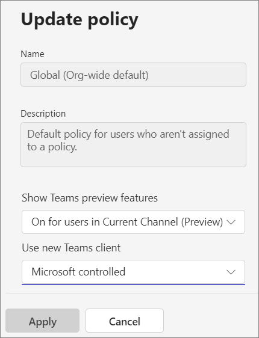

# Microsoft Teams Public preview

> [!NOTE]
> Features included in preview might not be complete and could undergo changes before becoming available in the public release. They're provided for evaluation and exploration purposes only. The preview features aren't supported in Office 365 Government Community Cloud (GCC).

Public preview for Microsoft Teams provides early access to unreleased features in Teams. Previews allow you to explore and test upcoming features. We also welcome feedback on any feature in public preview. The public preview feature is enabled per Team user, so you don't need to worry about this feature affecting your entire organization.

For a list of what's available in the Teams Public preview, visit [Microsoft Teams Public preview tech notes](https://techcommunity.microsoft.com/t5/microsoft-teams-public-preview/bd-p/MicrosoftTeamsPublicPreview).

> [!IMPORTANT]
> This policy has no effect on users who are part of [Microsoft 365 targeted release](/microsoft-365/admin/manage/release-options-in-office-365). For more information, see [Teams support for Targeted Release](https://techcommunity.microsoft.com/t5/microsoft-teams-blog/introducing-microsoft-teams-support-for-microsoft-365-targeted/ba-p/3804259).

> [!TIP]
> As a companion to this article, we recommend using the [Microsoft Teams Setup Guide](https://go.microsoft.com/fwlink/?linkid=2270034) when signed in to the Microsoft 365 admin center. This guide will customize your experience based on your environment. To review best practices without signing in and activating automated setup features, go to the [Microsoft 365 setup portal](https://go.microsoft.com/fwlink/?linkid=2270204).

## Set the Update policy

Public preview is enabled on a per-user basis, and the option to turn on Public preview is controlled in an admin policy. Update policies are used to manage Teams and Office Preview users who will see pre-release or preview features in the Teams app. You can use the Global (Org-wide default) policy and customize it, or create one or more custom policies for your users. The policy needs to be assigned to specific users because it doesn't overwrite the global policy.

1. Sign in to the [Microsoft Teams admin center](https://admin.teams.microsoft.com/).

1. Select **Teams** > **Teams Update policies**.

1. Select an existing policy or select **Add** to create a new one.

    

1. Name the update policy and add a description.
1. Select the setting for **Show Teams preview features**:

   - **On for users in Current Channel (Preview)** (default)
       - This default option turns on Teams Public preview features for any user enrolled in Office Current Channel (Preview).
       - Users enrolled in Office Current Channel (Preview) can't turn off Teams Public preview.

   - **Users can opt in**
       - This option enables Teams Public preview regardless of whether a user is enrolled in Office Current Channel (Preview).
       - The users must turn on Teams Public preview in their Teams app because it isn't enabled by default for them.

   - **Off**
     - Teams Public preview features aren't available to users.

   - **On for everyone**
       - This option turns on Teams Public preview regardless of whether a user is enrolled in Office Current Channel (Preview).
       - Users can't turn off Teams Public preview.

1. Select **Apply**.

You can also set the policy using the PowerShell `Set-CsTeamsUpdateManagementPolicy` cmdlet.

## Enable Public preview

To enable Public preview on a desktop or web client, perform the following tasks:
> [!NOTE]  
> This option is only available when **Show Teams preview features** is set to **Users can opt in** or [Custom app upload](/microsoftteams/platform/concepts/build-and-test/prepare-your-o365-tenant#enable-custom-teams-apps-and-turn-on-custom-app-uploading) is enabled.

# [New Teams client](#tab/new-teams-client)

1. Select **Settings and more** (**...**) next to your user profile.
1. Select **Settings** > **About Teams**.
1. Under **Early access**, select the **Public preview** checkbox.

Users who are in new Teams client will see early Access indicator under Settings -> About Teams

# [Classic Teams](#tab/classic-teams)

1. Select the three dots to the left of your profile to display the Teams menu.
2. Select **About** > **Public preview**.
3. Select **Switch to Public preview**.

Users who are in the classic Teams will see **EA** next to their profile picture indicating that they have **E**arly **A**ccess to Teams features.

---

## Public preview for Microsoft Teams Rooms on Windows

Public preview is turned off by default. When Public preview is turned on, users have access to features that are in public preview on enabled Teams Rooms. To turn on Public preview, add ```<EnablePublicPreview>True</EnablePublicPreview>``` to your XML configuration file. For more information about the XML file, see [Manage a Microsoft Teams Rooms console settings remotely with an XML configuration file](/microsoftteams/rooms/xml-config-file).

We recommend enrolling 5-10 devices to public preview.

All public preview features are announced at [Microsoft Teams Public preview - Microsoft Tech Community](https://techcommunity.microsoft.com/t5/microsoft-teams-public-preview/bd-p/MicrosoftTeamsPublicPreview).

## Related topics

[Deploy the new Teams using policies](new-teams-deploy-using-policies.md)

[Public developer preview](/microsoftteams/platform/resources/dev-preview/developer-preview-intro)
