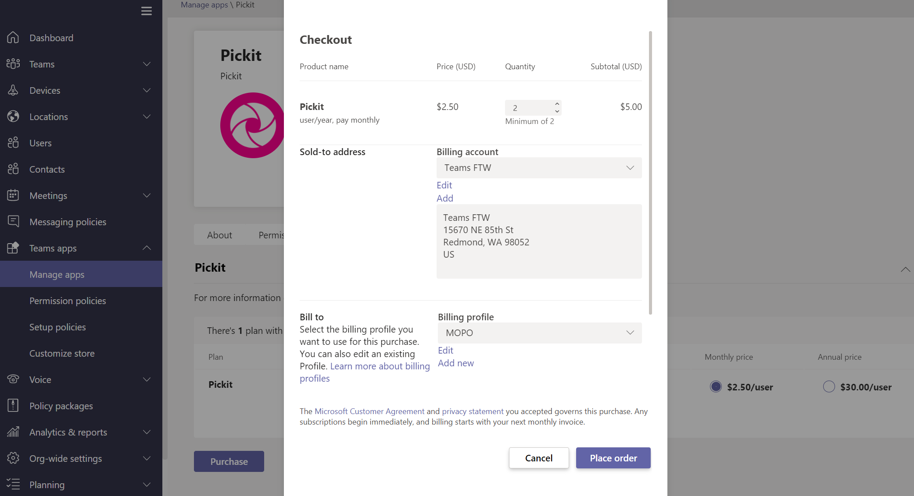

Purchase third-party apps for Teams
======================================================

> [!NOTE]
> This feature is currently only available in the United States.

Teams apps are free to install and some may require purchasing service subscriptions to experience the app's full functionality and scope. These service subscriptions are called Software as a Service (SaaS) offers, which are available for purchase through [AppSource](https://appsource.microsoft.com/) and now through the Microsoft Teams admin center.

The [Manage apps](manage-apps.md) page in the Microsoft Teams admin center is where you view and manage all Teams apps for your organization. For example, you can see the org-level status and properties of apps, upload new custom apps to your organization's app store, block or allow apps at the org level, and manage org-wide app settings.

Here, you can also purchase licenses for services offered by third-party apps for users in your organization. The **Licenses** column in the table indicates whether an app offers a SaaS subscription for purchase.

:::image type="content" source="media/purchase-third-party-apps-list.png" alt-text="Screenshot showing third-party apps that have SaaS subscriptions":::

## Purchase apps in the Teams admin center

1. In the left navigation of the Microsoft Teams admin center, go to **Teams apps** > **Manage apps**. You must be a global admin or Teams service admin to access the page.
2. Search for the app that you want. To identify apps that have a paid SaaS subscription, look in the **Licenses** column. Each app will have one of the following values:
    - **Purchase**: The app offers a SaaS subscription and is available to purchase.  
    - **Purchased**: The app offers a SaaS subscription and you've purchased licenses for it.
    - **- -**: The app doesn't offer a SaaS subscription.
3. When you find the app, click **Purchase** to go to the **Plans and pricing** tab of the app details page. Review the plans and pricing information for the SaaS offer for the app. If you need more information, select the **learn more** link to go to the app's page on [AppSource](https://appsource.microsoft.com/).  
4. To subscribe to an app, choose the plan you want, and select **Purchase**. The checkout flow will open directly in the Teams admin center.
    
5. Select the number of user licenses you want to buy.
6. Check that the billing account and sold-to address is correct. If you don't already have one, add a new one by selecting **New**.
7. Check that the correct billing profile is selected. If you don't already have one, add a new one by selecting **Add new**. The billing profile lets you add a purchase order number to identify your order later.
8. Select **Place order**.
9. Select **Set up** to activate your subscription on the publisher's website.

After you've purchased the SaaS offer associated with the Teams app, you can view the following purchase details on the **Plans and pricing** tab of the app details page.

- **License activation date**: Date on which your license was activated. If your account isn't yet set up, this shows as **Subscription pending activation**.
- **Licenses**: Number of licenses you purchased.

:::image type="content" source="media/purchase-third-party-apps-details-page.png" alt-text="Screenshot of Plans and pricing tab of app details page":::

Select **Manage licenses** to go to the Microsoft 365 admin center to view and manage the licenses you purchased and to manage license assignments for users.

Global admins can view the purchases made by anyone in the organization whereas Teams service admins can only view the purchases made by themselves.  

## Have a SaaS offer for a Teams app that you want to list and sell in the Microsoft Teams admin center and AppSource?

Developers can create SaaS offers associated with their Teams apps. These offers are published through [Partner Center](https://partner.microsoft.com) and are available for organizations to purchase through [AppSource](https://appsource.microsoft.com/) and the Microsoft Teams admin center.

Third-party app developers can go to [Create a SaaS offer](/azure/marketplace/partner-center-portal/create-new-saas-offer) for more information.

## Related topics

- [Manage your apps in the Microsoft Teams admin center](manage-apps.md)
- [Create a SaaS offer](/azure/marketplace/partner-center-portal/create-new-saas-offer)