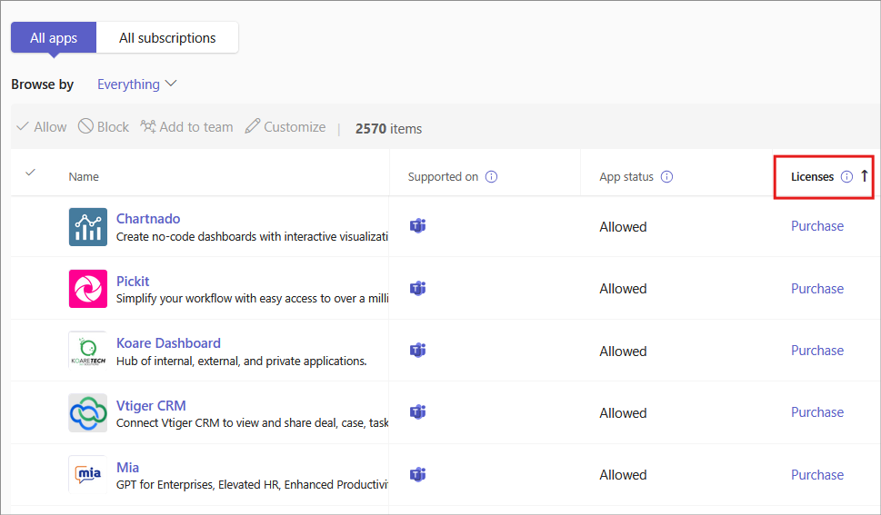

# Purchase third-party apps for Teams

Teams apps are free to install and some may require purchasing service subscriptions to experience the app's full functionality and scope. These service subscriptions are called Software as a Service (SaaS) offers, which are available for purchase through [AppSource](https://appsource.microsoft.com/) and now through the Microsoft Teams admin center.

The [Manage apps](manage-apps.md) page in the Microsoft Teams admin center is where you view and manage all Teams apps for your organization. For example, you can see the org-level status and properties of apps, upload new custom apps to your organization's app store, block or allow apps at the org level, and manage org-wide app settings.

Here, you can also purchase licenses for services offered by third-party apps for users in your organization. The **Licenses** column in the table indicates whether an app offers a SaaS subscription for purchase.

## Purchase apps in the Teams admin center

> [!IMPORTANT]
> When you enable app purchasing, it will also turn on in-app purchasing. Users may see in-app purchase offers which are controlled by the ISV for their app. If you want to block your users from purchasing an app, you have to block the app. For more information on how to block an app, see [Manage app policies](app-policies.md) or [learn how to block an app at the org-level](manage-apps.md#allow-and-block-apps).

1. In the left pane of the Microsoft Teams admin center, go to **Teams apps** > **Manage apps**. You must be a Global admin or Teams service admin to access the page.
1. Search for the app that you want. To identify apps that have a paid SaaS subscription, look in the **Licenses** column. Each app will have one of the following values:
    - **Purchase**: The app offers a SaaS subscription and is available to purchase.  
    - **Purchased**: The app offers a SaaS subscription and you've purchased licenses for it.
    - **- -**: The app doesn't offer a SaaS subscription.
1. When you find the app, select **Purchase** to go to the **Plans and pricing** tab of the app details page. Review the plans and pricing information for the SaaS offer for the app. If you need more information, select **Learn more** to go to the app's page on [AppSource](https://appsource.microsoft.com/).

   > [!NOTE]
   > Private plans may also be listed for purchase, which include special pricing that your organization has previously negotiated with an ISV. These plans will have the label **Private plan** under the plan name.

1. To subscribe to an app, choose the plan you want, and select **Purchase**. The checkout flow opens directly in the Teams admin center.

1. Select the number of user licenses you want to buy.
1. Check that the billing account and sold-to address is correct. If you don't already have one, add a new one by selecting **Add**. For more information on billing accounts, see [Understand billing accounts](/microsoft-365/commerce/manage-billing-accounts).

   > [!NOTE]
   > You have to be a Global admin to add a new billing account.

1. Check that the correct billing profile is selected. If you don't already have one, add a new one by selecting **Add new**. You have the option to pay with a credit card, debit card, or with [invoice billing](#invoice-billing). The billing profile also lets you add a purchase order number to identify your order later. For more information on billing profiles, see [Understand billing profiles](/microsoft-365/commerce/billing-and-payments/manage-billing-profiles).
1. Select **Place order**.
1. Select **Set up** to activate your subscription on the publisher's website. If you don't set up your subscription after your purchase, you can do it later by selecting **Manage licenses**.

After you've purchased the SaaS offer associated with the Teams app, you can view the following purchase details on the **Plans and pricing** tab of the app details page.

- **License activation date**: Date on which your license was activated. If your account isn't yet set up, this shows as **Subscription pending activation**.
- **Licenses**: Number of licenses you purchased.

:::image type="content" source="media/purchase-third-party-apps-details-page.png" alt-text="Screenshot of Plans and pricing tab of app details page.":::

Select **Manage licenses** to go to the Microsoft 365 admin center to view and manage the licenses you purchased.

Global admins can add more licenses, remove licenses, and cancel subscriptions for purchases made by anyone in the organization. Teams service admins can perform the same actions for purchases made by themselves. However, if a Teams service admin also has the Billing admin role, they can manage purchases made by anyone in the organization.

> [!NOTE]
> If a Global admin wants to manage a subscription purchased by another global admin, they need to be in the same billing account. You can give another Global admin access to a subscription you purchased by selecting the app in the Microsoft 365 admin center. From there, go to **View billing profile** > **Select billing account** > **Assign roles** > **Add other Global admins**.

## Manage subscriptions in Teams admin center

Admins can now manage their app subscriptions and licenses purchased from Teams​ in Teams admin centre. You can Add or Remove licenses, update billing details or access the invoice in the Teams admin center. To manage  subscriptions:

1. Login to Teams admin center using your admin + billing credentials.
1. Go to **Teams apps** > [**Manage apps**](https://admin.teams.microsoft.com/policies/manage-apps) .
1. Select the Subscriptions tab.
1. To view the list of apps that offer SaaS subscriptions, sort the Licences column.
1. Select the app you want to manage subscriptions for. An app details page opens.
1. Select the Plans and pricing tab.
1. Select **Manage Subscription**.

   :::image type="content" source="../images/manage-existing-subscriptions-tac.png" alt-text="Manage existing subscriptions" border="true":::

You can perform the following actions from the subscriptions tab:

- View app subscriptions
- Assign licenses
- Buy licenses
- Remove assigned or unassigned licenses
- Activate and cancel subscriptions
- Update payment methods

  :::image type="content" source="../images/manage-app-subscription-tac.png" alt-text="Manage subscriptions in TAC" border="true":::

> [!NOTE]
> In Teams admin center, you can only view the list of subscriptions purchased by you or others using the same billing account . If you want to view all the purchased  subscription for a tenant or a different billing account, you must visit the Microsoft admin center.

### Invoice billing

- Invoice billing is available as a payment option for some transactions.
- A credit review is required the first time you use invoice billing, which can take up to 24 to 48 hours for approval. Invoice billing won't be available until the credit check is complete. You can place your order with a credit card or try again later after your credit review is approved.
- Invoice billing is only available for Global admins or an admin with both Teams service admin and Billing admin permissions.
- Invoice billing isn't available when purchasing a plan with a 30-day free trial.

## Have a SaaS offer for a Teams app that you want to list and sell in the Microsoft Teams admin center and AppSource?

Developers can create SaaS offers associated with their Teams apps. These offers are published through [Partner Center](https://partner.microsoft.com) and are available for organizations to purchase through [AppSource](https://appsource.microsoft.com/) and the Microsoft Teams admin center.

Third-party app developers can go to [Create a SaaS offer](/azure/marketplace/partner-center-portal/create-new-saas-offer) for more information.

## Related topics

- [Manage your apps in the Microsoft Teams admin center](manage-apps.md)
- [Create a SaaS offer](/azure/marketplace/partner-center-portal/create-new-saas-offer)
- [Azure AD built-in roles](/azure/active-directory/roles/permissions-reference)
- [Microsoft 365 admin roles](/microsoft-365/admin/add-users/about-admin-roles)
