# Quality of Experience Review Guide

This guide is about the Drive Value phase for Microsoft Teams and Skype for
Business Online.

# Introduction

To have the greatest impact on improving the user experience, organizations need
to operationalize the key areas that are shown in the following figure.
Additional areas include identifying operational tasks, establishing targets for
quality metrics, ascertaining the metrics to use to gauge organizational
success, and narrowing areas of investigation as needed.

_Figure 1 - Key operational areas covered throughout this document_

By continually assessing and remediating the areas described in this document,
you can reduce their potential to negatively affect the quality of your users’
experience. Most user-experience problems encountered in a deployment can be
grouped into the following categories:

-   Incomplete firewall or proxy configuration

-   Poor Wi-Fi coverage

-   Insufficient bandwidth

-   VPN

-   Inconsistent or outdated client versions

-   Unoptimized or built-in audio devices

-   Problematic subnets or network devices

Through proper planning and design before deploying Teams or Skype for Business
Online, you can reduce the amount of effort that will be required to maintain
high-quality experiences.

This guide focuses on using the Call Quality Dashboard (CQD) Online as the
primary tool to report and investigate each area, with a special emphasis on
audio to maximize adoption and impact. Any improvements made to the network to
improve the audio experience will also directly translate to improvements in
video and desktop sharing.

To accelerate your assessment, two curated CQD templates are provided: one for
managing all networks and the other is filtered for managed (internal) networks
only. Although the All Networks template reports are configured to display
building and network information, it can still be used while you work toward
collecting and uploading building information. Uploading building information
into CQD enables the service to enhance reporting by adding custom building,
network, and location information while differentiating internal from external
subnets. For more information, see [Building Mapping](#building-mapping) later
in this document.

## What is the CQD?

You use the Call Quality Dashboard (CQD) to gain insight into the quality of
calls made by using Teams and Skype for Business services. CQD is designed to
help Skype for Business and Teams admins and network engineers optimize the
network. CQD looks at aggregate information for an entire organization where
overall patterns can become apparent, allowing staff to make informed
assessments of call quality. CQD provides reports of call metrics that give you
insight into overall call quality, call reliability, and user experience.

> [!NOTE]
> CQD doesn’t contain any personally identifiable information (PII). PII is information that can be used on its own or with other information to identify, contact, or locate a single person, or to identify an individual in context. 

## Intended audience

This document is intended to be used by partner and customer stakeholders with
roles such as Collaboration Lead/Architect, Consultant, Change
Management/Adoption Specialist, Support/Help Desk Lead, Network Lead, Desktop
Lead, and IT Admin.

This document is also intended to be used by the designated quality champion(s).
For more information, see [the Quality Champion
role](https://docs.microsoft.com/MicrosoftTeams/4-envision-plan-my-service-management#the-quality-champion-role).

# Prerequisites

Before using this guide, make sure you have the proper tenant
[roles](https://support.office.com/en-us/article/About-Office-365-admin-roles-da585eea-f576-4f55-a1e0-87090b6aaa9d)
assigned so that you can access CQD.

-   **Office 365 Global Administrator role:** Accesses all administrative
    features in the Office 365 suite of services in your plan, including Skype
    for Business.

-   **Skype for Business Administrator role:** Configures Skype for Business for
    your organization and is able to view all the [activity
    reports](https://support.office.com/en-us/article/activity-reports-0d6dfb17-8582-4172-a9a9-aed798150263)
    in the Office 365 admin center. This role is required even if you deploy
    only Teams.

Alternatively, you can assign the following role to an Office 365 user account
to allow access to reporting features only.

-   **Reports Reader:** Can view all the [activity
    reports](https://support.office.com/en-us/article/activity-reports-0d6dfb17-8582-4172-a9a9-aed798150263)
    in the Office 365 admin center, any reports from the [Office 365 Adoption
    content
    pack](https://support.office.com/en-us/article/Office-365-Adoption-content-pack-77ff780d-ab19-4553-adea-09cb65ad0f1f),
    and CQD reports.

Understanding the key concepts of CQD helps maximize the impact you can make in
improving your users’ experience with Teams or Skype for Business Online.
Additional resources can be found in the [Appendix](#appendix).

# What is quality?

When discussing quality in Teams and Skype for Business, it’s important to
define the term to achieve a common understanding. Quality, as defined here, is
a combination of service metrics and user experience.

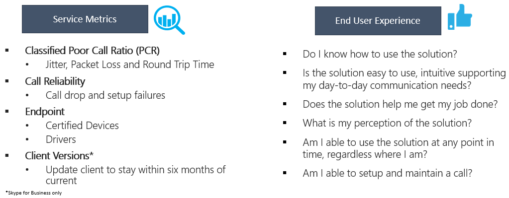

_Figure 2 - What is quality?_

## Define your target metrics

This section discusses the core service metrics that we use to assess how
services experience health. By continually assessing and driving efforts to keep
these metrics below target, you’ll help ensure your users experience consistent,
reliable call quality. To get you started, the following targets are provided.
Let’s briefly cover the difference between a managed and unmanaged network:

-   A *managed* network can be influenced and controlled by the organization.
    This includes the internal LAN, the remote WAN, and VPN.

-   An *unmanaged* network can’t be influenced or controlled by the
    organization. An example of an unmanaged network is a hotel or airport
    network.

_Table 1 - Core target health assessment metrics_

|               | Quality for managed networks | Reliability for managed networks |                      |
|---------------|------------------------------|----------------------------------|----------------------|
| Metric name   | Audio Poor Call Ratio %      | Call Setup Failures %            | Call Drop Failures % |
| Sample target | \<3%                         | \<1%                             | \<4%                 |

It’s important to discuss and define your organization’s targets to meet your
business objectives. Ideally, you should identify these targets prior to
deployment.

### Audio PCR % 

Audio Poor Call Ratio (PCR) represents the organization’s overall percentage of
calls that have poor audio quality. This metric is meant to highlight areas
where your organization can concentrate effort to have the strongest impact
toward reducing this value and improving the user experience, which is why
managed networks are the primary focus when looking at PCR. External users are
important too, but investigations differs on an organizational and user basis.
Consider providing best practices for external users, and look at external calls
independently from the overall organization.

### Call Setup Failures % 

This represents any media session that couldn’t be established. Given the
severity of the impact on the user experience measured here, the goal is to
reduce this value to as close to zero as possible. A high value for this metric
is more common in new deployments with incomplete firewall rules than a mature
deployment, but it’s still important to watch on a regular basis. As your
operational rigor matures, you can expand this metric to include video and
desktop-sharing workloads.

### Call Drop Failures % 

This applies to an audio workload where the session terminated unexpectedly. As
your operational rigor matures, you can expand this metric to include video and
desktop-sharing workloads.

## Service metrics

Service metric targets consist of specific client-based metrics.

### PCR

The basis for determining whether a call is classified as poor is by using the
poor call ratio (PCR). PCR is made up of the five network metrics described in
the following table. For a call to be classified as poor, only one metric needs
to exceed the defined threshold. For more information about the call
classification process, see [this blog
post](https://blogs.technet.microsoft.com/jenstr/2013/09/20/what-is-the-basis-for-classifying-a-call-as-poor-in-lync-2013-qoe/).

_Table 2 - Poor Call Service Metrics_

| Metric                                           | Description                                                                                                                                                                                                                                                                                                                                                                  | User experience                                                                                                                                                          |
|--------------------------------------------------|------------------------------------------------------------------------------------------------------------------------------------------------------------------------------------------------------------------------------------------------------------------------------------------------------------------------------------------------------------------------------|--------------------------------------------------------------------------------------------------------------------------------------------------------------------------|
| Jitter \>30 ms                                   | This is the average change in delay between successive packets. Teams and Skype for Business can adapt to some levels of jitter through buffering. It’s only when the jitter exceeds the buffering that a participant notices the effects of jitter.                                                                                                                         | The packets arriving at different speeds cause a speaker’s voice to sound robotic.                                                                                       |
| Packet loss rate \>10% or 0.1                    | This is often defined as a percentage of packets that are lost. Packet loss directly affects audio quality—from small, individual lost packets that have almost no impact to back-to-back burst losses that cause audio to cut out completely.                                                                                                                               | The packets being dropped and not arriving at their intended destination cause gaps in the media, resulting in missed syllables and words, and choppy video and sharing. |
| Round-trip time \>500 ms                         | This is the time it takes to get an IP packet from point A to point B and back to point A. This network propagation delay is tied to the physical distance between the two points and the speed of light and includes additional overhead taken by the various devices in the network path.                                                                                  | The packets taking too long to arrive at their destination cause a walkie-talkie effect.                                                                                 |
| NMOS degradation average \> 1.0                  | One or more of these network metrics, although individually weren’t poor, together caused the Network [Mean Opinion Score](https://technet.microsoft.com/en-us/library/bb894481(v=office.12).aspx) (NMOS) to drop by more than one point. This doesn’t necessarily mean the network connection is poor, but enough issues occurred during the call that quality was reduced. | This is a combination of jitter, packet loss, and—to a lesser degree—increased round-trip time. The user might be experiencing a combination of these symptoms.          |
| Average ratio of concealed samples \> 7% or 0.07 | One or more of these network metrics, although individually weren’t poor, caused the client to self-heal the media. A concealed audio sample is a technique used to smooth out the abrupt transition that would usually be caused by dropped network packets.                                                                                                                | High values indicate that significant levels of loss concealment were applied, and resulted in distorted or lost audio.                                                  |

### Client and device readiness

You need a solid client and device strategy to ensure that your users have a
consistent and positive user experience. A few key principles drive each
readiness strategy.

#### Client readiness

A strong client readiness strategy ensures that your users are running the most
recent version of the client while enjoying the best experience possible.
Microsoft routinely patches the Skype for Business client; ensuring that you
keep it up to date in your environment is vital to your overall success.

We recommend that you not let your client versions fall behind by more than six
months. If you’re using Office Click-to-Run, you’re already being kept up to
date by the service. Use the included [Client
Report](#determine-client-versions), as described later in this guide, to assist
you with this process. You can also leverage the Rate My Call sample reports to
further enhance your client readiness strategy.

> [!IMPORTANT]
> Currently, Teams clients are distributed and updated automatically through the Azure Content Delivery Network and will be kept up to date by the service. Client readiness and investigative activities aren’t applicable to Teams.

#### Device readiness

No one single strategy can affect the user experience more than your device
readiness strategy. Most organizations are happy to remove unnecessary devices
from users (for example, desk phones or other dedicated audio devices), and this
is often a core business justification for switching to Teams or Skype for
Business. However, those same organizations sometimes hesitate to provide
replacement devices, even if those devices are less expensive. Modern-day
laptops and PCs, though equipped with built-in microphone and speaker, aren’t
optimized for business-class voice over IP (VoIP). This often creates a poor
experience for all participants, especially if the speaker is in a noisy
environment. Microsoft’s device certification program ensures that when a user
participates in a phone call by using any device certified for Teams or Skype
for Business, it produces an experience that’s superior to a non-certified
device.

We always recommend that Teams and Skype for Business users use a certified
headset or speaker when participating in a voice call by using a desktop client.
For more information about Microsoft certified devices, review this [article
about phones and qualified
devices](https://technet.microsoft.com/en-us/office/dn788944.aspx). Use the
[Device Report](#devices-investigations), later in this guide, for assistance
with managing your devices. You can also use the Rate My Call sample reports to
further enhance your device readiness strategy.

## User experience

Analyzing the user experience is more art than science, because the metrics
gathered here don’t always mean that there’s a problem with the network or
service but rather, they indicate that the user perceives a problem. Microsoft
offers a built-in survey mechanism—known as Rate My Call (RMC)—to help gauge
overall user experience. RMC will help you answer the following questions from
your users’ perspective:

-   Do I know how to use the solution?

-   Is the solution easy to use and intuitive, and does it support my day-to-day
    communication needs?

-   Does the solution help me get my job done?

-   What’s my overall perception of the solution?

-   Can I use the solution at any point in time, regardless of where I am?

-   Can I set up and maintain a call?

### RMC

RMC is built into Teams and Skype for Business and is automatically configured
to be displayed after one in every 10 calls, or 10 percent of all calls. This
brief survey asks the user to rate the call and provide a little context for why
the call quality might have been poor. A one or two rating is considered poor,
three to four is good, and five is excellent. Although it’s somewhat of a
lagging indicator, this is a useful metric for uncovering issues that service
metrics can miss.

> [!NOTE]
> Until users are instructed to respond to RMC surveys by giving good feedback in addition to bad, responses typically come back as overwhelmingly negative. Most users only respond when call quality is poor. Because of this, your RMC reports might be skewed to the poor side even while service metrics are good. 

You can use CQD to report on RMC user responses, and sample reports are included
in the CQD template. However, they aren’t discussed in detail in this guide. For
more information about RMC in Skype for Business Online and guidance for
educating users to give useful RMC responses, see the following [blog
post](https://blogs.technet.microsoft.com/jenstr/2015/05/05/rate-my-call-in-skype-for-business-2015/).

## Categories of quality

The success of operationalizing a high-quality and reliable deployment depends
on your building operational rigor. Specifically, pay special attention to the
three categories illustrated in the following figure; these are the focus of
this guide:

-   **Network:** Audio quality focused on the PCR metric, TCP usage, wired and
    wireless subnets, and identifying the use of HTTP proxies and VPN.

-   **Endpoints:** Audio devices and client version (Skype for Business only).

-   **Service Management:** This category comprises two sections:

    -   First is Microsoft’s responsibility to manage and maintain the Teams and
        Skype for Business Online services.

    -   Second are tasks your organization must manage to ensure reliable access
        to the service, such as updating building information and maintaining
        firewalls for new Office 365 IP addresses as infrastructure is added to
        the service.

_Figure 3 - Critical categories for Teams and Skype for Business Online deployment_

The graphic below outlines the tasks you must execute for each category. We
recommend that you run these tasks once a week, at a minimum.

The first time you perform these tasks will take more effort than subsequent
iterations, because many of these categories require that you validate your
deployment configurations. After you’ve achieved the state you want by meeting
the targets you’ve defined, performing these tasks will help you maintain that
state.

### Service management tasks

In a cloud-first world, you must perform certain service management tasks to
maintain high-quality user experiences. These tasks range from ensuring there is
sufficient bandwidth to reach the service without saturating internet links,
validating that quality of service (QoS) is in place on all managed network
areas, and—lastly—staying on top of [Office 365 IP ranges on
firewalls](https://support.office.com/en-us/article/Office-365-URLs-and-IP-address-ranges-8548a211-3fe7-47cb-abb1-355ea5aa88a2?ui=en-US&rs=en-US&ad=US).

### Network tasks

There are two categories of network tasks: reliability and quality. Reliability
focuses on measuring the user’s ability to make calls successfully and stay
connected. Quality focuses on the aggregated telemetry sent to Teams and Skype
for Business Online by the user’s client during and after the call has ended.

Given the critical impact that reliability has on the user experience, begin
assessing and investigating those metrics before diving into quality.

### Endpoints tasks

The main task in this category is validating which client versions are running
Skype for Business on desktop builds from the last six months to ensure users
are getting the benefit of the continual optimizations made to the Skype for
Business desktop client. Additionally, this simplifies overall client management
tasks and provides a consistent user experience.

The other important area is monitoring which devices are prevalent in your
deployment and driving the use of certified devices to provide the best user
experience.

> [!IMPORTANT]
> Currently, Teams clients are distributed and updated automatically through the Azure Content Delivery Network and will be kept up to date by the service. Client readiness and investigative activities aren’t applicable to Teams.

# Using the reports

This section describes the fundamentals of working with CQD. Guidance is given
for the following topics:

-   Finding your tenant ID

-   Reporting on Teams versus Skype for Business

-   First versus second classifications

-   Dimensions, measures, and filters

-   Streams versus calls

-   Good, poor, and unclassified calls

-   Getting started with CQD

-   Editing reports in CQD

-   Filtering reports in CQD

For more in-depth training and resources, see the [Appendix](#appendix).

## Tenant ID

Some CQD reports require that you include a filter for your tenant ID. Due to
the way CQD aggregates data, federated participant telemetry is included.
Although this can prove valuable when analyzing poor call metrics, client and
device reports require the filtering of data to a specific tenant to exclude
federated participant telemetry. If you don’t know your tenant ID, you can use
one of the following methods to find it.

Permission requirements

-   Global Administrator Role

-   Skype for Business Administrator Role

### Azure AD Portal

1.  Sign in to the Microsoft Azure portal: <https://portal.azure.com>

2.  Select **Azure Active Directory**.

3.  Under **Manage**, select **Properties**. The tenant ID is shown in the
    **Directory ID** box.

### Azure PowerShell

1.  [Install the Microsoft Azure PowerShell Service Management
    module](https://docs.microsoft.com/en-us/powershell/azure/servicemanagement/install-azure-ps?view=azuresmps-4.0.0).

2.  Open an Azure PowerShell command window and run the following script,
    entering your Office 365 credentials when prompted:  
    **Login-AzureRmAccount**

3.  The tenant ID is listed in the output.

### Skype for Business Online Admin Center

1.  Go to <https://portal.office.com>

2.  Sign in with your tenant administrator organizational account.

3.  Select **Skype for Business** under **Admin Centers**.

4.  The tenant ID is listed as **Organization ID** on the Welcome page.

### Skype for Business Online using PowerShell

1.  [Connect to Skype for Business Online via
    PowerShell](https://technet.microsoft.com/en-us/library/dn362839(v=ocs.15).aspx).

2.  Run the following command:  
    **(Get-cstenant).tenantid**

3.  The tenant ID is displayed as a GUID.

## Teams vs. Skype for Business

CQD can report on both Teams and Skype for Business telemetry. However, there
might be times when you want to develop a report to look at Teams telemetry
separate from Skype for Business.

### Summary reports

To modify the summary reports page to look at only Teams or Skype for Business,
select the **Product Filter** drop-down menu from the top of the screen, and
then select the product you want.

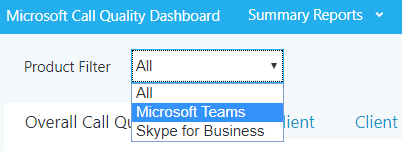

_Figure 4 - Select a Product Filter_

### Detailed reports

To filter a detailed report, add the filter **Is Teams** to the report and set
it to True or False. For more information, see [Editing
Reports](#editing-reports) later in this section.

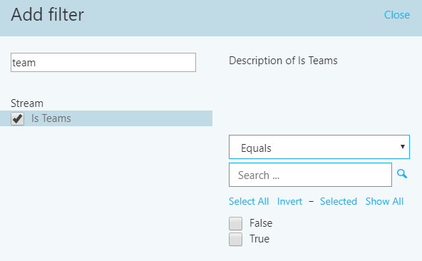

_Figure 5 - Adding a Microsoft Teams filter to a report_

## Dimensions, measures, and filters

A well-formed CQD query contains all three of the following parameters:

-   **Dimension:** How I want to pivot on the data.

-   **Measure:** What I want to report on.

-   **Filter:** How do I want to reduce the data set the query returns.

Another way to look at this is a dimension is the grouping function, a measure
is the data I’m interested in, and a filter is how I want to narrow down the
results to those that are relevant to my query.

An example of a well-formed query is "Show me Poor Streams [Measure] by Subnet
[Dimension] for Building 6 [Filter]."

For more information, see [Dimensions and measures available in
CQD](https://aka.ms/cqd-dm).

For dimensions, measures, and filters for the reports used in the CQD templates,
see the [Appendix](#_Dimensions,_Measures_and).

## First vs. second 

Many of the dimensions and measures in CQD are classified as first or second.
CQD doesn’t use caller/callee fields—these have been renamed first and Second
because there are intervening steps between the caller and callee. The following
logic determines which endpoint involved in the stream or call is labeled as
first:

-   First will always be a server endpoint (Conference Server, Mediation Server,
    and so on) if a server is involved in the stream or call.

-   Second will always be a client endpoint unless the stream is between two
    server endpoints.

-   If both endpoints are the same type, the choice of which is first is based
    on internal ordering of the user agent category. This ensures the ordering
    is consistent.

For more information about determining the first or second endpoint when they’re
both the same, see [Dimensions and measures available in
CQD](https://aka.ms/cqd-dm).

## Stream vs. call

You need to understand the difference between a call and a stream to properly
choose which dimensions or measures you’ll be looking at in CQD.

**Stream:** A stream exists between only two endpoints. There is only one stream
for each direction, and two streams are required for communication. Streams are
useful for analyzing buildings or networks. In some cases, both call and stream
are used in the name (for example, Call Setup Stream or Call Dropped Stream).
These are still classified as single streams.

**Call:** A call is a grouping of all streams from all participants. A call
consists of—at minimum—two streams. A single call will have two participants
each with a minimum of one stream. Calls are useful for analyzing trends over
time.

For additional guidance on whether the dimension or measure is referring to a
call or a stream, see [Dimensions and measures available in
CQD](https://aka.ms/cqd-dm)

## Good, poor, and unclassified calls

A call is categorized either as good, poor, or unclassified. Let’s take a moment
to talk about each one in more detail.

**Good or poor:** A good or poor call consists of a call that contains a
complete set of service metrics, for which a full QoE report was generated.
Determining whether a call is good or poor is described [earlier in this
guide](#pcr).

**Unclassified:** An unclassified call doesn’t contain a full set of service
metrics. These are often short calls—usually less than 60 seconds—where averages
couldn’t be computed and a QoE report wasn’t generated.

## Access CQD Online

You can access CQD one of two ways.

-   Go to <https://cqd.lync.com>.

-   Go to **Skype for Business admin center** \> **tools**, and select the link
    to CQD, as shown below.

_Figure 6 – Accessing CQD through the Skype for Business admin center_

## Getting started

When you first browse to CQD, you’ll see the Summary Reports page. Most of the
reports described in this guide are custom detailed reports. To get started
using the detailed reports, select **Summary Reports** at the top of the page,
and then choose **Detailed Reports**.

_Figure 7 - Navigating to Detailed Reports_

The Detailed Reports page in CQD looks like the figure shown below.

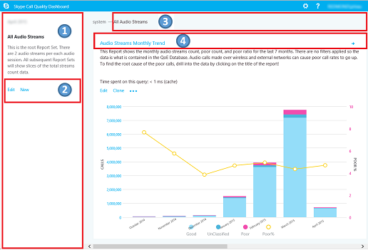

_Figure 8 - Detailed Reports page_

1.  The summary pane shows context for the report set that appears to the right.

2.  You can select **Edit** in the summary pane to set report–level properties
    (including y-axis height).

3.  The breadcrumb helps users identify their current location in the report set
    hierarchy.

4.  Reports that have child reports are shown with a blue link. By selecting the
    link, you can drill down to the child reports.

Point to the bar charts and trend lines to display detailed values. The report
that has focus will show the action menu: **Edit**, **Clone**, **Delete**,
**Download**, and **Export Report Tree**.

## Editing reports

When you select **Edit** on the action menu of a report, you’ll open Query
Editor. Each report is backed by a query. A report is a visualization of the
data returned by its query. The Query Editor is a UI for editing these queries
in addition to the display options for the report, as illustrated in the
following figure.

_Figure 9 - Report Editor_

1.  You choose dimensions, measures, and filters from the left pane. Pointing to
    an existing value displays a close button (**X**) you can select to remove
    the value.

    1.  By selecting the dimension or measure, you can change the title by
        editing the **Title** field. You can also change the order by selecting
        the blue Up or Down arrows in the top pane.

    2.  Selecting (**+**) next to a heading opens the dialog box for adding a
        new dimension, measure, or filter.

    3.  Enter the first few letters of the dimension, measure, or filter in the
        **Find a** field to filter the list for easier searching.

2.  The top pane shows options for chart customization.

3.  The Query Editor shows a preview of the report.

4.  Use the **Edit** box at the bottom of the screen to create or edit a
    detailed description of the report.

## Filtering reports

The templates provided includes several built-in queries and report filters. The
following sections describe the most common filters used throughout the
templates.

### CQD filter

You can use the CQD filter, or URL filter, to temporarily filter every report
query. The most common CQD filter you’ll use is to filter reports to exclude
federated participant telemetry. We recommend that you bookmark this filter so
it becomes the default view. Excluding federated data from CQD reports is useful
when you’re remediating managed buildings or networks where federated data might
influence your report.

To implement a CQD filter, in the browser address bar, append the following to
the end of the URL:

/filter/[AllStreams].[Second Tenant Id]\|[YOUR TENANT ID HERE]

**Example:**  
https://cqd.lync.com/cqd/\#/1234567/2018-02/filter/[AllStreams].[Second Tenant
Id]\|[TENANTID]&tenant=TENANTID

> [!NOTE]
> The URL example above is for visual representation only. Please use the default CQD link of <https://cqd.lync.com>.

### Query filters

Query filters are implemented by using the Report Editor. These filters are used
to reduce the number of records returned by CQD, thus minimizing the report’s
overall size. This is especially useful for filtering out unmanaged networks.
The filters below use regular expressions (RegEx).

_Table 3 - Query filters_

| Filter               | Description          | CQD query filter example                                  |
|----------------------|---------------------------------------------------------------------------------------------------------------------------------------------------------------------------------------------------------------------------------------------------------------------------------------------------------------------------|-----------------------------------------------------------|
| Blank values         | Some filters don’t have the option to filter for blank values. To filter blank values manually, use the blank expression and set the filter to Equals or Not Equals, depending on your needs.                                                                                                                             | Second Building Name \<\> \^\\s\*\$                       |
| Popular home subnets | Without a valid building file to separate managed from unmanaged networks, home networks will get included in the reports. These home subnets are outside the scope of IT’s control and can be quickly excluded from a report. Popular home subnets, as defined in this guide, are 10.0.0.0, 192.168.1.0 and 192.168.0.0. | Second Subnet \<\> 10.0.0.0 \| 192.168.0.0 \| 192.168.1.0 |
| Inside vs. outside   | Used to filter a report for managed (inside) or unmanaged (outside). The managed CQD template is already preconfigured with these filters.                                                                                                                                                                                | Second Inside Corp = Inside                               |

### Report filters

Report filters are implemented by adding a filter to the rendered report either
in the Report Editor or directly to the report. The following reports filters
are used throughout the template.

_Table 4 - Report Filter_

| Filter     | Description                            | CQD report filter example         |
|------------|----------------------------------------|-----------------------------------|
| Month      | Start with the year first, then month. | 2017-10                           |
| Alphabetic | Filters for any alphabetic characters. | [a-z]                             |
| Numeric    | Filters for any numeric characters.    | [0-9]                             |
| Percentage | Filters for a percentage.              | ([3-9]\\.)\|([3-9])\|([1-9][0-9]) |

# Import the CQD templates

This guide includes two curated CQD templates. These templates accelerate your
usage of CQD and provide you an opportunity to quickly leverage CQD’s
capabilities to make an impact on your users’ Teams or Skype for Business
experience. The All Networks template, though optimized to work with a building
data file, can be used while you work toward collecting and uploading building
information into CQD, as described in the next section.

**To import the templates (.CQDX) into CQD Online**

1.  Go to <https://cqd.lync.com>.

2.  Authenticate by using your Office 365 Administrative credentials.

> [!NOTE]
> You must have the Office 365 Global Administrator, Skype for Business Administrator, or Report Readers role to access CQD. 

3.  Select the **Summary Reports** menu at the top of the page, and then choose
    **Detailed Reports**.

4.  On the summary pane, select **Import**. Go to the CQDX saved location,
    select the CQDX template, and then select **Open**.

5.  After the template is uploaded, a pop-up window will display the message
    “Report import was successful.” Select **OK.**

1.  Repeat steps 4 and 5 for the second CQD template.

> [!NOTE]
> The CQD templates are imported per user. If additional users need to use the report, they must sign in and import the templates into their CQD instance. 

# Building mapping

In a Teams or Skype for Business Online deployment, all clients are external.
That has the implication that by default, all clients are reported as outside in
CQD Online, regardless of whether the client was connected on an internal
corporate network.

When you work with call quality, you need to know the location of a client and
whether it was connected to a network you can manage or a network you can’t
manage—the assumption being that you can only improve networks you can manage.
By uploading network and building information to CQD Online, you enable CQD to
determine whether a client was connected to an internal corporate/managed
network or to an external/unmanaged network.

## Building data file structure

The format of the data file you upload must meet the following requirements to
pass the validation check before uploading.

-   The file must be either a TSV file, which means that for each row, each
    column is separated by a Tab character, or a CSV file in which each column
    is separated by a comma.

-   The file can’t be larger than 50 MB.

-   The content of the data file *must not include table headers*. In other
    words, the first line of the data file must be real data, not column
    headings such as “Network.”

-   For each column, the data type can only be String, Number, or Bool. If the
    data type is Number, the value must be a numeric value; if it’s Bool, the
    value must be either 0 or 1.

-   For each column, if the data type is String, the data can be empty (but
    still must be separated by an appropriate delimiter, that is a Tab character
    or comma). This just assigns that field an empty string value.

-   There must be 14 columns for each row. Each column must have the data type
    described in the following table, and the columns must be in the order
    listed in the table.

_Table 5 - Building file structure_

| Column name        | Data type | Example                   | Guidance    |
|--------------------|-----------|---------------------------|-------------|
| Network            | String    | 192.168.1.0               | Required    |
| NetworkName        | String    | USA/Seattle/SEATTLE-SEA-1 | Required\*  |
| NetworkRange       | Number    | 26                        | Required    |
| BuildingName       | String    | SEATTLE-SEA-1             | Required\*  |
| OwnershipType      | String    | Contoso                   | Optional    |
| BuildingType       | String    | IT Termination            | Optional    |
| BuildingOfficeType | String    | Engineering               | Optional    |
| City               | String    | Seattle                   | Recommended |
| ZipCode            | String    | 98001                     | Recommended |
| Country            | String    | US                        | Recommended |
| State              | String    | WA                        | Recommended |
| Region             | String    | MSUS                      | Recommended |
| InsideCorp         | Bool      | 1                         | Required    |
| ExpressRoute       | Bool      | 0                         | Required    |

\*While not required by CQD, the templates are configured to display Building
and Network name.

### Supernetting

You can use supernetting, commonly called Classless Inter-Domain Routing (CIDR,)
in place of defining each subnet. A *supernet* is a combination of several
subnets that share a single routing prefix. Instead of adding an entry for each
subnet, you can use the supernetted/CIDR address. Supernetting is supported, but
we don’t recommend using it.

For example, Contoso’s marketing building is made up of the subnets below:

-   10.1.0.0/24 – first floor

-   10.1.1.0/24 – second floor

-   10.1.2.0/24 – third floor

-   10.1.3.0/24 – fourth floor

Instead of adding an entry for each subnet, you can use the supernetted/CIDR
address—in this example, 10.1.0.0/22.

-   Network = 10.1.0.0

-   Network Range = 22

Here are a few things to consider before you implement supernetting:

-   Supernetting takes less time up front, but it comes at the cost of reducing
    the richness of your data. Let’s say there’s a quality problem involving
    subnet 200.1.2.0. If you implemented supernetting, you won’t know where in
    the building the subnet is located or what type of network it is (for
    example, a lab). If you’d defined all the subnets for a building and
    uploaded floor location information, you’d be able to see that distinction.

-   It’s important to ensure that the supernetted/CIDR address is correct and
    isn’t catching unwanted subnets.

-   Supernetting can be used in a building mapping with 8-bit to 28-bit mask.

-   It’s quite common to find 192.168.0.0 in data. For many organizations, this
    indicates that the user is at home. For others, this is the IP address
    scheme for a satellite office. If your organization does have offices that
    use this configuration, don’t include it in your building file as it’s
    difficult to distinguish between home and internal networks by using common
    subnets.

> [!IMPORTANT]
> The network range can be used to represent a supernet. All new building data file uploads will be checked for any overlapping ranges. If you have previously uploaded a building file, you should download the current file and upload it again to identify any overlaps and fix the issue. Any overlap in previously uploaded files might result in the wrong mappings of subnets to buildings in the reports. 

### VPN

The quality of experience (QoE) data that clients send to Office 365—which is
where CQD data is sourced from—includes a VPN flag. However, this flag relies on
VPN vendors’ reporting to Windows that the VPN network adapter registered is a
Remote Access adapter. Not all VPN vendors properly register Remote Access
adapters. Because of this, you might not be able to use the built-in VPN query
filters. There are two approaches to accommodating VPN subnets in the building
information file.

-   Define a **Network Name** by using the text “VPN” in this field for VPN
    subnets.

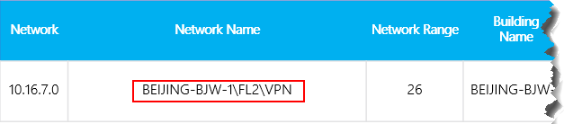

_Figure 10 - VPN using network name_

-   Define a **Building Name** by using the text “VPN” in this field for VPN
    subnets.

_Figure 11 - VPN using building name_

> [!IMPORTANT]
> Certain VPN implementations don’t accurately report subnet information. If this occurs in your reporting, we recommend that when you add a VPN subnet to the building file, instead of one entry for the subnet, add separate entries for each address in the VPN subnet as a separate 32-bit network. Each row can have the same building metadata. For example, instead of one row for 172.16.18.0/24, you have 253 rows, with one row for each address from 172.16.18.1/32 through 172.16.18.254/32, inclusive.

> [!NOTE]
> VPN connections have been known to misidentify the network connection as wired when the underlying internet connection is wireless. When looking at quality over VPN connections, you can’t assume that the connection type has been accurately identified.

## Uploading building information

The CQD Summary Reports dashboard includes a **Tenant Data Upload** page,
accessed by selecting the **Tenant Data Upload** link tag on the upper-right
corner (look for the gear icon). This page is used for admins to upload their
own information, such as mapping of IP address and geographical information,
mapping each wireless access point and its MAC address, and so on.

1.  Go to CQD Online by browsing to <https://cqd.lync.com>.

2.  Select the gear icon in the upper-right corner, and choose **Tenant Data
    Upload** from the **Summary Reports** page.

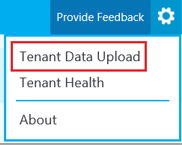

_Figure 12 - Tenant Data Upload menu_

1.  Alternatively, if this is your first time visiting CQD, you’ll be asked to
    upload building data. You can select **Upload Now** to quickly navigate to
    the **Tenant Data Upload** page.

_Figure 13 - Building data upload banner_

1.  On the **Tenant Data Upload** page, select **Browse** to choose a data file.

2.  After selecting a data file, specify **Start date** and, optionally, specify
    an end date.

3.  After selecting **Start date**, select **Upload** to upload the file to the CQD.   Before the file is uploaded, it’s validated. If validation fails, an error message is displayed requesting that you correct the file. The following figure shows an error occurring when the number of columns in the data file is incorrect.

_Figure 14 - Building data upload error_

4.  If no errors occur during validation, the file upload will succeed. You can
    then see the uploaded data file in the **My uploads** table, which shows the
    full list of all uploaded files for the current tenant at the bottom of that
    page.

> [!NOTE]
> It can take up to four hours to finish processing the building file.    If you’ve already uploaded a building file and need to add subnets that might have been missed or excluded, modify the original file by adding the new subnets, remove the current file, and re-upload the newly edited file. There can be only one active building data file in CQD. 

## Missing subnets

After uploading building information for managed networks, every managed network
should have a building association. However, this isn’t always the case;
typically, a few subnets are missed. This section covers how to validate those
missing networks.

Browse to the **Detailed Reports** page in CQD Online and navigate to the
**Missing Subnet Report** included in the CQD templates. This presents all the
subnets with 10 or more audio streams that are not defined in the building data
file. Ensure that there are no managed networks in this list. If subnets are
missing, update the original building data file and re-upload it to CQD.

> [!IMPORTANT]
> You’ll need to add your tenant ID as a query filter for **Second Tenant ID** to this report to filter the report to view only your organization’s tenant data. Otherwise, the report will show federated subnets.

> [!NOTE] 
> Be sure to adjust the Month Year report filter to the current month. Select **Edit**, and adjust the **Month Year** report filter to save the new default month.                                                  |

_Figure 15 - Missing Building Report_

# Reliability investigations

The first step to improving quality is to assess the state of audio reliability
across the organization. Because audio reliability is vital to a positive user
experience, we start with the two components that measure reliability:

1.  **Call Setup Failures:** Session couldn’t be established.

2.  **Call Drop Failures:** Session was established and unexpectedly terminated

Throughout this section, we’ll cover methods to investigate both areas.

> [!NOTE]
> Not all reports included in the templates are covered in this guide. Please refer to the individual report description for more information.

## Call setup

Prioritize remediating call setup failures in this area first, because these
failures have a significant negative impact on the user experience.

Begin your investigation by assessing the percentage of overall call setup
failures for the organization, and then prioritize areas of investigation based
on the highest percentage by building or network.

### Call setup failures overall

This chart report displays the total amount of successful call set up and call
setup failures over time. Point to any one of the columns to display its
individual values, as shown in the figure below.

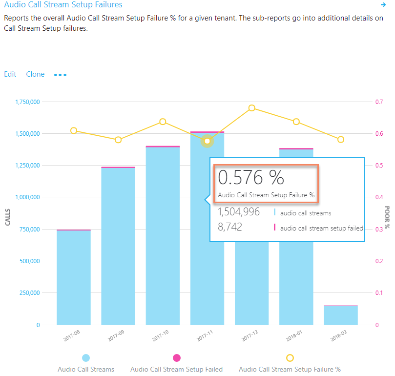

_Figure 16 - Audio Reliability - Call Stream Setup Failures_

#### Analysis

This report displays your organization’s audio call setup usage and failures
over time. By using this report, you can answer the following questions and
determine your next course of action:

1.  What is the total call setup failure percentage for the current month?

2.  Is the total call setup failure percentage below or above the defined target
    metric?

3.  Is the failure trend worse or better than the previous month?

4.  Is the failure trend increasing, steady, or decreasing?

The information presented in this report will tell the story of how often your
overall call setups are failing across your organization.

Irrespective of the previous answers, take the time to investigate further by
using the included sub-reports to look for any individual buildings or networks
that might need remediation. Although the overall failure rate might be below
the target metric, often the failure rates for one or more buildings or networks
are above the metric and need remediation.

### Call setup failures by building and subnet 

This table report is used to discover and isolate any buildings or networks that
need remediation.

> [!NOTE]
> Be sure to adjust the Month Year report filter to the current month. Select **Edit**, and adjust the **Month Year** report filter to save the new default month.

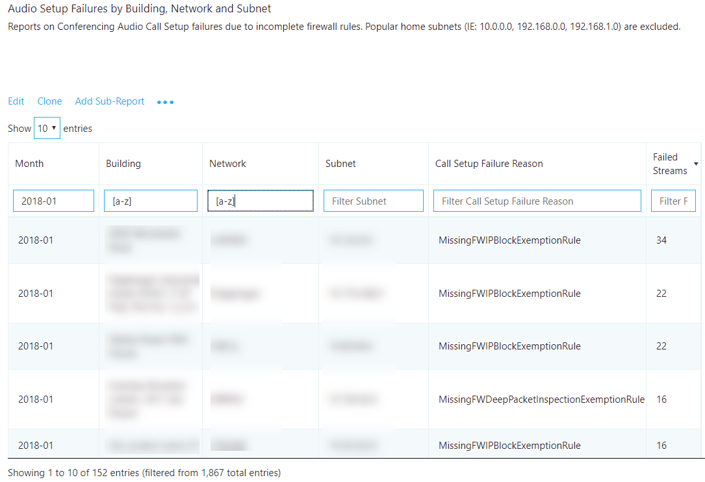

_Figure 17 - Audio Setup Failures by Building or Subnet_

#### Remediation 

Focus your remediation efforts on buildings or subnets that have the largest
volume of failures first, because this will maximize impact to the user
experience and help to quickly reduce the organizational call setup failures.
The following table lists the two reasons for call setup failures as reported by
CQD.

_Table 6 – Reasons for Call Setup Failures_

| Call Setup Failures reason                       | Typical cause                                                                                                                                                                                                                                                                                   |
|--------------------------------------------------|-------------------------------------------------------------------------------------------------------------------------------------------------------------------------------------------------------------------------------------------------------------------------------------------------|
| Missing FW Deep Packet Inspection Exemption Rule | Indicates that network equipment along the path prevented the media path from being established due to deep packet inspection rules. This is likely due to firewall rules not being correctly configured. In this case the TCP handshake succeeded but the SSL handshake did not.               |
| Missing FW IP Block Exception Rule               | Indicates that network equipment along the path prevented the media path from being established to the Office 365 network. This might be due to proxy or firewall rules not being correctly configured to allow access to IP addresses and ports used for Teams and Skype for Business traffic. |

Now as you begin your remediation, you can focus your efforts on a particular
building or subnet. As the preceding table shows, these issues are due to
firewall or proxy configurations. Review the options in the following table for
remediation actions.

_Table 7 - Next Steps for Call Setup Failure Remediation_

| Remediation           | Guidance     |
|-----------------------|--------------------------------------------------------------------------------------------------------------------------------------------------------------------------------------------------------------------------------------------------------------------------------------------------------------------------------------------------------------------------------------------------------------------------------------------------------------------------------------------------|
| Configure firewall(s) | Work with your network team and verify your firewall(s) configuration against [the Office 365 IP address list](https://aka.ms/o365ips). Verify that the [media subnets](https://support.office.com/en-us/article/Office-365-URLs-and-IP-address-ranges-8548a211-3fe7-47cb-abb1-355ea5aa88a2#bkmk_teams) and ports are included in the firewall rules. Verify that the necessary TCP and UDP ports are opened in the firewall. Media prefers UDP over TCP. TCP is considered a failback protocol. <ul><li>**TCP:** port 443</li><li>**UDP:** ports 3478–3481</li><ul> |
| Verify                | Leverage the [Microsoft Network Assessment Tool](https://www.microsoft.com/en-us/download/details.aspx?id=53885) to verify connectivity from the affected building or subnet by using the connectivity check function.    |

## Call drop

Unlike call setup failures, there is no reason code to indicate why call dropped
failures occurred, which makes it difficult to isolate a specific root cause. To
better triage dropped calls, use an inferred approach. By remediating any areas
of interest for audio, patching clients, and driving usage of certified devices
for Teams and Skype for Business, you’d expect call dropped failures to decline.

### Call drop failures overall

This chart report displays the total amount of audio streams, total audio
streams dropped, and total stream dropped percentage. Point to any one of the
columns to display its values, as shown in the following figure.

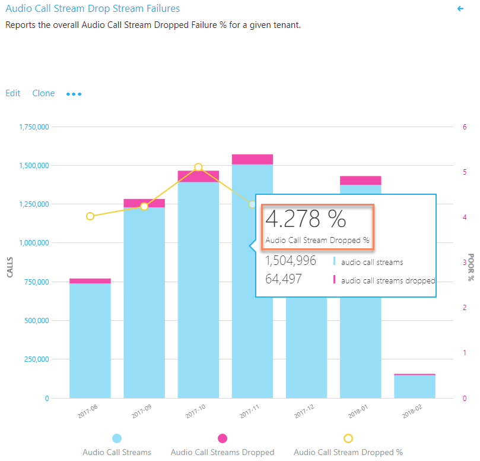

_Figure 18 - Total call dropped failure percentage_

#### Analysis

This chart report displays your organization’s usage and failures over time
related to call drops. By using this report, you can answer the following
questions:

1.  What is the current total call dropped percentage?

2.  Is the total drop percentage below the defined target metric?

3.  Is the failure trend worse or better than the previous month?

4.  Is the failure trend increasing, steady, or decreasing?

The information presented in this report can tell the story of how often your
overall call drops are occurring across your organization.

Irrespective of the answers to the questions above, take the time to investigate
using the sub-reports to look for any buildings or networks that might need
remediation. Although the overall drop rate might be below the target metric,
often the drop rate for one or more buildings or networks is above the metric
and needs remediation.

### Call drop failures by building or subnet

Failures in this table report indicate that the call was dropped unexpectedly
and resulted in a negative user experience. There are two table reports included
in the template, one for investigating conferencing and the other for two-party.

> [!NOTE]
> Be sure to adjust the Month Year filter to the current month. Select **Edit**, and adjust **Month Year** to save the new default month.

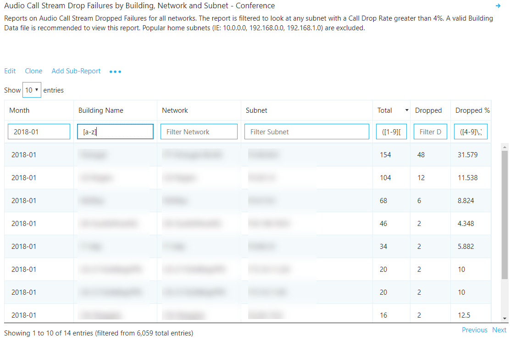

_Figure 19 – Audio call dropped failures by building or subnet_

#### Remediation

Using the preceding table report, you can now isolate “hot spots” in the managed
network where call drops occur above the defined target metric. Focus your
remediation efforts on buildings or networks that have the highest total stream
count first, to make the biggest impact.

Common causes of call drops:

-   Under-provisioned network or internet egress

-   No QoS configured on constrained networks

-   Older client versions

-   User behavior

After you discover hot spots, you can leverage [Call
Analytics](https://techcommunity.microsoft.com/t5/Skype-for-Business-Blog/Introducing-Call-Analytics/ba-p/57309)
to further review users in that building for specific issues. Call Analytics
contains PII data and can be useful for further isolating potential reasons for
the call drops.

Regardless of your next step, it’s a good practice to notify the helpdesk that
an issue has been discovered with specific buildings or subnets. This way, they
can quickly respond to incoming calls and triage users more efficiently. Flagged
users can then be reported back to the engineering team for further
investigation.

The following table lists some common methods to manage and remediate call
drops.

_Table 9 - Next steps for call drop remediation_

| Remediation                              | Guidance     |
|------------------------------------------|------------------------------------------------------------------------------------------------------------------------------------------------------------------------------------------------------------------------------------------------------------------------------------------------------------------------------------------------------------------------------------------------------------------------------------------------------------------------------------------------------------------------------------------------------------------------------------------------------------|
| Network/internet                         | Now that you know which building is affected, work with your network team to monitor bandwidth at that building to determine whether there are issues with overutilization. If the issue is discovered to be related to network congestion, consider increasing bandwidth to that building.   **QoS:** If increasing bandwidth is impossible or cost-prohibitive, consider implementing QoS. This will guarantee media packets on the managed network are prioritized above non-media traffic. Alternatively, if there is no clear evidence that bandwidth is the culprit, consider these solutions: <ul><li>[Microsoft Teams QoS Guidance](https://docs.microsoft.com/en-us/MicrosoftTeams/qos-in-teams)</li><li>[Skype for Business QoS Guidance](https://myadvisor.fasttrack.microsoft.com/CloudVoice/Downloads?SelectedIDs=5_1_0_8)</li></ul> **Perform a network readiness assessment:** A network assessment provides details about expected bandwidth usage, how to cope with bandwidth and network changes, and recommended networking practices for Teams and Skype for Business. Using the preceding table as your source, you have a list of buildings or subnets that are excellent candidates for an assessment.  <ul><li>[Microsoft Teams Network Readiness Assessment](https://docs.microsoft.com/MicrosoftTeams/3-envision-evaluate-my-environment#test-the-network)</li><li>[Skype for Business Network Readiness Assessment](https://myadvisor.fasttrack.microsoft.com/CloudVoice/Offers/?pageState=NetworkReadiness)</li></ul> **Microsoft Network Assessment Tool:** Use this tool for a simple test of network performance to determine how well the network would perform for a Teams or Skype for Business Online call. The tool helps you assess the performance of a subnet and validate the readiness of the network against Microsoft performance [requirements](https://aka.ms/performancerequirements).<ul><li>[Download the Network Assessment Tool](https://www.microsoft.com/en-us/download/details.aspx?id=53885)</li></ul>         |
| Clients (Skype for Business Online Only) | Some older clients have known, documented issues with media reliability. Review the Call Analytics reports from multiple affected users or create a custom Client Version table report in CQD filtered to specific buildings or subnets with Total Call Dropped Failure % measure. This information will help you understand whether a relationship exists between call drops in that specific building and a specific version of the client.                                                                                                                                                              |
| Devices                                  | The majority of device failures are due to using devices that aren’t certified for Teams or Skype for Business. Failures usually take the form of the integrated speakers or mics that are being used, or earbud/mic combinations that are plugged into the 3.5 mm audio jack on a device. Microsoft’s current recommendation is that any users who are experiencing call drops—or poor calls in general—and are using integrated devices or drivers should be provisioned a [certified headset or speakerphone](https://partnersolutions.skypeforbusiness.com/solutionscatalog/personal-peripherals-pcs). |
| User Behavior                            | If you determine that neither network, devices, or clients are the issue, consider engaging [My Advisor](https://aka.ms/myadvisor) for guidance in developing a user adoption strategy to educate users how to best join and exit meetings. A smarter Teams and Skype user will produce a better user experience for all participants in the meeting. A user who puts their laptop to sleep (by closing the lid) without exiting the meeting will be classified as an unexpected call drop.     |

# Quality investigations

The next step to assess the state of audio quality across the deployment is to
investigate Audio Poor Call Ratio (PCR), TCP, and proxy usage. It’s important to
remember that CQD data doesn’t provide you a specific root cause, but instead
provides you with likely problem areas to begin a collaborative conversation
with the appropriate teams for remediation activities.

> [!NOTE]
> Not all reports included in the templates are covered in this guide. Please refer to the individual report description for more information. 

## Investigate call quality

The overall PCR percentage is primarily used to indicate whether the
organization is meeting defined audio metric targets. It’s important to note
that even if the overall percentage is within target, some subnets or buildings
might not meet the defined targets and therefore need further investigation. For
example, if the organizational audio PCR percentage is 3 percent in December,
which meets the sample target, specific buildings might still be having poor
experiences, depending on the distribution of that 3 percent.

### Overall organizational poor call percentage

To assess the overall percentage of poor calls for the organization use the
Quality Overall chart report.

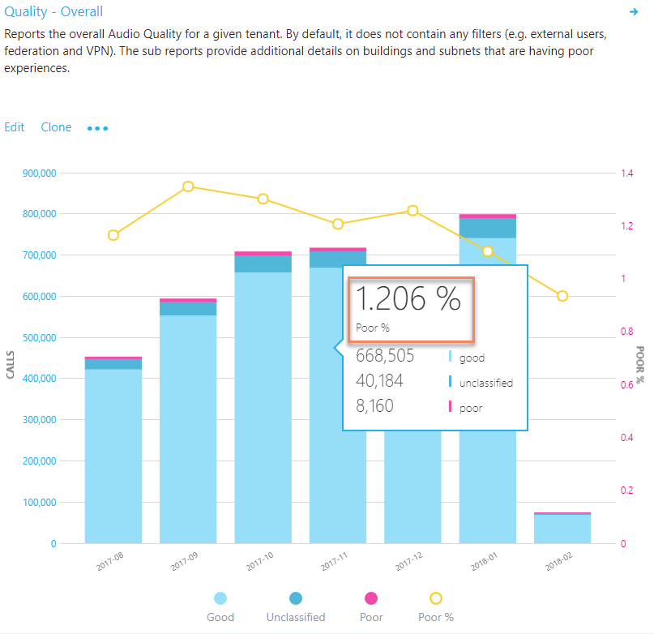

_Figure 20 – Audio Quality - Overall_

#### Investigation

This chart report displays your organization’s usage and PCR over time. By using
this report, you can answer the following questions:

1.  What is the total PCR for the current month?

2.  Is the PCR below the defined target metric?

3.  Is the failure trend worse or better than the previous month?

4.  Is the failure trend increasing, steady, or decreasing?

Irrespective of the answers to the questions above, take the time to investigate
by using the sub-reports to look for any buildings or networks that might need
further investigation. Although the overall PCR might be below the target
metric, often the PCR for one or more buildings or networks is above the metric
and needs further investigation.

### Audio quality overall

There are two report trees included in the templates for audio quality, one for
investigating conferencing and the other for two-party calls. For the purposes
of quality remediation, the investigative process is the same, so we’ll focus
here on conferencing. Improvements in conference quality will also positively
affect two-party call quality. Reports are also included to view audio quality
for conferencing and two-party by wired and Wi-Fi.

> [!NOTE]
> Investigating two-party poor calls is similar to investigating conference calls. The task is to identify buildings or subnets that have the lowest quality to validate whether there’s a pattern of poor calls with another building or subnet. 

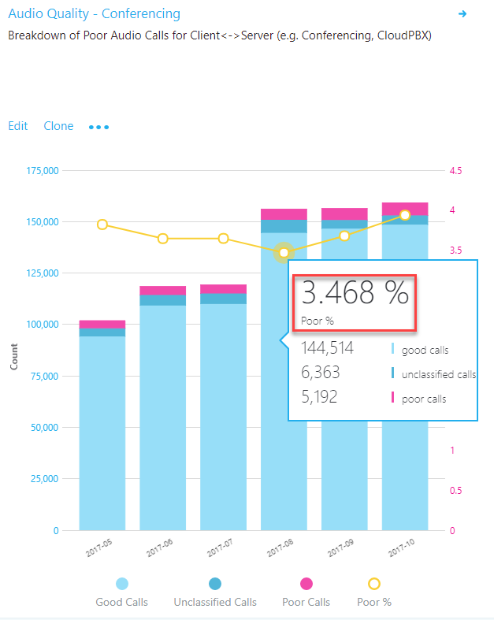

_Figure 21 – Audio Quality - Conferencing_

#### Investigation

This chart report displays your organization’s conferencing or two-party usage
and PCR over time. By using this report, you can answer the following questions:

1.  What is the total PCR for the current month?

2.  Is the PCR below the defined target metric?

3.  Is PCR worse or better than the previous month?

4.  Is the PCR trend increasing, steady, or decreasing?

Irrespective of the answers to the questions above, take the time to investigate
by using the sub-reports to look for any buildings or networks that might need
investigation. Although the overall PCR might be below the target metric, often
the PCR for one or more buildings or networks is above the metric and needs
remediation.

### Poor audio stream by building and subnet

This table report gives you additional insight into what contributed to the
calls’ being classified as poor and helps to isolate hot spots in the managed
network.

The connection detail distinguishes between wired and Wi-Fi and includes jitter,
packet loss, and round-trip time (RTT) measurements. A similar report also
exists under the two-party reports, and is used to isolate two-party calls on
your managed network.

> [!NOTE]
> Be sure to adjust the Month Year filter to the current month. Select **Edit**, and adjust **Month Year** to save the new default month. 

> [!TIP]
> Common home networks are difficult to triage due to their widespread use. A separate report that uses the firewall IP has been added to the All Networks template to assist with remediating offices that use common networks.

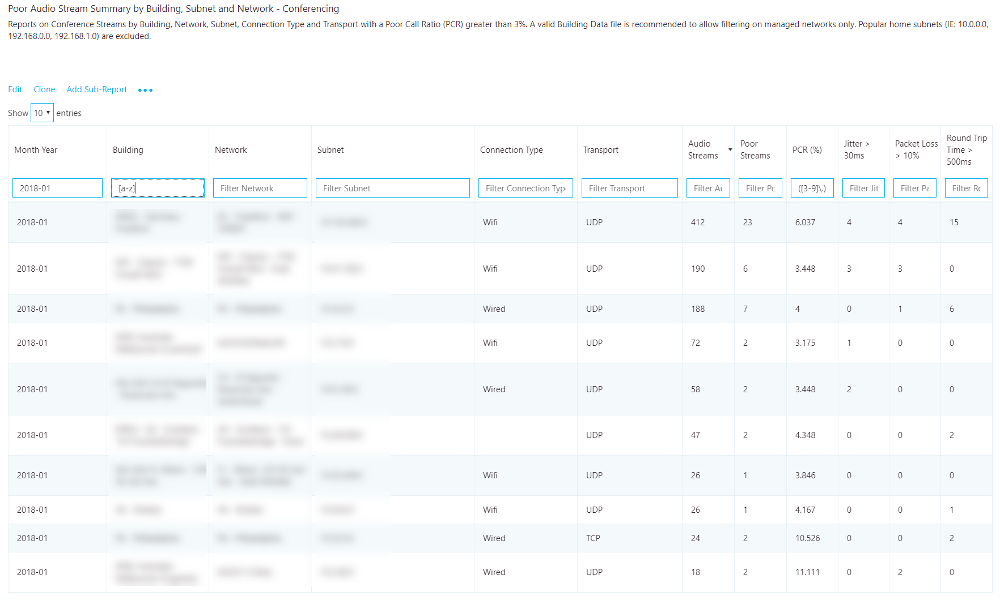

_Figure 22 - Poor Audio Stream Summary by Building and Subnet - Conferencing_

#### Remediation

Focus your remediation efforts on buildings or networks that have the largest
volume of audio streams, because this will maximize impact and help to improve
the user experience quickly. Use the jitter, packet loss, and RTT measurements
to understand what’s contributing to the poor call quality. It’s possible for
there to be more than one problem:

-   **Jitter:** Media packets are arriving at different speeds, which causes a
    speaker to sound robotic.

-   **Packet loss:** Media packets are being dropped, which creates the effect
    of missing words or syllables.

-   **RTT:** Media packets are taking a long time to get to their destination,
    which creates a walkie-talkie effect.

Although no single source of truth accounts for what can cause a poor call,
several common methods can help you deal with network anomalies.

To assist your investigation into quality issues, you can leverage [Call
Analytics](https://techcommunity.microsoft.com/t5/Skype-for-Business-Blog/Introducing-Call-Analytics/ba-p/57309).
With Call Analytics, you can look at a specific conference or users’ detailed
call report. This report will contain PII data and is useful when attempting to
discern a reason for failures. Once you know which building that is affected,
tracking down users in that building should be straightforward.

Don’t forget to let the helpdesk know that these networks are experiencing
quality issues, so they can quickly triage and respond to incoming calls.

_Table 9 - Common contributors to high PCR_

| Remediation                              | Guidance       |
|------------------------------------------|-----------------------------------------------------------------------------------------------------------------------------------------------------------------------------------------------------------------------------------------------------------------------------------------------------------------------------------------------------------------------------------------------------------------------------------------------------------------------------------------------------------------------------------------------------------------------------------------------------------------------------------------------------------------------------------------------------------------------------------------------------------------------------------------------------------------------------------------------------------------------------------------------------------------------------------------------------------------------------------------------------------------------------------------------------------------------------------------------------------------------------------------------------------------------------------------------------------------------------------------------------------------------------------------------------------------------------------------------------------------------------------------------------------------------------------------------------------------------------------------------------------------------------------------------------------------------------------------------------------------------------------------------------------------------------------------------------------------------------------------------------------------------------------------------------------------------------------------------------------------------------------------------------------------------------------------|
| Networks                                 | An overused or under-provisioned network can cause issues with media quality. Work with the network team to determine whether the network connections from the user to the internet egress point has enough bandwidth to support media. **Perform a network readiness assessment:** A network assessment provides details about expected bandwidth usage, how to cope with bandwidth and network changes, and recommended networking practices for Teams and Skype for Business. Using the preceding table as your source, you have a list of buildings or subnets that are excellent candidates for an assessment. <ul><li>[Microsoft Teams Network Readiness Assessment](https://docs.microsoft.com/MicrosoftTeams/3-envision-evaluate-my-environment#test-the-network)</li><li>[Skype for Business Network Readiness Assessment](https://myadvisor.fasttrack.microsoft.com/CloudVoice/Offers/?pageState=NetworkReadiness)</li></ul> **Microsoft Network Assessment Tool:** Use this tool for a simple test of network performance to determine how well the network would perform for a Teams or Skype for Business Online call. This tool helps you assess the performance of a subnet and validate the readiness of the network against the Microsoft performance [requirements](https://aka.ms/performancerequirements). <ul><li>[Download the Network Assessment Tool](https://www.microsoft.com/en-us/download/details.aspx?id=53885) </li></ul>        |
| Quality of Service (QoS)                 | QoS is a proven method to help prioritize packets on a network to ensure they arrive at their destination intact and on time. Consider implementing QoS across your organization to maximize the quality of the user experience where bandwidth is limited or constrained. QoS will help solve issues typically associated with high levels of packet loss, and—to a lesser degree—jitter and round-trip times.  <ul><li>[Microsoft Teams QoS Guidance](https://docs.microsoft.com/en-us/MicrosoftTeams/qos-in-teams)</li><li>[Skype for Business QoS Guidance](https://myadvisor.fasttrack.microsoft.com/CloudVoice/Downloads?SelectedIDs=5_1_0_8)</li></ul>    |
| Wi-Fi                                    | Wi-Fi can have a significant impact on call quality. Wi-Fi design doesn’t typically take into consideration the network requirements for VoIP services and are often a source of poor quality. **QoS:** Modern wireless networks must support many devices. These devices compete for bandwidth and can lead to quality issues for VoIP services where speed and latency are vital. Consult your wireless vendor for specifics, and consider implementing QoS on your wireless network to prioritize Skype for Business and Teams media. **AP density:** Access points (APs) might be too far apart or not in an ideal location. To minimize potential interference, place extra APs in conference rooms and in locations that aren’t obstructed by walls or other objects. **2.4 GHz vs. 5 GHz:** 5 GHz provides less background interference and higher speeds, and should be prioritized when deploying VoIP over Wi-Fi. However, 5 GHz isn’t as strong as 2.4 GHz and doesn’t penetrate walls as easily. Review your building layout to determine which frequency you can rely on for the best connection. **Signal strength:** Traditionally measured in dBm (power ratio in decibels), this measures the strength of the wireless signal. After a device is connected to an AP, it doesn’t want to let go easily. As the device moves away from the AP, the signal strength falls off to a point that induces a poor connection even though another, closer AP is available. If possible, work with your AP vendor to ensure that the APs are configured to drop a device when signal strength falls below an acceptable level. This will ensure that the device doesn’t hang on to a weak AP. This is a good solution when you can’t easily add more APs. **Wireless driver:** When all else fails, ensure that wireless drivers are up to date. This will help mitigate any poor user experience related to an outdated driver. |
| Network device                           | Larger organizations might have hundreds of devices spread out across the network. Work with your network team to ensure the network devices from the user to the internet are maintained and up to date.     |
| VPN                                      | It has been well-documented that VPN appliances aren’t traditionally designed to handle real-time media workloads. Some VPN configurations prohibit the use of UDP (which is the preferred protocol for audio) and rely on TCP only. Consider implementing a [VPN split-tunnel solution](https://myadvisor.fasttrack.microsoft.com/CloudVoice/Downloads?SelectedIDs=5_1_0_9) to help reduce VPN as a source of poor quality.        |
| Clients (Skype for Business Online Only) | Older clients have been known to cause issues with media. Ensure that clients are being patched within six months of release. Leverage [MyAdvisor](https://aka.ms/myadvisor) for guidance on developing a client readiness strategy and deploy [Click-to-Run](https://technet.microsoft.com/en-us/library/jj219427.aspx).      |
| Devices                                  | The use of [optimized devices](https://partnersolutions.skypeforbusiness.com/solutionscatalog) can help to significantly improve the user experience. With all things being equal, optimized devices are designed to maximize the user experience with Teams and Skype for Business and produce superior quality. Leverage [MyAdvisor](https://aka.ms/myadvisor) for guidance on developing a device readiness strategy.   |

## Investigate TCP audio sessions

TCP is considered a failback transport and not the primary transport you want
for real-time media. The reason it’s a failback transport is due to the stateful
nature of TCP. For example, if a call is made on a latent network and media
packets are delayed, then packets from a few seconds ago—which are no longer
useful—compete for bandwidth to get to the receiver, which can make a bad
situation worse. This makes the audio healer stitch and stretch audio, resulting
in audible artifacts often in the form of jitter.

The reports in this section don’t make a distinction between good and poor
calls. Given that UDP is preferred, the reports look for the use of TCP for
audio. This is primarily caused by incomplete firewall rules. For more
information about firewall rules for Teams and Skype for Business Online, see
[Office 365 URLs and IP address ranges](https://aka.ms/o365ips).

> [!IMPORTANT]
> Having a valid [building file](#building-mapping) uploaded is recommended to be able to quickly distinguish inside from outside audio streams when looking at TCP usage. 

### Audio streams with TCP usage overall

This report indicates the overall TCP usage for audio over the last seven
months, as shown below.

All further reports in this section will focus on narrowing down specific
buildings and subnets where TCP is most commonly used. Further sub-reports break
down TCP usage by both conferencing and two-party calls.

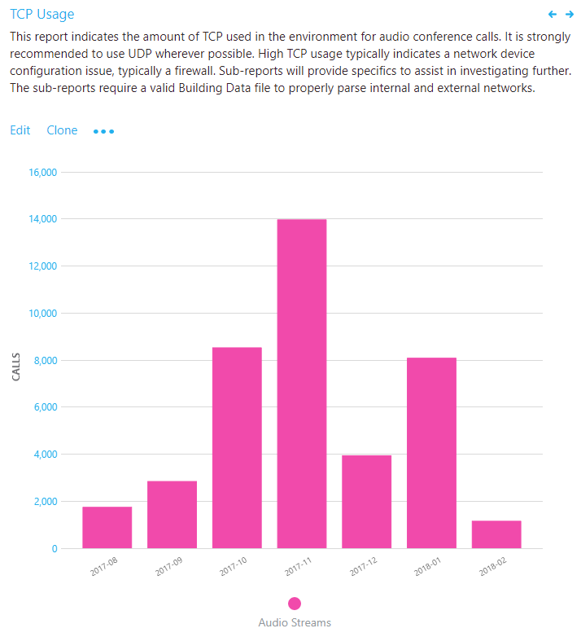

_Figure 23 – Audio Streams with TCP Usage_

#### Investigation

This chart report displays your organization’s overall TCP usage. By using this
report, you can answer the following questions:

1.  What is the total volume of TCP calls for the current month?

2.  Is it worse or better than the previous month?

3.  Is the TCP usage trend increasing, steady, or decreasing?

If you notice that the TCP usage trend is increasing, or above normal monthly
usage, take the time to investigate by using the sub-reports to look for any
buildings or networks that might need remediation. Ideally, you want as few
TCP-based audio sessions as possible on the managed network.

### TCP vs. UDP

This table report identifies the volume of TCP versus UDP usage reporting on the
latest month for conferences for audio, video, and video-based screen sharing
(VBSS).

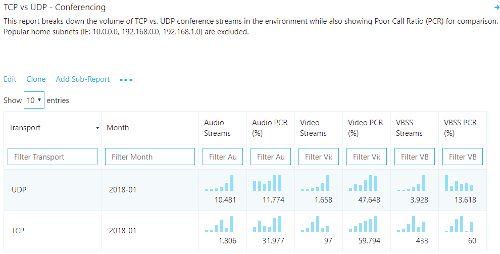

_Figure 24 – TCP vs. UDP - Conferencing_

#### Analysis

Although you want TCP usage to be as low as possible, you might see a bit of TCP
usage in an otherwise healthy deployment. To compare UDP to TCP usage, divide
TCP audio streams by UDP audio streams to determine a percentage. A value over
1 percent needs to be further investigated.

In the example above, we take 1,806 TCP streams divided by 10,481 UDP streams to
arrive at a value of 17.2 percent. This value is well above 1 percent and tells
us that we need to continue our investigation to determine where the TCP usage
is occurring.

Also included in the report is Audio Poor Percentage. This gives you a view into
the comparison of call quality between UDP and TCP to help visualize how TCP is
affecting overcall call quality.

So now that you’ve determined that there is a high usage of TCP-based audio in
your organization, what do you do next? Go to the **TCP Streams by Building and
Subnet** reports to break down the TCP usage by building and subnets.

### TCP streams by building and subnet

In the provided CQD templates, go to the TCP Streams by Building and Subnet
table reports by using either the managed or All Networks template. There are
three reports included in the template, one for investigating conferencing, with
and without Microsoft relay information, and one for investigating two-party
calls. For the purpose of investigating TCP usage, the process is the same, so
we’ll focus the discussion here on conferencing only.

> [!IMPORTANT]
> Having a valid [building file](#building-mapping) uploaded is recommended to be able to quickly distinguish inside from outside audio streams when looking at TCP usage. 

> [!NOTE]
> Be sure to adjust the Month Year filter to the current month. Select **Edit**, and adjust **Month Year** to save the new default month.                                  |

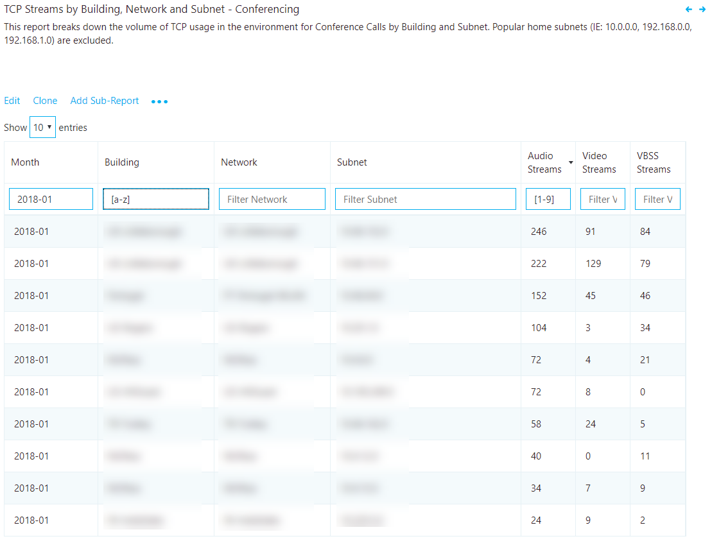

_Figure 25 – TCP Streams by Building and Subnet - Conferencing_

#### Remediation

This report identifies specific buildings and subnets that are contributing to
the volume of TCP usage. An additional report is also included to identify the
Microsoft relay IP that was used in the call to help isolate missing firewall
rules. Focus your remediation efforts on those buildings that have the highest
volume of audio streams to maximize impact.

The most common cause of TCP usage is missing exception rules in firewalls or
proxies. We’ll be talking about proxies in the next section, so for now focus
your efforts on the firewalls. By using the building or subnet provided, you can
determine which firewall needs to be updated.

_Table 10 - Remediation* guidance for TCP streams by building and subnet_

| Remediation        | Guidance     |
|--------------------|--------------------------------------------------------------------------------------------------------------------------------------------------------------------------------------------------------------------------------------------------------------------------------------------------------------------------------------------------------------------------------------------------------------------------------------------------------------------------------------------------------------------------------------------------------------------------------------------------------------------------------------------------------------------------------------------------------------------------------------------------------------------------------------------------------------|
| Configure firewall | Verify [Office 365 IP ports and addresses](https://aka.ms/o365ips) are excluded from your firewall. Though there are many IP addresses and ports that need to be opened, for media-related TCP issues, focus your initial efforts on the following: Verify the following [media subnets](https://support.office.com/en-us/article/Office-365-URLs-and-IP-address-ranges-8548a211-3fe7-47cb-abb1-355ea5aa88a2#bkmk_teams) are in your firewall rules. Refer to Row 4 in the table shown for specific media subnet information. [UDP ports 3478–3481](https://techcommunity.microsoft.com/t5/Skype-for-Business-Blog/Updated-IP-ranges-and-ports-for-Skype-for-Business-Online/ba-p/47470): These ports are the preferred media ports and must be opened, otherwise the client will fail back to TCP port 443. |
| Verify             | Use the [Microsoft Network Assessment Tool](https://www.microsoft.com/en-us/download/details.aspx?id=53885) to check for connectivity issues to specific Office 365 IP addresses and ports from the affected building or subnet.    |

## Investigate HTTP proxy usage

HTTP proxies aren’t the preferred path for establishing media sessions, for a
multitude of reasons. Many contain deep packet inspection features that can
prevent connections to the service from being completed and introduce
disruptions. Additionally, proxies might force TCP as opposed to allowing UDP,
which is recommended for optimal audio quality.

It is always Microsoft’s recommendation to configure the client to directly
connect to Teams and Skype for Business services. This is especially important
for media-based traffic.

> [!IMPORTANT]
> Having a valid [building file](#building-mapping) uploaded makes it easy to properly distinguish inside from outside audio streams when analyzing proxy usage. 

### Audio streams with HTTP proxy usage overall

This report outlines the proxy usage over time on a monthly scale. The HTTP
proxy stream report in this section of the template is much like the TCP
reports. It doesn’t look at whether calls are poor or good, but whether the call
is connected over HTTP.

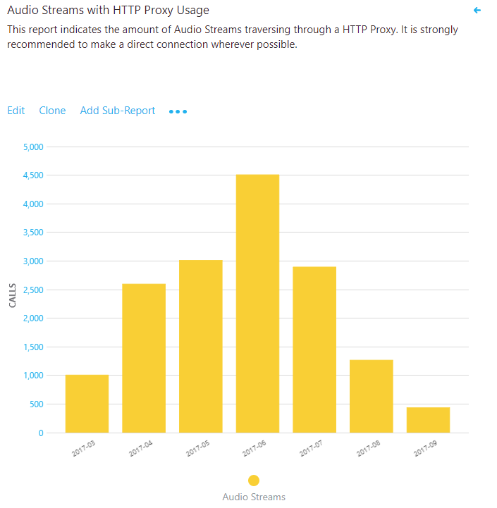

_Figure 26 – Audio Streams with HTTP Proxy Usage_

#### Analysis

If you see a high volume of HTTP usage, consult your networking team to ensure
the proper exclusions are in place so that clients are directly routing to Teams
or Skype for Business Online media subnets. Ideally, there should be no HTTP
usage displayed here.

If you have only one internet proxy in your organization, verify the proper
[Office 365 URLs and IP address range exclusions](https://aka.ms/o365ips). If
more than one internet proxy is configured in your organization, leverage the
HTTP sub-report to isolate which building or subnet is affected.

For organizations that can’t bypass the proxy, ensure that the Skype for
Business client is configured to sign in properly when it’s located behind a
proxy as outlined in the article [Skype for Business should use proxy server to
sign in instead of trying direct
connection](https://support.microsoft.com/en-us/help/3207112/skype-for-business-should-use-proxy-server-to-sign-in-instead-of-tryin).

### HTTP proxy streams by building and subnet

This report identifies specific buildings and subnets that are contributing to
HTTP usage.

> [!IMPORTANT]
> Having a valid [building file](#building-mapping) uploaded makes it easy to properly distinguish inside from outside audio streams when analyzing proxy usage.

> [!NOTE]
> Be sure to adjust the Month Year filter to the current month. Select **Edit**, and adjust **Month Year** to save the new default month.                        |

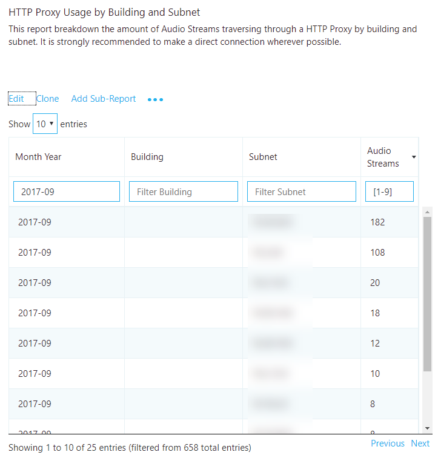

_Figure 27 – HTTP Proxy Usage by Building and Subnet_

#### Remediation

Focus your remediation efforts on any buildings or subnets that have HTTP proxy
usage. The most common cause of HTTP usage is missing exception rules in
proxies. By using the building or subnet provided, you can determine which proxy
needs to be updated.

Verify that the required [Office 365 FQDNs](https://aka.ms/o365ips) are excluded
from your proxy.

# Endpoint investigations

This section is focused on the tasks for reporting on Skype for
Business–specific client versions and the use of certified devices.

> [!NOTE]
> Not all reports included in the templates are covered in this guide. Please refer to the individual report description for more information. 

## Determine client versions

The report in this space focuses on identifying Skype for Business client
versions in use and their relative volume in the environment.

> [!IMPORTANT]
> Currently, Teams clients are distributed and updated automatically through the Azure Content Delivery Network (CDN) and will be kept up to date by the service. Client readiness and investigative activities aren’t applicable to Teams.

Version numbers for Skype for Business 2015 and 2016 can be found via the links
below:

-   [Office 365 client update channel
    releases](https://technet.microsoft.com/en-us/office/mt465751?f=255&MSPPError=-2147217396)

-   [Office 365 Version and Build numbers for Click to
    run](https://support.office.com/en-us/article/Version-and-build-numbers-of-update-channel-releases-ae942449-1fca-4484-898b-a933ea23def7?ui=en-US&rs=en-US&ad=US)

-   [Skype for Business downloads and
    updates](https://technet.microsoft.com/en-us/office/dn788954.aspx)

> [!NOTE] 
> Be sure to adjust the Month Year filter to the current month. Select **Edit**, and adjust **Month Year** to save the new default month.  

> [!IMPORTANT]
> Client reports require you to exclude federated participant data. To exclude federated participant data, you must add a query filter for **Second Tenant ID** set to your organization’s [tenant ID](#tenant-id). |

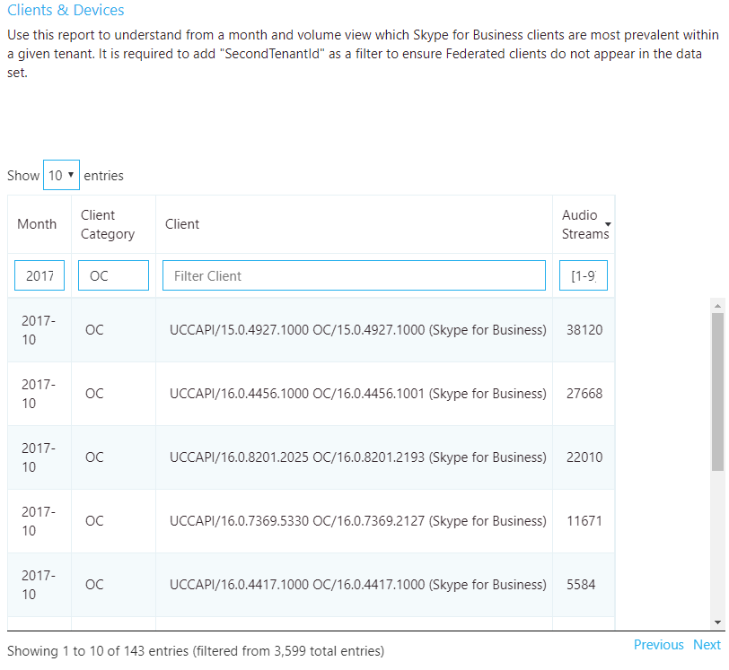

_Figure 28 - Client version report_

### Remediation

A critical part of driving high-quality user experiences is ensuring that
managed clients are running up-to-date versions of Skype for Business. This
provides several benefits, among them:

-   It’s easier to manage a few versions versus many versions.

-   It provides a level of consistency of experience.

-   It makes it easier to troubleshoot problems with call quality and usability.

-   Microsoft continually makes general improvements and optimizations across
    the product. Ensuring that users receive these updates reduces their risk of
    running into a problem that has already been solved.

Limiting your deployment to client versions that are less than six months old
will improve the overall user experience and improve manageability compared to
having large numbers of different versions of the client in the same
environment.

If you’re using only Office Click-to-Run, you’ll automatically be within the
six-month window. No further action is required.

If, like most organizations, you have a mix of Click-to-Run and installer
packages (MSI), you can use the report to verify that the MSI clients are being
updated regularly. Focus your efforts on those clients where the volume is above
average. If you notice clients are falling behind, work with the team
responsible for managing Office updates and ensure that they’re approving and
deploying client patches regularly.

## Devices investigations

To make use of the following device report, it’s best to understand the concept
of the mean opinion score (MOS). MOS is the gold-standard measurement to gauge
the perceived audio quality. It’s represented as an integer rating from 0 to 5.

The basis of all measures of voice quality is how a person perceives the quality
of speech. Because it’s affected by human perception, it’s inherently
subjective. There are several different methodologies for subjective testing.
Most voice quality measures are based on an absolute categorization rating (ACR)
scale.

In an ACR subjective test, a statistically significant number of people rate
their quality of experience on a scale of 1 (bad) to 5 (excellent). The average
of the scores is the MOS. The resulting MOS depends on the range of experiences
that were exposed to the group and to the type of experience being rated.

Because it’s impractical to conduct subjective tests of voice quality for a live
communication system, Teams and Skype for Business generate MOS values by using
advanced algorithms to objectively predict the results of a subjective test.

The available set of MOS and associated metrics provide a view into the quality
of the experience being delivered to the users.

By supplying users with devices certified for Teams and Skype for Business, you
reduce the likelihood of encountering negative experiences due to the device
itself (which is more likely, for example, with built-in laptop speakers and
microphones). For more information, see [Phones and Devices for Skype for
Business](https://technet.microsoft.com/en-us/office/dn947482).

### Organizational usage of capture devices (microphones) by volume

This report is used to assess microphone usage by volume and MOS score, and can
be found in the accompanying templates under Clients & Devices*.*

> [!IMPORTANT]
> Device reports require you to exclude federated participant data. To exclude federated participant data, you must add a query filter for **Second Tenant ID** set to your organization’s [tenant ID](#tenant-id). 

> [!NOTE] 
> Be sure to adjust the Month Year filter to the current month. Select **Edit**, and adjust **Month Year** to save the new default month.   You might notice when viewing this report that you see the same device reported multiple times. This is due to the way the device is reported being reported to CQD. Differences in hardware and OS locale report device data differently.

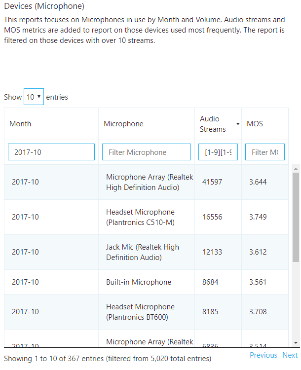

_Figure 29 - – Device (Microphone) Report_

#### Remediation

The first task is to determine the MOS target you would like to attain. MOS
scores range from 1 to 5, with 5 being the best. Choose a reasonable target
based on your environment and query results. In the following example, the
target is an MOS score of 3.6 or better for all devices that have over 100
streams. You’ll achieve your device quality target when:

-   The device query results return MOS \> 3.6 for NumStreams \> 100

Typically, you’ll need to replace poorly performing devices with certified
devices. Some considerations when reviewing the device report include:

-   Are the devices certified or known to be good in your environment? If a
    certified or good device is returned in the query with a lower MOS score
    than your baseline, there may be unknown additional factors (such as a poor
    network or underpowered pc) that is contributing to the low score.
    Additional investigation will be required.

-   You can identify users of a device through [Call
    Analytics](#call-analytics-training). Check to make sure they have the
    latest device drivers and that their device isn’t connected through a USB
    hub.

-   Check to see whether there’s a correlation between bad devices and a
    particular system’s make and model. If so, the device might be incompatible
    or need driver upgrades.

The second task is to determine the overall usage of non-certified devices. We
recommend that at least 80 percent of all audio streams use a certified device.
This is best accomplished by exporting the Devices report to Excel and manually
calculating the usage of certified or approved devices. Organizations typically
keep a list of all approved devices, so filtering and sorting the data should be
straightforward.

## Appendix

## Lync Networking Guide

For more background on the Teams and Skype for Business networking concepts and
rationale behind their importance to quality, the [Lync Server 2013 Networking
Guide](https://blogs.technet.microsoft.com/nexthop/2013/06/03/lync-server-2013-networking-guide-network-planning-monitoring-and-troubleshooting-with-microsoft-lync-server/)
is still applicable.

## Network performance requirements

The quality of real-time media (audio, video, and application sharing) over IP
is greatly affected by the quality of end-to-end network connectivity. For
optimal Teams or Skype for Business media quality, your network must meet the
following network performance metrics.

_Table 11 - Network performance requirements_

| Metric                           | Client to Microsoft Edge           | Customer Edge to Microsoft Edge    |
|----------------------------------|------------------------------------|------------------------------------|
| Latency (one way)                | \<50 ms                            | \<30 ms                            |
| Latency (RTT or Round-trip Time) | \<100 ms                           | \<60 ms                            |
| Burst packet loss                | \<10% during any 200-ms interval   | \<1% during any 200-ms interval    |
| Packet loss                      | \<1% during any 15-sec interval    | \<0.1% during any 15-sec interval  |
| Packet inter-arrival Jitter      | \<30 ms during any 15-sec interval | \<15 ms during any 15-sec interval |
| Packet reorder                   | \<0.05% out-of-order packets       | \< 0.01% out-of-order packets      |

For more information, see the following article about [media quality and network
performance](https://aka.ms/performancerequirements) for Teams and Skype for
Business Online.

## Other resources

### Building data file

-   [Turning on and using CQD in Skype for Business
    Online](https://support.office.com/en-us/article/Turning-on-and-using-Call-Quality-Dashboard-in-Skype-for-Business-Online-553fa13c-92d2-4d5c-a3d5-41a073cb047c?ui=en-US&rs=en-US&ad=US)

### CQD training

-   <https://aka.ms/sof-cqd>

-   [Getting started with
    CQD](https://www.skypeoperationsframework.com/Academy?SOFTrainings=Configuring%20Call%20Quality%20Dashboard%20to%20monitor%20your%20Skype%20for%20Business%20Online%20Environment)
    guide and workshop.

-   [CQD Dimensions and Measures online
    guide](https://support.office.com/en-us/article/Dimensions-and-measures-available-in-Call-Quality-Dashboard-in-Skype-for-Business-Online-e97aeeee-9e43-416f-b433-9cdd63d8874b)

### Call Analytics training

-   [Introducing Call
    Analytics](https://techcommunity.microsoft.com/t5/Skype-for-Business-Blog/Introducing-Call-Analytics/ba-p/57309)

-   [Set up Skype for Business Call
    Analytics](https://support.office.com/en-us/article/Set-up-Skype-for-Business-Call-Analytics-FBF7247A-84AE-46CC-9204-2C45B1C734CD)

-   [What's the difference between Call Analytics and Call Quality
    Dashboard?](https://support.office.com/en-us/article/What-s-the-difference-between-Call-Analytics-and-Call-Quality-Dashboard-4CD5FE35-8463-4996-A252-086CD3CA2D9A)

-   [Use Call Analytics to troubleshoot poor Skype for Business call
    quality](https://support.office.com/en-us/article/Use-Call-Analytics-to-troubleshoot-poor-Skype-for-Business-call-quality-66945036-ae87-4c08-a0bb-984e50d6b009)

### Call Analytics support

-   Community: [Skype for Business Preview
    Program](https://techcommunity.microsoft.com/t5/Skype-for-Business-Preview/bd-p/SkypeforBusinessPreviewProgram)

-   To get support, sign in to our preview portal
    [www.skypepreview.com](http://www.skypepreview.com), select **Report an
    issue**, and use the **Create New Bug** option to report an issue. Please
    note that support engineers are available to provide support from Monday
    through Friday, between the hours of 6 AM to 9 PM EST. Requests outside of
    those hours will be triaged the following day.

### Devices

-   [Skype for Business Solutions Catalog Personal Peripherals &
    PCs](http://partnersolutions.skypeforbusiness.com/solutionscatalog/personal-peripherals-pcs)

### Tenant reporting

-   [Office 365 Adoption Content
    Pack](https://blogs.office.com/en-us/2017/05/22/announcing-the-public-preview-of-the-office-365-adoption-content-pack-in-powerbi/)

-   [Skype for Business Online
    reporting](https://support.office.com/en-us/article/Skype-for-Business-Online-reporting-4935cddf-fafa-442d-91a3-246af01f8373)

-   [Microsoft Teams
    reporting](https://techcommunity.microsoft.com/t5/Microsoft-Teams-Blog/New-usage-reports-for-Microsoft-Teams/ba-p/132614)
