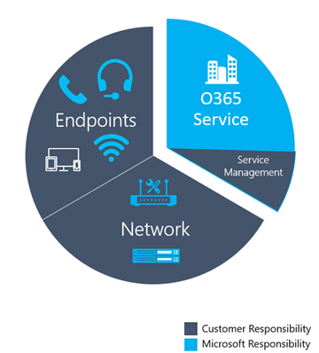
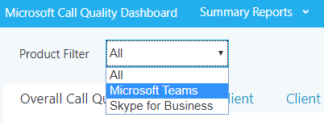
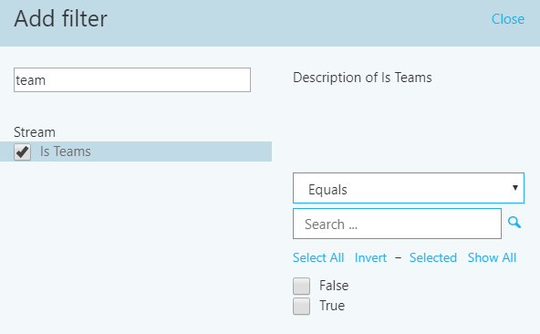
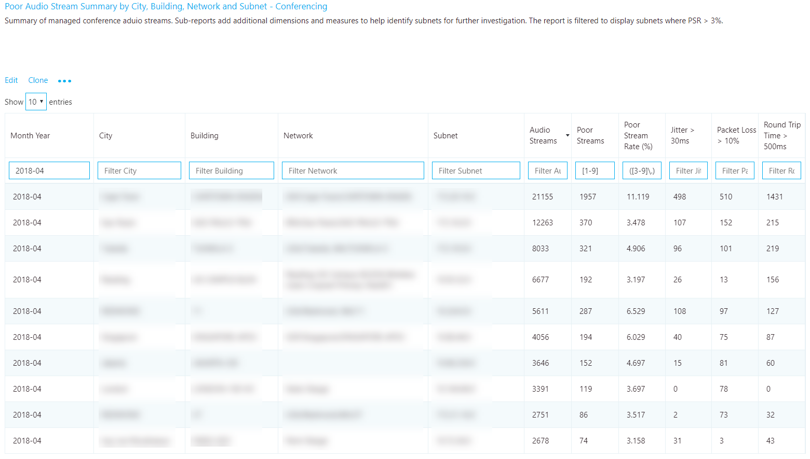
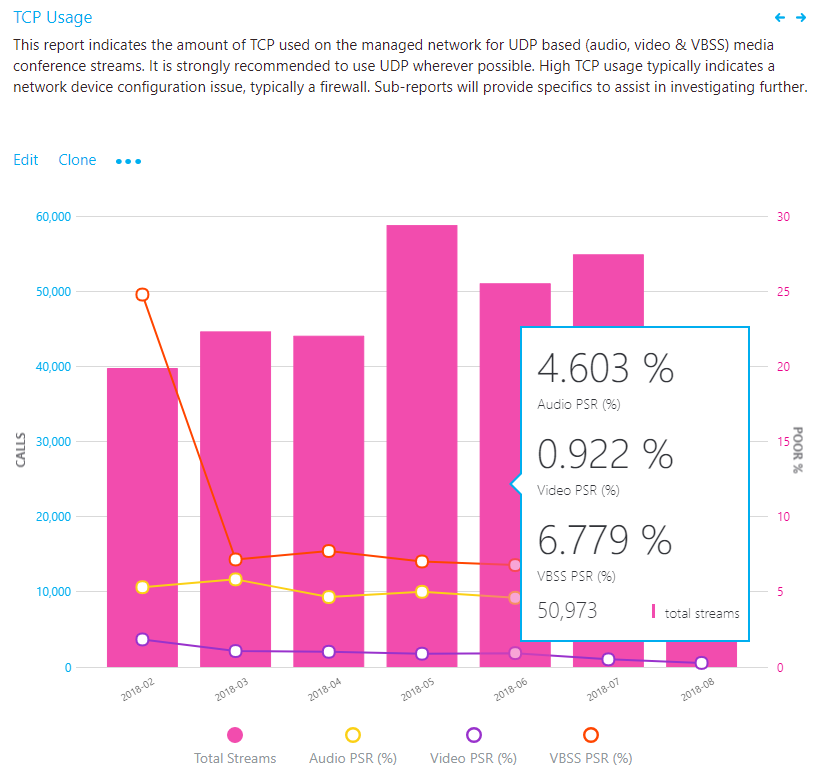
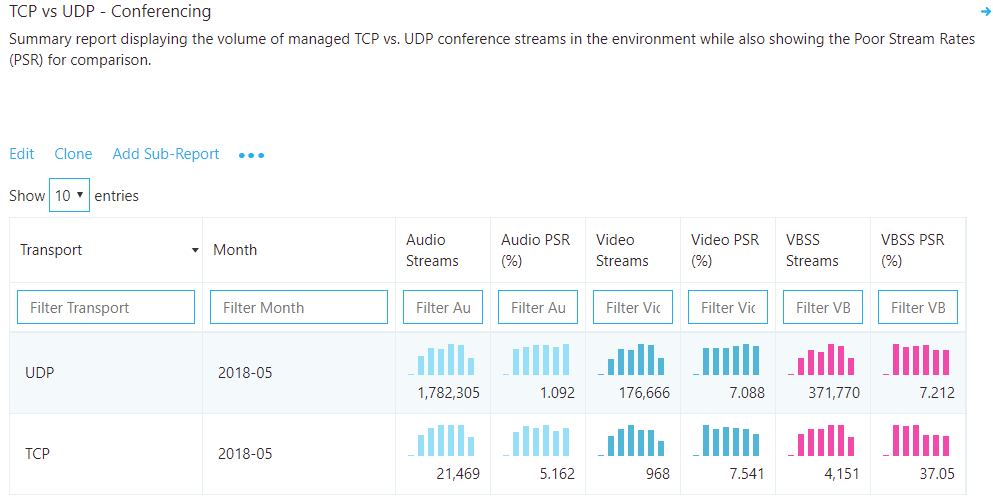
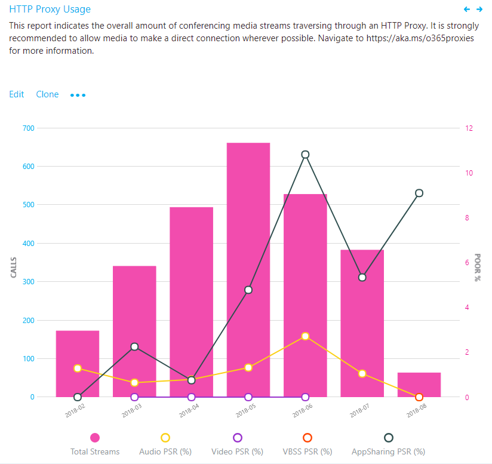

#  Use CQD to manage call and meeting quality in Microsoft Teams 

This article will help you - the Teams admin or support and helpdesk engineer - to develop a process for monitoring and maintaining call and meeting quality for your organization by using Microsoft Teams Call Quality Dashboard (CQD). Our guidance emphasizes audio-quality scenarios because any network improvements you make to improve the audio experience will translate to improvements in video and sharing.

Key to this guidance are the two [curated CQD templates](https://aka.ms/QERtemplates) - we recommend that you download them before you go through the guidance in this article.

This article assumes that you've already [set up CQD](turning-on-and-using-call-quality-dashboard.md).


## Categories to monitor and maintain

Once you've rolled out meetings and voice in Teams, you'll need a plan for ongoing monitoring and maintenance. Doing so will ensure that Teams is always running optimally. This plan should include the key areas listed below. You should also establish targets for quality metrics and a plan for troubleshooting and isolating problems when they happen.

<table>
<thead>
<tr class="header">
<th>Category</th>
<th>Description</th>
</tr>
</thead>
<tbody>
<tr class="odd">
<td><strong>Call quality</strong></td>
<td>
<p>Break down the metrics by internal calls (within your organization, such as VPN, WiFi, wired) or external calls</p>
<p>Break down the metrics by building or network</p>
<p>VPN calls</p>
<p>Calls using TCP, UDP, or proxy</p>
</td>
</tr>
<tr class="even">
<td><strong>Call reliability</strong></td>
<td><p>Identify and remediate any network or firewall problems</p>
<p>Gain insights into the percentages of call setup and drop failures</p>
<p>Learn where the majority of call setup and drop failures occur</p>
</td>
</tr>
<tr class="odd">
<td><strong>User survey</strong></td>
<td>
<p>Use Rate My Call data to learn about users' actual experience</p>
<p>Where are the poor experiences occurring?</p>
<p>Correlate the poor experience with call quality, reliability, and devices</p>
</td>
</tr>
<tr class="even">
<td><strong>Devices</strong></td>
<td><p>Learn which microphones and speakers are most commonly used and their impact on call quality</p>
<p>Are the supporting audio, video, USB, and WiFi drivers being regularly patched?</p>
</td>
</tr>
<tr class="odd">
<td><strong>Clients</strong></td>
<td>
<p>Learn which client types and versions are being used and their impact on call quality and reliability  </p>
</ol></td>
</tr>
</tbody>
</table>

By continually assessing and remediating the areas described in this article, you can reduce their potential to negatively affect your users. Most user problems can be grouped into the following categories:

-   Incomplete firewall or proxy configuration
-   Poor Wi-Fi coverage
-   Insufficient bandwidth
-   VPN
-   Inconsistent or outdated client versions and drivers
-   Unoptimized or built-in audio devices
-   Problematic subnets or network devices

Through proper planning and design before deploying Teams or Skype for Business Online, you can reduce the amount of effort that will be required to maintain high-quality experiences.

This article focuses on using the Call Quality Dashboard (CQD) Online as the primary tool to report and investigate each area, with a special emphasis on audio to maximize adoption and impact. Any improvements made to the network to improve the audio experience will also directly translate to improvements in video and desktop sharing.

To accelerate your assessment, [two curated CQD templates](https://aka.ms/qertemplates) are provided: one is for managing all networks and the other is filtered for managed (internal) networks only. Although the All Networks template reports are configured to display building and network information, they can still be used while you work toward collecting and uploading building information. Uploading building information into CQD enables the service to enhance reporting by adding custom building, network, and location information while differentiating internal from external subnets. For more information, read [Building mapping](CQD-building-mapping.md).

### Intended audience

This article is intended to be used by partner and customer stakeholders with roles such as Collaboration Lead/Architect, Consultant, Change Management/Adoption Specialist, Support/Help Desk Lead, Network Lead, Desktop Lead, and IT Admin.

This article is also intended to be used by the designated quality champion(s). For more information, see [the Quality Champion role](4-envision-plan-my-service-management.md#the-quality-champion-role).


## What is quality?

In this context, quality is a combination of service metrics and user experience.


### Service metrics

Service metrics consist of specific client-based metrics. During each call, the client collects telemetry for the call and submits a report at the end of each call that can later be accessed in CQD or in [per-user call analytics](set-up-call-analytics.md). These metrics include (but aren't limited to):

-   Poor Stream (incoming and outgoing)
-   Setup Failure Rate
-   Drop Failure Rate


#### Poor stream rate

The poor stream rate (PSR) represents the organization's overall percentage of streams that have poor quality. This metric is meant to highlight areas where your organization can concentrate effort to have the strongest impact toward reducing this value and improving the user experience, which is why [managed networks](#managed-versus-unmanaged-networks) are the primary focus when looking at PSR. External users are important too, but investigation differs on an organizational basis. Consider providing best practices for external users, and investigate external calls independently from the overall organization.

The actual measurement in CQD varies by workload, but for the purposes of this article, we focus primarily on the _Audio Poor Percentage_ measurement. PSR is made up of the five network metric averages described in the following table. For a stream to be classified as poor, only one metric needs to exceed the defined threshold. CQD provides the "Poor Due To…" measurements to better understand what condition caused the stream to be classified as poor. To learn more, read [Stream classification in CQD](stream-classification-in-call-quality-dashboard.md).

> [!Note]
> CQD provides the "Poor due to…" measurements to better understand what condition caused the stream to be classified as poor.


##### Audio poor quality metrics

| Metric average     | Description     | User experience |
|-------------|-----------------|-----------------|
| Jitter \>30 ms        | This is the average change in delay between successive packets. Teams and Skype for Business can adapt to some levels of jitter through buffering. It's only when the jitter exceeds the buffering that a participant notices the effects of jitter.      | The packets arriving at different speeds cause a speaker's voice to sound robotic.   |
| Packet loss rate \>10% or 0.1        | This is often defined as a percentage of packets that are lost. Packet loss directly affects audio quality—from small, individual lost packets that have almost no impact to back-to-back burst losses that cause audio to cut out completely.     | The packets being dropped and not arriving at their intended destination cause gaps in the media, resulting in missed syllables and words, and choppy video and sharing. |
| Round-trip time \>500 ms        | This is the time it takes to get an IP packet from point A to point B and back to point A. This network propagation delay is tied to the physical distance between the two points and the speed of light, and includes additional overhead taken by the various devices in the network path.      | The packets taking too long to arrive at their destination cause a walkie-talkie effect.   |


##### Why do we prefer to use streams instead of calls?

Streams let us know which particular leg of the call was poor - outgoing or incoming. When you're looking at call analytics for a poor call, determine whether the poor call was due to that caller's stream (outbound) or callee's stream (inbound). Determining which stream is impacting call quality is even more important for conferences. If you're only looking at call data, you'll see how many conferences a person participates in, but you won't see which people are active speakers, doing the most screen sharing.

Call data gives you usage metrics, but it won't necessarily lead you to the root cause for poor call quality. By looking at stream direction, you can identify factors such as a call that's not on a managed network, a call from a non-employee (e.g., a vendor or someone on a different network). In these cases, if the other person's network connection was poor, the entire call will be flagged as poor. You can't do  anything about external factors, so this data isn't helpful.

Stream direction can also help you identify problematic devices or clients.

 - For example, If you have a limited budget for devices and want to provide devices only for heavy audio users, use the audio usage report (VoIP) and filter for outbound streams and conferencing. Look for high-volume audio users who are speaking into built-in microphones - these may correlate to poorer call quality (and you might want to provide audio devices for these people). For added clarity, you could filter for packet utilization, which will let you target especially high-volume audio users. 

  - Another example involves screen sharing. If a customer is using an old Teams client, screen sharing performance may be affected. You could address this problem by prioritizing client upgrades for people who do a lot of screen sharing.

 - By identifying which direction of a stream is causing poor call quality, you can determine whether you've got a QoS or bandwidth-related problem. If you haven't fully implemented QoS, or if you only mark packets at the client and not at the inbound stream, you might see poorer call quality. By looking at stream direction, you can get a more granular view of packet loss, latency, or jitter in a specific direction. 

   - For example, let's say a user complains of robotic audio while on a wired connection (jitter). By looking at stream and direction, you can determine that the problem happens on the inbound stream, only for a specific set of subnets. After you give this information to your networking team, they can track it down to a misconfigured WAN accelerator that was not bypassing media traffic. Once the network team reconfigures the WAN accelerator, jitter disappears and call quality improves. 


#### Setup Failure Rate

The setup failure rate, otherwise known as the _Total Call Setup Failure Percentage_ measurement in CQD, is the number of streams where the media path couldn't be established between the endpoints at the start of the call.

This represents any media stream that couldn't be established. Given the severity of the impact of this problem on the user experience, the goal is to reduce this value to as close to zero as possible. A high value for this metric is more common in new deployments with incomplete firewall rules than a mature deployment, but it's still important to watch on a regular basis.

This metric is calculated by taking the total number of streams that failed to set up divided by the total number of streams that submitted a successful call detail record (CDR):

-   **Setup Failure Rate** = Total Call Setup Failed Stream Count / Total CDR Available Stream Count

#### Drop Failure Rate

The drop failure rate, otherwise known as the _Total Call Dropped Failure Percentage_ measurement in CQD, is the percentage of successfully established streams where the media path didn't terminate normally.

This represents any media stream that terminated unexpectedly. Although the impact of this isn't as severe as a stream that failed to set up, it still negatively affects the user experience. Sudden and frequent media drops not only can have a severe impact on the user experience, they result in the need for users to reconnect, resulting in lost productivity (not to mention frustration).

The metric is calculated by taking the total number of dropped streams divided by the total count of streams that set up successfully:

-   **Drop Failure Rate** = Total Call Dropped Stream Count / Total Call Setup Succeeded Stream Count

### Define your target metrics

This section discusses some of the core service metrics that we use to assess the health of the services. By continually assessing and driving efforts to keep these metrics below their defined targets, you'll help ensure that your users experience consistent, reliable call quality. As a starting point, use the suggested targets in the table below. Adjust the targets as needed to meet your business objectives.

<table>
<tr>
<th rowspan="2" colspan="2" valign="center">Network type</th><th rowspan="1">Quality targets</th><th colspan="2">Reliability targets</th></tr>
<tr><th>Audio Poor Stream Rate</th><th>Setup Failure Rate</th><th>Drop Failure Rate</th></tr>
<tr><td rowspan="2"><strong>All</strong></td><td>Internal</td><td>2.0%</td><td>0.5%</td><td>2.0%</td></tr>
<tr><td>Overall</td><td>3.0%</td><td>1.0%</td><td>3.0%</td></tr>
<tr><td rowspan="5"><strong>Conferencing</strong></td><td>Internal</td><td>2.0%</td><td>0.5%</td><td>2.0%</td></tr>
<tr><td>Wired internal</td><td>1.0%</td><td>0.5%</td><td>1.0%</td></tr>
<tr><td>Wi-Fi 5 GHz internal</td><td>1.0%</td><td>0.5%</td><td>1.0%</td></tr>
<tr><td>Wi-Fi 2.4 GHz internal</td><td>2.0%</td><td>0.5%</td><td>2.0%</td></tr>
<tr><td>Overall</td><td>2.0%</td><td>0.5%</td><td>3.0%</td></tr>
<tr><td rowspan="4"><strong>P2P</strong></td><td>Internal</td><td>2.0%</td><td>0.5%</td><td>2.0%</td></tr>
<tr><td>Wired/Wi-Fi 5 GHz internal</td><td>1.0%</td><td>0.5%</td><td>1.0%</td></tr>
<tr><td>Wired/Wi-Fi 5 GHz overall</td><td>2.0%</td><td>1.0%</td><td>1.0%</td></tr>
<tr><td>Overall</td><td>2.0%</td><td>1.0%</td><td>3.0%</td></tr>
</table>

### User experience

Analyzing the user experience is more art than science, because the metrics gathered here don't always mean that there's a problem with the network or service but rather, they simply indicate that the user perceives a problem. CQD includes a built-in survey mechanism — Rate My Call (RMC) — to help gauge overall user experience. RMC will give you insight into the following questions from the perspective of your users:

-   Do I know how to use the solution?
-   Is the solution easy to use and intuitive, and does it support my day-to-day communication needs?
-   Does the solution help me get my job done?
-   What's my overall perception of the solution?
-   Can I use the solution at any point in time, regardless of where I am?
-   Can I set up and maintain a call?

#### Rate My Call 

Rate My Call (RMC) is built into Teams and Skype for Business. It automatically pops up after one in every 10 calls, or 10 percent. This brief survey asks the user to rate the call and provide a little context for why the call quality might have been poor. A one or two rating is considered poor, three to four is good, and five is excellent. Although it's somewhat of a lagging indicator, this is a useful metric for uncovering issues that service metrics can miss.

> [!Note]
> The human factor: Users often ignore the survey when call quality is good, and they fill it out when call quality is bad. As a result, your RMC reports might be skewed to the poor side even while service metrics are good.

You can use CQD to report on RMC user responses, and sample reports are included in the CQD template. However, they aren't discussed in detail in this article. 

#### Client and device readiness

You need a solid client and device strategy to help ensure that your users have a consistent and positive user experience. A few key principles drive each readiness strategy.

##### Client readiness

Keeping the Teams client up-to-date ensures that your users are always getting the best-possible experience. Microsoft releases frequent [updates to the Teams client](teams-client-update.md) (the update installs itself in the background unless you've turned off this functionality - which we don't recommend). It's also important to remember to patch network, video, USB, and audio drivers, because they're often overlooked and can affect call and meeting quality. Consider adding network, Wi-Fi, video, USB, and audio drivers to your current patch management process.


##### Device readiness

No one single strategy can affect the user experience more than your device readiness strategy. For example, users who rely on their laptop speakers and microphone will experience a lot of background noise in calls and meetings. Teams is designed to work with almost any device, but if you're having device-related problems, check out [Phone for Teams](./devices/phones-for-teams.md).


### Categories of quality

Operationalize a set of quality-management practices - this gives you the best chance of good call and meeting quality. A good quality management plan addresses these categories:

-   **Network:** Audio quality focused on the Poor Stream Ratio (PSR) metric, TCP usage, wired and wireless subnets, and identifying the use of HTTP proxies and VPN

-   **Endpoints:** Audio devices and up-to-date clients

-   **Service Management:** This category comprises two sections:

    -   First is Microsoft's responsibility to manage and maintain the Teams and Skype for Business Online services.

    -   Second are tasks your organization manages to ensure reliable access to the service, such as updating building information and maintaining firewalls for new Office 365 IP addresses as infrastructure is added to the service.



Review the following list of tasks recommended to maintain quality. You should perform these tasks regularly - for example, weekly.

#### Service management tasks

These tasks range from ensuring there is sufficient bandwidth to reach the service without saturating internet links, validating that quality of service (QoS) is in place on all managed network areas, and staying on top of [Office 365 IP ranges on firewalls](/microsoft-365/enterprise/urls-and-ip-address-ranges).

#### Network tasks

There are two categories of network tasks: reliability and quality. Reliability focuses on measuring the user's ability to make calls successfully and stay connected. Quality focuses on the aggregated telemetry sent to Teams and Skype for Business Online by the user's client during the call and after it has ended. 

Given the critical impact that reliability has on the user experience, we recommend that you assess and investigate reliability metrics before you dive into quality. 

#### Endpoints tasks

The main task in this category removing any obstacles to regular [Teams client updates](teams-client-update.md). By default, Teams automatically updates regularly (unless you turn off that setting, which we don't recommend). 

You should also monitor devices and provide updates whenever you identify problems related to a device.

## Use CQD to manage call quality

Once you've [set up CQD](turning-on-and-using-call-quality-dashboard.md), you're ready to start using it to manage call and meeting quality for your organization.

Most problems with Teams performance fall into the following categories:

-   Incomplete firewall or proxy configuration
-   Poor Wi-Fi coverage
-   Insufficient bandwidth
-   VPN
-   Inconsistent or outdated client versions and drivers
-   Unoptimized or built-in audio devices
-   Problematic subnets or network devices

If you take the time before you roll out Teams to assess these areas and remediate any deficiencies, you'll reduce the amount of effort needed to maintain a high-quality Teams experience for all your users. For help assessing your network in preparation for your Teams rollout, read [Advisor for Teams](use-advisor-teams-roll-out.md) and [Prepare your network for Teams](prepare-network.md).

### Expectations using CQD

Use the Call Quality Dashboard (CQD) to gain insight into the quality of calls made by using Teams and Skype for Business services. CQD is designed to help Teams and Skype for Business admins and network engineers optimize the network and keep a close eye on quality, reliability, and the user experience. CQD looks at aggregate telemetry for an entire organization, where overall patterns can become apparent; this lets you make informed assessments and plan remediation. CQD provides reports of metrics that provide insight into overall quality, reliability, and user experience.

CQD, although useful for analyzing trends and subnets, doesn't always provide a specific cause for a given scenario. It's important to understand this and set the correct expectation when using CQD:

-   CQD won't provide the root cause for every scenario
-   CQD won't contain Phone System or Audio Conferencing streams
-   CQD will call out areas for further investigation based on trends

### CQD reports overview

Use the drop-down menu at the top of the screen to open a report. For a list of the data provided in each report, read [Data available in CQD reports](CQD-data-and-reports.md#data-available-in-cqd-reports).

New in January 2020: [Download Power BI query templates for CQD](https://github.com/MicrosoftDocs/OfficeDocs-SkypeForBusiness/blob/live/Teams/downloads/CQD-Power-BI-query-templates.zip?raw=true). Customizable Power BI templates you can use to analyze and report your CQD data.


### Teams vs. Skype for Business

CQD can report on both Teams and Skype for Business. However, there might be times when you want to develop a report to look at Teams telemetry separate from Skype for Business.

#### Summary reports

To modify the summary reports page to look at only Teams or Skype for Business, select the **Product Filter** drop-down menu from the top of the screen, and then select the product you want.



#### Detailed reports

To filter all detailed reports, in the browser bar, append the following to the end of the URL:

```PowerShell
/filter/[AllStreams].[Is Teams]|[FALSE]
```

**Example:**

```https://cqd.teams.microsoft.com/cqd/#/1234567/2018-5/filter/[AllStreams].[Is Teams]|[FALSE]```

For more information about URL filters, read [Filtering reports](CQD-data-and-reports.md#report-filters) later in this section.

To filter an individual detailed report, add the filter ``Is Teams`` to the report and set it to True or False.



### Managed versus unmanaged networks

By default, all endpoints in CQD are classified as external. As soon as a building file is introduced, we can begin to look at managed endpoint data. As previously discussed, networks in CQD are defined as:

-   A _managed network_, often referred to as internal or inside, can be influenced and controlled by the organization. This includes the internal LAN, the remote WAN, and VPN.
-   An _unmanaged network_, often referred to as external or outside, can't be influenced or controlled by the organization. An example of an unmanaged network is a hotel or airport network.

### Dimensions, measures, and filters

A well-formed CQD query contains all three of the following parameters:

-   **Dimension:** How I want to pivot on the data.

-   **Measure:** What I want to report on.

-   **Filter:** How I want to reduce the dataset the query returns.

Another way to look at this is that a _dimension_ is the grouping function, a _measure_ is the data I'm interested in, and a _filter_ is how I want to narrow down the results to those that are relevant to my query.

An example of a well-formed query is **Show me Poor Streams [Measure] by Subnet [Dimension] for Building 6 [Filter]**. For more information, see [Dimensions and measures available in CQD](./dimensions-and-measures-available-in-call-quality-dashboard.md).

### First vs. second 

Many of the dimensions and measures in CQD are classified as first or second. CQD doesn't use caller/callee fields—these have been renamed _first_ and _second_ because there are intervening steps between the caller and callee. The following logic determines which endpoint involved is labeled as first:

-   **First** will always be a server endpoint (Conference Server, Mediation Server, and so on) if a server is involved in the stream or call.

-   **Second** will always be a client endpoint unless the stream is between two server endpoints.

-   If both endpoints are the same type, the choice of which is first is based on internal ordering of the user agent category. This ensures the ordering is consistent.

For more information about determining the first or second endpoint when they're both the same, see [Dimensions and measures available in CQD](./dimensions-and-measures-available-in-call-quality-dashboard.md).

### Stream vs. call

You need to understand the difference between a call and a stream to properly choose which dimensions or measures you'll be looking at in CQD. Although CQD's primary focus is on streams, call-based measurements are also available.

-   **Stream:** A _stream_ exists between only two endpoints. There is only one stream for each direction, and two streams are required for communication. Streams are useful for investigating buildings, networks, or subnets. In some cases, both call and stream are used in the measurement's name (for example, Call Setup Stream or Call Dropped Stream). These are still classified as streams.

-   **Call:** A _call_ is a grouping of all streams from all participants. A call consists of—at minimum—two streams. A single call will have at least two endpoints, each with a minimum of one stream.

For additional guidance on whether the dimension or measure is referring to a call or a stream, see [Dimensions and measures available in CQD](./dimensions-and-measures-available-in-call-quality-dashboard.md)

### Good, poor, and unclassified calls

A call is categorized either as good, poor, or unclassified. Let's take a moment to talk about each one in more detail.

-   **Good or poor:** A good or poor call consists of a call that contains a complete set of service metrics, for which a full QoE report was generated and received by the service. Determining whether a stream is good or poor is described [earlier in this article](#poor-stream-rate).

-   **Unclassified:** An unclassified stream doesn't contain a full set of service metrics. These can be short calls—usually less than 60 seconds—where averages couldn't be computed and a QoE report wasn't generated. The most common reason for calls to be unclassified is that there was little to no packet utilization. An example of this would be a participant who joins a meeting on mute and never speaks. The participant is receiving, but not transmitting, media. Without media being transmitted, there won't be any metrics available for CQD to use to classify the endpoint's outbound media stream.

To learn more, read [Stream classification in CQD](stream-classification-in-call-quality-dashboard.md).

### Common subnets

Common subnets are specific private subnets that are used by hotels, home networks, hotspots, and similar areas. These subnets are difficult to triage due to their widespread use. If your organization uses one of these common subnets, we recommend that you move that network to another subnet. This will make reporting easier in CQD. When noted, reports in the All Networks template have been configured to exclude these subnets to eliminate them as a source of poor quality. Common subnets are defined below; their impact will vary by organization.

-   10.0.0.0/24
-   192.168.0.0/24
-   192.168.1.0/24
-   192.168.2.0/24
-   172.20.10.0/24
-   192.168.43.0/24

When investigating a managed network that uses a common subnet, you'll need to use the Second Reflexive Local IP dimension to group subnets. This dimension contains the endpoint's public IP address.


## Reliability investigations

The first step to improving quality is to assess the state of reliability across the organization. Because reliability is vital to a positive user experience, we start with the two components that measure reliability:

1.  **Setup failures:** The call couldn't be established.

2.  **Drop failures:** The call was established and unexpectedly terminated.

Throughout this section, we'll cover methods to investigate both areas.

> [!NOTE]
> Not all reports included in the templates are covered in this article. However, the methods of investigation explained below still apply. Please refer to the individual report description for more information.


### Setup failures

Prioritize remediating setup failures in this area first, because these failures have a significant negative impact on the user experience.

Begin your investigation by assessing the percentage of overall setup failures for the organization, and then prioritize areas of investigation based on the highest percentage by building or network. 

#### Setup failure trend analysis

This report displays the total amount of streams, stream setup failures, and the stream setup failure rate. Point to any one of the columns to display its individual values. 

##### Analysis

By using this report, you can answer the following questions and determine your next course of action:

-   What is the total call setup failure percentage for the current month?

-   Is the total call setup failure percentage below or above the defined target metric?

-   Is the failure trend worse or better than the previous month?

-   Is the failure trend increasing, steady, or decreasing?

Irrespective of your answers to these questions, take the time to investigate further by using the companion sub-reports to look for any individual buildings or subnets that might need remediation. Although the overall failure rate might be below the target metric, the failure rates for one or more buildings or networks might be above the target metric and need investigation.

#### Setup failure investigations 

This summary report is used to discover and isolate any buildings or networks that might need remediation.

> [!NOTE]
> Be sure to adjust the Month Year report filter to the current month. Select **Edit**, and adjust the **Month Year** report filter to save the new default month.

##### Remediation 

Focus your first remediation efforts on buildings or subnets that have the largest volume of failures. This will maximize impact on the user experience and help to quickly reduce the rate of organizational call setup failures. The following table lists the two reasons for setup failures as reported by CQD.

| Call Setup Failures reason       | Typical cause                    |
|----------------------------------|----------------------------------|
| Missing FW Deep Packet Inspection Exemption Rule | Indicates that network equipment along the path prevented the media path from being established due to deep packet inspection rules. This is likely due to firewall rules not being correctly configured. In this scenario, the TCP handshake succeeded but the SSL handshake didn't.      |
| Missing FW IP Block Exception Rule      | Indicates that network equipment along the path prevented the media path from being established to the Microsoft 365 or Office 365 network. This might be due to proxy or firewall rules not being correctly configured to allow access to IP addresses and ports used for Teams and Skype for Business traffic. |

As you begin your remediation, you can focus your efforts on a particular building or subnet. As the preceding table shows, these issues are due to firewall or proxy configurations. Review the options in the following table for remediation actions.

|      Remediation      |Guidance  |
|-----------------------|----------|
| Configure firewalls | Work with your network team and verify your firewalls configuration against [the Office 365 IP address list](/microsoft-365/enterprise/urls-and-ip-address-ranges).<br><br>Verify that the [media subnets](https://support.office.com/article/Office-365-URLs-and-IP-address-ranges-8548a211-3fe7-47cb-abb1-355ea5aa88a2#bkmk_teams) and ports are included in the firewall rules. <br><br>Verify that the [necessary ports](prepare-network.md) are opened in the firewall. UDP should be given priority because TCP is considered a failback protocol for audio, video, and video-based screen sharing, and its use will affect the quality of the call. Legacy RDP application sharing uses TCP only.|

### Drop failures

Unlike setup failure codes, CQD has no drop failure code to indicate why drop failures occur, which makes it difficult to isolate a specific root cause. To better triage drop failures, use an inferred approach. By remediating any areas of interest for media, patching clients and drivers, and driving usage of certified devices for Teams and Skype for Business, you can expect drop failures to decline.

#### Drop failure trend analysis

This report displays the total amount of audio streams, total drop failures, and the drop failure rate. Point to any one of the columns to display its values. 


##### Analysis

By using this type of report, you can answer the following questions:

-   What is the current drop failure rate?
-   Is the drop failure rate below the defined target metric?
-   Is the failure trend worse or better than the previous month?
-   Is the failure trend increasing, steady, or decreasing?

Irrespective of the answers to the questions above, take the time to investigate using the sub-reports to look for any buildings or networks that might need remediation. Although the overall drop failure rate might be below the target metric, the drop failure rate for one or more buildings or networks might be above the target metric and need investigation.

#### Drop failure investigations

Failures reported here indicate that the call was dropped unexpectedly and resulted in a negative user experience. Unlike the trending reports, these reports provide additional insights into specific subnets that need further investigation.


##### Remediation

Using the included table reports, you can isolate problem areas in the network where the drop rate is above the target metric you've defined. Focus your first remediation efforts on buildings or subnets that have the highest total stream count, to make the biggest impact.

Common causes of call drops:

-   Under-provisioned network or internet egress
-   No QoS configured on constrained networks
-   Older client versions
-   User behavior

After you discover your problem areas, you can use [per-user call analytics](use-call-analytics-to-troubleshoot-poor-call-quality.md) to further review users in that building for specific issues. Call analytics contains additional EUII data and can be useful for further isolating potential reasons for the drop failures.

Regardless of your next step, it's a good practice to notify your helpdesk that an issue has been discovered with specific buildings or subnets. This lets the helpdesk quickly respond to incoming calls and triage users more efficiently. Flagged users can then be reported back to the engineering team for further investigation.

The following table lists some common methods to manage and remediate drop failures.

| Remediation                              | Guidance                      |
|------------------------------------------|-------------------------------|
| **Network/internet**                         | **Congestion**: Work with your network team to monitor bandwidth at specific buildings/subnets to confirm that there are issues with overutilization. If you do confirm that there is network congestion, consider increasing bandwidth to that building or applying QoS. Use the included [Quality Poor Stream summary reports](#quality-investigations) to review the problem subnets for issues with jitter, latency, and packet loss, because these will often precede a dropped stream.<br><br>**QoS**: If increasing bandwidth is impractical or cost-prohibitive, consider implementing QoS. This tool is very effective at managing congested traffic and can guarantee that media packets on the managed network are prioritized above non-media traffic. Alternatively, if there's no clear evidence that bandwidth is the culprit, consider these solutions:<ul><li>[Microsoft Teams QoS guidance](qos-in-teams.md)</li></ul><br>**Perform a network readiness assessment**: A network assessment provides details about expected bandwidth usage, how to cope with bandwidth and network changes, and recommended networking practices for Teams and Skype for Business. Using the preceding table as your source, you have a list of buildings or subnets that are excellent candidates for an assessment.<ul><li>[Prepare your organization's network for Teams](prepare-network.md)</li></ul> |
| **Clients (Skype for Business Online only)** | Some older Skype for Business clients have known, documented issues with media reliability. Review the Call Analytics reports from multiple affected users, or create a custom Client Version table report in CQD filtered to specific buildings or subnets with Total Call Dropped Failure % measure. This information will help you understand whether a relationship exists between call drops in that specific building and a specific version of the client.     |
| **Devices**                                  |If devices are the culprit in call-quality problems, consider updating offending devices. Read [Phones for Teams](./devices/phones-for-teams.md) to learn more. |
| **User behavior**                            | If you determine that neither network, devices, or clients are the issue, consider developing a user adoption strategy to educate users how to best join and exit meetings. A smarter Teams and Skype for Business user will produce a better user experience for all participants in the meeting. For example, a user who puts their laptop to sleep (by closing the lid) without exiting the meeting will be classified as an unexpected call drop.   |

## Quality investigations

The next step to assess the state of audio quality across the organization is to investigate Poor Stream Rate (PSR), TCP, and proxy usage. It's important to remember that CQD data doesn't provide you a specific root cause, but instead provides you with likely problem areas to begin a collaborative conversation with the appropriate teams for remediation activities. 

> [!NOTE]
> Not all reports included in the templates are covered in this article; however, the methods of investigation explained below will still apply for those reports. Refer to the individual report description for more information. 

### Quality

The PSR percentages are used to indicate whether the organization is meeting defined metric targets for a given focus area. It's important to note that even if the high-level percentages are within the defined target, individual subnets or buildings might not meet the defined targets and, therefore, need further investigation. For example, if the overall audio PSR percentage is 2 percent in April, which meets the sample target, individual buildings and subnets might still be having poor experiences, depending on the overall distribution of that 2 percent. 

To assess the percentage of poor streams, use the quality reports. Various quality reports are provided to review metrics for overall, conferencing, two-party, PSTN calling, VPN, and meeting rooms. Monthly, weekly, and daily reports are provided to assist in this process. Weekly and daily reports are limited to the Managed Networks template to increase their effectiveness and reduce noise. 

#### Quality trend analysis

Trending reports display quality information over time and are used to help identify and understand quality trends within each area of interest. As noted above, there are report trees included in the templates for investigating quality; conferencing, two-party, PSTN calling, VPN, and meeting rooms. For the purposes of analyzing quality, the investigative process is the same. However, we recommend that you start with conferencing first, because any improvements in conference quality will also positively affect all other areas. 

> [!Note]
> Investigating two-party, PSTN calling, and meeting rooms are similar to investigating conferencing. The focus is to isolate buildings or subnets that have the worst quality and identify the reason for the poor quality.

> [!Important]
> VPN-based reports are filtered by using the Second VPN dimension. This dimension requires that the VPN network adapter be properly registered as a Remote Access Adapter. VPN vendors don't reliably use this flag, and your mileage will vary depending on the VPN vendor deployed at your organization. Modify the [VPN](CQD-upload-tenant-building-data.md#vpn) reports if needed by using the building or network name.

##### Investigation

By using these reports, you can answer the following questions:

-   What is the total PSR for the current month?
-   Is the PSR below the defined target metric?
-   Is PSR worse or better than the previous month?
-   Is the PSR trend increasing, steady, or decreasing?

Irrespective of the answers to the questions above, take the time to investigate by using the sub-reports to look for any buildings or subnets that might need investigation. Although the overall PSR might be below the target metric, often the PSR for one or more buildings or networks is above the metric and needs remediation.

#### Quality investigations

The quality summary reports give you deeper insight into what contributed to the streams' being classified as poor and helps to isolate problem areas in the managed network.

Although the dimensions used might differ slightly between report, each report will include measures for total streams, total poor streams, PSR, and poor quality due to. Reports have been created for each area of interest: conferencing, two-party, PSTN calling, VPN, and meeting rooms. The Managed Network template includes additional reports to take advantage of the location information uploaded via the building file.


> [!Note]
> Common subnets are difficult to triage due to their widespread use. A separate report that displays the client's public IP (Second Reflexive Local IP) has been added to the All Networks template to assist with remediating offices that use common networks.




##### Remediation

Focus your remediation efforts on buildings or subnets that have the largest volume of streams, because this will maximize impact and help to improve the user experience quickly. Use the jitter, packet loss, and round-trip time (RTT) measurements to understand what's contributing to the poor quality (it's possible for there to be more than one problem):

-   **Jitter**: Media packets are arriving at different speeds, which causes a speaker to sound robotic.
-   **Packet loss**: Media packets are being dropped, which creates the effect of missing words or syllables.
-   **RTT**: Media packets are taking a long time to get to their destination, which creates a walkie-talkie effect.

To assist your investigation into quality issues, use [per-user call analytics](use-call-analytics-to-troubleshoot-poor-call-quality.md). With Call Analytics, you can look at a specific conference or user's call report. This report will contain EUII/PII data and is useful when you're looking for the cause of a failure. After you know which building is affected, it should be straightforward to track down users in that building. 

Don't forget to let your helpdesk know that these networks are experiencing quality issues, so they can quickly triage and respond to incoming calls.

| Remediation                              | Guidance                         |
|------------------------------------------|----------------------------------|
| **Networks**                                 | **Congestion**: An overused or under-provisioned network can cause issues with media quality. Work with the network team to determine whether the network connections from the user to the internet egress point has enough bandwidth to support media. <br><br>**Perform a network readiness assessment**: A network assessment provides details about expected bandwidth usage, how to cope with bandwidth and network changes, and recommended networking practices for Teams and Skype for Business. Using the preceding table as your source, you have a list of buildings or subnets that are excellent candidates for an assessment.<ul><li>[Prepare your organization's network for Teams](prepare-network.md)</li></ul>|
| **Quality of Service (QoS)**  | QoS is a proven tool to help prioritize packets on a congested network to ensure they arrive at their destination intact and on time. Consider implementing QoS across your organization to maximize the quality of the user experience where bandwidth is constrained. QoS will help solve issues typically associated with high levels of packet loss, and—to a lesser degree—jitter and round-trip times.<ul><li>[Teams QoS guidance](qos-in-teams.md)</li></ul> |
| **Wi-Fi**               | Wi-Fi can have a significant impact on call quality. Wi-Fi deployments don't typically take into consideration the network requirements for VoIP services and are often a source of poor quality. For more information about optimizing your Wi-Fi infrastructure, see [this article about Wi-Fi planning](/skypeforbusiness/certification/plan-wifi).<br><br>**Wireless driver**: Ensure that wireless drivers are up to date. This will help mitigate any poor user experience related to an outdated driver. Many organizations don't include wireless drivers in their patch cycles, and these drivers can go unpatched for years. Many wireless issues are solved by ensuring the wireless drivers are up to date.<br><br>**WMM**: Wireless Multimedia Extensions (WMM), also known as Wi-Fi Multimedia, provides basic QoS features to wireless networks. Modern wireless networks must support many devices. These devices compete for bandwidth and can lead to quality issues for VoIP services, where speed and latency are vital. Consult your wireless vendor for specifics and consider implementing WMM on your wireless network to prioritize Skype for Business and Teams media.<br><br>**Access point density**: Access points might be too far apart or not in an ideal location. To minimize potential interference, place extra access points in conference rooms and in locations that aren't obstructed by walls or other objects where the Wi-Fi signal is weak.<br><br>**2.4 GHz versus 5 GHz**: 5 GHz provides less background interference and higher speeds, and should be prioritized when deploying VoIP over Wi-Fi. However, 5 GHz isn't as strong as 2.4 GHz and doesn't penetrate walls as easily. Review your building layout to determine which frequency you can rely on for the best connection. |
|**Network device** | Larger organizations might have hundreds of devices spread out across the network. Work with your network team to ensure that the network devices from the user to the internet are maintained and up to date. |
| **VPN**  | VPN appliances aren't traditionally designed to handle real-time media workloads. Some VPN configurations prohibit the use of UDP (which is the preferred protocol for media) and rely on TCP only. Consider implementing a VPN split-tunnel solution to help reduce VPN as a source of poor quality. |
| **Clients** <br>(Skype for Business Online only) | Ensure all clients are being regularly updated. |
| **Devices** | If devices are the culprit in call-quality problems, consider updating offending devices. Read [Phones for Teams](./devices/phones-for-teams.md) to learn more. |
| **Drivers** | Patching network (Ethernet and Wi-Fi), audio, video, and USB drivers should be part of your overall patch management strategy. Many quality issues are solved by updating drivers. |
| **Meeting rooms on Wi-Fi** | We highly recommend that meeting room devices be connected to the network by using at least a 1-Gbps Ethernet connection. Meeting room devices typically include multiple audio and video streams, along with meeting content such as screen sharing, and have higher network requirements than other Teams or Skype for Business endpoints. Meeting rooms are, by definition, stationary devices where Wi-Fi affords a benefit only during installation.<br><br>Meeting rooms need to be treated with extra care and attention to ensure that the experience using these devices is meeting or exceeding expectations. Quality issues with meeting rooms are usually going to be escalated quickly, because they're often used by senior-level staff.<br><br>With all things being equal (apart from convenience), Wi-Fi performance is often less than a wired connection. With the rise of "bring your own device" policies and the proliferation of laptops, Wi-Fi access points are often over-utilized. Real-time media might not be prioritized on Wi-Fi networks, which can lead to quality issues during peak use times. This heavy usage can coincide with a meeting where there might be a dozen people in attendance, each with their own laptop and smartphone, all connected to the same Wi-Fi access point as the meeting room device.<br><br>Wi-Fi should only be considered as a temporary solution, for a mobile installation, or when Wi-Fi has been properly provisioned to support business-class, real-time–based media. |


### TCP 

Transmission Control Protocol (TCP) is considered a failback transport and not the primary transport you want for real-time media. The reason it's a failback transport is due to the stateful nature of TCP. For example, if a call is made on a latent network and media packets are delayed, then packets from a few seconds ago—which are no longer useful—compete for bandwidth to get to the receiver, which can make a bad situation worse. This makes the audio healer stitch and stretch audio, resulting in audible artifacts, often in the form of jitter.

The reports in this section don't make a distinction between good and poor streams. Given that UDP is preferred, the reports look for the use of TCP for audio, video, and video-based screen sharing (VBSS). Poor stream rates are provided to help compare UDP quality versus TCP quality so that you can focus your efforts where the impact is the greatest. TCP usage is primarily caused by incomplete firewall rules. For more information about firewall rules for Teams and Skype for Business Online, see [Microsoft 365 and Office 365 URLs and IP address ranges](/microsoft-365/enterprise/urls-and-ip-address-ranges).

> [!Note]
> Audio, video, and VBSS all prefer UDP as their primary transport. The legacy RDP Application Sharing workload only uses TCP.

#### TCP usage

TCP reports indicates the overall TCP usage over the last seven months. All further reports in this section will focus on narrowing down specific buildings and subnets where TCP is most commonly used. Separate reports are available for both conferencing and two-party streams.



##### Investigation

By using this report, you can answer the following questions:

-   What is the total volume of TCP streams for the current month?
-   Is it worse or better than the previous month?
-   Is the TCP usage trend increasing, steady, or decreasing?
-   Is the TCP PSR the same as my overall PSR?

If you notice that the TCP usage trend is increasing or above normal monthly usage, take the time to investigate by using the sub-reports to look for any buildings or networks that might need remediation. Ideally, you want as few TCP-based audio sessions as possible on the managed network.

#### TCP vs. UDP

This report identifies the volume of TCP versus UDP usage reporting on the latest month for audio, video, and video-based screen sharing (VBSS). 



##### Analysis

Although you want TCP usage to be as low as possible, you might see a bit of TCP usage in an otherwise healthy deployment. TCP by itself won't contribute to a poor call, so stream rates are provided to help identify whether TCP usage is a contributor to poor quality. 

#### TCP investigations

In the provided CQD templates, navigate to the TCP Streams by Building and Subnet reports by using either the Managed Networks or All Networks template. For the purpose of investigating TCP usage, the process is the same, so we'll focus the discussion here on conferencing.


##### Remediation

This report identifies specific buildings and subnets that are contributing to the volume of TCP usage. An additional report is also included to identify the Microsoft Relay IP that was used in the call to help isolate missing firewall rules. Focus your remediation efforts on those buildings that have the highest volume of TCP streams to maximize impact.

The most common cause of TCP usage is missing exception rules in firewalls or proxies. We'll be talking about proxies in the next section, so for now focus your efforts on the firewalls. By using the building or subnet provided, you can determine which firewall needs to be updated.

| Remediation        | Guidance     |
|--------------------|--------------------------------------|
| Configure firewall | Verify that [Microsoft 365 or Office 365 IP ports and addresses](/microsoft-365/enterprise/urls-and-ip-address-ranges) are excluded from your firewall. For media-related TCP issues, focus your initial efforts on the following:<ul><li>Verify that the client media subnets 13.107.64.0/18 and 52.112.0.0/14 are in your firewall rules.</li><li>UDP ports 3478–3481 are the required media ports and must be opened, otherwise the client will fail back to TCP port 443.</li></ul> |
| Verify             | Use the [Microsoft Network Assessment Tool](https://www.microsoft.com/download/details.aspx?id=53885) to check for issues with connectivity to specific Microsoft 365 or Office 365 IP addresses and ports from the affected building or subnet.    |

### HTTP proxy

HTTP proxies aren't the preferred path for establishing media sessions, for a multitude of reasons. Many contain deep packet inspection features that can prevent connections to the service from being completed and introduce disruptions. Additionally, almost all proxies force TCP as opposed to allowing UDP, which is recommended for optimal audio quality.

We always recommend that you configure the client to directly connect to Teams and Skype for Business services. This is especially important for media-based traffic.


> [!IMPORTANT]
> We recommend that you upload a [valid building file](CQD-upload-tenant-building-data.md) so you can distinguish inside from outside audio streams when analyzing proxy usage. 


#### HTTP proxy usage

The HTTP proxy stream report in this section of the template is much like the TCP reports. It doesn't look at whether calls are poor or good, but whether the call is connected over HTTP.



##### Analysis

You want to see as few HTTP media streams as possible. If you have streams traversing your proxy, consult your networking team to ensure that the proper exclusions are in place so that clients are directly routing to Teams or Skype for Business Online media subnets.

If you have only one internet proxy in your organization, verify the proper [Microsoft 365 or Office 365 URLs and IP address range exclusions](/microsoft-365/enterprise/urls-and-ip-address-ranges). If more than one internet proxy is configured in your organization, use the HTTP sub-report to isolate which building or subnet is affected.

For organizations that can't bypass the proxy, ensure that the Skype for Business client is configured to sign in properly when it's located behind a proxy, as outlined in the article [Skype for Business should use proxy server to sign in instead of trying direct connection](https://support.microsoft.com/help/3207112/skype-for-business-should-use-proxy-server-to-sign-in-instead-of-tryin). 


#### HTTP proxy investigations

This report identifies specific buildings and subnets that are contributing to HTTP usage.


##### Remediation

We [recommend](proxy-servers-for-skype-for-business-online.md) that you always bypass proxies for Skype for Business and Teams, especially media traffic. Proxies don't make Skype for Business more secure, because its traffic is already encrypted. Performance-related problems can be introduced to the environment through latency and packet loss. Issues such as these will result in a negative experience with audio, video and screen sharing, where real-time streams are essential.

The most common cause of HTTP usage is missing exception rules in proxies. By using the building or subnet provided, you can quickly determine which proxy needs to be configured for media bypass.

Verify that the required [Microsoft 365 or Office 365 FQDNs](/microsoft-365/enterprise/urls-and-ip-address-ranges) are add to an allowlist in your proxy.

## Endpoint investigations

This section is focused on the tasks for reporting on client versions and the use of certified devices. Reports are available to outline usage for client versions, client type, capture devices and drivers (microphone), video capture devices, and Wi-Fi vendor and driver versions.

> [!NOTE]
> Not all reports included in the templates are covered in this article; however, the methods of investigation explained below still apply. Refer to the individual report description for more information.

### Client versions

These reports focus on identifying Skype for Business client versions in use and their relative volume in the environment.

> [!IMPORTANT]
> Currently, Teams clients are distributed and updated automatically through the Azure Content Delivery Network and will be kept up to date by the service. As a result, you don't need to monitor Teams client versions (unless you turn off the auto updating, which we don't recommend).

Unless you exclude federated participant data, these reports will include client telemetry from federated endpoints. To exclude federated endpoints, you must add a query filter for Second Tenant ID set to your organization's [tenant ID](CQD-data-and-reports.md#how-to-find-your-tenant-id). Alternatively, you can use a [URL filter](CQD-data-and-reports.md#url-filters) to exclude federated participant telemetry.


#### Remediation

A critical part of driving high-quality user experiences is ensuring that managed clients are running up-to-date versions of Skype for Business, in addition to ensuring the supporting audio, video, network, and USB drivers are up to date. This provides several benefits, among them: 

-   It's easier to manage a few versions versus many versions.
-   It provides a level of consistency of experience.
-   It makes it easier to troubleshoot problems with call quality and usability.
-   Microsoft continually makes general improvements and optimizations across the product. Ensuring that users receive these updates reduces their risk of running into a problem that has already been solved.

Limiting your deployment to client versions that are less than six months old will improve the overall user experience and improve manageability by reducing the number of versions that need to be supported.

If you're using only Office Click-to-Run, you'll automatically be within the six-month window. No further action is required.

If you have a mix of Click-to-Run and installer packages (MSI), you can use the report to verify that the MSI clients are being updated regularly. If you notice clients are falling behind, work with the team responsible for managing Office updates and ensure that they're approving and deploying client patches regularly.

It's also important to consider and ensure that the network, video, USB, and audio drivers are being patched as well. It can be easy to overlook these drivers and not include them in your patch management strategy.

Version numbers for Skype for Business can be found via the links below:

-   [Release information for updates to Microsoft 365 Apps](/officeupdates/release-notes-office365-proplus)
-   [Update history for Microsoft 365 Apps for enterprise](/officeupdates/update-history-office365-proplus-by-date)
-   [Skype for Business downloads and updates](/SkypeForBusiness/software-updates)

### Devices

To make use of the microphone device report, we need to understand the concept of the mean opinion score (MOS). MOS is the gold-standard measurement to gauge the perceived audio quality. It's represented as an integer rating from 0 to 5.

The basis of all measures of voice quality is how a person perceives the quality of speech. Because it's affected by human perception, it's inherently subjective. There are several different methodologies for subjective testing. Most voice quality measures are based on an absolute categorization rating (ACR) scale.

In an ACR subjective test, a statistically significant number of people rate their quality of experience on a scale of 1 (bad) to 5 (excellent). The average of the scores is the MOS. The resulting MOS depends on the range of experiences that were exposed to the group and to the type of experience being rated.

Because it's impractical to conduct subjective tests of voice quality for a live communication system, Microsoft Teams and Skype for Business generate MOS values by using advanced algorithms to objectively predict the results of a subjective test.

The available set of MOS and associated metrics provide a view into the quality of the experience being delivered to the users by an audio device. 

By supplying users with devices certified for Teams and Skype for Business, you reduce the likelihood of encountering negative experiences due to the device itself (which is more likely, for example, with built-in laptop speakers and microphones). For more information, see these articles on the [certification program](/SkypeForBusiness/certification/overview) and the [partner solutions catalog](https://partnersolutions.skypeforbusiness.com/solutionscatalog/personal-peripherals-pcs).

The device reports are used to assess device usage by volume and MOS score (audio only), and can be found in the accompanying templates under Clients & Devices. 

> [!IMPORTANT]
> Unless you exclude federated participant data, these reports will include client telemetry from federated endpoints. To exclude federated endpoints, you must add a query filter for **Second Tenant ID** set to your organization's [tenant ID](CQD-data-and-reports.md#how-to-find-your-tenant-id). ALternatively, you can use a [URL filter](CQD-data-and-reports.md#url-filters) to exclude federated participant telemetry.


> [!Note]
> You might notice when viewing this report that you see the same device reported multiple times. This is due to the way the device is reported being reported to CQD. Differences in hardware and OS locale cause differences in how device data is reported.

##### Remediation

Typically, you'll need to discover and phase out non-certified devices and replace them with certified devices. Some considerations when reviewing the device reports include:

-   Are the devices in use certified for Teams and Skype for Business? 
-   You can identify users of a specific device by using [per-user call analytics](use-call-analytics-to-troubleshoot-poor-call-quality.md). Check to make sure they have the latest device drivers and that their device isn't connected through a USB hub or docking station. 
-   How many different versions of various drivers are in use? Are they being patched regularly? Ensuring that audio, video, and Wi-Fi drivers are being patched regularly will help eliminate these as a source of quality issues and make the user experience more predictable and consistent.

##### Audio

The next task is to determine the overall usage of [certified audio devices](https://partnersolutions.skypeforbusiness.com/solutionscatalog/personal-peripherals-pcs). We recommend that at least 80 percent of all audio streams use a certified audio device. This is best accomplished by exporting the microphone devices report to Excel to calculate the usage of certified or approved devices. Organizations typically keep a list of all approved devices, so filtering and sorting the data should be straightforward.

##### Video

Video drivers are important to keep updated as well. Ensuring that video cards are being regularly patched will help exclude video drivers as a source of poor quality for video streams. Using [certified video devices](https://partnersolutions.skypeforbusiness.com/solutionscatalog/personal-peripherals-pcs) will help ensure a smooth and high-quality user experience. Video devices that support H.264 native encoding are preferred, to reduce CPU usage during video conferencing.

##### Wi-Fi

Wi-Fi drivers also need to be patched on a regular cadence as well and should be included in your patch management strategy. Many quality issues can be corrected by maintaining up-to-date Wi-Fi drivers. For more information about optimizing your Wi-Fi infrastructure, see [this article about Wi-Fi planning](/skypeforbusiness/certification/networking-wifi).


## Related topics

[Use Advisor for Teams](use-advisor-teams-roll-out.md)

[Prepare your network for Teams](prepare-network.md)

[Office 365 Network Connectivity Principles](/microsoft-365/enterprise/microsoft-365-network-connectivity-principles)

[Teams analytics and reporting](teams-analytics-and-reports/teams-reporting-reference.md)

[Manage your devices in Teams](./devices/device-management.md)

[Improve and monitor call quality for Teams](monitor-call-quality-qos.md)

[What is CQD?](CQD-what-is-call-quality-dashboard.md)

[Set up Call Quality Dashboard (CQD)](turning-on-and-using-call-quality-dashboard.md)

[Upload tenant and building data](CQD-upload-tenant-building-data.md)

[CQD data and reports](CQD-data-and-reports.md)

[Dimensions and measures available in CQD](dimensions-and-measures-available-in-call-quality-dashboard.md)

[Stream Classification in CQD](stream-classification-in-call-quality-dashboard.md)

[Use Power BI to analyze CQD data](CQD-Power-BI-query-templates.md)
