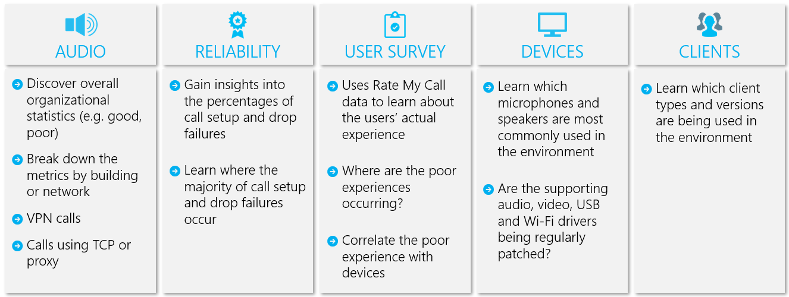
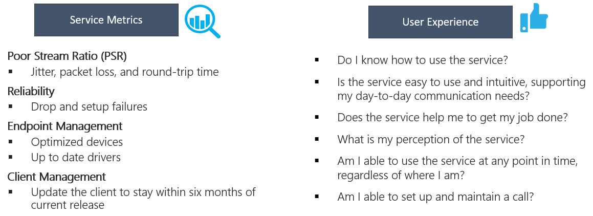
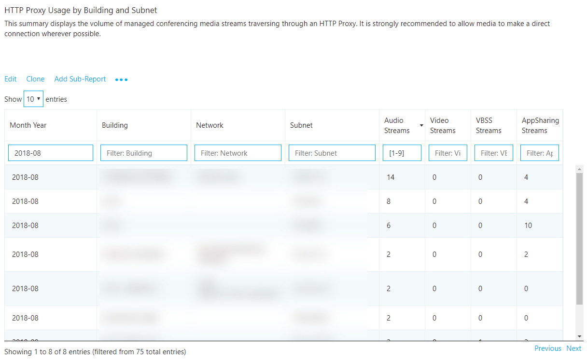
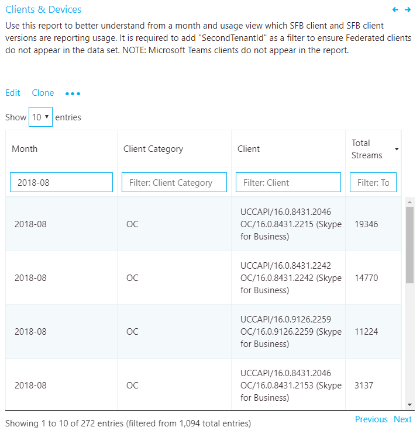

#  Use CQD to manage call and meeting quality in Microsoft Teams 

This article will help you - the Teams admin or support and helpdesk engineer - develop a process for monitoring and maintaining call and meeting quality for your organization in Microsoft Teams using Call Quality Dashboard (CQD). Our guidance emphasizes audio-quality scenarios because any network improvements you make to improve the audio experience will translate to improvements in video and sharing.

Key to this guidance are the two [curated CQD templates](https://aka.ms/QERtemplates) - we recommend that you download them before you go through the guidance in this article.

## Categories to monitor and maintain

Once you've rolled out meetings and voice in Teams, you'll need a plan for ongoing monitoring and maintenance. Doing so will ensure that Teams is always running optimally. This plan should include the key areas that are shown in the following figure. You should also establish targets for quality metrics and a plan for troubleshooting and isolating problems when they happen.

**<font color="red">SIUNIE and VAMSI, please review this graphic. Since it's all text, I think we can kill it, replace it with a table. </font>**



_Figure 1 - Key operational areas_

Most problems with Teams performance fall into the following categories:

-   Incomplete firewall or proxy configuration
-   Poor Wi-Fi coverage
-   Insufficient bandwidth
-   VPN
-   Inconsistent or outdated client versions and drivers
-   Unoptimized or built-in audio devices
-   Problematic subnets or network devices

If you take the time before you roll out Teams to assess these areas and remediate any deficiencies, you'll reduce the amount of effort needed to maintain a high-quality Teams experience for all your users. For help assessing your network in preparation for your Teams rollout, read [Advisor for Teams](use-advisor-teams-roll-out.md) and [Prepare your network for Teams](prepare-network.md).


## Set up CQD, assign admin roles

Open the Microsoft Call Quality Dashboard (CQD) at [https://cqd.teams.microsoft.com](https://cqd.teams.microsoft.com) (sign in with your admin credentials). Or go to the Teams admin center and select **Call Quality Dashboard**. On the page that opens, click **Sign in** and enter your Global Administrator account or Microsoft Teams Service Admin account information.

Read [Set up Call Quality Dashboard (CQD)](turning-on-and-using-call-quality-dashboard.md) to:
- [Assign admin roles](turning-on-and-using-call-quality-dashboard.md#assign-admin-roles-for-access-to-cqd) to anybody that needs to access CQD
- [Upload tenant data](turning-on-and-using-call-quality-dashboard.md#upload-tenant-data-information) (including custom building, network and location information). Don't miss the [sample template](https://github.com/MicrosoftDocs/OfficeDocs-SkypeForBusiness/blob/live/Teams/downloads/locations-template.zip?raw=true).
- Set up and learn how to use reports

Through proper planning and design before deploying Teams or Skype for Business Online, you can reduce the amount of effort that will be required to maintain high-quality experiences.

This guide focuses on using the Call Quality Dashboard (CQD) Online as the primary tool to report and investigate each area, with a special emphasis on audio to maximize adoption and impact. Any improvements made to the network to improve the audio experience will also directly translate to improvements in video and desktop sharing.

To accelerate your assessment, [two curated CQD templates](https://aka.ms/qertemplates) are provided: one is for managing all networks and the other is filtered for managed (internal) networks only. Although the All Networks template reports are configured to display building and network information, they can still be used while you work toward collecting and uploading building information. Uploading building information into CQD enables the service to enhance reporting by adding custom building, network, and location information while differentiating internal from external subnets. For more information, see [Building mapping](#building-mapping) later in this guide.

### Intended audience

This guide is intended to be used by partner and customer stakeholders with roles such as Collaboration Lead/Architect, Consultant, Change Management/Adoption Specialist, Support/Help Desk Lead, Network Lead, Desktop Lead, and IT Admin.

This guide is also intended to be used by the designated quality champion(s). For more information, see [the Quality Champion role](4-envision-plan-my-service-management.md#the-quality-champion-role).

## Assign roles for accessing CQD

Before using this guide, make sure you have the proper tenant [roles](https://docs.microsoft.com/office365/admin/add-users/about-admin-roles) assigned so that you can access CQD.

This table shows you what each role can do in CQD:


|  |View reports  |View EUII fields  |Create reports  |Upload building data  |
|---------|:-------:|:-------:|:-------:|:-------:|
|Office 365 Global Administrator     |Yes         |Yes         |Yes         |Yes         |
|Teams Service Administrator     |Yes         |Yes         |Yes         |Yes         |
|Teams Communications Administrator     |Yes         |Yes         |Yes         |Yes         |
|Teams Communications Support Engineer     |Yes         |Yes         |Yes         |No         |
|Teams Communications Support Specialist     |Yes         |No         |Yes         |No         |
|Skype for Business Administrator     |Yes         |Yes         |Yes         |Yes         |
|Azure AD Global Reader |Yes         |Yes         |Yes         |No         |
|Office 365 Reports Reader<sup>1</sup>     |Yes         |No         |Yes         |No         |

<sup>1</sup> In addition to reading CQD reports, the Office 365 Reports Reader can view all the [activity reports](https://support.office.com/article/activity-reports-0d6dfb17-8582-4172-a9a9-aed798150263) in the admin center and any reports from the [Microsoft 365 Adoption content pack](https://support.office.com/article/Office-365-Adoption-content-pack-77ff780d-ab19-4553-adea-09cb65ad0f1f).

> [!NOTE]
> If you're not seeing EUII (end-user identifiable information) and you have one of the roles that's permitted to see this information, keep in mind that CQD only keeps EUII for 30 days. Anything older than 30 days is deleted.

## What is quality?

In this context, quality is a combination of service metrics and user experience.

**<font color="red">SIUNIE and VAMSI: I want to nuke this graphic - it's all text anyway. I'll replace it with a nice-looking table instead. QUESTION: Is this section now incomplete because it doesn't contain all the newer reports & functionality from V3? It looks like this section is V2 only. Can you confirm?</font>**



_Figure 2 - What is quality?_

### Service metrics

Service metrics consist of specific client-based metrics. During each call, the client collects telemetry for the call and submits a report at the end of each call that can later be accessed in CQD or in [per-user call analytics](set-up-call-analytics.md). These metrics include:

-   Poor Stream Rate
-   Setup Failure Rate
-   Drop Failure Rate


#### Poor Stream Rate

The poor stream rate (PSR) indicates the organization’s overall percentage of streams that have poor quality. Reducing PSR will improve the user experience. This is why [managed networks](#managed-vs-unmanaged-networks) are the primary focus when looking at PSR. External users are important too, but investigation differs by organization. Consider providing best practices for external users, and investigate external calls independently from the overall organization.

The actual measurement in CQD varies by workload, but for the purposes of this guide, we focus primarily on the _Audio Poor Percentage_ measurement. PSR is made up of the five network metric averages described in the following table. For a stream to be classified as poor, only one metric needs to exceed the defined threshold. CQD provides the “Poor Due To…” measurements to better understand what condition caused the stream to be classified as poor. To learn more, read [Stream classification in CQD](stream-classification-in-call-quality-dashboard.md).

_Table 1 - Audio poor quality metrics_

| Metric average     | Description     | User experience |
|-------------|-----------------|-----------------|
| Jitter \>30 ms        | This is the average change in delay between successive packets. Teams and Skype for Business can adapt to some levels of jitter through buffering. It’s only when the jitter exceeds the buffering that a participant notices the effects of jitter.      | The packets arriving at different speeds cause a speaker’s voice to sound robotic.   |
| Packet loss rate \>10% or 0.1        | This is often defined as a percentage of packets that are lost. Packet loss directly affects audio quality—from small, individual lost packets that have almost no impact to back-to-back burst losses that cause audio to cut out completely.     | The packets being dropped and not arriving at their intended destination cause gaps in the media, resulting in missed syllables and words, and choppy video and sharing. |
| Round-trip time \>500 ms        | This is the time it takes to get an IP packet from point A to point B and back to point A. This network propagation delay is tied to the physical distance between the two points and the speed of light, and includes additional overhead taken by the various devices in the network path.      | The packets taking too long to arrive at their destination cause a walkie-talkie effect.   |
| NMOS degradation average \>1.0         | Average [Network Mean Opinion Score (NMOS)](https://docs.microsoft.com/previous-versions/office/communications-server/bb894481(v=office.12)#network-mos) degradation for the stream. Represents how much the network loss and jitter has affected the quality of received audio that caused the NMOS to drop by more than one point. | This is a combination of jitter, packet loss, and—to a lesser degree—increased round-trip time. The user might be experiencing a combination of these symptoms.   |
| Average ratio of concealed samples \>7% or 0.07 | Average ratio of the number of audio frames with concealed samples generated by packet loss healing to the total number of audio frames. A concealed audio sample is a technique used to smooth out the abrupt transition that would usually be caused by dropped network packets.      | High values indicate that significant levels of loss concealment were applied and resulted in distorted or lost audio.     |

#### Setup Failure Rate

The setup failure rate, otherwise known as the _Total Call Setup Failure Percentage_ measurement in CQD, is the number of streams where the media path couldn’t be established between the endpoints at the start of the call.

This represents any media stream that couldn’t be established. Given the severity of the impact of this problem on the user experience, the goal is to reduce this value to as close to zero as possible. A high value for this metric is more common in new deployments with incomplete firewall rules than a mature deployment, but it’s still important to watch on a regular basis.

This metric is calculated by taking the total number of streams that failed to set up divided by the total number of streams that submitted a successful call detail record (CDR):

-   **Setup Failure Rate** = Total Call Setup Failed Stream Count / Total CDR Available Stream Count

#### Drop Failure Rate

The drop failure rate, otherwise known as the _Total Call Dropped Failure Percentage_ measurement in CQD, is the percentage of successfully established streams where the media path didn’t terminate normally.

This represents any media stream that terminated unexpectedly. Although the impact of this isn’t as severe as a stream that failed to set up, it still negatively affects the user experience. Sudden and frequent media drops not only can have a severe impact on the user experience, they result in the need for users to reconnect, resulting in lost productivity (not to mention frustration).

The metric is calculated by taking the total number of dropped streams divided by the total count of streams that set up successfully:

-   **Drop Failure Rate** = Total Call Dropped Stream Count / Total Call Setup Succeeded Stream Count

### Define your target metrics

This section discusses some of the core service metrics that we use to assess the health of the services. By continually assessing and driving efforts to keep these metrics below their defined targets, you’ll help ensure that your users experience consistent, reliable call quality. As a starting point, use the suggested targets in the table below. Adjust the targets as needed to meet your business objectives.

_Table 2 - Core target health assessment metrics_
<table>
<tr>
<th rowspan="2" colspan="2" valign="center">Network type</th><th rowspan="1">Quality targets</th><th colspan="2">Reliability targets</th></tr>
<tr><th>Audio Poor Stream Rate</th><th>Setup Failure Rate</th><th>Drop Failure Rate</th></tr>
<tr><td rowspan="2"><strong>All</strong></td><td>Internal</td><td>2.0%</td><td>0.5%</td><td>2.0%</td></tr>
<tr><td>Overall</td><td>3.0%</td><td>1.0%</td><td>3.0%</td></tr>
<tr><td rowspan="5"><strong>Conferencing</strong></td><td>Internal</td><td>2.0%</td><td>0.5%</td><td>2.0%</td></tr>
<tr><td>Wired internal</td><td>1.0%</td><td>0.5%</td><td>1.0%</td></tr>
<tr><td>Wi-Fi 5 GHz internal</td><td>1.0%</td><td>0.5%</td><td>1.0%</td></tr>
<tr><td>Wi-Fi 2.4 GHz internal</td><td>2.0%</td><td>0.5%</td><td>2.0%</td></tr>
<tr><td>Overall</td><td>2.0%</td><td>0.5%</td><td>3.0%</td></tr>
<tr><td rowspan="4"><strong>P2P</strong></td><td>Internal</td><td>2.0%</td><td>0.5%</td><td>2.0%</td></tr>
<tr><td>Wired/Wi-Fi 5 GHz internal</td><td>1.0%</td><td>0.5%</td><td>1.0%</td></tr>
<tr><td>Wired/Wi-Fi 5 GHz overall</td><td>2.0%</td><td>1.0%</td><td>1.0%</td></tr>
<tr><td>Overall</td><td>2.0%</td><td>1.0%</td><td>3.0%</td></tr>
</table>

### User experience

Analyzing the user experience is more art than science, because the metrics gathered here don’t always mean that there’s a problem with the network or service but rather, they simply indicate that the user perceives a problem. CQD includes a built-in survey mechanism — Rate My Call (RMC) — to help gauge overall user experience. RMC will give you insight into the following questions from the perspective of your users:

-   Do I know how to use the solution?
-   Is the solution easy to use and intuitive, and does it support my day-to-day communication needs?
-   Does the solution help me get my job done?
-   What’s my overall perception of the solution?
-   Can I use the solution at any point in time, regardless of where I am?
-   Can I set up and maintain a call?

#### Rate My Call 

Rate My Call (RMC) is built into Teams and Skype for Business. It automatically pops up after one in every 10 calls, or 10 percent. This brief survey asks the user to rate the call and provide a little context for why the call quality might have been poor. A one or two rating is considered poor, three to four is good, and five is excellent. Although it’s somewhat of a lagging indicator, this is a useful metric for uncovering issues that service metrics can miss.

> [!Note]
> The human factor: Users often ignore the survey when call quality is good, and they fill it out when call quality is bad. As a result, your RMC reports might be skewed to the poor side even while service metrics are good.

You can use CQD to report on RMC user responses, and sample reports are included in the CQD template. However, they aren’t discussed in detail in this guide. For more information about RMC in Skype for Business Online and guidance for educating users to give useful RMC responses, see [this blog post](https://blogs.technet.microsoft.com/jenstr/2015/05/05/rate-my-call-in-skype-for-business-2015/).

**<font color="red">SIUNIE and VAMSI: This blog post goes back to SfB 2015. We need a more up-to-date reference here. If this blog's information is still relevant, let's move it into an article.</font>**

#### Client and device readiness

You need a solid client and device strategy to help ensure that your users have a consistent and positive user experience. A few key principles drive each readiness strategy.

##### Client readiness

A strong client readiness strategy ensures that your users are running the most recent version of the client while enjoying the best experience possible. Microsoft routinely patches the Skype for Business client; ensuring that you keep it up to date in your environment is vital to your overall success. It’s also important to remember to patch network, video, USB, and audio drivers, because they’re often overlooked and can affect the user’s experience. Consider adding network, Wi-Fi, video, USB, and audio drivers to your current patch management process.

We recommend that you not let your client versions fall behind by more than six months. If you’re using Office Click-to-Run, you’re already being kept up to date by the service. Use the included [client versions](#client-versions), as described later in this guide, to assist you with this process. You can also leverage the Rate My Call sample reports to further enhance your client readiness strategy.

> [!IMPORTANT]
> Currently, Teams clients are distributed and updated automatically through the Azure Content Delivery Network and will be kept up to date by the service. Due to this, client readiness and investigative activities aren’t applicable to Teams.


##### Device readiness

No one single strategy can affect the user experience more than your device readiness strategy. Most organizations are happy to remove unnecessary devices (for example, desk phones or other dedicated audio devices) from users, and this is often a core business justification for switching to Teams or Skype for Business. However, those same organizations sometimes hesitate to provide replacement devices, even if those devices are less expensive. Modern-day laptops and PCs, though equipped with built-in microphone and speaker, aren’t optimized for business-class voice over IP (VoIP). This often creates a poor experience for all participants, especially if the speaker is in a noisy environment. Microsoft’s device certification program ensures that when a user participates in a phone call by using any device certified for Teams or Skype for Business, it produces an experience that’s superior to a non-certified device. 

We always recommend that Teams and Skype for Business users use a certified headset or speaker when participating in a voice call through the desktop client. For more information about Microsoft certified devices, review these articles about the [certification program](/SkypeForBusiness/certification/overview) and view the [partner solutions catalog](https://partnersolutions.skypeforbusiness.com/solutionscatalog/personal-peripherals-pcs). Use the [Devices report](#devices), described later in this guide, for assistance with managing your devices.


### Categories of quality

The success of operationalizing a high-quality and reliable deployment depends on your building operational rigor. Specifically, pay special attention to the three categories illustrated in the following figure; these are the focus of this guide:

-   **Network:** Audio quality focused on the Poor Stream Ratio (PSR) metric, TCP usage, wired and wireless subnets, and identifying the use of HTTP proxies and VPN.

-   **Endpoints:** Audio devices and client versions (Skype for Business only).

-   **Service Management:** This category comprises two sections:

    -   First is Microsoft’s responsibility to manage and maintain the Teams and Skype for Business Online services.

    -   Second are tasks your organization must manage to ensure reliable access to the service, such as updating building information and maintaining firewalls for new Office 365 IP addresses as infrastructure is added to the service.


_Figure 3 - Critical categories for Teams and Skype for Business Online deployment_

The following graphic outlines the tasks you must execute for each category. We recommend that you run these tasks once a week, at a minimum.

The first time you perform these tasks will take more effort than subsequent iterations, because many of these categories require that you validate your deployment configurations. After you’ve achieved the state you want by meeting the targets you’ve defined, performing these tasks will help you maintain that state.

<!--  This is a net new graphic, never was included in the online article. OOPS! -->


#### Service management tasks

In a cloud-first world, you must perform certain service management tasks to maintain high-quality user experiences. These tasks range from ensuring there is sufficient bandwidth to reach the service without saturating internet links, validating that quality of service (QoS) is in place on all managed network areas, and—lastly—staying on top of [Office 365 IP ranges on firewalls](https://aka.ms/o365ips).

#### Network tasks

There are two categories of network tasks: reliability and quality. Reliability focuses on measuring the user’s ability to make calls successfully and stay connected. Quality focuses on the aggregated telemetry sent to Teams and Skype for Business Online by the user’s client during the call and after it has ended. 

Given the critical impact that reliability has on the user experience, it’s important to begin assessing and investigating those metrics before diving into quality. 

#### Endpoints tasks

The main task in this category is validating which client versions are running Skype for Business on desktop builds from the last six months, to ensure users are getting the benefit of the continual optimizations made to the Skype for Business desktop client. Additionally, this simplifies overall client management tasks and provides a consistent user experience.

The other important area is monitoring which devices are prevalent in your deployment and driving the use of certified devices to provide the best user experience.


> [!IMPORTANT]
> Currently, Teams clients are distributed and updated automatically through the Azure Content Delivery Network and will be kept up to date by the service. Client readiness and investigative activities aren’t applicable to Teams.

## Use CQD to manage call quality

Once you've [set up CQD](turning-on-and-using-call-quality-dashboard.md), you're ready to start using it to manage call and meeting quality for your organization.

For more in-depth training and resources, see the [Appendix](#other-resources).

### What is CQD?

You use the Call Quality Dashboard (CQD) to gain insight into the quality of calls made by using Teams and Skype for Business services. CQD is designed to help Skype for Business and Teams admins and network engineers optimize the network and keep a close eye on quality, reliability, and the user experience. CQD looks at aggregate telemetry for an entire organization, where overall patterns can become apparent, allowing staff to make informed assessments and plan remediation. CQD provides reports of metrics that provide insight into overall quality, reliability, and user experience.

### Expectations using CQD

CQD, although useful for analyzing trends and subnets, doesn’t always provide a specific cause for a given scenario. It’s important to understand this and set the correct expectation when using CQD:

-   CQD won’t provide the root cause for every scenario
-   CQD won’t contain Phone System or Audio Conferencing streams
-   CQD will call out areas for further investigation based on trends

### CQD reports overview

Use the drop-down menu at the top of the screen to open a report. 

-   [Summary reports](turning-on-and-using-call-quality-dashboard.md#summary-reports) are static and can’t be edited, downloaded, or exported. These are aggregate reports.
-   [Default reports](turning-on-and-using-call-quality-dashboard.md#reports-provided-with-cqd) are pre-made reports covering the most common scenarios you'll need. You can't edit these reports, but you can use rich filters to drill down into the data you need to analyze call and meeting quality in your org.
-   [Detailed reports](turning-on-and-using-call-quality-dashboard.md#create-custom-detailed-reports) are fully customizable and can be downloaded to a CSV file, exported, or cloned. Download the CQD templates for a mix of customizable chart and table reports.

For a list of the data provided in each report, see [Data available in CQD reports](turning-on-and-using-call-quality-dashboard.md#data-available-in-cqd-reports).

New in January 2020: [Download Power BI query templates for CQD](https://github.com/MicrosoftDocs/OfficeDocs-SkypeForBusiness/blob/live/Teams/downloads/CQD-Power-BI-query-templates.zip?raw=true). Customizable Power BI templates you can use to analyze and report your CQD data.

_Figure 4 - CQD report categories_

The summary reports are divided into four categories:

-   **Summary Reports** focus on analyzing quality trends with daily, monthly, and table reports to assist with identifying subnets that have poor quality. This is the default landing page when you first sign in to CQD Online.
-   **Location-Enhanced Reports** focus on analyzing quality trends based on location information. To use these reports, you must have uploaded a building file.
-   **Reliability Reports** focus on analyzing reliability trends for audio, video, video-based screen sharing (VBSS), and app sharing.
-   **Quality of Experience Reports** are a “slimmed-down” version of the detailed QER templates, focusing on key areas for analyzing audio quality and reliability.

### Report types

You can choose from two types of reports in CQD, depending on how you want to view your data. Although this guide doesn’t cover the specifics of creating one type of report over another, :

-   Chart reports create graphical bar charts to represent data in a visual format. Chart reports are best used to visualize data over a given time period.
-   Table reports are useful for looking at individual measurements and dimensions when you export the reports to CSV files for manipulation in Microsoft Excel.


### Teams vs. Skype for Business

CQD can report on both Teams and Skype for Business. However, there might be times when you want to develop a report to look at Teams telemetry separate from Skype for Business.

#### Summary reports

To modify the summary reports page to look at only Teams or Skype for Business, select the **Product Filter** drop-down menu from the top of the screen, and then select the product you want.


_Figure 5 - Select a Product Filter_

#### Detailed reports

To filter all detailed reports, in the browser bar, append the following to the end of the URL:

```PowerShell
/filter/[AllStreams].[Is Teams]|[FALSE]
```

**Example:**

```https://cqd.teams.microsoft.com/cqd/#/1234567/2018-5/filter/[AllStreams].[Is Teams]|[FALSE]```

For more information about URL filters, see [Filtering reports](#filtering-reports) later in this section.

To filter an individual detailed report, add the filter ``Is Teams`` to the report and set it to True or False. For more information, see [Editing reports](#editing-reports) later in this section.


_Figure 6 - Adding a Microsoft Teams filter to a report_


### Managed versus unmanaged networks

By default, all endpoints in CQD are classified as external. As soon as a building file is introduced, we can begin to look at managed endpoint data. As previously discussed, networks in CQD are defined as:

-   A _managed network_, often referred to as internal or inside, can be influenced and controlled by the organization. This includes the internal LAN, the remote WAN, and VPN.
-   An _unmanaged network_, often referred to as external or outside, can’t be influenced or controlled by the organization. An example of an unmanaged network is a hotel or airport network.

### Dimensions, measures, and filters

A well-formed CQD query contains all three of the following parameters:

-   **Dimension:** How I want to pivot on the data.

-   **Measure:** What I want to report on.

-   **Filter:** How I want to reduce the dataset the query returns.

Another way to look at this is that a _dimension_ is the grouping function, a _measure_ is the data I’m interested in, and a _filter_ is how I want to narrow down the results to those that are relevant to my query.

An example of a well-formed query is **Show me Poor Streams [Measure] by Subnet [Dimension] for Building 6 [Filter]**. For more information, see [Dimensions and measures available in CQD](https://aka.ms/cqd-dm).

### First vs. second 

Many of the dimensions and measures in CQD are classified as first or second. CQD doesn’t use caller/callee fields—these have been renamed _first_ and _second_ because there are intervening steps between the caller and callee. The following logic determines which endpoint involved is labeled as first:

-   **First** will always be a server endpoint (Conference Server, Mediation Server, and so on) if a server is involved in the stream or call.

-   **Second** will always be a client endpoint unless the stream is between two server endpoints.

-   If both endpoints are the same type, the choice of which is first is based on internal ordering of the user agent category. This ensures the ordering is consistent.

For more information about determining the first or second endpoint when they’re both the same, see [Dimensions and measures available in CQD](https://aka.ms/cqd-dm).

### Stream vs. call

You need to understand the difference between a call and a stream to properly choose which dimensions or measures you’ll be looking at in CQD. Although CQD’s primary focus is on streams, call-based measurements are also available.

-   **Stream:** A _stream_ exists between only two endpoints. There is only one stream for each direction, and two streams are required for communication. Streams are useful for investigating buildings, networks, or subnets. In some cases, both call and stream are used in the measurement’s name (for example, Call Setup Stream or Call Dropped Stream). These are still classified as streams.

-   **Call:** A _call_ is a grouping of all streams from all participants. A call consists of—at minimum—two streams. A single call will have at least two endpoints, each with a minimum of one stream.

For additional guidance on whether the dimension or measure is referring to a call or a stream, see [Dimensions and measures available in CQD](https://aka.ms/cqd-dm)

### Good, poor, and unclassified calls

A call is categorized either as good, poor, or unclassified. Let’s take a moment to talk about each one in more detail.

-   **Good or poor:** A good or poor call consists of a call that contains a complete set of service metrics, for which a full QoE report was generated and received by the service. Determining whether a stream is good or poor is described [earlier in this guide](#poor-stream-rate).

-   **Unclassified:** An unclassified stream doesn’t contain a full set of service metrics. These can be short calls—usually less than 60 seconds—where averages couldn’t be computed and a QoE report wasn’t generated. The most common reason for calls to be unclassified is that there was little to no packet utilization. An example of this would be a participant who joins a meeting on mute and never speaks. The participant is receiving, but not transmitting, media. Without media being transmitted, there won’t be any metrics available for CQD to use to classify the endpoint’s outbound media stream.

For more information about the stream classification process, see [this article](stream-classification-in-call-quality-dashboard.md).

### Common subnets

Common subnets are specific private subnets that are used by hotels, home networks, hotspots, and similar areas. These subnets are difficult to triage due to their widespread use. If your organization uses one of these common subnets, we recommend that you move that network to another subnet. This will make reporting easier in CQD. When noted, reports in the All Networks template have been configured to exclude these subnets to eliminate them as a source of poor quality. Common subnets are defined below; their impact will vary by organization.

-   10.0.0.0/24
-   192.168.0.0/24
-   192.168.1.0/24
-   192.168.2.0/24
-   172.20.10.0/24
-   192.168.43.0/24

When investigating a managed network that uses a common subnet, you’ll need to use the Second Reflexive Local IP dimension to group subnets. This dimension contains the endpoint’s public IP address.

## Drill-down filters - narrow the focus of investigations

CQD reports features several drill-down filters, which are powerful tools for narrowing the focus of your call-quality investigations:
**<font color="red">I THOUGHT WE HAD A LIST OF THESE SOMEWHERE - was I imagining it?</font>**

To review the basics of using drill-down filters, read [Drill-down functionality](turning-on-and-using-call-quality-dashboard.md#drill-down-functionality).

### Adding and editing drill-down fields

When editing a report, you have the option to specify drill-down fields of your own using the Query Editor.

Start by clicking on the “…” button of the report you wish to edit and select “Edit”.


Select a Dimension from the list on the left side of the Query Editor. Then click on the dropdown below the “Navigate To” label and select the tab and expander group that you wish for that Dimension to drill through to. Note: Drill-down functionality only works by navigating to different tabs at present. Support for drilling through to a specific expander will be added later.
Finally, click “Close” to save your changes to the Dimension, and click “Save” to save and close the Query Editor.


Select a Dimension from the list on the left side of the Query Editor. Then click on the dropdown below the “Navigate To” label and select the tab and expander group that you wish for that Dimension to drill through to. Note: Drill-down functionality only works by navigating to different tabs at present. Support for drilling through to a specific expander will be added later.
Finally, click “Close” to save your changes to the Dimension, and click “Save” to save and close the Query Editor.


### Multi-select filters

In addition to drill-down functionality, CQD also supports specifying Filters with multiple values (OR filters).

In order to select multiple filter values, begin by adding a new filter to the report. Click the “+” button beside the Filters label, enter the name of the Dimension you wish to use, and click “Add”.


Once you have done so, click the magnifying glass icon by the new filter. You will be shown a text field, and a number of options, such as “Select All” and “Invert”. Enter a value into the text field and click the magnifying glass icon by that field to search for all values that contain that string. Alternately, you may leave the text field empty and just hit the magnifying glass icon to view up to the first 100 options.

```PowerShell
/filter/[AllStreams].[Second Tenant Id]\|[YOUR TENANT ID HERE]
```

Example:  


### Dashboard level filters
Certain CQD reports have dashboard-level filters added to them, making it easy to filter by common parameters. These filters appear outside the regular report tabs and directly beneath the Product filter, and they apply to all filters in the Dashboard.


```PowerShell
/filter/[AllStreams].[Is Teams]|[TRUE | FALSE]
```

### URL-defined filter values

In addition to defining parameters in the URL such as Trending Month, tenant ID, language, etc., CQD also supports defining filter values for the Product or Dashboard level filters in the URL. This allows users to easily save time by bookmarking URLs with certain filter values pre-selected.

To apply a URL filter value to the Dashboard, the filter must first be present as either a Product or Dashboard level filter. Afterwards, add the following text to the URL after the Trending Month and before the URL parameters:

```filter/DATA_MODEL_NAME|VALUE```

For example, if you wished to specify a Product filter value of Microsoft Teams, you would add the following:

```filter/[AllStreams].[Is%20Teams]|[True]```

Your entire URL should take the form of something like the following:

```https://cqd.teams.microsoft.com/spd/#/Dashboard/2624085/2018-9/filter/[AllStreams].[Is%20Teams]|[True]```

Additionally, the URL-defined filter also supports specifying multi-select values by adding more filter values each separated by a pipe character. For example:

```filter/[AllStreams].[Media%20Type]|[Video]|[Audio]|[VBSS]```

In the event that a non-valid data model name is provided, the URL filter will not be applied.


## Import the CQD templates

This guide includes [two curated CQD templates](https://aka.ms/qertemplates). These templates accelerate your usage of CQD and provide you an opportunity to quickly leverage CQD’s capabilities to make an impact on your users’ Teams or Skype for Business experience. The All Networks template, though optimized to work with a building data file, can be used while you work toward collecting and uploading building information into CQD, as described in the next section.

**To import the templates (.CQDX) into CQD**

1. In CQD, select **Detailed Reports** from the menu at the top of the page.

2. In the left panel, select **Import**. Browse to the first CQDX template and select **Open**.

3. After the template is uploaded, a pop-up window will display the message “Report import was successful.” Select **OK**.

4. Repeat steps 2 and 3 for the second CQD template.

> [!NOTE]
> Each user must import the CQD templates into their CQD instance. 


## Building mapping

In a Teams or Skype for Business Online deployment, all clients are external. That has the implication that by default, all clients are reported as outside in CQD, regardless of whether the client was connected on an internal corporate network.

When you work with CQD, you need to know the location of an endpoint and whether it was connected to a network you can manage or a network you can’t manage—the assumption being that you can only improve networks you can manage. By uploading subnet and building information to CQD, you enable CQD to determine whether the endpoint was connected to an internal corporate/managed network or to an external/unmanaged network.

### Building data file structure

The format of the data file you upload must meet the following requirements to pass the validation check before uploading.

-   The file must be either a TSV file—which means that for each row, each column is separated by a Tab character—or a CSV file in which each column is separated by a comma.

-   The file can’t be larger than 50 MB.

-   The content of the data file *must not include table headers*. In other words, the first line of the data file must be real data, not column headings such as “Network.”

-   For each column, the data type can only be String, Number, or Bool. If the data type is Number, the value must be a numeric value; if it’s Bool, the value must be either 0 or 1.

-   For each column, if the data type is String, the data can be empty (but still must be separated by an appropriate delimiter—that is, a Tab character or comma). This just assigns that field an empty string value.

-   There must be 14 columns for each row. Each column must have the data type described in the following table, and the columns must be in the order listed in the table.

_Table 5 - Building file structure_

| Column name        | Data type | Example                   | Guidance    |
|--------------------|-----------|---------------------------|-------------|
| Network            | String    | 192.168.1.0               | Required    |
| NetworkName        | String    | USA/Seattle/SEATTLE-SEA-1 | Required\*  |
| NetworkRange       | Number    | 26                        | Required    |
| BuildingName       | String    | SEATTLE-SEA-1             | Required\*  |
| OwnershipType      | String    | Contoso                   | Optional    |
| BuildingType       | String    | IT Termination            | Optional    |
| BuildingOfficeType | String    | Engineering               | Optional    |
| City               | String    | Seattle                   | Recommended |
| ZipCode            | String    | 98001                     | Recommended |
| Country            | String    | US                        | Recommended |
| State              | String    | WA                        | Recommended |
| Region             | String    | MSUS                      | Recommended |
| InsideCorp         | Bool      | 1                         | Required    |
| ExpressRoute       | Bool      | 0                         | Required    |

\*While not required by CQD, the templates are configured to display Building and Network name.

#### Supernetting

You can use supernetting, commonly called Classless Inter-Domain Routing (CIDR,) in place of defining each subnet. A *supernet* is a combination of several subnets that share a single routing prefix. Instead of adding an entry for each subnet, you can use the supernetted address. Supernetting is supported, but we don’t recommend using it.

For example, Contoso’s marketing building is made up of the subnets below:

-   10.1.0.0/24—first floor
-   10.1.1.0/24—second floor
-   10.1.2.0/24—third floor
-   10.1.3.0/24—fourth floor

Instead of adding an entry for each subnet, you can use the supernetted address—in this example, 10.1.0.0/22.

-   Network = 10.1.0.0
-   Network Range = 22

Here are a few things to consider before you implement supernetting:

-   Supernetting can only be used in a subnet mapping with 8-bit to 28-bit mask.

-   Supernetting takes less time up front, but it comes at the cost of reducing the richness of your data. Let’s say there’s a quality problem involving subnet 200.1.2.0. If you implemented supernetting, you won’t know where in the building the subnet is located or what type of network it is (for example, a lab). If you’d defined all the subnets for a building and uploaded floor location information, you’d be able to see that distinction.

-   It’s important to ensure that the supernetted address is correct and isn’t catching unwanted subnets.

-   It’s quite common to find 192.168.0.0 in data. For many organizations, this indicates that the user is at home. For others, this is the IP address scheme for a satellite office. If your organization does have offices that use this configuration, don’t include it in your building file because it’s difficult to distinguish between home and internal networks by using common subnets. See the section about [common subnets](#common-subnets), earlier in this guide.

> [!IMPORTANT]
> The network range can be used to represent a supernet. All new building data file uploads will be checked for any overlapping ranges. If you’ve previously uploaded a building file, you should download the current file and upload it again to identify any overlaps and fix the issue. Any overlap in previously uploaded files might result in the wrong mappings of subnets to buildings in the reports.

#### VPN

The quality of experience (QoE) data that clients send to Office 365—which is where CQD data is sourced from—includes a VPN flag. CQD will see this as the First VPN and Second VPN dimensions. However, this flag relies on VPN vendors’ reporting to Windows that the VPN network adapter registered is a Remote Access adapter. Not all VPN vendors properly register Remote Access adapters. Because of this, you might not be able to use the built-in VPN query filters. There are two approaches to accommodating VPN subnets in the building information file:

- Define a **Network Name** by using the text “VPN” in this field for VPN subnets.

  

  _Figure 12 - VPN using network name_

- Define a **Building Name** by using the text “VPN” in this field for VPN subnets.

  

  _Figure 13 - VPN using building name_

> [!IMPORTANT]
> Certain VPN implementations don’t accurately report subnet information. If this occurs in your reporting, we recommend that when you add a VPN subnet to the building file, instead of one entry for the subnet, add separate entries for each address in the VPN subnet as a separate 32-bit network. Each row can have the same building metadata. For example, instead of one row for 172.16.18.0/24, you have 253 rows, with one row for each address from 172.16.18.1/32 through 172.16.18.254/32, inclusive.


> [!NOTE]
> VPN connections have been known to misidentify the network connection as wired when the underlying internet connection is wireless. When looking at quality over VPN connections, you can’t assume that the connection type has been accurately identified.

### Uploading building information

The CQD Summary Reports dashboard includes a **Tenant Data Upload** page, accessed by selecting the **Tenant Data Upload** link tag in the upper-right corner (look for the gear icon). This page is used for admins to upload their own information, such as mapping of IP address and geographical information, mapping each wireless access point and its MAC address, and so on.

1. In CQD, select the gear icon in the upper-right corner, and choose **Tenant Data Upload** from the **Summary Reports** page.

   

   _Figure 14 - Tenant Data Upload menu_

2. Alternatively, if this is your first time visiting CQD, you’ll be asked to upload building data. You can select **Upload Now** to quickly navigate to the **Tenant Data Upload** page.

   

   _Figure 15 - Building data upload banner_

3. On the **Tenant Data Upload** page, select **Browse** to choose a data file.

4. After selecting a data file, specify **Start date** and, optionally, specify an end date.

5. After selecting **Start date**, select **Upload** to upload the file to CQD. <br><br>Before the file is uploaded, it’s validated. If validation fails, an error message is displayed requesting that you correct the file. The following figure shows an error occurring when the number of columns in the data file is incorrect.

   
 
   _Figure 16 - Building data upload error_

6. If no errors occur during validation, the file upload will succeed. You can then see the uploaded data file in the **My uploads** table, which shows the full list of all uploaded files for the current tenant at the bottom of that page.

> [!NOTE]
> It can take up to four hours to finish processing the building file. <br><br> If you’ve already uploaded a building file and need to add subnets that might have been missed or excluded, modify the original file by adding the new subnets, remove the current file, and re-upload the newly edited file. There can be only one active building data file in CQD. 


### Updating a building file

While gathering building and subnet information, administrators will often upload the building file in multiple iterations over time, adding new subnets and their building information as it becomes available. When this occurs, you’ll need to re-upload your building file. This process is like the initial upload as described in the previous section, with a few exceptions as noted in the following section.

> [!Important]
> Only one building file can be active at a time. Multiple building files aren’t cumulative.

#### Adding net new subnets

There are times when you’ll need to add net new subnets to CQD that weren’t originally part of your network topology. To add net new subnets, do the following in the CQD Tenant Data Upload portal:

1.  Edit the original building file and provide an end date that occurs at least one day before the net new subnets were acquired.
2.  Download the original file, if you don’t already have an up-to-date copy.
3.  Append the net new subnets to the original building file.
4.  Upload the newly modified building file following the same process as above, and set the start date for one day after the previous building file ends.

#### Updating the current building file

If a building file is already uploaded but you need to add missing subnets, do the following in the CQD Tenant Data Upload portal:

1.  Download the original file, if you don’t already have an up-to-date copy.
2.  Remove the current file in CQD.
3.  Append the new subnets to the original file.
4.  Upload the building file. Be sure to set the start date to at least eight months prior so that CQD will process historical data.

### Missing subnets

After you upload building information for managed networks, every managed network should have a building association. However, this won’t always be the case; typically, a few subnets are missed. This section covers how to validate those missing networks.

Browse to the **Detailed Reports** page in CQD and navigate to the **Missing Subnet Report** included in the CQD templates. This presents all the subnets with 10 or more audio streams that aren’t defined in the building data file and are being marked as outside. Ensure that there are no managed networks in this list. If subnets are missing, update the original building data file and re-upload it to CQD.

> [!IMPORTANT]
> You’ll need to add your tenant ID as a query filter for **Second Tenant ID** to this report to filter the report to view only your organization’s tenant data. Otherwise, the report will show federated subnets.

> [!NOTE] 
> Be sure to adjust the Month Year report filter to the current month. Select **Edit**, and adjust the **Month Year** report filter to save the new default month.


_Figure 17 - Missing Building Report_

### Building mapping tools

Let’s face it, mapping out subnets in your organization can be difficult. Large global networks are very complex, with different teams managing their respective regions, and there might be no single source of truth for the network topology. There are two tools available to assist with starting the building mapping exercise, described in the following sections.

#### CQD tools

These tools are based on PowerShell and can leverage Active Directory (AD) Sites and Services and Microsoft DHCP services to help pre-populate your building file.  These tools will help with the following tasks:

1.  Query AD Sites and Services, and create a building file based on the information contained within.
2.  Query a Microsoft DHCP server or servers to pull subnet information and automatically create a building file.
3.  Validate an existing building file, checking for duplicates and overlaps.
4.  Find unmapped subnets in CQD.

For more information about this tool, see [this blog post](https://aka.ms/cqdtools).

**<font color="red">SIUNIE and VAMSI: This is a blog from June 2018 (Martin Rinas). Are these tools still relevant for Teams/ If info in this blog post is important, let's weave it into the documentation. Otherwise, let's stop linking to it.</font>**

#### Network Planner

[Network Planner](network-planner.md), in the Teams admin center, determines and organizes your network requirements for your Cloud Voice deployment in a few steps. By providing your organization's networking details and Cloud Voice usage, you can get an approximate calculation of the network requirements for your Cloud Voice deployment, manage and export these details for reporting, and view areas for further investigation and next steps.

Although the Network Planner doesn’t automate the building mapping process entirely, after network information is entered into the Network Planner it can then be exported to a building file ready for upload to CQD.

## Reliability investigations

The first step to improving quality is to assess the state of reliability across the organization. Because reliability is vital to a positive user experience, we start with the two components that measure reliability:

1.  **Setup failures:** The call couldn’t be established.

2.  **Drop failures:** The call was established and unexpectedly terminated.

Throughout this section, we’ll cover methods to investigate both areas.

> [!NOTE]
> Not all reports included in the templates are covered in this guide. However, the methods of investigation explained below still apply. Please refer to the individual report description for more information.


### Setup failures

Prioritize remediating setup failures in this area first, because these failures have a significant negative impact on the user experience.

Begin your investigation by assessing the percentage of overall setup failures for the organization, and then prioritize areas of investigation based on the highest percentage by building or network. 

#### Setup failure trend analysis

This report displays the total amount of streams, stream setup failures, and the stream setup failure rate. Point to any one of the columns to display its individual values, as shown in the following figure. 


_Figure 19 - Audio Reliability - Stream Setup Failures_

##### Analysis

By using this report, you can answer the following questions and determine your next course of action:

-   What is the total call setup failure percentage for the current month?

-   Is the total call setup failure percentage below or above the defined target metric?

-   Is the failure trend worse or better than the previous month?

-   Is the failure trend increasing, steady, or decreasing?

Irrespective of your answers to these questions, take the time to investigate further by using the companion sub-reports to look for any individual buildings or subnets that might need remediation. Although the overall failure rate might be below the target metric, the failure rates for one or more buildings or networks might be above the target metric and need investigation.

#### Setup failure investigations 

This summary report is used to discover and isolate any buildings or networks that might need remediation.

> [!NOTE]
> Be sure to adjust the Month Year report filter to the current month. Select **Edit**, and adjust the **Month Year** report filter to save the new default month.


_Figure 20 - Audio Setup Failures by Subnet_

##### Remediation 

Focus your first remediation efforts on buildings or subnets that have the largest volume of failures. This will maximize impact on the user experience and help to quickly reduce the rate of organizational call setup failures. The following table lists the two reasons for setup failures as reported by CQD.

_Table 7 – Reasons for Call Setup Failures_

| Call Setup Failures reason       | Typical cause                    |
|----------------------------------|----------------------------------|
| Missing FW Deep Packet Inspection Exemption Rule | Indicates that network equipment along the path prevented the media path from being established due to deep packet inspection rules. This is likely due to firewall rules not being correctly configured. In this scenario, the TCP handshake succeeded but the SSL handshake didn’t.      |
| Missing FW IP Block Exception Rule      | Indicates that network equipment along the path prevented the media path from being established to the Office 365 network. This might be due to proxy or firewall rules not being correctly configured to allow access to IP addresses and ports used for Teams and Skype for Business traffic. |

Now as you begin your remediation, you can focus your efforts on a particular building or subnet. As the preceding table shows, these issues are due to firewall or proxy configurations. Review the options in the following table for remediation actions.

_Table 8 - Next Steps for Call Setup Failure Remediation_


|      Remediation      |                                                                                                                                                                                                                                                                                                                                                                   Guidance                                                                                                                                                                                                                                                                                                                                                                   |
|-----------------------|----------------------------------------------------------------------------------------------------------------------------------------------------------------------------------------------------------------------------------------------------------------------------------------------------------------------------------------------------------------------------------------------------------------------------------------------------------------------------------------------------------------------------------------------------------------------------------------------------------------------------------------------------------------------------------------------------------------------------------------------|
| Configure firewall(s) | Work with your network team and verify your firewall(s) configuration against [the Office 365 IP address list](https://aka.ms/o365ips).<br><br>Verify that the [media subnets](https://support.office.com/article/Office-365-URLs-and-IP-address-ranges-8548a211-3fe7-47cb-abb1-355ea5aa88a2#bkmk_teams) and ports are included in the firewall rules. <br><br>Verify that the necessary ports (listed below) are opened in the firewall. UDP should be given priority because TCP is considered a failback protocol for audio, video, and video-based screen sharing, and its use will affect the quality of the call. Legacy RDP application sharing uses TCP only.<br><ul><li>**TCP:** port 443</li><li>**UDP:** ports 3478–3481</li><ul> |
|        Verify         |                                                                                                                                                                                                                                                                 Use the [Microsoft Network Assessment Tool](https://www.microsoft.com/download/details.aspx?id=53885) to verify connectivity from the affected building or subnet by using the connectivity check function.                                                                                                                                                                                                                                                                  |

### Drop failures

Unlike setup failure codes, CDQ has no drop failure code to indicate why drop failures occur, which makes it difficult to isolate a specific root cause. To better triage drop failures, use an inferred approach. By remediating any areas of interest for media, patching clients and drivers, and driving usage of certified devices for Teams and Skype for Business, you can expect drop failures to decline.

#### Drop failure trend analysis

This report displays the total amount of audio streams, total drop failures, and the drop failure rate. Point to any one of the columns to display its values, as shown in the following figure. 


_Figure 21 - Dropped stream rate_

##### Analysis

By using this type of report, you can answer the following questions:

-   What is the current drop failure rate?
-   Is the drop failure rate below the defined target metric?
-   Is the failure trend worse or better than the previous month?
-   Is the failure trend increasing, steady, or decreasing?

Irrespective of the answers to the questions above, take the time to investigate using the sub-reports to look for any buildings or networks that might need remediation. Although the overall drop failure rate might be below the target metric, the drop failure rate for one or more buildings or networks might be above the target metric and need investigation.

#### Drop failure investigations

Failures reported here indicate that the call was dropped unexpectedly and resulted in a negative user experience. Unlike the trending reports, these reports provide additional insights into specific subnets that need further investigation.

> [!NOTE]
> Be sure to adjust the Month Year filter to the current month. Select **Edit**, and adjust **Month Year** to save the new default month.


_Figure 22 – Drop failures by subnet_

##### Remediation

Using the included table reports, you can isolate problem areas in the network where the drop rate is above the target metric you’ve defined. Focus your first remediation efforts on buildings or subnets that have the highest total stream count, to make the biggest impact.

Common causes of call drops:

-   Under-provisioned network or internet egress
-   No QoS configured on constrained networks
-   Older client versions
-   User behavior

After you discover your problem areas, you can use [per-user call analytics](use-call-analytics-to-troubleshoot-poor-call-quality.md) to further review users in that building for specific issues. Call analytics contains additional EUII/PII data and can be useful for further isolating potential reasons for the drop failures.

Regardless of your next step, it’s a good practice to notify your helpdesk that an issue has been discovered with specific buildings or subnets. This way, they can quickly respond to incoming calls and triage users more efficiently. Flagged users can then be reported back to the engineering team for further investigation.

The following table lists some common methods to manage and remediate drop failures.

_Table 9 - Next steps for call drop remediation_

| Remediation                              | Guidance                      |
|------------------------------------------|-------------------------------|
| **Network/internet**                         | **Congestion**: Work with your network team to monitor bandwidth at specific buildings/subnets to confirm that there are issues with overutilization. If you do confirm that there is network congestion, consider increasing bandwidth to that building or applying QoS. Use the included [Quality Poor Stream summary reports](#quality-investigations) to review the problem subnets for issues with jitter, latency, and packet loss, because these will often precede a dropped stream.<br><br>**QoS**: If increasing bandwidth is impractical or cost-prohibitive, consider implementing QoS. This tool is very effective at managing congested traffic and can guarantee that media packets on the managed network are prioritized above non-media traffic. Alternatively, if there’s no clear evidence that bandwidth is the culprit, consider these solutions:<ul><li>[Microsoft Teams QoS guidance](qos-in-teams.md)</li></ul><br>**Perform a network readiness assessment**: A network assessment provides details about expected bandwidth usage, how to cope with bandwidth and network changes, and recommended networking practices for Teams and Skype for Business. Using the preceding table as your source, you have a list of buildings or subnets that are excellent candidates for an assessment.<ul><li>[Microsoft Teams Network Readiness Assessment](3-envision-evaluate-my-environment.md#test-the-network)</li></ul><br>**Microsoft Network Assessment Tool:** Use this tool for a simple test of network performance to determine how well the network would perform for a Teams or Skype for Business Online call. The tool helps you assess the performance of a subnet and validate the readiness of the network against Microsoft performance [requirements](https://aka.ms/performancerequirements).<ul><li>[Download the Network Assessment Tool](https://www.microsoft.com/download/details.aspx?id=53885)</li></ul> |
| **Clients (Skype for Business Online only)** | Some older clients have known, documented issues with media reliability. Review the Call Analytics reports from multiple affected users, or create a custom Client Version table report in CQD filtered to specific buildings or subnets with Total Call Dropped Failure % measure. This information will help you understand whether a relationship exists between call drops in that specific building and a specific version of the client.     |
| **Devices**                                  | We recommend that any users who are experiencing call drops—or poor calls in general—and are using integrated devices should be provisioned a [certified headset or speakerphone](https://partnersolutions.skypeforbusiness.com/solutionscatalog/personal-peripherals-pcs)  to eliminate this as a potential source of poor quality and reliability. |
| **User behavior**                            | If you determine that neither network, devices, or clients are the issue, consider developing a user adoption strategy to educate users how to best join and exit meetings. A smarter Teams and Skype for Business user will produce a better user experience for all participants in the meeting. A user who puts their laptop to sleep (by closing the lid) without exiting the meeting will be classified as an unexpected call drop.   |

## Quality investigations

The next step to assess the state of audio quality across the organization is to investigate Poor Stream Rate (PSR), TCP, and proxy usage. It’s important to remember that CQD data doesn’t provide you a specific root cause, but instead provides you with likely problem areas to begin a collaborative conversation with the appropriate teams for remediation activities. 

> [!NOTE]
> Not all reports included in the templates are covered in this guide; however, the methods of investigation explained below will still apply for those reports. Refer to the individual report description for more information. 

### Quality

The PSR percentages are used to indicate whether the organization is meeting defined metric targets for a given focus area. It’s important to note that even if the high-level percentages are within the defined target, individual subnets or buildings might not meet the defined targets and, therefore, need further investigation. For example, if the overall audio PSR percentage is 2 percent in April, which meets the sample target, individual buildings and subnets might still be having poor experiences, depending on the overall distribution of that 2 percent. 

To assess the percentage of poor streams, use the quality reports. Various quality reports are provided to review metrics for overall, conferencing, two-party, PSTN calling, VPN, and meeting rooms. Monthly, weekly, and daily reports are provided to assist in this process. Weekly and daily reports are limited to the Managed Networks template to increase their effectiveness and reduce noise. 

#### Quality trend analysis

Trending reports display quality information over time and are used to help identify and understand quality trends within each area of interest. As noted above, there are report trees included in the templates for investigating quality; conferencing, two-party, PSTN calling, VPN, and meeting rooms. For the purposes of analyzing quality, the investigative process is the same. However, we recommend that you start with conferencing first, because any improvements in conference quality will also positively affect all other areas. 

> [!Note]
> Investigating two-party, PSTN calling, and meeting rooms are similar to investigating conferencing. The focus is to isloate buildings or subnets that have the worst quality and identify the reason for the poor quality.

> [!Important]
> VPN-based reports are filtered by using the Second VPN dimension. This dimension requires that the VPN network adapter be properly registered as a Remote Access Adapter. VPN vendors don’t reliably use this flag, and your mileage will vary depending on the VPN vendor deployed at your organization. Follow the guidance outlined [earlier in this guide](#vpn) for modifying the VPN reports if needed by using the building or network name.


_Figure 23 – Audio Quality - Conferencing_

##### Investigation

By using these reports, you can answer the following questions:

-   What is the total PSR for the current month?
-   Is the PSR below the defined target metric?
-   Is PSR worse or better than the previous month?
-   Is the PSR trend increasing, steady, or decreasing?

Irrespective of the answers to the questions above, take the time to investigate by using the sub-reports to look for any buildings or subnets that might need investigation. Although the overall PSR might be below the target metric, often the PSR for one or more buildings or networks is above the metric and needs remediation.

#### Quality investigations

The quality summary reports give you deeper insight into what contributed to the streams’ being classified as poor and helps to isolate problem areas in the managed network.

Although the dimensions used might differ slightly between report, each report will include measures for total streams, total poor streams, PSR, and poor quality due to. Reports have been created for each area of interest: conferencing, two-party, PSTN calling, VPN, and meeting rooms. The Managed Network template includes additional reports to take advantage of the location information uploaded via the building file.

> [!NOTE]
> Be sure to adjust the Month Year filter to the current month. Select **Edit**, and adjust **Month Year** to save the new default month.

> [!Note]
> Common subnets are difficult to triage due to their widespread use. A separate report that displays the client’s public IP (Second Reflexive Local IP) has been added to the All Networks template to assist with remediating offices that use common networks.


_Figure 24 – Poor Audio Stream Summary by Building and Subnet - Conferencing_

##### Remediation

Focus your remediation efforts on buildings or subnets that have the largest volume of streams, because this will maximize impact and help to improve the user experience quickly. Use the jitter, packet loss, and round-trip time (RTT) measurements to understand what’s contributing to the poor quality (it’s possible for there to be more than one problem):

-   **Jitter**: Media packets are arriving at different speeds, which causes a speaker to sound robotic.
-   **Packet loss**: Media packets are being dropped, which creates the effect of missing words or syllables.
-   **RTT**: Media packets are taking a long time to get to their destination, which creates a walkie-talkie effect.

To assist your investigation into quality issues, use [per-user call analytics](use-call-analytics-to-troubleshoot-poor-call-quality.md). With Call Analytics, you can look at a specific conference or user's call report. This report will contain EUII/PII data and is useful when you’re looking for the cause of a failure. After you know which building is affected, it should be straightforward to track down users in that building. 

Don’t forget to let your helpdesk know that these networks are experiencing quality issues, so they can quickly triage and respond to incoming calls.

_Table 10 - Common contributors to high PSR_

| Remediation                              | Guidance                         |
|------------------------------------------|----------------------------------|
| **Networks**                                 | **Congestion**: An overused or under-provisioned network can cause issues with media quality. Work with the network team to determine whether the network connections from the user to the internet egress point has enough bandwidth to support media. <br><br>**Perform a network readiness assessment**: A network assessment provides details about expected bandwidth usage, how to cope with bandwidth and network changes, and recommended networking practices for Teams and Skype for Business. Using the preceding table as your source, you have a list of buildings or subnets that are excellent candidates for an assessment.<ul><li>[Microsoft Teams Network Readiness Assessment](3-envision-evaluate-my-environment.md#test-the-network)</li></ul><br>**Microsoft Network Assessment Tool:** Use this tool for a simple test of network performance to determine how well the network would perform for a Teams or Skype for Business Online call. The tool helps you assess the performance of a subnet and validate the readiness of the network against Microsoft performance [requirements](https://aka.ms/performancerequirements).<ul><li>[Download the Network Assessment Tool](https://www.microsoft.com/download/details.aspx?id=53885)</li></ul><br> |
| **Quality of Service (QoS)**  | QoS is a proven tool to help prioritize packets on a congested network to ensure they arrive at their destination intact and on time. Consider implementing QoS across your organization to maximize the quality of the user experience where bandwidth is constrained. QoS will help solve issues typically associated with high levels of packet loss, and—to a lesser degree—jitter and round-trip times.<ul><li>[Microsoft Teams QoS guidance](qos-in-teams.md)</li></ul> |
| **Wi-Fi**               | Wi-Fi can have a significant impact on call quality. Wi-Fi deployments don’t typically take into consideration the network requirements for VoIP services and are often a source of poor quality. For more information about optimizing your Wi-Fi infrastructure, see [this article about Wi-Fi planning](/skypeforbusiness/certification/plan-wifi).<br><br>**Wireless driver**: Ensure that wireless drivers are up to date. This will help mitigate any poor user experience related to an outdated driver. Many organizations don’t include wireless drivers in their patch cycles, and these drivers can go unpatched for years. Many wireless issues are solved by ensuring the wireless drivers are up to date.<br><br>**WMM**: Wireless Multimedia Extensions (WMM), also known as Wi-Fi Multimedia, provides basic QoS features to wireless networks. Modern wireless networks must support many devices. These devices compete for bandwidth and can lead to quality issues for VoIP services, where speed and latency are vital. Consult your wireless vendor for specifics and consider implementing WMM on your wireless network to prioritize Skype for Business and Teams media.<br><br>**Access point density**: Access points might be too far apart or not in an ideal location. To minimize potential interference, place extra access points in conference rooms and in locations that aren’t obstructed by walls or other objects where the Wi-Fi signal is weak.<br><br>**2.4 GHz versus 5 GHz**: 5 GHz provides less background interference and higher speeds, and should be prioritized when deploying VoIP over Wi-Fi. However, 5 GHz isn’t as strong as 2.4 GHz and doesn’t penetrate walls as easily. Review your building layout to determine which frequency you can rely on for the best connection. |
|**Network device** | Larger organizations might have hundreds of devices spread out across the network. Work with your network team to ensure that the network devices from the user to the internet are maintained and up to date. |
| **VPN**  | VPN appliances aren’t traditionally designed to handle real-time media workloads. Some VPN configurations prohibit the use of UDP (which is the preferred protocol for media) and rely on TCP only. Consider implementing a VPN split-tunnel solution to help reduce VPN as a source of poor quality. |
| **Clients** <br>(Skype for Business Online only) | Ensure all clients are being regularly updated. |
| **Devices** | The use of [optimized devices](https://partnersolutions.skypeforbusiness.com/solutionscatalog) can help to significantly improve the user experience. With all things being equal, optimized devices are designed to maximize the user experience with Teams and Skype for Business, and produce superior quality. |
| **Drivers** | Patching network (Ethernet and Wi-Fi), audio, video, and USB drivers should be part of your overall patch management strategy. Many quality issues are solved by updating drivers. |
| **Meeting rooms on Wi-Fi** | We highly recommend that meeting room devices be connected to the network by using at least a 1-Gbps Ethernet connection. Meeting room devices typically include multiple audio and video streams, along with meeting content such as screen sharing, and have higher network requirements than other Teams or Skype for Business endpoints. Meeting rooms are, by definition, stationary devices where Wi-Fi affords a benefit only during installation.<br><br>Meeting rooms need to be treated with extra care and attention to ensure that the experience using these devices is meeting or exceeding expectations. Quality issues with meeting rooms are usually going to be escalated quickly, because they’re often used by senior-level staff.<br><br>With all things being equal (apart from convenience), Wi-Fi performance is often less than a wired connection. With the rise of “bring your own device” policies and the proliferation of laptops, Wi-Fi access points are often over-utilized. Real-time media might not be prioritized on Wi-Fi networks, which can lead to quality issues during peak use times. This heavy usage can coincide with a meeting where there might be a dozen people in attendance, each with their own laptop and smartphone, all connected to the same Wi-Fi access point as the meeting room device.<br><br>Wi-Fi should only be considered as a temporary solution, for a mobile installation, or when Wi-Fi has been properly provisioned to support business-class, real-time–based media. |


### TCP

TCP is considered a failback transport and not the primary transport you want for real-time media. The reason it’s a failback transport is due to the stateful nature of TCP. For example, if a call is made on a latent network and media packets are delayed, then packets from a few seconds ago—which are no longer useful—compete for bandwidth to get to the receiver, which can make a bad situation worse. This makes the audio healer stitch and stretch audio, resulting in audible artifacts, often in the form of jitter.

The reports in this section don’t make a distinction between good and poor streams. Given that UDP is preferred, the reports look for the use of TCP for audio, video, and video-based screen sharing (VBSS). Poor stream rates are provided to help compare UDP quality versus TCP quality so that you can focus your efforts where the impact is the greatest. TCP usage is primarily caused by incomplete firewall rules. For more information about firewall rules for Teams and Skype for Business Online, see [Office 365 URLs and IP address ranges](https://aka.ms/o365ips).

> [!Important]
> Having a [valid building file](#building-mapping) uploaded is highly recommended so you can quickly distinguish inside from outside streams when looking at TCP usage.

> [!Note]
> Audio, video, and VBSS all prefer UDP as their primary transport. The legacy RDP Application Sharing workload only uses TCP.

#### TCP usage

TCP reports indicates the overall TCP usage over the last seven months. All further reports in this section will focus on narrowing down specific buildings and subnets where TCP is most commonly used. Separate reports are available for both conferencing and two-party streams.


_Figure 25 – Audio Streams with TCP Usage_


##### Investigation

By using this report, you can answer the following questions:

-   What is the total volume of TCP streams for the current month?
-   Is it worse or better than the previous month?
-   Is the TCP usage trend increasing, steady, or decreasing?
-   Is the TCP PSR the same as my overall PSR?

If you notice that the TCP usage trend is increasing or above normal monthly usage, take the time to investigate by using the sub-reports to look for any buildings or networks that might need remediation. Ideally, you want as few TCP-based audio sessions as possible on the managed network.

#### TCP vs. UDP

This report identifies the volume of TCP versus UDP usage reporting on the latest month for audio, video, and video-based screen sharing (VBSS). 


_Figure 26 – TCP vs. UDP - Conferencing_

##### Analysis

Although you want TCP usage to be as low as possible, you might see a bit of TCP usage in an otherwise healthy deployment. TCP by itself won’t contribute to a poor call, so stream rates are provided to help identify whether TCP usage is a contributor to poor quality. 

#### TCP investigations

In the provided CQD templates, navigate to the TCP Streams by Building and Subnet reports by using either the Managed Networks or All Networks template. For the purpose of investigating TCP usage, the process is the same, so we’ll focus the discussion here on conferencing.

> [!IMPORTANT]
> Having a valid [building file](#building-mapping) uploaded is recommended so you can quickly distinguish inside from outside streams when looking at TCP usage. 

> [!NOTE]
> Be sure to adjust the Month Year filter to the current month. Select **Edit**, and adjust **Month Year** to save the new default month.                                  |


_Figure 27 – TCP Streams by Building and Subnet - Conferencing_

##### Remediation

This report identifies specific buildings and subnets that are contributing to the volume of TCP usage. An additional report is also included to identify the Microsoft Relay IP that was used in the call to help isolate missing firewall rules. Focus your remediation efforts on those buildings that have the highest volume of TCP streams to maximize impact.

The most common cause of TCP usage is missing exception rules in firewalls or proxies. We’ll be talking about proxies in the next section, so for now focus your efforts on the firewalls. By using the building or subnet provided, you can determine which firewall needs to be updated.


_Table 11 - Remediation guidance for TCP streams by building and subnet_

| Remediation        | Guidance     |
|--------------------|--------------------------------------|
| Configure firewall | Verify that [Office 365 IP ports and addresses](https://aka.ms/o365ips) are excluded from your firewall. For media-related TCP issues, focus your initial efforts on the following:<ul><li>Verify that the client media subnets 13.107.64.0/18 and 52.112.0.0/14 are in your firewall rules.</li><li>UDP ports 3478–3481 are the required media ports and must be opened, otherwise the client will fail back to TCP port 443.</li></ul> |
| Verify             | Use the [Microsoft Network Assessment Tool](https://www.microsoft.com/download/details.aspx?id=53885) to check for issues with connectivity to specific Office 365 IP addresses and ports from the affected building or subnet.    |

### HTTP proxy

HTTP proxies aren’t the preferred path for establishing media sessions, for a multitude of reasons. Many contain deep packet inspection features that can prevent connections to the service from being completed and introduce disruptions. Additionally, almost all proxies force TCP as opposed to allowing UDP, which is recommended for optimal audio quality.

We always recommend that you configure the client to directly connect to Teams and Skype for Business services. This is especially important for media-based traffic.


> [!IMPORTANT]
> Having a valid [building file](#building-mapping) uploaded makes it easy to properly distinguish inside from outside audio streams when analyzing proxy usage. 


#### HTTP proxy usage

The HTTP proxy stream report in this section of the template is much like the TCP reports. It doesn’t look at whether calls are poor or good, but whether the call is connected over HTTP.


_Figure 28 – Audio Streams with HTTP Proxy Usage_

##### Analysis

You want to see as little HTTP media streams as possible. If you have streams traversing your proxy, consult your networking team to ensure that the proper exclusions are in place so that clients are directly routing to Teams or Skype for Business Online media subnets.

If you have only one internet proxy in your organization, verify the proper [Office 365 URLs and IP address range exclusions](https://aka.ms/o365ips). If more than one internet proxy is configured in your organization, use the HTTP sub-report to isolate which building or subnet is affected.

For organizations that can’t bypass the proxy, ensure that the Skype for Business client is configured to sign in properly when it’s located behind a proxy, as outlined in the article [Skype for Business should use proxy server to sign in instead of trying direct connection](https://support.microsoft.com/help/3207112/skype-for-business-should-use-proxy-server-to-sign-in-instead-of-tryin). 


#### HTTP proxy investigations

This report identifies specific buildings and subnets that are contributing to HTTP usage.

> [!IMPORTANT]
> Having a valid [building file](#building-mapping) uploaded makes it easy to properly distinguish inside from outside audio streams when analyzing proxy usage.

> [!NOTE]
> Be sure to adjust the Month Year filter to the current month. Select **Edit**, and adjust **Month Year** to save the new default month.



_Figure 29 – HTTP Proxy Usage by Building and Subnet_

##### Remediation

We [recommend](proxy-servers-for-skype-for-business-online.md) that you always bypass proxies for Skype for Business and Teams, especially media traffic. Proxies don't make Skype for Business more secure, because its traffic is already encrypted. Performance-related problems can be introduced to the environment through latency and packet loss. Issues such as these will result in a negative experience with audio, video and screen sharing, where real-time streams are essential.

The most common cause of HTTP usage is missing exception rules in proxies. By using the building or subnet provided, you can quickly determine which proxy needs to be configured for media bypass.

Verify that the required [Office 365 FQDNs](https://aka.ms/o365ips) are whitelisted in your proxy.

For more information about using proxies with Skype for Business Online and Teams, see [this article](proxy-servers-for-skype-for-business-online.md).

## Endpoint investigations

This section is focused on the tasks for reporting on client versions and the use of certified devices. Reports are available to outline usage for client versions, client type, capture devices and drivers (microphone), video capture devices, and Wi-Fi vendor and driver versions.

> [!NOTE]
> Not all reports included in the templates are covered in this guide; however, the methods of investigation explained below still apply. Refer to the individual report description for more information.

### Client versions

The reports in this space focus on identifying Skype for Business client versions in use and their relative volume in the environment.

> [!IMPORTANT]
> Currently, Teams clients are distributed and updated automatically through the Azure Content Delivery Network and will be kept up to date by the service. Client readiness and investigative activities aren’t applicable to Teams.

> [!Important]
> Unless you exclude federated participant data, these reports will include client telemetry from federated endpoints. To exclude federated endpoints, you must add a [query filter](#query-filters) for Second Tenant ID set to your organization’s [tenant ID](#tenant-id). Alternatively, you can use a [URL filter](#url-filter) to exclude federated participant telemetry.

> [!NOTE]
> Be sure to adjust the Month Year filter to the current month. Select **Edit**, and adjust **Month Year** to save the new default month.



_Figure 30 - Client version report_

#### Remediation

A critical part of driving high-quality user experiences is ensuring that managed clients are running up-to-date versions of Skype for Business, in addition to ensuring the supporting audio, video, network, and USB drivers are up to date. This provides several benefits, among them: 

-   It’s easier to manage a few versions versus many versions.
-   It provides a level of consistency of experience.
-   It makes it easier to troubleshoot problems with call quality and usability.
-   Microsoft continually makes general improvements and optimizations across the product. Ensuring that users receive these updates reduces their risk of running into a problem that has already been solved.

Limiting your deployment to client versions that are less than six months old will improve the overall user experience and improve manageability by reducing the number of versions that need to be supported.

If you’re using only Office Click-to-Run, you’ll automatically be within the six-month window. No further action is required.

If you have a mix of Click-to-Run and installer packages (MSI), you can use the report to verify that the MSI clients are being updated regularly. If you notice clients are falling behind, work with the team responsible for managing Office updates and ensure that they’re approving and deploying client patches regularly.

It’s also important to consider and ensure that the network, video, USB, and audio drivers are being patched as well. It can be easy to overlook these drivers and not include them in your patch management strategy.

Version numbers for Skype for Business can be found via the links below:

-   [Release information for updates to Office ProPlus](https://docs.microsoft.com/officeupdates/release-notes-office365-proplus)
-   [Update history for Office 365 ProPlus](https://docs.microsoft.com/officeupdates/update-history-office365-proplus-by-date)
-   [Skype for Business downloads and updates](/SkypeForBusiness/software-updates)

### Devices

To make use of the microphone device report, we need to understand the concept of the mean opinion score (MOS). MOS is the gold-standard measurement to gauge the perceived audio quality. It’s represented as an integer rating from 0 to 5.

The basis of all measures of voice quality is how a person perceives the quality of speech. Because it’s affected by human perception, it’s inherently subjective. There are several different methodologies for subjective testing. Most voice quality measures are based on an absolute categorization rating (ACR) scale.

In an ACR subjective test, a statistically significant number of people rate their quality of experience on a scale of 1 (bad) to 5 (excellent). The average of the scores is the MOS. The resulting MOS depends on the range of experiences that were exposed to the group and to the type of experience being rated.

Because it’s impractical to conduct subjective tests of voice quality for a live communication system, Microsoft Teams and Skype for Business generate MOS values by using advanced algorithms to objectively predict the results of a subjective test.

The available set of MOS and associated metrics provide a view into the quality of the experience being delivered to the users by an audio device. 

By supplying users with devices certified for Teams and Skype for Business, you reduce the likelihood of encountering negative experiences due to the device itself (which is more likely, for example, with built-in laptop speakers and microphones). For more information, see these articles on the [certification program](/SkypeForBusiness/certification/overview) and the [partner solutions catalog](https://partnersolutions.skypeforbusiness.com/solutionscatalog/personal-peripherals-pcs).

The device reports are used to assess device usage by volume and MOS score (audio only), and can be found in the accompanying templates under Clients & Devices. 

> [!IMPORTANT]
> Unless you exclude federated participant data, these reports will include client telemetry from federated endpoints. To exclude federated endpoints, you must add a query filter for **Second Tenant ID** set to your organization’s [tenant ID](#tenant-id). ALternatively, you can use a [URL filter](#url-filter) to exclude federated participant telemetry.

> [!NOTE] 
> Be sure to adjust the Month Year filter to the current month. Select **Edit**, and adjust **Month Year** to save the new default month.

> [!Note]
> You might notice when viewing this report that you see the same device reported multiple times. This is due to the way the device is reported being reported to CQD. Differences in hardware and OS locale cause differences in how device data is reported.


_Figure 31 - Devices (Microphone) Report_

##### Remediation

Typically, you’ll need to discover and phase out non-certified devices and replace them with certified devices. Some considerations when reviewing the device reports include:

-   Are the devices in use certified for Teams and Skype for Business? 
-   You can identify users of a specific device by using [per-user call analytics](use-call-analytics-to-troubleshoot-poor-call-quality.md). Check to make sure they have the latest device drivers and that their device isn’t connected through a USB hub or docking station. 
-   How many different versions of various drivers are in use? Are they being patched regularly? Ensuring that audio, video, and Wi-Fi drivers are being patched regularly will help eliminate these as a source of quality issues and make the user experience more predictable and consistent.

##### Audio

The next task is to determine the overall usage of [certified audio devices](https://partnersolutions.skypeforbusiness.com/solutionscatalog/personal-peripherals-pcs). We recommend that at least 80 percent of all audio streams use a certified audio device. This is best accomplished by exporting the microphone devices report to Excel to calculate the usage of certified or approved devices. Organizations typically keep a list of all approved devices, so filtering and sorting the data should be straightforward.

##### Video

Video drivers are important to keep updated as well. Ensuring that video cards are being regularly patched will help exclude video drivers as a source of poor quality for video streams. Using [certified video devices](https://partnersolutions.skypeforbusiness.com/solutionscatalog/personal-peripherals-pcs) will help ensure a smooth and high-quality user experience. Video devices that support H.264 native encoding are preferred, to reduce CPU usage during video conferencing.

##### Wi-Fi

Wi-Fi drivers also need to be patched on a regular cadence as well and should be included in your patch management strategy. Many quality issues can be corrected by maintaining up-to-date Wi-Fi drivers. For more information about optimizing your Wi-Fi infrastructure, see [this article about Wi-Fi planning](/skypeforbusiness/certification/networking-wifi).

## Appendix 

### Office 365 network connectivity principles

Before you begin planning your network for Office 365 network connectivity, it’s important to understand the connectivity principles for securely managing Office 365 traffic and getting the best possible performance. The following article will help you understand the most recent guidance for securely optimizing Office 365 network connectivity:

[Office 365 Network Connectivity Principles](https://aka.ms/pnc)

### Planning for Wi-Fi

Microsoft’s approach to drive quality and agility into the wireless networks comes in three parts: end to end planning, best practices in deployment, and proactive maintenance and operations. This solution brief walks you through this process to ensure an enterprise-class wireless Skype for Business experience:

[Ensuring an Enterprise Class Wireless Skype for Business Experience](https://www.microsoft.com/download/details.aspx?id=47257)

### Lync Networking Guide

For more background on the Teams and Skype for Business networking concepts and rationale behind their importance to quality, the [Lync Server 2013 Networking Guide](https://blogs.technet.microsoft.com/nexthop/2013/06/03/lync-server-2013-networking-guide-network-planning-monitoring-and-troubleshooting-with-microsoft-lync-server/) is still applicable.

**<font color="red">SIUNIE and VAMSI: We need to reference a more up-to-date resource. If anything in this blog is still relevant, let's move it into documentation.</font>**

### Network performance requirements

The quality of real-time media (audio, video, and application sharing) over IP is greatly affected by the quality of end-to-end network connectivity. For optimal Teams or Skype for Business media quality, your network must meet the following network performance metrics.

_Table 12 - Network performance requirements_

| Metric                            | Client to Microsoft Edge           | Customer Edge to Microsoft Edge    |
|-----------------------------------|------------------------------------|------------------------------------|
| Latency (one way)                 | \<50 ms                            | \<30 ms                            |
| Latency (RTT, or round-trip time) | \<100 ms                           | \<60 ms                            |
| Burst packet loss                 | \<10% during any 200-ms interval   | \<1% during any 200-ms interval    |
| Packet loss                       | \<1% during any 15-sec interval    | \<0.1% during any 15-sec interval  |
| Packet inter-arrival Jitter       | \<30 ms during any 15-sec interval | \<15 ms during any 15-sec interval |
| Packet reorder                    | \<0.05% out-of-order packets       | \< 0.01% out-of-order packets      |

For more information, see [this article about media quality and network performance](https://aka.ms/performancerequirements) for Teams and Skype for Business Online.

### Other resources


#### CQD 

- [Set up Call Quality Dashboard (CPD)](turning-on-and-using-call-quality-dashboard.md)

- [Use CQD to manage call and meeting quality](quality-of-experience-review-guide.md)

- [Dimensions and measures available in Call Quality Dashboard](https://aka.ms/cqd-dm)


### Call Analytics 

-   [Set up per-user call analytics](set-up-call-analytics.md)

-   [Use Call Analytics to troubleshoot poor call quality](use-call-analytics-to-troubleshoot-poor-call-quality.md)


### Devices

[Manage your devices in Teams](device-management.md)

### Tenant reporting

[Teams analytics and reporting](teams-analytics-and-reports/teams-reporting-reference.md)


## Related topics

[Use Advisor for Teams](use-advisor-teams-roll-out.md)

[Prepare your network for Teams](prepare-network.md)


