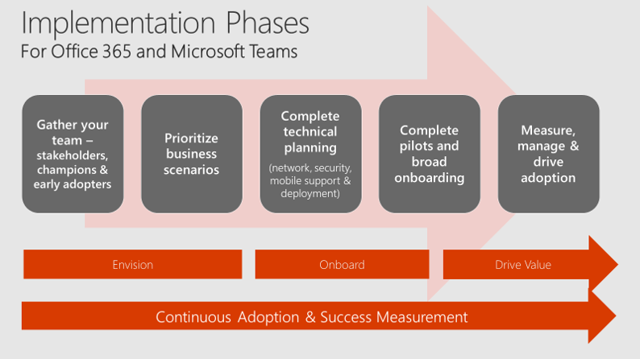
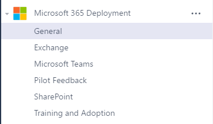

Quick start - Microsoft Teams planning guide
==========================================================

Use this guide to help you plan, implement, and adopt Microsoft Teams in your organization. This guide focuses on enabling collaboration and team communications scenarios. To implement Teams enterprise voice features, check out our [Cloud voice](https://docs.microsoft.com/MicrosoftTeams/cloud-voice-deployment) documentation.

#### *Figure 1: Implementation phases of Office 365 and Teams*

## Step 1: Get your people together

Assemble a group of individuals from your business, IT, and user communities to act as the stakeholder and decision-making group for your Teams deployment. In smaller organizations, this may be two or three people. Be sure to include individuals from all three communities to ensure a successful journey.  

## Step 2:  Prioritize your business scenarios

Collaboration and communication is about people! Pick the most relevant business scenarios for your organization instead of talking about features and functions. Check out the [Microsoft 365 FastTrack Productivity Library](https://fasttrack.microsoft.com/microsoft365/productivitylibrary) for examples to help you define scenarios for your company. Successful Teams deployments often center around high-velocity teams that work closely together, such as product development, marketing event teams, finance groups, or support organizations. Select one of these scenarios and complete a quick inventory of how these users work today so you can effectively design the Teams experience in a meaningful way for these people.

#### *Best practice:*
**Plan Teams with Teams!** Customers who use Teams to plan their deployment ease the change curve for key stakeholders. Consider creating a team called Microsoft 365 Deployment and creating channels for the various workloads you want to deploy. Your team might look something like this:

## Step 3: Complete technical planning

Efficient technical planning is the foundation of a great user experience. If your organization has over 50 seats and is participating in an [eligible plan](https://technet.microsoft.com/library/dn783224.aspx), you can use [FastTrack benefits](https://technet.microsoft.com/library/dn783224.aspx?f=255&MSPPError=-2147217396), available at no additional cost to guide you through planning, deployment and service adoption. Or, you can complete this work yourself using our FastTrack Onboarding Wizards, which are available from [FastTrack](https://fasttrack.microsoft.com/) once you sign in with your Office 365 account. The information below will help you complete this step for Teams. At a minimum, you’ll want to review these four articles:

1.	[Check your environment's readiness for Teams](environment-readiness.md)
2.	[Prepare your network for Teams](prepare-network.md)
3.	[Office 365 URLs and IP address ranges](office-365-urls-ip-address-ranges.md)
4.	[Guest access in Teams](guest-access.md)

In addition, certain organizations may want to review [Overview of security and compliance in Teams.](security-compliance-overview.md)

## Step Four: Conduct pilots and deploy Teams

In most organizations, you’ll want to conduct an initial Teams pilot with your stakeholders, champions, and select early adopters for one or more of the scenarios you selected above. A pilot gives you valuable information about how Office 365 and Teams are received in your organization. Select an interested group of users and a prioritized business scenario to get started. Figure 2 shows some example scenarios.

###### *Figure 2: Use case examples for Teams*

Once your pilots are complete, you’ll have the feedback you need to plan your broad Teams deployment. Large organizations often deploy in phases to manage the onboarding and training work required to implement a quality employee experience. Be sure your deployment plan integrates your prioritized business scenarios to ensure your employees are getting the most from Office 365 and Teams.

When you’re ready to turn on Teams, read [Office 365 licensing for Teams](office-365-licensing.md) to find out how.

##### ***Best practice:***
In smaller organizations (currently fewer than 2500 users), consider enabling Teams for the entire organization, then add all users to a single, company-wide team. Add common reference items and tasks to this team to simplify the collaboration and productivity experience for everyone.

If you use Yammer for broad company collaboration, consider integrating Yammer into the Teams experience. This doesn’t replace the native browser or mobile experience for Yammer but provides an integrated way to stay up-to-date on topics of broad interest across your organization. To learn more, watch [Tech Tip: Community management for Yammer with Microsoft Teams.](https://youtu.be/LU-sv-07jcY)

##### ***Don’t forget mobile!***
As you’re deploying Teams, don’t forget to turn on the mobile experience. Enabling your users to run Office 365 mobile applications can dramatically increase usage and satisfaction. Office, Outlook, SharePoint, Teams, Planner, Yammer, and other popular Office 365 services all offer mobile experiences. As a best practice, [turn on the Teams mobile experience](get-clients.md#mobile-clients) at the same time as you deploy the desktop and browser clients.

## **Step five: Measure usage, manage satisfaction, and drive adoption**

Deploying software is not the only thing required to drive change in your organization. Empowering collaboration is more about people as the technology. To successfully drive adoption of Office 365 and Teams, stay focused on your employees’ experience. Here’s a quick checklist of our best practices to get you started. Microsoft partners can also help you design the right adoption plan for your organization.

1. **Read [Office 365 Adoption Guidance](https://microsoft.sharepoint.com/:b:/t/ToolkitforTeamwork/ETCwPQo47a1IveJmot1vvb4BywRpFjqfRPrtjPtgF_i_hg?e=bfc85a9e74cd4cac8163286b6ef5ae74)** for best practices.  Use our article on [creating a change management strategy for Microsoft Team](change-management-strategy.md) to document your approach.
2. **Study [Office 365 activity reports](https://support.office.com/article/Activity-Reports-in-the-Office-365-admin-center-0d6dfb17-8582-4172-a9a9-aed798150263)** to understand usage across your environment. If you aren’t an Office 365 admin for your company, ask your admin to give you Reports Reader permissions so you can access activity reports.
3. **Capture feedback from your employees** on their experience with Office 365 and Teams. Use a public channel in Teams when your organization has fewer than 2500 individuals. Use a public group in Yammer when your organization is larger than this current membership limit in Teams. 
4. **Use [Your Digital Day](https://microsoft.sharepoint.com/teams/ToolkitforTeamwork/SitePages/A%20Day%20in%20the%20Digital%20Life.aspx) materials to Drive use of common features** by encouraging chat, @mentions and usage of cloud storage (OneDrive & SharePoint Online via Microsoft Teams) to draw people into the experience. Stop emailing that spreadsheet around! 
5. **Nurture your champions and highlight your wins.** Reward employees for embracing these new tools and using them in innovative ways that relate to business outcomes for your company. This, above anything, will ensure continued adoption of Office 365 and Teams.

## Next Steps
1. Head over to the [Planning workshop kit](planning-workshop-practical-guide.md)
2. Download the [Planning Workshop for Microsoft Teams](https://www.microsoft.com/en-us/download/55982) powerpoint
3. Use the downloaded PowerPoint to help you fill out the questionnaire and figure out your next steps in the [Practical Guidance for Microsoft Teams Quick Start & Planning Guide]() docment for your deployment. 