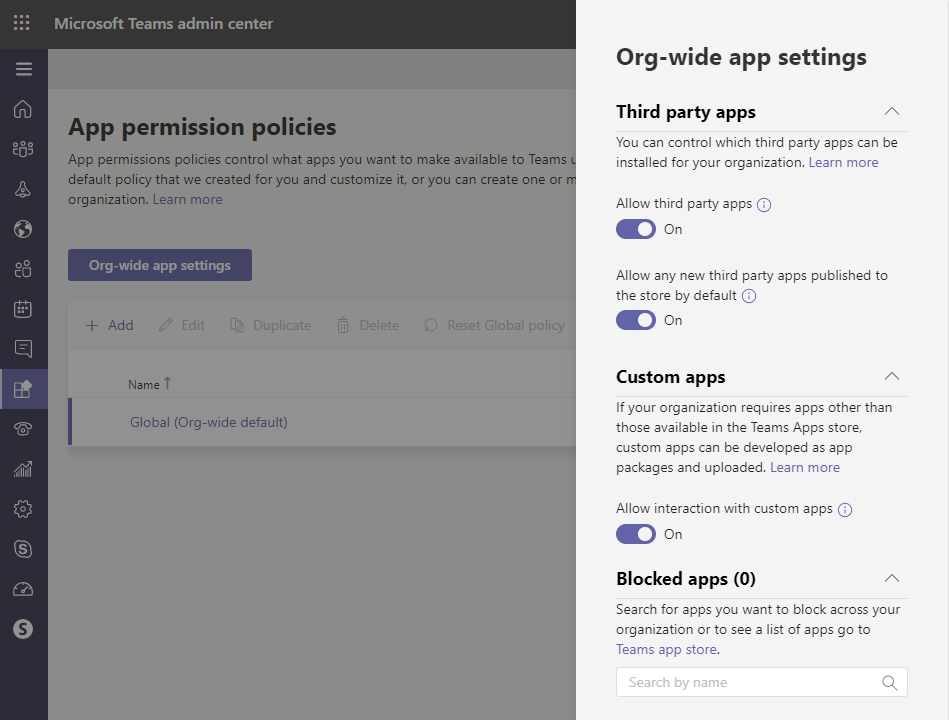

# Resource-specific consent in Microsoft Teams

Resource-specific consent in Microsoft Teams lets team owners give consent to apps to access team data. Examples of such access include the ability to read channel messages, create and delete channels, and create and remove channel tabs.

As an admin, you can control whether team owners in your organization can give consent through settings in the Azure portal and the Microsoft Teams admin center.  

## Set whether team owners can give consent to apps

Here are the settings in the Azure portal and the Microsoft Teams admin center that you must set to control whether team owners can give consent to apps. Be sure to review all the following settings.

### Settings in the Azure portal

The following two settings in the Azure portal determine whether team owners can give consent to apps.

> [!IMPORTANT]
> Changing any of these settings doesn't affect data access for apps that were already granted consent. For example, if you configure these settings to prevent team owners from giving consent, these changes don't remove data access that's already been granted.

#### The "Users can consent to apps accessing company data for groups they own" setting

This setting controls whether users in your organization can consent to apps on their behalf. To enable team owners to give consent, this setting must be set to **Yes**. To manage this setting, do the following:

1. In the Azure portal, go to **Enterprise applications** > **User settings**.
2. Under **Enterprise applications**, set **Users can consent to apps accessing company data for groups they own** to **No** or **Yes**.

#### The "Allow group owners to allow apps to apps accessing their groups" setting

This setting controls whether group owners can grant team-specific permissions. This setting must be enabled for team owners for them to give consent. To manage this setting, do the following:

1. In the Azure portal, go to **Azure Active Directory** > **Groups**, and then click **General**.
2. Under **Office 365 Groups**, set **Allow group owners to allow apps to apps accessing their groups** to one of the following:

    - **Off**: Only admins can grant team-specific permissions.
    - **Selected**: Only team owners in groups that you specify can grant team-specific permissions for teams that they own.
    - **On**: All team owners can grant team-specific permissions for teams that they own.

### Settings in the Microsoft Teams admin center

In addition to settings in the Azure portal, [org-wide app settings](teams-app-permission-policies.md#manage-org-wide-app-settings) in the Microsoft Teams admin center and the settings in the [app permission policy](teams-app-permission-policies.md) assigned to the team owner determine whether a team owner can give consent.

> [!IMPORTANT]
> Changing any of these settings doesn't affect data access for apps that were already granted consent. For example, if you disable third-party and custom apps org-wide or if you block specific apps to prevent team owners from giving consent, these changes don't remove data access that's already been granted.  

#### The "Allow third party or custom apps" setting in org-wide app settings

This org-wide app setting controls whether users in your organization can use third-party and custom apps. This setting must be on to enable team owners to give consent. To manage this setting, do the following:

1. In the left navigation of the Microsoft Teams admin center, go to **Teams apps** > **Permission policies**, and then click **Org-wide settings**.
2. Under **Third-party apps**, turn off or turn on **Allow third party or custom apps**.

    

#### Blocked apps in org-wide app settings

When an app is blocked in org-wide app settings, it's blocked for all users in your organization. Team owners can only give consent to an app if the app isn't blocked. To view and manage the apps that are blocked across your organization, do the following:

1. In the left navigation of the Microsoft Teams admin center, go to **Teams apps** > **Permission policies**, and then click **Org-wide settings**.
2. Under **Blocked apps**, vou can remove and add apps to the blocked app list.

    

#### App permission policy assigned to the team owner

Team owners can only give consent to apps that their app permission policy allows them to run. To view and manage the app permission policy that's assigned to a team owner, do the following:

1. In the left navigation of the Microsoft Teams admin center, go to **Users**.
2. Double-click the display name of the team owner, and then click **Policies**.
3. The policy assigned to the team owner is listed under **App permission policy**.
    - To assign a different policy, click **Edit**, and then select the policy that you want to assign.
    - To edit the settings of the policy that's assigned to the team owner, click the policy name, and then make the changes that you want.  

## Related topics

- [Microsoft Graph](https://developer.microsoft.com/graph)
