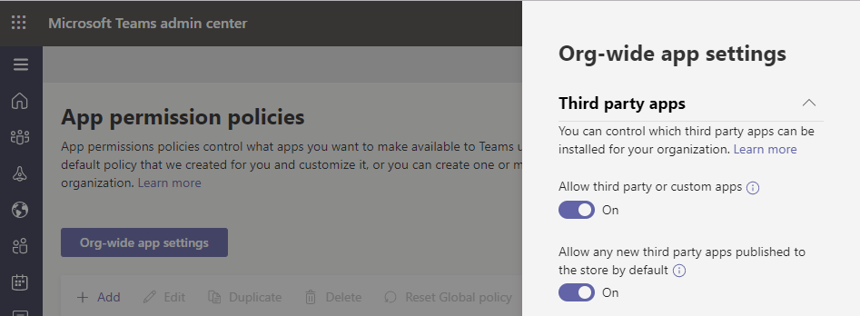
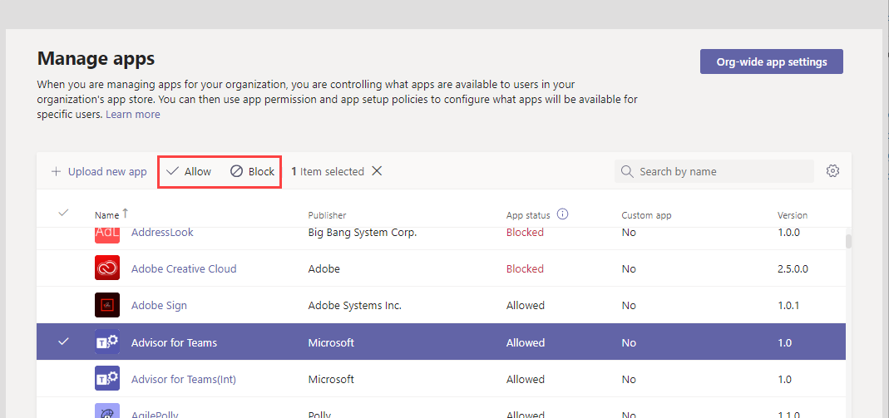

# Resource-specific consent in Microsoft Teams

[!INCLUDE [preview-feature](includes/preview-feature.md)]

Resource-specific consent in Microsoft Teams lets team owners give consent to apps to access team data. Examples of such access include the ability to read channel messages, create and delete channels, and create and remove channel tabs.

As an admin, you control whether team owners in your organization can give consent through settings that you configure by using the Azure Active Directory (Azure AD) PowerShell module or the Azure portal and the Microsoft Teams admin center.  

## Set whether team owners can give consent to apps

Here are the settings that you must set to control whether team owners can give consent to apps. Be sure to review all the following settings.

### Settings in Azure AD

The following two settings determine whether team owners can give consent to apps.

> [!IMPORTANT]
> Changing any of these settings doesn't affect data access for apps that were already granted consent. For example, if you configure these settings to prevent team owners from giving consent, these changes don't remove data access that's already been granted.

#### The "Users can consent to apps accessing company data on their behalf" setting

This setting controls whether users in your organization can consent to apps on their behalf. To enable team owners to give consent, this setting must be set to **Yes**. To manage this setting, do the following:

1. In the Azure portal, go to **Enterprise applications** > **User settings**.
2. Under **Enterprise applications**, set **Users can consent to apps accessing company data on their behalf** to **No** or **Yes**.

You can also manage this setting using PowerShell. To learn more, see [Configure user content to applications](/azure/active-directory/manage-apps/configure-user-consent#configure-user-consent-to-applications).

#### The "EnableGroupSpecificConsent" setting

This setting controls whether users in your organization can consent to apps accessing company data for the groups that they own. This setting must be enabled for team owners to give consent. For steps on how to manage this setting by using PowerShell, see [Configure group owner consent to apps accessing group data](/azure/active-directory/manage-apps/configure-user-consent#configure-group-owner-consent-to-apps-accessing-group-data).

### Settings in the Microsoft Teams admin center

In addition to settings in Azure AD, [org-wide app settings](manage-apps.md#manage-org-wide-app-settings) on the [Manage apps](manage-apps.md) page, whether an app is blocked or allowed on the [Manage apps](manage-apps.md#allow-and-block-apps) page, and the [app permission policy](teams-app-permission-policies.md) assigned to the team owner determine whether a team owner can give consent.

> [!IMPORTANT]
> Changing any of these settings doesn't affect data access for apps that were already granted consent. For example, if you disable third-party apps org-wide or if you block specific apps to prevent team owners from giving consent, these changes don't remove data access that's already been granted.  

#### The "Allow third party apps" setting in org-wide app settings

This org-wide app setting controls whether users in your organization can use third-party apps. This setting must be on to enable team owners to give consent. To manage this setting, do the following:

1. In the left navigation of the Microsoft Teams admin center, go to **Teams apps** > **Manage apps**, and then click **Org-wide app settings**.
2. Under **Third party apps**, turn off or turn on **Allow third party apps**.

    

You may have to wait up to 24 hours for your changes to take effect.

#### Allow or block the app at the org level

When you block or allow an app on the [Manage apps](manage-apps.md#allow-and-block-apps) page, that app is blocked or allowed for all users in your organization. Team owners can only give consent to an app if the app is allowed. To allow or block an app at the org level, do the following:

1. In the left navigation of the Microsoft Teams admin center, go to **Teams apps** > **Manage apps**.
2. On the Manage apps page, select the app, and then click **Block** to block it or click **Allow** to allow it.

    

#### App permission policy assigned to the team owner

Team owners can only give consent to apps that their app permission policy allows them to run. To view and manage the app permission policy that's assigned to a team owner, do the following:

1. In the left navigation of the Microsoft Teams admin center, go to **Users**.
2. Double-click the display name of the team owner, and then click **Policies**.
3. The policy assigned to the team owner is listed under **App permission policy**.
    - To assign a different policy, click **Edit**, and then select the policy that you want to assign.
    - To edit the settings of the policy that's assigned to the team owner, click the policy name, and then make the changes that you want.  

## Uploading custom apps

When uploading a custom app (also known sideloading) that uses resource-specific consent, the app must come from the tenant that it's being installed to. In other words, the Azure AD app registration must be from this tenant. Global admins are exempted from this restriction, and can upload custom apps from any tenant, either directly to a team (sideloading) or to the tenant app catalog.

## Related topics

- [Available RSC permissions](/microsoftteams/platform/graph-api/rsc/resource-specific-consent)
- [Microsoft Graph](https://developer.microsoft.com/graph)
- [Manage your apps in the Microsoft Teams admin center](manage-apps.md)
- [Manage app permission policies in Teams](teams-app-permission-policies.md)
